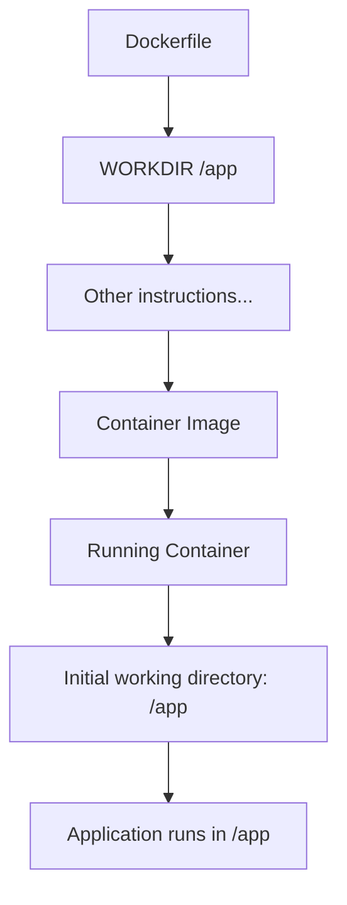

# Docker WORKDIR

## Introduction

When building Docker containers, organizing your filesystem structure is essential for maintainability and security. The `WORKDIR` instruction is a fundamental Dockerfile directive that helps you establish and change the working directory within your container. This directory becomes the default location where subsequent commands like `RUN`, `CMD`, `ENTRYPOINT`, `COPY`, and `ADD` will execute.

Think of `WORKDIR` as similar to running `cd` in your terminal before executing commands - it sets the context for operations that follow.

## Basic Syntax

The basic syntax for the `WORKDIR` instruction is:

```dockerfile
WORKDIR /path/to/directory
```

If the specified directory doesn't exist in the container filesystem, Docker will automatically create it.

## Why Use WORKDIR?

Before diving into examples, let's understand why `WORKDIR` is important:

1. **Organization**: Keeps files in predictable, logical locations
2. **Clarity**: Makes Dockerfiles more readable by providing context
3. **Security**: Avoids operations in sensitive system directories
4. **Consistency**: Creates a reliable environment for your application
5. **Prevents path-related errors**: Reduces issues with relative paths

## Basic Examples

### Setting a Simple Working Directory

```dockerfile
FROM ubuntu:20.04
WORKDIR /app
RUN echo "Hello from the app directory!" > greeting.txt
CMD ["cat", "greeting.txt"]
```

In this example:
- We start with an Ubuntu 20.04 base image
- Set `/app` as our working directory
- Create a file called `greeting.txt` inside `/app`
- Configure the container to display the contents of this file when started

When you build and run this container:

```bash
docker build -t workdir-demo .
docker run workdir-demo
```

Output:
```
Hello from the app directory!
```

### Using Multiple WORKDIR Instructions

You can change the working directory multiple times in a Dockerfile:

```dockerfile
FROM ubuntu:20.04
WORKDIR /tmp
RUN echo "This file is in /tmp" > temp-file.txt
WORKDIR /app
RUN echo "This file is in /app" > app-file.txt
CMD ["ls", "-la"]
```

When you run this container, `ls -la` will show the contents of `/app`, not `/tmp`, because the last `WORKDIR` instruction set `/app` as the current directory.

## Working with Relative Paths

If you use a relative path in `WORKDIR`, it's interpreted relative to the previous working directory:

```dockerfile
FROM ubuntu:20.04
WORKDIR /base
WORKDIR subdir
WORKDIR another-level
RUN pwd
```

The `pwd` command will output:
```
/base/subdir/another-level
```

This makes it convenient to create nested directory structures without repeating the full path each time.

## Best Practices

### 1. Always Use Absolute Paths

While relative paths work, using absolute paths makes your Dockerfile more explicit and less prone to errors:

```dockerfile
# Recommended
WORKDIR /app

# Avoid if possible
WORKDIR app
```

### 2. Avoid Using Root Directory

For security reasons, avoid using the root directory (`/`) as your working directory:

```dockerfile
# Not recommended
WORKDIR /
COPY . .  # This copies files to the root filesystem!

# Better approach
WORKDIR /app
COPY . .  # Files are contained in /app
```

### 3. Create a Dedicated Directory for Your Application

Create a dedicated directory for your application code rather than using system directories:

```dockerfile
FROM node:14
# Create dedicated directory for application
WORKDIR /usr/src/app
COPY package*.json ./
RUN npm install
COPY . .
CMD ["npm", "start"]
```

### 4. Combine with USER for Better Security

For enhanced security, combine `WORKDIR` with the `USER` instruction:

```dockerfile
FROM node:14
# Create app directory
WORKDIR /usr/src/app
# Create a non-root user
RUN groupadd -r appuser && useradd -r -g appuser appuser
# Change ownership of the working directory
RUN chown -R appuser:appuser /usr/src/app
# Switch to non-root user
USER appuser
# Now all subsequent commands run as non-root user in /usr/src/app
COPY --chown=appuser:appuser . .
RUN npm install
CMD ["npm", "start"]
```

## Real-World Examples

### Node.js Web Application

```dockerfile
FROM node:14
# Set working directory
WORKDIR /usr/src/app
# Install dependencies first (leverages Docker cache)
COPY package*.json ./
RUN npm install
# Copy application code
COPY . .
# Expose port for the application
EXPOSE 3000
# Start the application
CMD ["node", "app.js"]
```

### Python Data Processing Application

```dockerfile
FROM python:3.9
# Set working directory
WORKDIR /app
# Install dependencies
COPY requirements.txt .
RUN pip install --no-cache-dir -r requirements.txt
# Copy application code
COPY ./src ./src
COPY ./data ./data
# Set working directory for scripts
WORKDIR /app/src
# Run the application
CMD ["python", "process_data.py"]
```

## Common Issues and Solutions

### Issue: Command Not Found

```dockerfile
FROM ubuntu:20.04
WORKDIR /app
COPY script.sh .
CMD ["./script.sh"]
```

If you get "Command not found" when running this container, remember to:

1. Make your script executable:
```dockerfile
FROM ubuntu:20.04
WORKDIR /app
COPY script.sh .
RUN chmod +x script.sh
CMD ["./script.sh"]
```

2. Use the correct path relative to your WORKDIR:
```dockerfile
FROM ubuntu:20.04
WORKDIR /app
COPY script.sh .
RUN chmod +x /app/script.sh
CMD ["/app/script.sh"]
```

### Issue: Files Not Found

If your application can't find files, check if you're using the correct paths relative to your working directory:

```dockerfile
FROM python:3.9
WORKDIR /app
COPY app.py .
COPY data/input.csv /tmp/data/  # This goes to a different directory
CMD ["python", "app.py"]
```

If `app.py` tries to open `./data/input.csv`, it will fail because the file is in `/tmp/data/`, not `/app/data/`.

Solution: Maintain consistent paths or adjust your application code:

```dockerfile
FROM python:3.9
WORKDIR /app
COPY app.py .
COPY data/input.csv ./data/
CMD ["python", "app.py"]
```

## How WORKDIR Affects Container Runtime

When a container starts, the working directory set by the last `WORKDIR` instruction becomes the initial working directory for the container's main process.

Let's visualize this with a diagram:



## Environment Variables in WORKDIR

You can use environment variables in the `WORKDIR` instruction:

```dockerfile
FROM ubuntu:20.04
ENV APP_DIR=/application
WORKDIR $APP_DIR
RUN pwd  # Outputs: /application
```

This is useful for creating configurable Dockerfiles.

## Summary

The `WORKDIR` instruction is an essential part of Dockerfile best practices that:

- Sets the working directory for subsequent instructions
- Creates organization and structure in your container
- Prevents operations in sensitive system directories
- Makes Dockerfiles more readable and maintainable
- Works with both absolute and relative paths

Remember to use absolute paths when possible, create dedicated directories for your application, and combine with other security practices like using non-root users for optimal container configuration.

## Exercises

1. Create a Dockerfile that sets up multiple working directories and creates a different file in each. Use the `find` command to verify where files are located.

2. Modify an existing Dockerfile for a web application to use proper `WORKDIR` instructions instead of absolute paths in commands.

3. Create a Dockerfile that uses environment variables to dynamically set the working directory based on the environment (development/production).

## Additional Resources

- [Docker Documentation on WORKDIR](https://docs.docker.com/engine/reference/builder/#workdir)
- [Dockerfile Best Practices](https://docs.docker.com/develop/develop-images/dockerfile_best-practices/)
- [Docker Security Best Practices](https://docs.docker.com/engine/security/security/)