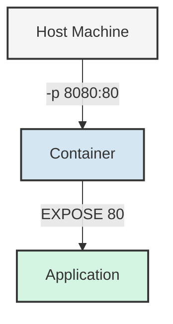

# Docker EXPOSE

## Introduction

When working with containerized applications, communication between containers and with the outside world is essential. Docker provides several networking features to facilitate this communication, and one of the key concepts to understand is the `EXPOSE` instruction in Dockerfiles.

The `EXPOSE` instruction tells Docker that a container listens on specific network ports at runtime. It serves as documentation about which ports your application uses, making your Docker images more self-documenting and easier to use.

In this guide, we'll explore what the `EXPOSE` instruction does, how it differs from port publishing, and how to use it effectively in your Docker configurations.

## Understanding the EXPOSE Instruction

### What EXPOSE Does

The `EXPOSE` instruction in a Dockerfile informs Docker that the container listens on specified network ports at runtime. Its syntax is simple:

```dockerfile
EXPOSE <port> [<port>/<protocol>...]
```

For example:

```dockerfile
EXPOSE 80
EXPOSE 443/tcp 53/udp
```

### What EXPOSE Doesn't Do

An important distinction to understand is that the `EXPOSE` instruction does **not** actually publish the ports to the host machine. It serves as documentation and has the following characteristics:

- It documents which ports are intended to be published
- It functions as a type of documentation between the image builder and the container runner
- It can be used for container linking (in legacy Docker networks)
- It serves as a default for the `-P` flag in `docker run`

### EXPOSE vs. Publishing Ports

To help understand the difference, let's compare:

| Feature | EXPOSE | Port Publishing (`-p` or `--publish`) |
|---------|--------|---------------------------------------|
| Purpose | Documentation | Actually maps container ports to host |
| Defined in | Dockerfile | `docker run` command or docker-compose file |
| External access | No | Yes |
| Format | `EXPOSE <port>/<protocol>` | `-p host_port:container_port` |

## Using EXPOSE in Dockerfiles

### Basic Usage

Here's how to use the `EXPOSE` instruction in a Dockerfile:

```dockerfile
FROM nginx:latest
EXPOSE 80 443
# Other instructions...
```

This indicates that the container will use ports 80 and 443 at runtime, but doesn't actually make those ports accessible from the host.

### Specifying Protocols

By default, `EXPOSE` assumes TCP protocol. If you need UDP, you can specify it:

```dockerfile
EXPOSE 53/udp
EXPOSE 80/tcp 443/tcp
```

### Real-World Example: Web Application

Let's create a complete Dockerfile for a simple Node.js web application:

```dockerfile
FROM node:16

# Create app directory
WORKDIR /usr/src/app

# Install app dependencies
COPY package*.json ./
RUN npm install

# Bundle app source
COPY . .

# Document that the container uses port 3000
EXPOSE 3000

CMD ["node", "app.js"]
```

The application in this container will listen on port 3000, but to access it from the host, you'd need to publish the port when running the container.

## Running Containers with EXPOSE

### Using the `-P` Flag

When you run a container with the `-P` (or `--publish-all`) flag, Docker maps all exposed ports to random ports on the host:

```bash
docker run -P my-web-app
```

To see which host ports are mapped to the container's exposed ports:

```bash
docker ps
```

Output might look like:

```
CONTAINER ID   IMAGE        COMMAND       PORTS                     NAMES
f82c35a3b7a1   my-web-app   "node app.js" 0.0.0.0:49153->3000/tcp   epic_hopper
```

This shows that the exposed port 3000 in the container is mapped to port 49153 on the host.

### Explicitly Publishing Ports

More commonly, you'll want to explicitly map specific host ports to container ports:

```bash
docker run -p 8080:3000 my-web-app
```

This maps port 3000 in the container (which was documented with `EXPOSE`) to port 8080 on the host.

## Practical Examples

### Example 1: Multi-Port Web Application

Here's a more complex example involving multiple exposed ports for a web application with both HTTP and HTTPS:

```dockerfile
FROM node:16-alpine

WORKDIR /app

COPY package*.json ./
RUN npm install

COPY . .

# Expose both HTTP and HTTPS ports
EXPOSE 80 443

CMD ["npm", "start"]
```

When running this container, you might publish the ports like:

```bash
docker run -p 8080:80 -p 8443:443 multi-port-web-app
```

### Example 2: Database Container

For a PostgreSQL database container:

```dockerfile
FROM postgres:14

# Custom configuration if needed
COPY custom-postgres.conf /etc/postgresql/postgresql.conf

# Document that PostgreSQL uses port 5432
EXPOSE 5432

# The postgres image already has a CMD defined
```

Running this container with explicit port publishing:

```bash
docker run -p 5432:5432 -e POSTGRES_PASSWORD=mysecretpassword custom-postgres
```

### Example 3: Microservices Application

In a microservices architecture, each service might expose different ports:

```dockerfile
FROM node:16-alpine

WORKDIR /app
COPY package*.json ./
RUN npm install
COPY . .

# API service exposes port 3000
EXPOSE 3000

CMD ["node", "api-service.js"]
```

And in a docker-compose.yml file, you might have:

```yaml
version: '3'
services:
  api-service:
    build: ./api
    ports:
      - "3000:3000"
  
  auth-service:
    build: ./auth
    ports:
      - "3001:3000"
  
  database:
    image: postgres:14
    ports:
      - "5432:5432"
    environment:
      POSTGRES_PASSWORD: mysecretpassword
```

## Best Practices

When using the `EXPOSE` instruction, follow these best practices:

1. **Document all used ports**: Always `EXPOSE` any port your application listens on, even if you don't intend to publish it externally.

2. **Use standard ports**: When possible, use standard ports for your services (e.g., 80 for HTTP, 443 for HTTPS).

3. **Specify protocols**: Explicitly specify the protocol (TCP/UDP) if your application doesn't use the default TCP.

4. **Group related ports**: Group related ports in a single `EXPOSE` instruction for better readability:
   ```dockerfile
   EXPOSE 80 443
   ```

5. **Document in README**: Besides using `EXPOSE`, document your container's port requirements in your project's README file.

## Networking and EXPOSE

Understanding how `EXPOSE` interacts with Docker's networking models is important:

### Default Bridge Network

In Docker's default bridge network, `EXPOSE` helps with container discovery. However, for modern Docker applications, this is less relevant as Docker Compose and user-defined networks provide better service discovery.

### User-Defined Networks

When using user-defined networks (recommended for multi-container applications), containers can communicate directly by name, regardless of exposed ports:

```bash
docker network create my-network
docker run --name web --network my-network my-web-app
docker run --name db --network my-network postgres
```

In this scenario, the `web` container can connect to the `db` container using the hostname `db` and its exposed port, even without port publishing.

## Visualizing EXPOSE in Docker

Here's a diagram showing how `EXPOSE` works in relation to port publishing:



## Troubleshooting EXPOSE Issues

### Common Problems and Solutions

1. **Application not accessible despite exposed port:**
   - Remember that `EXPOSE` alone doesn't publish ports
   - Use `-p` or `-P` when running the container

2. **Confused about which ports are exposed:**
   - Inspect the image: `docker image inspect --format='{{.Config.ExposedPorts}}' my-image`

3. **Container-to-container communication issues:**
   - Ensure containers are on the same network
   - Use container names as hostnames in user-defined networks

## Summary

The `EXPOSE` instruction in Dockerfiles is a documentation feature that indicates which ports a container will listen on at runtime. Key points to remember:

- `EXPOSE` documents ports but doesn't actually publish them
- To make ports accessible from the host, use `-p` or `-P` with `docker run`
- Always document all ports your application uses with `EXPOSE`
- For multi-container applications, use Docker Compose and user-defined networks

By understanding and properly using the `EXPOSE` instruction, you'll create more maintainable and self-documenting Docker images.

## Additional Resources

- [Docker Official Documentation on EXPOSE](https://docs.docker.com/engine/reference/builder/#expose)
- [Docker Networking Overview](https://docs.docker.com/network/)

## Exercises

1. Create a Dockerfile for a simple web server that exposes port 8080. Run the container and make it accessible on port 9090 on your host.

2. Modify an existing Dockerfile to expose multiple ports (e.g., 80 for HTTP and 443 for HTTPS).

3. Create a Docker Compose file for a three-tier application (web, API, database) where each service exposes appropriate ports.

4. Experiment with the `-P` flag and use `docker ps` to see which random ports were assigned to your container's exposed ports.