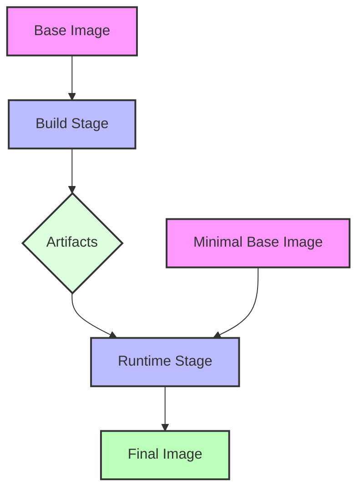

# Docker Multistage Builds

## Introduction

Docker multistage builds are a powerful feature that allows you to create smaller, more efficient Docker images without sacrificing build tools or debugging capabilities. In traditional Docker builds, you often face a dilemma: include all build tools for a complete build environment (resulting in large images) or create complex build scripts to minimize image size. Multistage builds solve this problem by allowing you to use multiple `FROM` statements in your Dockerfile, where each `FROM` instruction starts a new build stage.

In this guide, you'll learn:
- What multistage builds are and why they matter
- How to implement multistage builds step by step
- Real-world examples and best practices
- Advanced techniques to optimize your Docker workflow

## The Problem with Single-Stage Builds

Before diving into multistage builds, let's understand why they're needed. Consider this single-stage Dockerfile for a Node.js application:

```dockerfile
FROM node:18
WORKDIR /app
COPY package*.json ./
RUN npm install
COPY . .
RUN npm run build
EXPOSE 3000
CMD ["npm", "start"]
```

While this works, it creates an image containing:
- The Node.js runtime
- All npm dependencies (including dev dependencies)
- Build tools and source code
- The compiled application

The result? A bloated image with unnecessary components that:
- Consumes more disk space and network bandwidth
- Has a larger attack surface
- Takes longer to deploy

## Multistage Builds: The Solution

Multistage builds let you use multiple stages in a single Dockerfile, copying only the necessary artifacts from one stage to another. Here's how we can improve the previous example:

```dockerfile
# Build stage
FROM node:18 AS build
WORKDIR /app
COPY package*.json ./
RUN npm install
COPY . .
RUN npm run build

# Production stage
FROM node:18-slim
WORKDIR /app
COPY --from=build /app/dist ./dist
COPY --from=build /app/package*.json ./
RUN npm install --only=production
EXPOSE 3000
CMD ["npm", "start"]
```

In this example:
1. The first stage (named `build`) installs all dependencies and builds the application
2. The second stage starts with a slim Node.js image
3. Only the built assets and production dependencies are copied from the build stage
4. The final image is significantly smaller and contains only what's needed to run the application

## How Multistage Builds Work

Let's break down the key components of multistage builds:

### Multiple FROM Instructions

Each `FROM` instruction in a Dockerfile starts a new build stage. You can name stages using the `AS` keyword:

```dockerfile
FROM golang:1.18 AS builder
# ...build stage instructions

FROM alpine:latest
# ...production stage instructions
```

### Copying Files Between Stages

The `COPY --from=<stage>` instruction copies files from a previous stage to the current stage:

```dockerfile
COPY --from=builder /go/src/app/main ./
```

This copies the `main` binary from the `builder` stage to the current stage.

### Selective Execution

You can build up to a specific stage using the `--target` flag:

```bash
docker build --target builder -t myapp:build .
```

This is useful for debugging or creating different image variants.

## Step-by-Step Example: A Go Web Application

Let's walk through creating a multistage Dockerfile for a Go web application:

```dockerfile
# Stage 1: Build the application
FROM golang:1.18 AS builder
WORKDIR /app
# Copy go mod and sum files
COPY go.mod go.sum ./
# Download dependencies
RUN go mod download
# Copy source code
COPY . .
# Build the application
RUN CGO_ENABLED=0 GOOS=linux go build -a -installsuffix cgo -o main .

# Stage 2: Create the minimal runtime image
FROM alpine:3.15
RUN apk --no-cache add ca-certificates
WORKDIR /root/
# Copy the binary from builder stage
COPY --from=builder /app/main .
# Copy any config files
COPY --from=builder /app/config ./config
# Expose port
EXPOSE 8080
# Run the application
CMD ["./main"]
```

This Dockerfile:
1. Uses a full Go image to build the application
2. Creates a tiny Alpine-based image for the runtime
3. Includes only the compiled binary and configuration files
4. Results in an image that's often less than 20MB (compared to 300MB+ for the full Go image)

## Real-World Application: React Frontend with Node.js Backend

Here's a more complex example of a multistage build for a full-stack application:

```dockerfile
# Stage 1: Build the React frontend
FROM node:18 AS frontend-builder
WORKDIR /app/frontend
COPY frontend/package*.json ./
RUN npm install
COPY frontend/ ./
RUN npm run build

# Stage 2: Build the Node.js backend
FROM node:18 AS backend-builder
WORKDIR /app/backend
COPY backend/package*.json ./
RUN npm install
COPY backend/ ./
RUN npm run build

# Stage 3: Production image
FROM node:18-slim
WORKDIR /app
# Copy backend build
COPY --from=backend-builder /app/backend/dist ./dist
COPY --from=backend-builder /app/backend/package*.json ./
RUN npm install --only=production
# Copy frontend build to the public directory
COPY --from=frontend-builder /app/frontend/build ./public
EXPOSE 8080
CMD ["node", "dist/server.js"]
```

This Dockerfile:
1. Builds the React frontend in one stage
2. Builds the Node.js backend in another stage
3. Creates a final production image with just the compiled assets
4. Significantly reduces the image size by excluding build tools and source code

## Best Practices for Multistage Builds

### 1. Name Your Stages

Always name your build stages for clarity:

```dockerfile
FROM golang:1.18 AS builder
```

This makes your Dockerfile more readable and allows you to reference stages in any order.

### 2. Order Dependencies for Caching

Place instructions that change less frequently at the beginning of each stage:

```dockerfile
COPY package.json package-lock.json ./
RUN npm install
COPY . .
```

Docker caches the results of each step. By copying just the package files first, you can avoid reinstalling dependencies when only your source code changes.

### 3. Use Distroless or Minimal Base Images

For the final stage, use the smallest possible base image:

```dockerfile
FROM gcr.io/distroless/java:11
# or
FROM alpine:3.15
# or
FROM scratch  # For compiled languages that don't need an OS
```

### 4. Keep Only What You Need

Only copy artifacts that are required for runtime:

```dockerfile
# Bad practice
COPY --from=builder /app ./

# Good practice
COPY --from=builder /app/dist ./dist
COPY --from=builder /app/config ./config
```

### 5. Utilize Build Arguments

Use build arguments to create flexible builds:

```dockerfile
ARG NODE_ENV=production
FROM node:18 AS builder
ARG NODE_ENV
ENV NODE_ENV=${NODE_ENV}
# ...rest of Dockerfile
```

This allows you to build different image variants:

```bash
docker build --build-arg NODE_ENV=development -t myapp:dev .
```

## Advanced Multistage Techniques

### Conditional Stages

You can conditionally include stages based on build arguments:

```dockerfile
FROM base AS common
# ...common setup

FROM common AS development
# ...development-specific setup

FROM common AS production
# ...production-specific setup

FROM ${TARGET:-production} AS final
# Final stage uses either development or production
```

Build with:

```bash
docker build --build-arg TARGET=development -t myapp:dev .
```

### Parallelized Builds

With Docker BuildKit, you can parallelize independent stages:

```dockerfile
# These stages can build in parallel
FROM golang:1.18 AS api-builder
# ...build API

FROM node:18 AS frontend-builder
# ...build frontend

# Final stage depends on both
FROM alpine:3.15
COPY --from=api-builder /app/api ./
COPY --from=frontend-builder /app/dist ./public
```

Enable BuildKit with:

```bash
DOCKER_BUILDKIT=1 docker build -t myapp .
```

### Testing Stages

You can include testing stages in your build:

```dockerfile
FROM node:18 AS builder
# ...build application

FROM builder AS tester
RUN npm test

FROM node:18-slim AS production
COPY --from=builder /app/dist ./dist
# ...rest of production setup
```

Run tests during build with:

```bash
docker build --target tester .
```

## Visualizing Multistage Builds

Here's a diagram showing the flow of a typical multistage build:



## Summary and Key Takeaways

Docker multistage builds are a powerful technique for creating optimized container images by:

- Separating build-time and runtime environments
- Including only necessary artifacts in the final image
- Reducing image size, attack surface, and deployment time
- Improving build caching and development workflows

Key benefits include:
- Smaller image sizes (often 10-50x smaller)
- Improved security through reduced attack surface
- Faster deployments due to smaller image transfers
- Simplified Dockerfiles that don't require external build scripts

## Exercises

1. **Basic Exercise**: Convert a single-stage Dockerfile for a simple web application to use multistage builds.

2. **Intermediate Exercise**: Create a multistage Dockerfile for a compiled language (Go, Rust, C++) that produces a final image under 20MB.

3. **Advanced Exercise**: Implement a multistage build with three stages: development, testing, and production, using build arguments to select the appropriate stage.

## Additional Resources

- [Docker Documentation on Multistage Builds](https://docs.docker.com/develop/develop-images/multistage-build/)
- [BuildKit Documentation](https://docs.docker.com/build/buildkit/)
- [Docker Optimization Guide](https://docs.docker.com/develop/develop-images/dockerfile_best-practices/)

Happy containerizing!