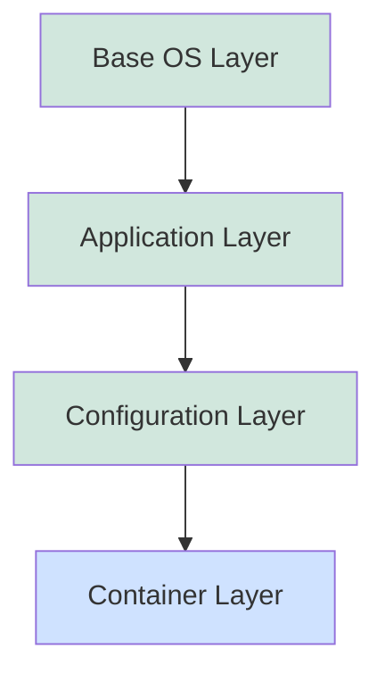

# Docker Layers

## Introduction

When working with Docker, understanding "layers" is crucial for creating efficient, optimized container images. Layers are a fundamental concept in Docker that directly impact the size, performance, and reusability of your Docker images.

In this guide, we'll explore what Docker layers are, how they work, and how you can leverage them to build better container images. By the end, you'll understand why the phrase "Docker images are like onions" makes perfect sense—they both have layers!

## What Are Docker Layers?

A Docker image is not a single, monolithic block of data. Instead, it's made up of multiple layers that are stacked on top of each other. Each layer represents a set of changes to the filesystem.

Let's break down this concept:

1. **Layer**: An immutable, read-only file that contains a set of differences from the layer below it
2. **Image**: A collection of layers stacked on top of each other
3. **Container**: A writable layer on top of an image



In the diagram above, the green layers together form an image, while the blue layer represents the running container.

## How Layers Work in Docker

### The Layered Filesystem

Docker uses a special filesystem called a "union filesystem" that allows multiple directories to be overlaid and presented as a single filesystem. Each layer contains only the changes from the previous layer.

When you build a Docker image with a `Dockerfile`, each instruction typically creates a new layer:

```dockerfile
FROM ubuntu:20.04          # Layer 1: Base Ubuntu image
RUN apt-get update          # Layer 2: Package database update
RUN apt-get install -y nginx # Layer 3: Nginx installation
COPY ./app /app             # Layer 4: Application code
CMD ["nginx", "-g", "daemon off;"] # No layer (metadata only)
```

Not all `Dockerfile` instructions create layers. Instructions like `CMD`, `LABEL`, `ENV`, `EXPOSE`, etc. create image metadata instead of layers.

### Layer Caching

One of the most powerful features of Docker's layered architecture is layer caching. When Docker builds an image, it checks if any layers can be reused from previous builds or from the local cache.

This is why Docker builds are often faster after the first build—Docker can reuse cached layers as long as the instruction and its contents haven't changed.

For example:

```bash
$ docker build -t myapp:v1 .
# First build - all layers need to be created
Step 1/5 : FROM ubuntu:20.04
 ---> 1318b700e415
Step 2/5 : RUN apt-get update
 ---> Running in 8d9232460d97
# ... output ...
 ---> a1b2c3d4e5f6
# ... more steps ...

$ touch newfile.txt  # Create a new file

$ docker build -t myapp:v2 .
# Second build - reuses cached layers
Step 1/5 : FROM ubuntu:20.04
 ---> 1318b700e415  # Cached
Step 2/5 : RUN apt-get update
 ---> Using cache
 ---> a1b2c3d4e5f6  # Cached
# ... more steps ...
```

## Best Practices for Working with Layers

### 1. Minimize the Number of Layers

While layers are useful, too many layers can impact performance. Docker recommends keeping the number of layers low by combining related operations:

```dockerfile
# Not optimal - two layers
RUN apt-get update
RUN apt-get install -y nginx

# Better - one layer
RUN apt-get update && apt-get install -y nginx
```

### 2. Order Instructions by Stability

Place instructions that change less frequently earlier in your Dockerfile. This maximizes cache usage:

```dockerfile
# Good order
COPY requirements.txt /app/
RUN pip install -r /app/requirements.txt
COPY . /app/

# Bad order
COPY . /app/
RUN pip install -r /app/requirements.txt
```

In the "good order" example, changing your application code won't invalidate the cached layer for installing dependencies.

### 3. Use .dockerignore

Create a `.dockerignore` file to exclude files and directories that aren't needed in your image:

```text
.git
node_modules
*.log
```

This reduces the context size and prevents unnecessary cache invalidation.

### 4. Multi-stage Builds

For production images, use multi-stage builds to keep only what's necessary in the final image:

```dockerfile
# Build stage
FROM node:14 AS build
WORKDIR /app
COPY package*.json ./
RUN npm install
COPY . .
RUN npm run build

# Production stage
FROM nginx:alpine
COPY --from=build /app/dist /usr/share/nginx/html
```

This example uses a Node.js image to build the application but delivers it in a smaller Nginx image.

## Inspecting Layers

You can inspect the layers in a Docker image using the `docker history` command:

```bash
$ docker history nginx:latest
IMAGE          CREATED        CREATED BY                                      SIZE
616abc3f037b   2 weeks ago    /bin/sh -c #(nop)  CMD ["nginx" "-g" "daemon…   0B
<missing>      2 weeks ago    /bin/sh -c #(nop)  STOPSIGNAL SIGQUIT           0B
<missing>      2 weeks ago    /bin/sh -c #(nop)  EXPOSE 80                    0B
<missing>      2 weeks ago    /bin/sh -c #(nop)  ENTRYPOINT ["/docker-entr…   0B
<missing>      2 weeks ago    /bin/sh -c #(nop) COPY file:09a214a3e07c919a…   4.61kB
<missing>      2 weeks ago    /bin/sh -c #(nop) COPY file:0fd5fca330dcd6a7…   1.04kB
<missing>      2 weeks ago    /bin/sh -c #(nop) COPY file:0b866ff3fc1ef5b0…   1.96kB
<missing>      2 weeks ago    /bin/sh -c apt-get update  && apt-get install…   63.2MB
<missing>      2 weeks ago    /bin/sh -c #(nop)  ENV NJS_VERSION=0.7.0        0B
<missing>      2 weeks ago    /bin/sh -c #(nop)  ENV NGINX_VERSION=1.23.1     0B
<missing>      2 weeks ago    /bin/sh -c #(nop)  LABEL maintainer=NGINX Do…   0B
<missing>      2 weeks ago    /bin/sh -c #(nop)  CMD ["bash"]                 0B
<missing>      2 weeks ago    /bin/sh -c #(nop) ADD file:9a4f0e0df7d11af7f…   80.4MB
```

For a more detailed view, you can use the `docker inspect` command:

```bash
$ docker inspect nginx:latest
```

## Container Layer and Data Persistence

When a container runs, Docker adds a writable layer on top of the image layers. This "container layer" stores all changes made to the container during its runtime.

However, when the container is removed, this layer is also deleted. To persist data, Docker provides two solutions:

### 1. Volumes

Volumes are the preferred way to persist data in Docker:

```bash
# Create a volume
$ docker volume create my-data

# Run a container with the volume
$ docker run -v my-data:/app/data nginx:latest
```

### 2. Bind Mounts

Bind mounts link a container path to a host path:

```bash
# Mount a host directory to a container
$ docker run -v $(pwd)/data:/app/data nginx:latest
```

## Practical Example: Optimizing a Node.js Application

Let's walk through optimizing a Node.js application Dockerfile by properly leveraging layers:

```dockerfile
# Initial Dockerfile
FROM node:14
WORKDIR /app
COPY . .
RUN npm install
EXPOSE 3000
CMD ["npm", "start"]
```

This works, but it's inefficient for development. Every code change will invalidate the cache and trigger a full `npm install`.

Here's an optimized version:

```dockerfile
# Optimized Dockerfile
FROM node:14
WORKDIR /app

# Copy package files first
COPY package*.json ./
RUN npm install

# Then copy application code
COPY . .

EXPOSE 3000
CMD ["npm", "start"]
```

With this structure, `npm install` runs only when package files change, not when application code changes.

For even better optimization, consider a multi-stage production build:

```dockerfile
# Build stage
FROM node:14 AS build
WORKDIR /app
COPY package*.json ./
RUN npm install
COPY . .
RUN npm run build

# Production stage
FROM node:14-alpine
WORKDIR /app
COPY --from=build /app/package*.json ./
COPY --from=build /app/dist ./dist
RUN npm install --only=production
EXPOSE 3000
CMD ["node", "dist/server.js"]
```

This results in a much smaller final image with only production dependencies.

## Summary

Docker layers are a powerful concept that enables efficient image building, sharing, and distribution. By understanding how layers work, you can:

- Optimize your Dockerfiles for faster builds
- Reduce image size and improve distribution speed
- Properly manage data persistence for containers
- Create more maintainable container images

Mastering Docker layers is essential for effectively working with containers in production environments and creating efficient CI/CD pipelines.

## Exercises

1. Take an existing Dockerfile for one of your applications and optimize it by reordering instructions to maximize layer caching.
2. Create a multi-stage Dockerfile for an application of your choice that separates build dependencies from runtime dependencies.
3. Use `docker history` to examine the layers of a popular image like `nginx` or `node` and observe how they're constructed.
4. Experiment with different layer caching scenarios by making changes to your Dockerfile and application code to see when caches are invalidated.

## Additional Resources

- [Docker Documentation: About storage drivers](https://docs.docker.com/storage/storagedriver/)
- [Docker Documentation: Use multi-stage builds](https://docs.docker.com/develop/develop-images/multistage-build/)
- [Docker Documentation: Best practices for writing Dockerfiles](https://docs.docker.com/develop/develop-images/dockerfile_best-practices/)