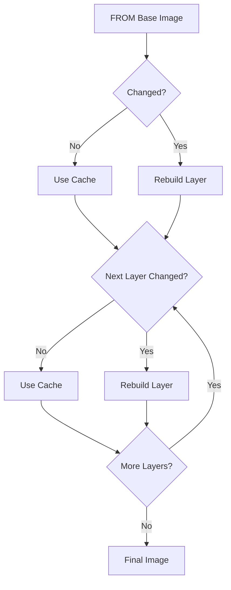

# Docker Cache

## Introduction

When working with Docker, you might notice that building container images can sometimes be quick and other times painfully slow. This inconsistency is often related to Docker's caching mechanism. Docker cache is a powerful feature that helps speed up the build process by reusing previously built layers when possible. Understanding how Docker cache works is essential for optimizing your Docker builds and workflows.

In this guide, we'll explore the fundamentals of Docker cache, how it works, and practical techniques to leverage it effectively.

## How Docker Cache Works

### The Layer System

Docker images are built using a layered file system. Each instruction in a Dockerfile creates a new layer:

```
FROM ubuntu:20.04       # Layer 1
RUN apt-get update      # Layer 2  
RUN apt-get install -y python3   # Layer 3
COPY . /app            # Layer 4
CMD ["python3", "app.py"]  # Layer 5
```

When Docker builds an image, it executes each instruction and saves the resulting filesystem changes as a layer. These layers are cached and can be reused in future builds.

### Cache Invalidation

The Docker cache operates on a simple principle:

1. For each instruction, Docker checks if it can use a cached layer
2. If the instruction and context haven't changed since the last build, Docker reuses the cached layer
3. If a layer's cache is invalidated, all subsequent layers must be rebuilt

Let's visualize this behavior:



## Optimizing Dockerfile for Better Caching

### Order Instructions by Change Frequency

One of the most effective strategies for leveraging Docker cache is to order instructions in your Dockerfile from least frequently changed to most frequently changed:

```
# Good example - optimized for cache usage
FROM node:14
WORKDIR /app

# Dependencies change less frequently
COPY package*.json ./
RUN npm install

# Application code changes frequently
COPY . .
CMD ["npm", "start"]
```

With this approach, when you only change your application code, Docker can reuse the cached layers for the base image and dependencies installation.

### Example: Cache in Action

Let's see an example of building an image twice to demonstrate caching:

First build:
```
$ docker build -t myapp .
[+] Building 45.6s
 => [1/5] FROM node:14                      0.0s
 => [2/5] WORKDIR /app                      0.1s
 => [3/5] COPY package*.json ./             0.1s
 => [4/5] RUN npm install                   43.2s
 => [5/5] COPY . .                          2.0s
```

After making changes to application code only:
```
$ docker build -t myapp .
[+] Building 3.1s
 => [1/5] FROM node:14                      0.0s
 => [2/5] WORKDIR /app                      0.0s
 => [3/5] COPY package*.json ./             0.0s
 => [4/5] RUN npm install                   0.0s
 => [5/5] COPY . .                          3.0s
```

Notice how Docker reused the cached layers for steps 1-4, only rebuilding the layer that copies the application code.

### The .dockerignore File

To maximize cache efficiency, create a `.dockerignore` file to exclude files not needed in your build:

```
# Example .dockerignore
node_modules
npm-debug.log
Dockerfile
.dockerignore
.git
.gitignore
README.md
```

This prevents unnecessary cache invalidation caused by changes to files that aren't relevant to your build.

## Advanced Caching Techniques

### Multi-stage Builds

Multi-stage builds allow you to use multiple FROM statements in your Dockerfile. This technique is particularly useful for creating smaller images while still benefiting from caching:

```
# Build stage
FROM node:14 AS build
WORKDIR /app
COPY package*.json ./
RUN npm install
COPY . .
RUN npm run build

# Production stage
FROM nginx:alpine
COPY --from=build /app/dist /usr/share/nginx/html
EXPOSE 80
CMD ["nginx", "-g", "daemon off;"]
```

### BuildKit Cache Mounts

Docker BuildKit introduces more advanced caching features. For example, you can use cache mounts to speed up package installations:

```
# Enable BuildKit first:
# export DOCKER_BUILDKIT=1

FROM node:14
WORKDIR /app
COPY package*.json ./

# Use cache mount for npm cache
RUN --mount=type=cache,target=/root/.npm \
    npm install

COPY . .
CMD ["npm", "start"]
```

To use this feature, you'll need to enable BuildKit by setting the environment variable `DOCKER_BUILDKIT=1`.

## Common Cache Problems and Solutions

### Cache Invalidation Issues

**Problem**: Even small changes to your application code invalidate dependency layers.

**Solution**: Separate dependency installation from code copying, as shown in the examples above.

### Build Arguments and Cache

**Problem**: Using `ARG` instructions can affect caching.

**Solution**: Place `ARG` instructions before they're needed, but after as much cacheable content as possible:

```
FROM ubuntu:20.04
RUN apt-get update && apt-get install -y python3

# Place ARG after commands that don't need it
ARG VERSION=latest

# Commands that use ARG
RUN echo "Building version: $VERSION"
```

### Forced Cache Bypass

Sometimes you might want to bypass the cache to ensure fresh content:

```bash
# Force rebuild without cache
docker build --no-cache -t myapp .
```

Use this sparingly, as it defeats the purpose of caching.

## Real-world Application: CI/CD Pipeline

In a continuous integration environment, Docker cache becomes particularly valuable. Here's how you might use it:

```yaml
# Example GitHub Actions workflow
jobs:
  build:
    runs-on: ubuntu-latest
    steps:
      - uses: actions/checkout@v2
      
      - name: Set up Docker Buildx
        uses: docker/setup-buildx-action@v1
      
      - name: Cache Docker layers
        uses: actions/cache@v2
        with:
          path: /tmp/.buildx-cache
          key: ${{ runner.os }}-buildx-${{ github.sha }}
          restore-keys: |
            ${{ runner.os }}-buildx-
      
      - name: Build and push
        uses: docker/build-push-action@v2
        with:
          context: .
          push: true
          tags: myapp:latest
          cache-from: type=local,src=/tmp/.buildx-cache
          cache-to: type=local,dest=/tmp/.buildx-cache-new
```

This setup allows your CI/CD pipeline to reuse cached layers between workflow runs, significantly reducing build times.

## Summary

Docker cache is a powerful feature that can dramatically improve build times when used correctly. The key points to remember are:

1. Docker builds images layer by layer, caching each layer
2. Once a layer changes, all downstream layers must be rebuilt
3. Organize your Dockerfile with less frequently changed instructions first
4. Use `.dockerignore` to prevent unnecessary cache invalidation
5. Consider multi-stage builds and BuildKit for advanced caching

By applying these techniques, you'll create more efficient Docker workflows with faster build times and better developer experience.

## Additional Resources

- [Docker Documentation on Build Cache](https://docs.docker.com/develop/develop-images/dockerfile_best-practices/#leverage-build-cache)
- [BuildKit Documentation](https://docs.docker.com/build/buildkit/)

## Exercises

1. Take an existing Dockerfile and reorganize it to optimize for caching.
2. Experiment with BuildKit's cache mounts for a project with package dependencies.
3. Set up a local development workflow that leverages Docker cache effectively.
4. Compare build times before and after implementing cache optimization techniques.