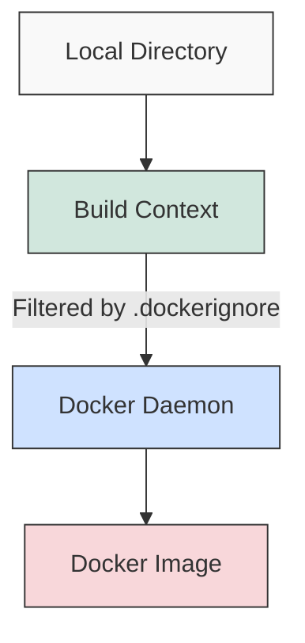

# Docker Ignore

When building Docker images, you might not want to include all the files in your project directory. The `.dockerignore` file helps you specify which files and directories should be excluded from the build context, making your Docker builds faster and your images smaller.

## What is a .dockerignore file?

A `.dockerignore` file works similarly to a `.gitignore` file if you're familiar with Git. It tells Docker which files and directories to ignore when copying files to the build context during the `docker build` process.

Using a `.dockerignore` file offers several benefits:

- **Faster builds**: Smaller build contexts mean faster uploads to the Docker daemon
- **Smaller images**: Excluding unnecessary files results in more compact Docker images
- **Security**: Prevents sensitive files like `.env` or private keys from being included in your images
- **Cleaner builds**: Avoids including build artifacts, dependencies, or logs that could interfere with the build

## Creating a .dockerignore file

To create a `.dockerignore` file:

1. Create a new file named `.dockerignore` in the root directory of your project (the same directory that contains your Dockerfile)
2. Add patterns for files and directories you want to exclude, one per line

Here's a simple example of a `.dockerignore` file:

```plaintext
# Exclude node modules
node_modules

# Exclude any git files
.git
.gitignore

# Exclude log files
*.log

# Exclude the README
README.md
```

## .dockerignore syntax

The `.dockerignore` file uses pattern matching similar to `.gitignore`. Here's what you need to know:

### Basic patterns

```plaintext
# Comment line (ignored)
file.txt           # Ignores file.txt in any directory
path/to/file.txt   # Ignores specific file
*.log              # Ignores all files with .log extension
**/*.log           # Ignores .log files in any subdirectory
temp?              # ? matches a single character (temp1, tempA, etc.)
```

### Directory patterns

```plaintext
node_modules/      # Ignores the node_modules directory and all its contents
build/             # Ignores the build directory and all its contents
```

### Negation patterns

You can use `!` to negate a pattern, meaning Docker will include a file that would otherwise be excluded:

```plaintext
# Ignore all .md files
*.md

# But include important-notes.md
!important-notes.md
```

### Path patterns

```plaintext
# Matches directories and files named temp at any level
**/temp

# Matches files or directories in the root directory only
/temp

# Matches any file or directory named temp or starting with temp
temp*
```

## Practical examples

Let's look at some real-world examples for different types of projects:

### Node.js project

```plaintext
# Development dependencies
node_modules
npm-debug.log
yarn-debug.log
yarn-error.log

# Environment and configuration
.env
.env.local
.env.development
.env.test
.env.production

# Testing
coverage
.nyc_output

# Build outputs
dist
build

# Version control
.git
.gitignore

# IDE specific files
.idea
.vscode
*.swp
*.swo

# OS specific files
.DS_Store
Thumbs.db
```

### Python project

```plaintext
# Python bytecode
__pycache__/
*.py[cod]
*$py.class

# Virtual environments
venv/
env/
ENV/
.env

# Testing
.pytest_cache/
.coverage
htmlcov/

# Distribution / packaging
dist/
build/
*.egg-info/

# Documentation
docs/_build/

# Version control
.git
.gitignore

# IDE specific files
.idea/
.vscode/
```

### Java project

```plaintext
# Compiled class files
*.class
target/
build/

# Package files
*.jar
*.war
*.ear

# Maven
.mvn/
mvnw
mvnw.cmd

# Gradle
.gradle/
gradlew
gradlew.bat

# Testing
test-output/

# Logs
*.log

# Version control
.git/
.gitignore

# IDE specific files
.idea/
.vscode/
*.iml
.classpath
.project
.settings/
```

## The build context and .dockerignore

To understand why `.dockerignore` is important, let's look at how Docker builds images:



1. When you run `docker build`, Docker client first sends the entire build context (recursively) to the Docker daemon
2. The `.dockerignore` file filters what gets included in this build context
3. The Docker daemon then builds the image using only the files in the build context

## Common use cases

### Excluding local development files

```plaintext
# Local development files
.env.local
docker-compose.override.yml
local-data/
```

### Excluding large files not needed for the build

```plaintext
# Large files
*.iso
*.zip
*.tar.gz
data/large-dataset.csv
```

### Excluding sensitive information

```plaintext
# Sensitive files
**/id_rsa
**/id_dsa
**/*.pem
**/secrets/
credentials.json
```

## Example: Complete workflow

Let's walk through a complete example of setting up a `.dockerignore` file for a Node.js web application:

1. Project structure:

```plaintext
my-node-app/
├── .git/
├── node_modules/
├── src/
│   ├── index.js
│   └── components/
├── public/
│   ├── images/
│   └── styles/
├── tests/
├── .env
├── .env.example
├── package.json
├── package-lock.json
└── Dockerfile
```

2. Create a `.dockerignore` file:

```plaintext
# Version control
.git
.gitignore

# Dependencies
node_modules

# Environment variables (except examples)
.env
.env.*
!.env.example

# Testing
tests
coverage

# Build artifacts
build
dist

# Logs
logs
*.log

# OS files
.DS_Store
Thumbs.db

# Editor directories
.idea
.vscode
*.swp
```

3. Dockerfile:

```dockerfile
FROM node:14-alpine

WORKDIR /app

# Copy package files first (for better caching)
COPY package*.json ./

RUN npm install --production

# Copy the rest of the application
COPY . .

EXPOSE 3000

CMD ["node", "src/index.js"]
```

4. Build the Docker image:

```bash
docker build -t my-node-app .
```

Notice how the build context is smaller and the build process is faster because `.dockerignore` excluded unnecessary files.

## Common mistakes and best practices

### Mistake: Ignoring files needed for the build

Be careful not to exclude files that are required for your application to build or run properly. For example, excluding `package.json` in a Node.js project would prevent installing dependencies.

### Mistake: Not ignoring sensitive files

Always exclude configuration files that contain secrets, credentials, or sensitive information. Even if they're not directly copied into the image, they become part of the build context that's sent to the Docker daemon.

### Best practice: Start with a comprehensive .dockerignore

Start with a comprehensive `.dockerignore` file and adjust as needed. It's better to explicitly include files than to accidentally include something sensitive.

### Best practice: Test your .dockerignore configuration

Test your `.dockerignore` configuration by using `docker build --no-cache .` and checking if the build context size makes sense.

## Summary

A `.dockerignore` file is a powerful tool for optimizing Docker builds and ensuring your Docker images are clean, secure, and efficient. By properly excluding files and directories that aren't needed in your Docker image, you can:

- Speed up the build process
- Reduce image size
- Improve security by preventing sensitive information from being included
- Keep your builds clean and reproducible

Remember to tailor your `.dockerignore` file to your specific project and requirements, and revisit it as your project evolves.

## Additional resources

- [Docker documentation on .dockerignore files](https://docs.docker.com/engine/reference/builder/#dockerignore-file)
- [Docker build command reference](https://docs.docker.com/engine/reference/commandline/build/)
- [Best practices for writing Dockerfiles](https://docs.docker.com/develop/develop-images/dockerfile_best-practices/)

## Exercises

1. Create a `.dockerignore` file for a web application project of your choice (React, Angular, Vue, etc.).
2. Compare the build context size with and without a `.dockerignore` file using `docker build` and observe the difference.
3. Identify files in your project that should never be included in a Docker image and add patterns to exclude them.
4. Create a `.dockerignore` file that excludes everything except specific directories and files needed for your application.