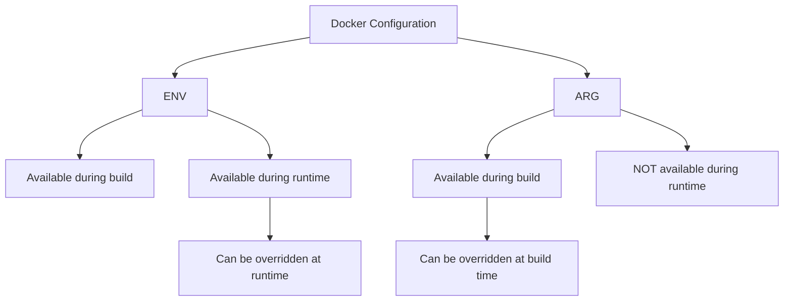

# Docker ENV

Environment variables provide a powerful way to configure Docker containers at runtime. In this guide, we'll explore how to use the `ENV` instruction in Dockerfiles and other methods to pass configuration information to your containerized applications.

## Introduction to Environment Variables in Docker

Environment variables are dynamic values that can affect the way running processes behave on a computer. In Docker, environment variables serve as a primary method for configuring applications inside containers without modifying their code.

Key benefits of using environment variables in Docker include:

- **Configuration flexibility**: Change application behavior without rebuilding images
- **Portability**: Move containers between environments while adapting to local settings
- **Security**: Store sensitive information separately from your application code
- **Compatibility**: Consistent with the twelve-factor app methodology for modern applications

## The ENV Instruction in Dockerfiles

The `ENV` instruction in a Dockerfile sets environment variables that persist when a container is run from the resulting image.

### Basic Syntax

```dockerfile
ENV <key>=<value> ...
```

### Setting Single Variables

You can set a single environment variable like this:

```dockerfile
ENV APP_HOME=/app
```

### Setting Multiple Variables

Multiple variables can be set in a single ENV instruction:

```dockerfile
ENV APP_HOME=/app \
    LOG_LEVEL=info \
    PORT=8080
```

Or across multiple ENV instructions:

```dockerfile
ENV APP_HOME=/app
ENV LOG_LEVEL=info
ENV PORT=8080
```

## Accessing Environment Variables

### Inside the Dockerfile

Once an environment variable is set using `ENV`, it can be referenced in subsequent instructions:

```dockerfile
ENV APP_HOME=/app
WORKDIR $APP_HOME
```

### In Container Commands

Environment variables are available to processes running inside the container:

```dockerfile
ENV GREETING="Hello, Docker!"
CMD ["sh", "-c", "echo $GREETING"]
```

When you run this container, it will output: `Hello, Docker!`

### In Shell Scripts

Environment variables can be accessed in shell scripts executed within the container:

```bash
#!/bin/bash
echo "The application is running on port $PORT"
```

### In Application Code

Your application code can access these variables through the language's standard methods:

```javascript
// Node.js example
const port = process.env.PORT || 3000;
console.log(`Server running on port ${port}`);
```

```python
# Python example
import os
port = os.environ.get('PORT', '3000')
print(f"Server running on port {port}")
```

## Overriding Environment Variables at Runtime

Environment variables defined in the Dockerfile can be overridden when starting a container.

### Using the -e Flag

```bash
docker run -e PORT=5000 my-app
```

### Using the --env Flag

```bash
docker run --env PORT=5000 my-app
```

### Using the --env-file Flag

You can also load variables from a file:

Create a `.env` file:
```
PORT=5000
LOG_LEVEL=debug
```

Then run:
```bash
docker run --env-file .env my-app
```

## Practical Examples

### Configuring a Web Server

```dockerfile
FROM nginx:alpine

ENV NGINX_PORT=80
ENV NGINX_SERVER_NAME=localhost

COPY nginx.conf.template /etc/nginx/templates/default.conf.template
CMD ["sh", "-c", "envsubst < /etc/nginx/templates/default.conf.template > /etc/nginx/conf.d/default.conf && nginx -g 'daemon off;'"]
```

With a template file `nginx.conf.template`:
```
server {
    listen ${NGINX_PORT};
    server_name ${NGINX_SERVER_NAME};
    
    location / {
        root /usr/share/nginx/html;
        index index.html;
    }
}
```

### Configuring a Database Connection

```dockerfile
FROM node:14-alpine

WORKDIR /app

COPY package*.json ./
RUN npm install

COPY . .

ENV DB_HOST=localhost
ENV DB_PORT=5432
ENV DB_USER=postgres
ENV DB_PASSWORD=postgres
ENV DB_NAME=myapp

CMD ["node", "server.js"]
```

In `server.js`:
```javascript
const { Pool } = require('pg');

const pool = new Pool({
  host: process.env.DB_HOST,
  port: process.env.DB_PORT,
  user: process.env.DB_USER,
  password: process.env.DB_PASSWORD,
  database: process.env.DB_NAME
});

// Application code continues...
```

### Multi-environment Configuration

```dockerfile
FROM python:3.9-slim

WORKDIR /app

COPY requirements.txt .
RUN pip install -r requirements.txt

COPY . .

# Default to development environment
ENV ENVIRONMENT=development
ENV DEBUG=true
ENV LOG_LEVEL=debug

# Production settings (can be overridden at runtime)
# docker run -e ENVIRONMENT=production -e DEBUG=false my-app
ENV PROD_LOG_LEVEL=info

CMD ["python", "app.py"]
```

In `app.py`:
```python
import os

environment = os.environ.get('ENVIRONMENT')
debug_mode = os.environ.get('DEBUG', 'false').lower() == 'true'

# Use different log levels based on environment
if environment == 'production':
    log_level = os.environ.get('PROD_LOG_LEVEL')
else:
    log_level = os.environ.get('LOG_LEVEL')

print(f"Starting application in {environment} mode")
print(f"Debug mode: {debug_mode}")
print(f"Log level: {log_level}")

# Application code continues...
```

## Best Practices for Using Docker ENV

### 1. Use ENV for Non-sensitive Configuration

Environment variables in Dockerfiles become part of the image history and can be viewed by anyone with access to the image. Use them for non-sensitive configuration only.

### 2. Default Values

Provide sensible default values for environment variables to ensure your container can run without requiring every variable to be specified at runtime.

```dockerfile
ENV PORT=8080 \
    LOG_LEVEL=info \
    NODE_ENV=production
```

### 3. Documentation

Document all environment variables your container accepts, including their purpose, default values, and expected format.

```dockerfile
# PORT: The port the application listens on (default: 8080)
# LOG_LEVEL: Logging verbosity [debug|info|warn|error] (default: info)
# NODE_ENV: Application environment [development|production] (default: production)
ENV PORT=8080 \
    LOG_LEVEL=info \
    NODE_ENV=production
```

### 4. Group Related Variables

Group related environment variables to improve readability:

```dockerfile
# Database configuration
ENV DB_HOST=localhost \
    DB_PORT=5432 \
    DB_USER=postgres \
    DB_NAME=myapp

# Application configuration
ENV APP_PORT=8080 \
    APP_LOG_LEVEL=info \
    APP_ENVIRONMENT=production
```

### 5. Use ARG for Build-time Variables

If a value is only needed during the build and not at runtime, use `ARG` instead of `ENV`:

```dockerfile
ARG NODE_VERSION=14

FROM node:${NODE_VERSION}-alpine

# Runtime environment variables
ENV APP_HOME=/app
```

## ENV vs ARG

It's important to understand the difference between `ENV` and `ARG` in Dockerfiles:



| Feature                | ENV        | ARG           |
|------------------------|------------|---------------|
| Available during build | ✅          | ✅             |
| Available at runtime   | ✅          | ❌             |
| Persists in the image  | ✅          | ❌             |
| Can be overridden      | At runtime | At build time |
| Default value          | Required   | Optional      |

## Summary

Environment variables in Docker provide a flexible way to configure containers without modifying code. The `ENV` instruction in Dockerfiles sets default environment variables that can be overridden at runtime.

Key takeaways:
- Use `ENV` for runtime configuration of your containers
- Override values at runtime using `-e`, `--env`, or `--env-file`
- Use environment variables to make your containers adaptable to different environments
- Follow best practices like providing defaults and documenting variables
- For build-time configuration, use `ARG` instead of `ENV`

## Exercises

1. Create a Dockerfile that uses environment variables to configure a web server port and document string.

2. Modify an existing Dockerfile to accept database connection parameters as environment variables.

3. Create a multi-stage build Dockerfile that uses different environment variables for development and production stages.

4. Write a shell script that reads Docker environment variables and uses them to generate a configuration file for an application.

5. Set up a Docker Compose file that passes different environment variables to multiple interconnected containers.

## Additional Resources

- [Docker Documentation: ENV instruction](https://docs.docker.com/engine/reference/builder/#env)
- [Docker Documentation: ARG instruction](https://docs.docker.com/engine/reference/builder/#arg)
- [Twelve-Factor App Methodology: Config](https://12factor.net/config)
- [Docker run reference: Environment variables](https://docs.docker.com/engine/reference/run/#env-environment-variables)