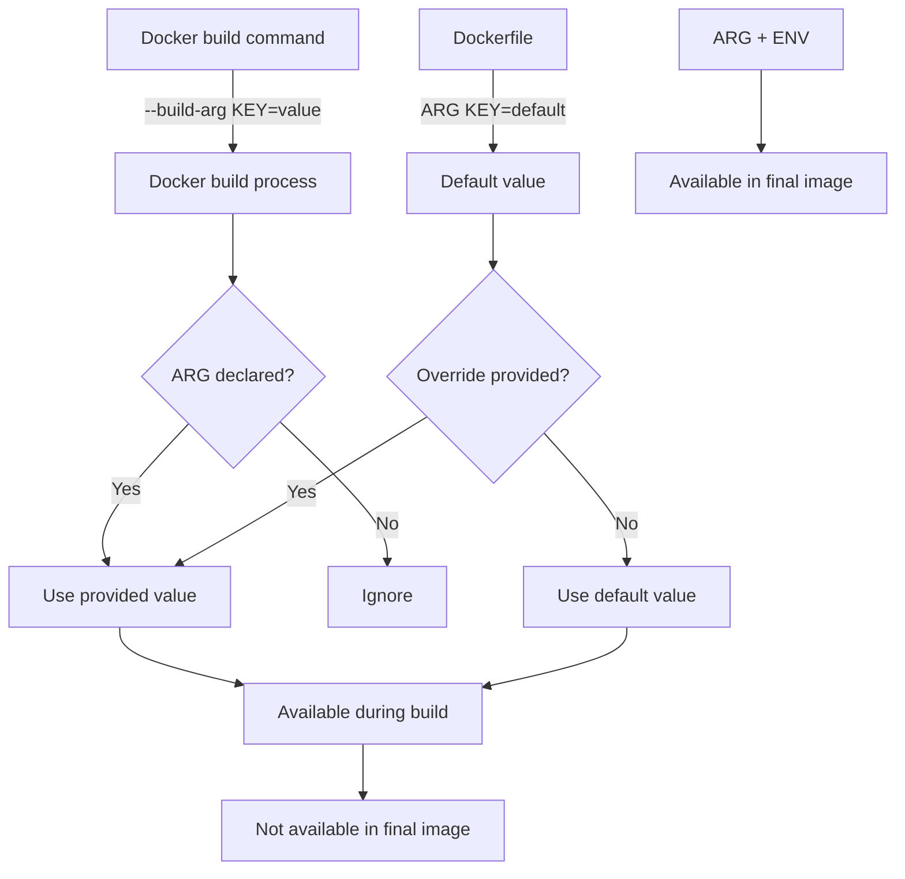

# Docker ARG

## Introduction

When building Docker images, you often need to customize the build process without modifying the Dockerfile itself. This is where the `ARG` instruction comes in. ARGs are build-time variables that allow you to pass different values to your Dockerfile during the image building process, making your Dockerfiles more flexible and reusable.

Unlike Docker's `ENV` instruction which sets environment variables that persist in the running container, `ARG` values are only available during the image build phase. They're perfect for varying things like software versions, repository URLs, or credentials needed only at build time.

## Basic Syntax

The basic syntax for declaring and using ARG in your Dockerfile is:

```dockerfile
# Declaring an ARG
ARG variable_name[=default_value]

# Using an ARG
RUN echo $variable_name
```

## How ARG Works

Let's understand the `ARG` instruction with a simple example:

```dockerfile
FROM ubuntu:20.04

# Declare an ARG with a default value
ARG PACKAGES="git vim curl"

# Use the ARG value in a RUN instruction
RUN apt-get update && apt-get install -y $PACKAGES
```

When building this image, you can override the default packages:

```bash
# Using the default value (git, vim, curl)
docker build -t my-ubuntu .

# Overriding the default value
docker build -t my-ubuntu --build-arg PACKAGES="nginx nodejs" .
```

## ARG Scope and Behavior

Understanding the scope of ARG variables is crucial:

1. **Declaration Before FROM**: ARGs declared before the `FROM` instruction are outside the build stage and not available inside the build stage by default.

2. **Re-declaring ARGs**: To use an ARG declared before `FROM` within the build stage, you must re-declare it after `FROM` (without a default value if you wish).

Here's an example showing the scope behavior:

```dockerfile
# ARG before FROM (only available before FROM)
ARG BASE_IMAGE=ubuntu:20.04

# This uses the ARG value
FROM $BASE_IMAGE

# Need to re-declare to use within the build stage
ARG BASE_IMAGE

# Now we can use it
RUN echo "Building from $BASE_IMAGE"

# Another ARG scoped only to this build stage
ARG VERSION=latest
RUN echo "Installing version: $VERSION"
```

## Multi-stage Builds and ARG

In multi-stage builds, each `FROM` instruction starts a new build stage with its own scope:

```dockerfile
ARG VERSION=3.9

FROM python:$VERSION AS build
# This stage uses Python 3.9 by default or whatever VERSION is passed

# ARGs need to be redeclared in each stage
ARG VERSION
RUN echo "Building with Python $VERSION"

FROM nginx:alpine AS deploy
# This stage doesn't have access to the VERSION ARG 
# unless you redeclare it
ARG VERSION
RUN echo "Deploying application built with Python $VERSION"
```

## Predefined ARGs

Docker provides some predefined ARGs that you can use without declaring them:

- `HTTP_PROXY` and `http_proxy`
- `HTTPS_PROXY` and `https_proxy`
- `FTP_PROXY` and `ftp_proxy`
- `NO_PROXY` and `no_proxy`

Example:

```dockerfile
FROM ubuntu:20.04

# No need to declare these ARGs
RUN echo "HTTP_PROXY: $HTTP_PROXY"
```

## Best Practices for Using ARG

Here are some best practices to follow when using ARG in your Dockerfiles:

1. **Default Values**: Always provide sensible default values to make your Dockerfile work without requiring build arguments.

2. **Combine Related ARGs**: Use ARGs together to create more complex configurations.

```dockerfile
ARG NODE_VERSION=16
ARG NODE_PACKAGE=node-v$NODE_VERSION
ARG NODE_PATH=/opt/$NODE_PACKAGE

RUN curl -o $NODE_PACKAGE.tar.gz https://nodejs.org/dist/v$NODE_VERSION/$NODE_PACKAGE.tar.gz && \
    tar -xzf $NODE_PACKAGE.tar.gz -C /opt/ && \
    ln -s $NODE_PATH/bin/node /usr/local/bin/node
```

3. **ARG vs ENV**: Use ARG for build-time variables and ENV for runtime variables. You can also set an ENV based on an ARG to make a build-time variable available at runtime:

```dockerfile
ARG VERSION=latest
ENV APP_VERSION=$VERSION

# APP_VERSION will persist in the container, even though VERSION won't
```

4. **Sensitive Information**: Avoid using ARG for sensitive data like passwords, as they are visible in the image history. If you need to use sensitive data during build, consider using BuildKit's secret mounting feature instead.

## Practical Examples

### Example 1: Customizing Software Versions

This example shows how to create a flexible Python image with customizable version:

```dockerfile
FROM ubuntu:20.04

ARG PYTHON_VERSION=3.9
ARG DEBIAN_FRONTEND=noninteractive

RUN apt-get update && apt-get install -y \
    python${PYTHON_VERSION} \
    python${PYTHON_VERSION}-venv \
    python${PYTHON_VERSION}-dev \
    && apt-get clean \
    && rm -rf /var/lib/apt/lists/*

# Create symbolic links to make 'python' point to the installed version
RUN ln -sf /usr/bin/python${PYTHON_VERSION} /usr/bin/python
RUN ln -sf /usr/bin/pip${PYTHON_VERSION} /usr/bin/pip
```

Build command:
```bash
# Default (Python 3.9)
docker build -t python-custom .

# Python 3.8
docker build -t python38-custom --build-arg PYTHON_VERSION=3.8 .
```

### Example 2: Configuring Build Environment

Here's an example of configuring different build environments (development, staging, production):

```dockerfile
FROM node:16-alpine

ARG NODE_ENV=production
ENV NODE_ENV=$NODE_ENV

WORKDIR /app

COPY package*.json ./

# Install dependencies based on environment
RUN if [ "$NODE_ENV" = "development" ]; then \
        npm install; \
    else \
        npm ci --only=production; \
    fi

COPY . .

# Default build command depending on environment
RUN if [ "$NODE_ENV" = "test" ]; then \
        npm run test; \
    elif [ "$NODE_ENV" = "development" ]; then \
        npm run build:dev; \
    else \
        npm run build; \
    fi

CMD ["npm", "start"]
```

Build command:
```bash
# Production build (default)
docker build -t myapp:prod .

# Development build
docker build -t myapp:dev --build-arg NODE_ENV=development .

# Test build
docker build -t myapp:test --build-arg NODE_ENV=test .
```

### Example 3: Configuring Build-time URLs

Use ARG to configure repository URLs and sources:

```dockerfile
FROM alpine:3.14

ARG REPO_URL=https://github.com/myorg/myapp.git
ARG BRANCH=main

RUN apk add --no-cache git

# Clone specific branch from configurable repository
RUN git clone -b $BRANCH $REPO_URL /app

WORKDIR /app
RUN ./build.sh

CMD ["./run.sh"]
```

Build command:
```bash
# Default (main branch)
docker build -t myapp .

# Feature branch
docker build -t myapp-feature --build-arg BRANCH=feature/new-ui .

# Fork repository
docker build -t myapp-fork --build-arg REPO_URL=https://github.com/contributor/myapp-fork.git .
```

## Visualizing ARG Flow

Here's a diagram showing how Docker ARG works:



## Summary

Docker's `ARG` instruction is a powerful tool for creating flexible and reusable Dockerfiles:

- ARGs are build-time variables, not available in the running container (unless copied to an ENV).
- ARGs can have default values that can be overridden with `--build-arg`.
- ARGs have specific scope rules, especially with multi-stage builds.
- You can combine ARGs with other Docker instructions for advanced configuration.

By using ARGs effectively, you can create Dockerfiles that can adapt to different build scenarios without requiring modifications to the Dockerfile itself.

## Further Learning

To deepen your understanding of Docker ARG, try these exercises:

1. Create a Dockerfile for a web application that can be built for different environments (dev, test, prod) using ARGs.
2. Build a multi-stage Dockerfile that uses ARGs to control which stages are included in the final image.
3. Experiment with ARG scope by creating a Dockerfile with multiple FROM instructions and observe how ARGs behave.

For official documentation, refer to:
- Docker's official documentation on the ARG instruction
- Docker BuildKit documentation for advanced build features