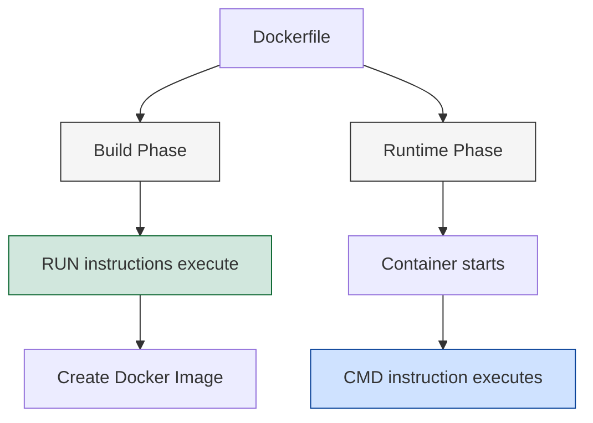

# Docker CMD

## Introduction

The `CMD` instruction is one of the most important commands in Docker configuration. It defines the default command that executes when a container starts. Think of it as telling Docker "run this program when you launch my container."

While similar to the `RUN` instruction, `CMD` serves a completely different purpose. `RUN` executes commands during image building, whereas `CMD` specifies what program should run when the container starts.

In this guide, we'll explore the Docker `CMD` instruction in depth, understand its syntax variations, and see how it works in real-world examples.

## Understanding Docker CMD

### What is CMD?

The `CMD` instruction defines the default command to run when a container starts. It provides the default executable and arguments for a running container. If you don't override the command when starting the container, Docker will execute whatever is specified in `CMD`.

### CMD Syntax

Docker supports three forms of the `CMD` instruction:

1. **Shell form**: `CMD command param1 param2`
2. **Exec form (preferred)**: `CMD ["executable", "param1", "param2"]`
3. **Parameter form**: `CMD ["param1", "param2"]` (used with `ENTRYPOINT`)

Let's examine each of these forms in detail:

#### Shell Form

When using the shell form, the command is executed in a shell:

```dockerfile
# Shell form
CMD echo "Hello, Docker!"
```

This actually runs `/bin/sh -c "echo Hello, Docker!"` inside the container. The shell form comes with some limitations:
- It doesn't pass signals properly to the container
- The actual running process is the shell, not your command
- It makes it harder to get environment variables

#### Exec Form (Preferred)

The exec form directly executes the command without a shell wrapper:

```dockerfile
# Exec form (preferred)
CMD ["echo", "Hello, Docker!"]
```

This form:
- Executes the command directly (no shell)
- Allows proper signal handling
- Makes your containers more efficient
- Is the recommended approach

#### Parameter Form

The parameter form provides default arguments for `ENTRYPOINT`:

```dockerfile
# Parameter form
ENTRYPOINT ["echo"]
CMD ["Hello, Docker!"]
```

When used together, the `CMD` arguments are passed to the `ENTRYPOINT` executable.

### CMD vs RUN: Understanding the Difference

A common confusion for Docker beginners is understanding the difference between `CMD` and `RUN`:

| Instruction | When it executes      | Purpose                               |
|-------------|-----------------------|---------------------------------------|
| `RUN`       | During image build    | Install packages, setup, etc.         |
| `CMD`       | When container starts | Set default command for the container |



## Practical Examples

### Basic Usage Example

Let's see a simple `Dockerfile` that uses the `CMD` instruction:

```dockerfile
FROM ubuntu:20.04

# Install Python
RUN apt-get update && apt-get install -y python3

# Set default command
CMD ["python3", "-c", "print('Hello from Python in Docker!')"]
```

When you build and run this image:

```bash
docker build -t python-hello .
docker run python-hello
```

The output will be:
```
Hello from Python in Docker!
```

### Overriding CMD at Runtime

A key feature of `CMD` is that it can be overridden when starting a container:

```bash
# Override the default CMD with a different command
docker run python-hello echo "This is different"
```

Output:
```
This is different
```

This flexibility makes `CMD` extremely useful for creating general-purpose images that can be customized at runtime.

### Web Server Example

Let's create a more practical example with a simple web server:

```dockerfile
FROM node:14

WORKDIR /app

# Copy package.json and install dependencies
COPY package.json .
RUN npm install

# Copy the rest of the application
COPY . .

# Expose port
EXPOSE 3000

# Set default command to start the server
CMD ["npm", "start"]
```

This `Dockerfile` creates an image for a Node.js application:
- It sets up the environment
- Installs dependencies
- Copies the application code
- Sets the default command to start the server

When you run this container, it will automatically start the Node.js server.

### Multiple Commands Example

What if you need to run multiple commands when your container starts? You have a few options:

#### Option 1: Use a Shell Script

```dockerfile
FROM ubuntu:20.04

COPY startup.sh /
RUN chmod +x /startup.sh

CMD ["/startup.sh"]
```

The `startup.sh` script could contain:

```bash
#!/bin/bash
echo "Starting services..."
service one start
service two start
echo "Services started!"
exec tail -f /dev/null  # Keep container running
```

#### Option 2: Use a Shell Command with &&

```dockerfile
FROM ubuntu:20.04

CMD echo "Starting..." && service one start && service two start && tail -f /dev/null
```

Note: The second approach uses the shell form, which has the limitations we discussed earlier.

## Best Practices for Using CMD

### 1. Always Use Exec Form

Always prefer the exec form `CMD ["executable", "param1", "param2"]` over the shell form:

```dockerfile
# Good
CMD ["nginx", "-g", "daemon off;"]

# Avoid
CMD nginx -g "daemon off;"
```

### 2. One CMD Per Dockerfile

Docker only uses the last `CMD` instruction in a `Dockerfile`. Any previous `CMD` instructions are ignored:

```dockerfile
FROM ubuntu:20.04

# This will be ignored
CMD ["echo", "This won't run"]

# Only this will execute
CMD ["echo", "This will run"]
```

### 3. Use CMD with ENTRYPOINT

When your container has a fixed executable, use `ENTRYPOINT` for the executable and `CMD` for default parameters:

```dockerfile
# Web server that takes port as argument
ENTRYPOINT ["nginx"]
CMD ["-g", "daemon off;"]
```

This allows users to override parameters while keeping the main executable:

```bash
docker run my-nginx -c /custom/nginx.conf
```

### 4. Consider Using Shell Scripts for Complex Commands

For complex startup logic, use a shell script:

```dockerfile
COPY start.sh /
RUN chmod +x /start.sh
CMD ["/start.sh"]
```

## Common Gotchas and Solutions

### Environment Variables

Environment variables don't expand in the exec form:

```dockerfile
# This WON'T work as expected
CMD ["echo", "$HOME"]
```

Solutions:

1. Use the shell form (less ideal):
```dockerfile
CMD echo $HOME
```

2. Use a shell script that can handle environment variables properly:
```dockerfile
COPY entrypoint.sh /
RUN chmod +x /entrypoint.sh
CMD ["/entrypoint.sh"]
```

### Default Shell Commands

Commands like `ls`, `echo`, etc. are shell commands and won't work directly:

```dockerfile
# This will fail
CMD ["ls", "-la"]
```

Solution: Explicitly use a shell:

```dockerfile
CMD ["/bin/sh", "-c", "ls -la"]
```

### Running as a Service

Many applications need to run in the foreground:

```dockerfile
# Wrong - Nginx will start and exit immediately
CMD ["nginx"]

# Correct - Runs in foreground
CMD ["nginx", "-g", "daemon off;"]
```

## Summary

The Docker `CMD` instruction is a crucial part of container configuration that:

- Specifies the default command to run when a container starts
- Can be overridden at runtime
- Works best in exec form `CMD ["executable", "param1"]`
- Should be used thoughtfully with `ENTRYPOINT`

Understanding the nuances of `CMD` helps you create more flexible and robust Docker containers, making your applications more portable and easier to deploy.

## Additional Resources

- [Docker CMD Documentation](https://docs.docker.com/engine/reference/builder/#cmd)
- [Docker ENTRYPOINT Documentation](https://docs.docker.com/engine/reference/builder/#entrypoint)

## Exercises

1. Create a simple `Dockerfile` that uses `CMD` to display a custom message.
2. Build an image that runs a Python script by default, but allows overriding it.
3. Create a web server image with proper `CMD` configuration to run in the foreground.
4. Experiment with using `CMD` and `ENTRYPOINT` together for a more flexible image.
5. Debug a `Dockerfile` where environment variables aren't being expanded correctly in `CMD`.