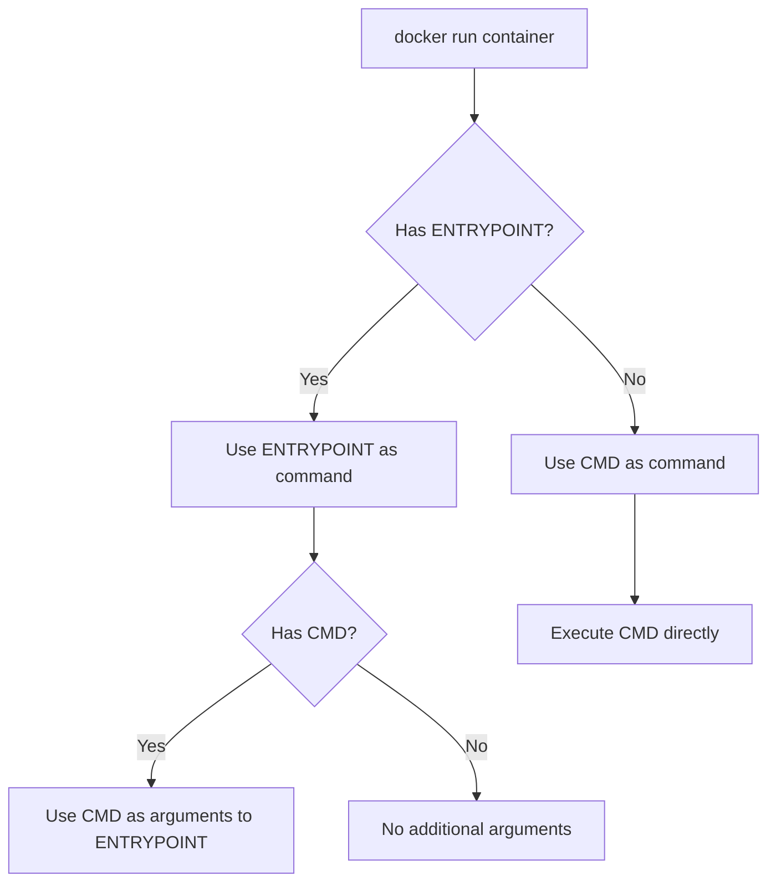

# Docker ENTRYPOINT

## Introduction

When working with Docker containers, you need a way to define what process runs when your container starts. This is where the `ENTRYPOINT` instruction comes in. The `ENTRYPOINT` instruction allows you to configure a container that will run as an executable, making your containers behave like standalone applications.

In this guide, we'll explore:
- What the Docker `ENTRYPOINT` instruction is
- How it differs from the `CMD` instruction
- Different forms of `ENTRYPOINT`
- Best practices and real-world examples

## What is ENTRYPOINT?

The `ENTRYPOINT` instruction in a Dockerfile defines the command that will **always** be executed when the container starts. Unlike other instructions that can be overridden from the command line, the `ENTRYPOINT` provides a more stable way to ensure specific commands run, regardless of additional parameters passed to `docker run`.

Think of `ENTRYPOINT` as setting up the "main program" that your container will execute, while any additional arguments from `CMD` or command-line are passed to this main program.

## ENTRYPOINT vs CMD

Both `ENTRYPOINT` and `CMD` instructions define what command gets executed when running a container. However, they serve different purposes and interact in specific ways:

| ENTRYPOINT | CMD |
|------------|-----|
| Defines the executable that will always run | Provides default arguments to the executable |
| Not easily overridden at runtime | Easily overridden by command-line arguments |
| Container runs as an executable | Container runs with default commands |

When both `ENTRYPOINT` and `CMD` are specified, Docker combines them in a specific way:



## Forms of ENTRYPOINT

Docker supports two forms of the `ENTRYPOINT` instruction:

### Shell Form

```dockerfile
ENTRYPOINT command param1 param2
```

In shell form, the command runs inside a shell (`/bin/sh -c`), which means:
- Shell processing occurs (variable substitution, etc.)
- Signals may not be properly passed to your application
- The specified command will not be container's PID 1

### Exec Form (Recommended)

```dockerfile
ENTRYPOINT ["executable", "param1", "param2"]
```

The exec form is preferred because:
- The executable runs directly (not within a shell)
- Signals are properly forwarded to your application
- The specified command becomes container's PID 1
- No shell string processing occurs

## Basic ENTRYPOINT Examples

### Simple Static ENTRYPOINT

```dockerfile
FROM ubuntu:20.04
ENTRYPOINT ["echo", "Hello from Docker!"]
```

Build and run:

```bash
$ docker build -t entrypoint-demo .
$ docker run entrypoint-demo
Hello from Docker!
```

Any additional arguments from the command line are appended to the `ENTRYPOINT`:

```bash
$ docker run entrypoint-demo additional arguments
Hello from Docker! additional arguments
```

### ENTRYPOINT with CMD as Default Parameters

```dockerfile
FROM ubuntu:20.04
ENTRYPOINT ["echo", "Hello"]
CMD ["World"]
```

Build and run:

```bash
$ docker build -t entrypoint-cmd-demo .
$ docker run entrypoint-cmd-demo
Hello World
```

You can override the default parameters:

```bash
$ docker run entrypoint-cmd-demo Docker
Hello Docker
```

## Practical Examples

### Creating an Executable Container

Let's create a container that works like the `ping` command:

```dockerfile
FROM alpine:3.14
RUN apk add --no-cache iputils
ENTRYPOINT ["ping"]
CMD ["localhost"]
```

Build and run:

```bash
$ docker build -t ping-container .
$ docker run ping-container
PING localhost (127.0.0.1): 56 data bytes
64 bytes from 127.0.0.1: seq=0 ttl=64 time=0.046 ms
64 bytes from 127.0.0.1: seq=1 ttl=64 time=0.077 ms
...
```

Now you can use it like the normal ping command:

```bash
$ docker run ping-container google.com
PING google.com (142.250.190.78): 56 data bytes
64 bytes from 142.250.190.78: seq=0 ttl=114 time=13.127 ms
64 bytes from 142.250.190.78: seq=1 ttl=114 time=15.365 ms
...
```

### Database Initialization Script

A common use case is to initialize a database with a setup script:

```dockerfile
FROM mysql:8.0
COPY ./init-db.sh /docker-entrypoint-initdb.d/
ENTRYPOINT ["docker-entrypoint.sh"]
CMD ["mysqld"]
```

The official MySQL image has an entrypoint script that:
1. Sets up the MySQL database
2. Executes any scripts in `/docker-entrypoint-initdb.d/`
3. Starts the MySQL server

### Entry Script with Configuration

An advanced example using a custom entry script:

```dockerfile
FROM node:14
WORKDIR /app
COPY package.json .
RUN npm install
COPY . .
COPY ./docker-entrypoint.sh /
RUN chmod +x /docker-entrypoint.sh
ENTRYPOINT ["/docker-entrypoint.sh"]
CMD ["npm", "start"]
```

And here's the entry script (`docker-entrypoint.sh`):

```bash
#!/bin/bash
set -e

# Configuration based on environment
if [ "$ENVIRONMENT" = "development" ]; then
  echo "Setting up development configuration..."
  # Development-specific setup
elif [ "$ENVIRONMENT" = "production" ]; then
  echo "Setting up production configuration..."
  # Production-specific setup
fi

# Execute the command passed to docker run
exec "$@"
```

The entry script handles configuration, then uses `exec "$@"` to run whatever command was passed to it (either from CMD or the command line).

## Overriding ENTRYPOINT

While `ENTRYPOINT` is meant to be fixed, there are cases where you need to override it. You can do this with the `--entrypoint` flag:

```bash
$ docker run --entrypoint echo ping-container "Overridden entrypoint"
Overridden entrypoint
```

## Best Practices

1. **Use exec form** - Always use the exec form (`["command", "param1"]`) rather than shell form to avoid signal handling issues.

2. **Keep it simple** - The `ENTRYPOINT` should focus on preparing your application to run, not performing complex tasks.

3. **Combine with CMD** - Use `ENTRYPOINT` for the command and `CMD` for default arguments that can be overridden.

4. **Create entry scripts** - For complex initialization, create a separate script as your entrypoint that handles setup and then executes the main process.

5. **Handle signals properly** - Ensure your entrypoint can forward signals (like SIGTERM) to the application.

6. **Use exec in scripts** - When using shell scripts as entrypoints, use `exec` to replace the shell process with your application.

## Common Mistakes to Avoid

1. **Not using exec form** - Using shell form causes signal handling issues and creates an unnecessary shell process.

2. **Hard-coding configuration** - Avoid hard-coding environment-specific details; use environment variables instead.

3. **Complex entrypoint logic** - Keep complex logic in separate scripts, not in the Dockerfile.

4. **Forgetting PID 1 responsibilities** - The entrypoint becomes PID 1 and should handle zombie processes and signals appropriately.

## Summary

The Docker `ENTRYPOINT` instruction is a powerful feature that allows you to create executable containers and define the main process that runs when a container starts.

Key points to remember:
- `ENTRYPOINT` defines what command always runs when the container starts
- The exec form `ENTRYPOINT ["command", "param1"]` is recommended
- `ENTRYPOINT` works with `CMD` to provide default arguments
- Entry scripts can provide flexibility while maintaining the executable nature of containers

By understanding and properly using `ENTRYPOINT`, you can create more predictable and user-friendly Docker containers that behave like standalone applications.

## Additional Resources

- [Docker Official Documentation on ENTRYPOINT](https://docs.docker.com/engine/reference/builder/#entrypoint)
- [Docker CMD and ENTRYPOINT Best Practices](https://docs.docker.com/develop/develop-images/dockerfile_best-practices/#entrypoint)

## Exercises

1. Create a Dockerfile that uses `ENTRYPOINT` to make a container that works like the `grep` command.

2. Modify an existing Dockerfile to use an entrypoint script that performs environment-specific configuration before starting the main application.

3. Create a container with both `ENTRYPOINT` and `CMD` that allows users to easily customize the behavior without modifying the Dockerfile.