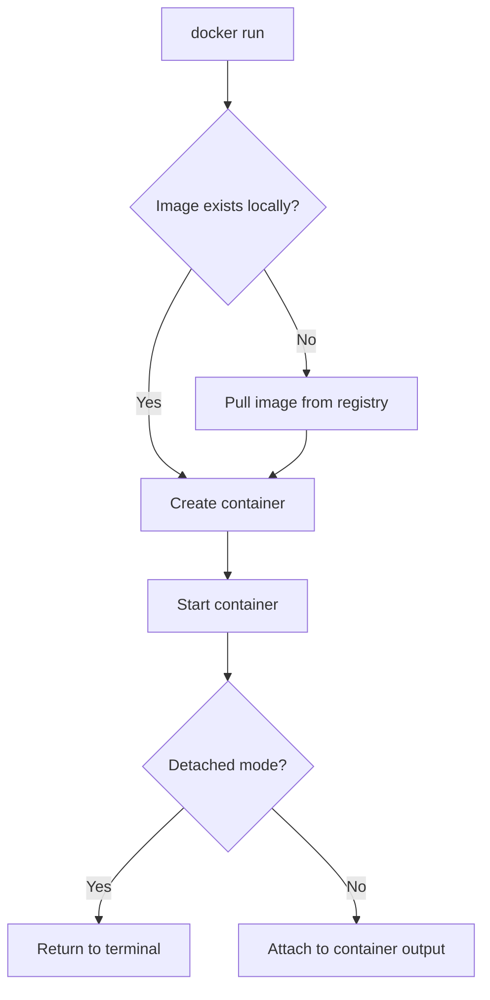

# Docker Run

## Introduction

`docker run` is one of the most fundamental commands in Docker. It serves as your gateway to creating and starting containers from Docker images. When you execute `docker run`, Docker performs several operations behind the scenes: it finds the specified image, creates a new container based on that image, and then starts the container with the options you've provided.

Think of Docker images as blueprints and containers as the actual instances created from these blueprints. The `docker run` command is what brings these blueprints to life!

## Basic Syntax

The basic syntax for the `docker run` command is:

```bash
docker run [OPTIONS] IMAGE [COMMAND] [ARG...]
```

Let's break down each component:

- `[OPTIONS]`: Optional flags that modify how the container runs
- `IMAGE`: The Docker image you want to use (e.g., ubuntu, nginx)
- `[COMMAND]`: Optional command to execute when the container starts
- `[ARG...]`: Optional arguments to pass to the command

## Basic Examples

### Running a Simple Container

Let's start with running a basic Ubuntu container:

```bash
docker run ubuntu
```

**Output:**
```
Unable to find image 'ubuntu:latest' locally
latest: Pulling from library/ubuntu
7b1a6ab2e44d: Pull complete
Digest: sha256:626ffe58f6e7566e00254b638eb7e0f3b11d4da9675088f4781a50ae288f3322
Status: Downloaded newer image for ubuntu:latest
```

What happened? Docker:
1. Looked for the Ubuntu image locally
2. Did not find it, so it pulled it from Docker Hub
3. Created a container
4. Started the container
5. The container immediately exited because we didn't specify any command to keep it running

### Running a Container in Interactive Mode

To interact with a container, we use the `-i` (interactive) and `-t` (terminal) flags:

```bash
docker run -it ubuntu bash
```

**Output:**
```
root@7a8f8c3d2b1a:/#
```

Now you're inside the container with a bash shell! You can run commands just like you would on an Ubuntu system.

## Essential Options

Let's explore some of the most commonly used options with `docker run`:

### Container Identification

```bash
docker run --name my-ubuntu-container ubuntu
```

This assigns a name to your container, making it easier to reference later.

### Detached Mode

```bash
docker run -d nginx
```

**Output:**
```
7a8f8c3d2b1a8e9f0c1d2e3f4a5b6c7d8e9f0a1b2c3d4e5f6a7b8c9d0e1f2a3
```

The `-d` flag runs the container in the background (detached mode) and returns the container ID.

### Port Mapping

```bash
docker run -d -p 8080:80 nginx
```

This maps port 8080 on your host to port 80 in the container, allowing you to access the nginx web server by visiting `http://localhost:8080` in your browser.

### Volume Mounting

```bash
docker run -v /host/path:/container/path ubuntu
```

This mounts a directory from your host system into the container, enabling data persistence and sharing.

### Environment Variables

```bash
docker run -e DB_HOST=localhost -e DB_PORT=5432 my-app
```

Sets environment variables inside the container.

## Practical Examples

Let's look at some real-world examples of using `docker run`:

### Running a Web Server

```bash
docker run -d --name my-website -p 8080:80 -v $(pwd)/website:/usr/share/nginx/html nginx
```

This command:
1. Runs an Nginx web server in detached mode
2. Names it "my-website"
3. Maps port 8080 on your host to port 80 in the container
4. Mounts your local "website" directory to Nginx's HTML directory

Now you can edit files in your local "website" directory, and they'll be served by Nginx.

### Running a Database

```bash
docker run -d \
  --name my-postgres \
  -e POSTGRES_PASSWORD=mysecretpassword \
  -e POSTGRES_USER=myuser \
  -e POSTGRES_DB=mydb \
  -p 5432:5432 \
  -v postgres-data:/var/lib/postgresql/data \
  postgres
```

This creates a PostgreSQL database container with:
1. Custom username, password, and database name
2. Port mapping to access the database from your host
3. A named volume for data persistence

### Running a Multi-container Application

For a web application with a separate database, you might run:

```bash
# Database container
docker run -d --name app-db \
  -e MYSQL_ROOT_PASSWORD=root \
  -e MYSQL_DATABASE=app_data \
  -e MYSQL_USER=app_user \
  -e MYSQL_PASSWORD=app_pass \
  --network app-network \
  mysql:5.7

# Web application container
docker run -d --name app-web \
  -p 3000:3000 \
  --network app-network \
  -e DB_HOST=app-db \
  -e DB_USER=app_user \
  -e DB_PASSWORD=app_pass \
  -e DB_NAME=app_data \
  my-web-app
```

Note: For this to work, you'd first need to create a network with `docker network create app-network`.

## Docker Run Workflow

Here's a visual representation of what happens when you run `docker run`:



## Common Flags Reference Table

| Flag | Description | Example |
|------|-------------|---------|
| `-d, --detach` | Run container in background | `docker run -d nginx` |
| `-p, --publish` | Map container port to host | `docker run -p 8080:80 nginx` |
| `-v, --volume` | Mount a volume | `docker run -v /host/path:/container/path ubuntu` |
| `-e, --env` | Set environment variables | `docker run -e VAR=value image` |
| `--name` | Assign a name to the container | `docker run --name web nginx` |
| `-i, --interactive` | Keep STDIN open | Used with `-t` for interactive shells |
| `-t, --tty` | Allocate a pseudo-TTY | Used with `-i` for interactive shells |
| `--rm` | Remove container when it exits | `docker run --rm alpine echo "Hello"` |
| `--network` | Connect to a network | `docker run --network my-net image` |
| `--restart` | Restart policy for container | `docker run --restart always nginx` |

## Resource Constraints

Docker allows you to limit resources used by containers:

```bash
# Limit memory to 512MB
docker run --memory="512m" nginx

# Limit CPU to 0.5 cores
docker run --cpus="0.5" nginx

# Set CPU priority (higher = more priority)
docker run --cpu-shares="512" nginx
```

## Best Practices

1. **Always use specific image tags** rather than `latest` to ensure reproducibility:
   ```bash
   docker run nginx:1.21.3
   ```

2. **Use `--rm` flag for temporary containers** to avoid cluttering your system:
   ```bash
   docker run --rm alpine echo "This container will be removed after exit"
   ```

3. **Name your containers** for easier management:
   ```bash
   docker run --name web-app nginx
   ```

4. **Use volume mounts for persistent data**:
   ```bash
   docker run -v data-volume:/app/data my-app
   ```

5. **Set resource limits** to prevent one container from consuming all system resources:
   ```bash
   docker run --memory="1g" --cpus="1.0" my-app
   ```

6. **Use environment variables for configuration** rather than hardcoding values:
   ```bash
   docker run -e LOG_LEVEL=info -e API_KEY=12345 my-app
   ```

## Common Errors and Troubleshooting

### Image Not Found
```
Unable to find image 'non-existent-image:latest' locally
docker: Error response from daemon: pull access denied for non-existent-image, repository does not exist or may require 'docker login'.
```

**Solution**: Double-check the image name and ensure it exists on Docker Hub or your private registry.

### Port Already Allocated
```
docker: Error response from daemon: driver failed programming external connectivity on endpoint my-container: Error starting userland proxy: listen tcp 0.0.0.0:8080: bind: address already in use.
```

**Solution**: Choose a different host port that isn't already in use.

### Insufficient Permissions
```
docker: Got permission denied while trying to connect to the Docker daemon socket.
```

**Solution**: Run the command with `sudo` or add your user to the docker group.

### Container Exits Immediately
If your container stops right after starting, it might be because:
1. The main process completed its task
2. There was an error in the application
3. The container lacks a foreground process

**Solution**: Check logs with `docker logs <container-id>` and ensure your application runs in the foreground.

## Summary

The `docker run` command is your entry point to working with Docker containers. In this guide, we've covered:

- Basic usage and syntax
- Common options and flags
- Practical real-world examples
- Best practices for container management
- Troubleshooting common issues

With these skills, you're well-equipped to start deploying applications in containers and taking advantage of Docker's flexibility and power.

## Where to Go Next

Now that you understand `docker run`, you might want to explore:

1. **Docker Compose** for managing multi-container applications
2. **Docker Volumes** for more advanced data persistence
3. **Docker Networks** for container communication
4. **Custom Dockerfiles** to create your own images

## Exercises

1. Run an Ubuntu container in interactive mode and install the `nano` text editor.
2. Create a container running Nginx, map it to port 8080, and replace the default webpage with your own HTML content.
3. Run a MySQL container with custom environment variables and connect to it using the mysql client.
4. Try running a container with memory constraints and observe what happens when your application exceeds those limits.
5. Use the `--restart` flag to create a container that automatically restarts if it crashes.