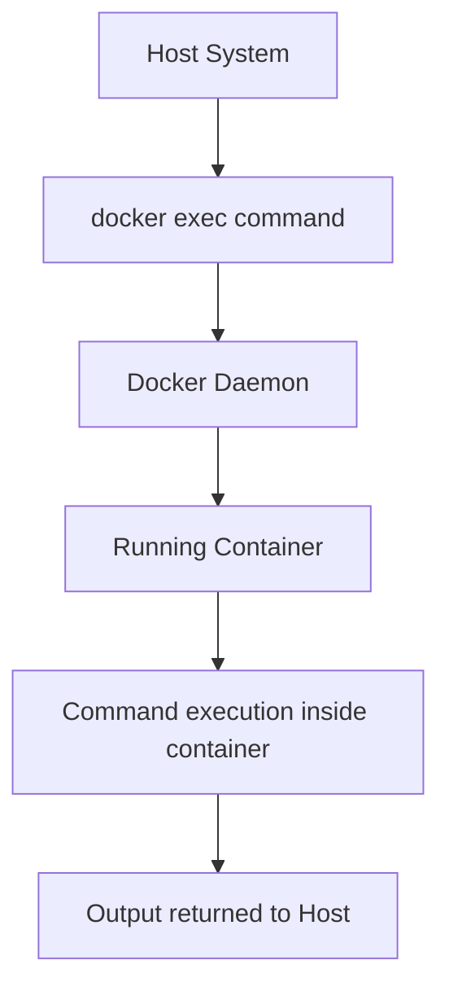

# Docker Exec

## Introduction

When working with Docker containers, you'll often need to interact with a running container - perhaps to inspect its environment, run a command, or troubleshoot an issue. This is where the `docker exec` command becomes indispensable. 

`docker exec` allows you to execute commands inside a running container, giving you a direct way to interact with your containerized applications without stopping or restarting them.

In this guide, we'll explore how to use `docker exec`, its common options, and practical scenarios where it proves invaluable in your Docker workflow.

## Understanding Docker Exec

### Basic Syntax

The basic syntax of the `docker exec` command is:

```bash
docker exec [OPTIONS] CONTAINER COMMAND [ARG...]
```

Where:
- `OPTIONS` are additional parameters that modify the command's behavior
- `CONTAINER` is the ID or name of the running container
- `COMMAND` is the command you want to run inside the container
- `[ARG...]` are any arguments for the command

### Simple Example

Let's start with a basic example. Assume we have a container named `web-app` running:

```bash
# Execute the 'ls' command in the web-app container
docker exec web-app ls
```

Output:
```
app
node_modules
package.json
src
```

This command runs `ls` inside the container, showing the files at the root directory of the container's filesystem.

## Common Options

The `docker exec` command comes with several useful options:

| Option | Description |
|--------|-------------|
| `-i, --interactive` | Keep STDIN open even if not attached |
| `-t, --tty` | Allocate a pseudo-TTY (terminal) |
| `-w, --workdir` | Working directory inside the container |
| `-e, --env` | Set environment variables |
| `-u, --user` | Username or UID to use |
| `--privileged` | Give extended privileges to the command |

### Interactive Shell Access

The most common usage of `docker exec` is to get an interactive shell inside a running container:

```bash
docker exec -it web-app /bin/bash
```

This command:
- Uses `-i` (interactive) to keep STDIN open
- Uses `-t` to allocate a pseudo-terminal
- Starts a bash shell inside the container

Once executed, you'll see a shell prompt inside the container:

```
root@7f2a12345678:/app#
```

You can now run commands directly inside the container as if you were logged into it.

## Practical Examples

### 1. Inspecting Configuration Files

When troubleshooting container issues, you may need to check configuration files:

```bash
# Check Nginx configuration
docker exec web-server cat /etc/nginx/nginx.conf
```

### 2. Monitoring Processes

See what processes are running inside a container:

```bash
docker exec database ps aux
```

Output:
```
USER       PID %CPU %MEM    VSZ   RSS TTY      STAT START   TIME COMMAND
postgres     1  0.0  0.3 213196 29736 ?        Ss   12:00   0:03 postgres
postgres    39  0.0  0.1 213348 11312 ?        Ss   12:00   0:00 postgres: checkpointer
postgres    40  0.0  0.1 213348  8760 ?        Ss   12:00   0:01 postgres: writer
```

### 3. Running Database Commands

Execute database queries directly:

```bash
# Run a MySQL query
docker exec -it mysql-db mysql -u root -p -e "SHOW DATABASES;"
```

Output:
```
Enter password: 
+--------------------+
| Database           |
+--------------------+
| information_schema |
| mysql              |
| performance_schema |
| sys                |
| webapp_db          |
+--------------------+
```

### 4. Installing Additional Software

Sometimes you need to install tools for debugging:

```bash
docker exec -it ubuntu-container apt-get update && apt-get install -y curl
```

### 5. Creating Files Inside Containers

You can create files inside a container:

```bash
docker exec web-app sh -c "echo 'Hello, Docker!' > /app/hello.txt"
```

Then verify it was created:

```bash
docker exec web-app cat /app/hello.txt
```

Output:
```
Hello, Docker!
```

## Understanding Container Context

When you use `docker exec`, it's important to understand that:

1. Commands run in the context of the container's environment
2. The command can only access resources available inside the container
3. Changes made using `docker exec` persist only for the lifetime of the container (unless made to mounted volumes)

Here's a diagram showing how `docker exec` interacts with a container:



## Troubleshooting with Docker Exec

Docker exec is particularly useful for troubleshooting:

### 1. Checking Container Logs

```bash
docker exec web-app tail -f /var/log/nginx/error.log
```

### 2. Network Diagnostics

```bash
# Install network tools (if not present)
docker exec -it app-container apt-get update && apt-get install -y iproute2 iputils-ping

# Check network interfaces
docker exec app-container ip addr

# Test connectivity
docker exec app-container ping -c 3 google.com
```

### 3. Resource Usage

```bash
# Check memory usage
docker exec container-name free -m

# Check disk space
docker exec container-name df -h
```

## Best Practices

1. **Use Interactive Mode Appropriately**: Only use the `-it` flags when you need an interactive session.

2. **Avoid Persistent Changes**: Remember that changes made inside a container are ephemeral unless you're working with mounted volumes.

3. **Security Considerations**: Be cautious with `--privileged` as it grants extended permissions.

4. **Execute as Specific User**: Use the `-u` option to execute commands as a specific user when needed.

5. **Exit Interactive Sessions Properly**: Use `exit` or `Ctrl+D` to exit an interactive session.

## Summary

The `docker exec` command is an essential tool in your Docker toolkit that enables you to:

- Execute commands inside running containers
- Access interactive shells for debugging
- Inspect configuration and log files
- Perform maintenance tasks without restarting containers
- Troubleshoot issues in real-time

By mastering `docker exec`, you gain deeper control over your containerized applications and can more efficiently manage your Docker environment.

## Exercises

1. Start a basic Nginx container and use `docker exec` to modify its default welcome page.
2. Practice connecting to a database container and executing queries using `docker exec`.
3. Use `docker exec` with the `-e` option to run a command with custom environment variables.
4. Try running the same command with and without the `-it` flags and observe the differences.

## Additional Resources

- [Docker Official Documentation](https://docs.docker.com/engine/reference/commandline/exec/)
- [Docker Run vs Exec: What's the Difference?](https://www.baeldung.com/ops/docker-run-vs-exec)
- [Docker Command Line Reference](https://docs.docker.com/engine/reference/commandline/)