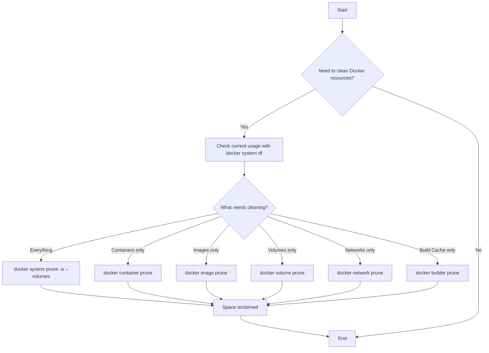

# Docker Prune

## Introduction

When working with Docker, you'll eventually accumulate unused containers, images, volumes, and networks. These unused resources consume disk space and can clutter your Docker environment. Docker provides a set of `prune` commands to help you clean up these resources efficiently.

In this guide, we'll explore how to use Docker's pruning commands to maintain a clean and efficient Docker environment. Whether you're a Docker beginner or looking to optimize your workflow, understanding these commands will help you manage your Docker resources more effectively.

## Understanding Docker Resources

Before diving into pruning, let's briefly understand the different Docker resources that can be pruned:

1. **Containers**: Running or stopped instances of Docker images
2. **Images**: Read-only templates used to create containers
3. **Volumes**: Persistent data storage used by containers
4. **Networks**: Communication channels between containers
5. **Build Cache**: Intermediate layers used during image building

Over time, these resources can accumulate, especially in development environments where you frequently create and destroy containers or build new images.

## Docker Prune Commands

Docker provides several commands to clean up unused resources:

### 1. Pruning Containers

To remove all stopped containers, use:

```bash
docker container prune
```

Example output:

```
WARNING! This will remove all stopped containers.
Are you sure you want to continue? [y/N] y
Deleted Containers:
container1
container2
container3

Total reclaimed space: 256MB
```

### 2. Pruning Images

To remove all dangling images (unused images without tags), use:

```bash
docker image prune
```

For a more aggressive cleanup that removes all unused images (not just dangling ones), add the `-a` or `--all` flag:

```bash
docker image prune -a
```

Example output:

```
WARNING! This will remove all dangling images.
Are you sure you want to continue? [y/N] y
Deleted Images:
image1
image2
image3

Total reclaimed space: 1.2GB
```

### 3. Pruning Volumes

To remove all unused volumes (not used by any containers), use:

```bash
docker volume prune
```

Example output:

```
WARNING! This will remove all volumes not used by at least one container.
Are you sure you want to continue? [y/N] y
Deleted Volumes:
volume1
volume2
volume3

Total reclaimed space: 2.1GB
```

### 4. Pruning Networks

To remove all unused networks, use:

```bash
docker network prune
```

Example output:

```
WARNING! This will remove all networks not used by at least one container.
Are you sure you want to continue? [y/N] y
Deleted Networks:
network1
network2
```

### 5. Pruning Build Cache

To remove unused build cache, use:

```bash
docker builder prune
```

Example output:

```
WARNING! This will remove all build cache.
Are you sure you want to continue? [y/N] y
Deleted build cache objects:
buildcache1
buildcache2

Total reclaimed space: 1.5GB
```

## System-wide Prune

If you want to clean up everything at once, Docker provides a convenient system-wide prune command:

```bash
docker system prune
```

This command removes:
- All stopped containers
- All networks not used by at least one container
- All dangling images
- All dangling build cache

For an even more thorough cleanup that includes unused volumes, add the `--volumes` flag:

```bash
docker system prune --volumes
```

To remove all unused images (not just dangling ones), use:

```bash
docker system prune -a
```

Example output:

```
WARNING! This will remove:
  - all stopped containers
  - all networks not used by at least one container
  - all dangling images
  - all dangling build cache

Are you sure you want to continue? [y/N] y
Deleted Containers:
container1
container2

Deleted Networks:
network1

Deleted Images:
image1
image2

Deleted build cache objects:
buildcache1
buildcache2

Total reclaimed space: 5.6GB
```

## Filtering Prune Operations

You can use filters to be more selective about what gets pruned. The most common filter is `until`, which allows you to prune resources created before a certain time.

For example, to prune containers created more than 24 hours ago:

```bash
docker container prune --filter "until=24h"
```

Similarly, for images:

```bash
docker image prune --filter "until=24h"
```

## Real-world Applications

### Automated Cleanup Script

Here's a simple shell script you might use in a production environment to perform regular cleanups:

```bash
#!/bin/bash
# Docker cleanup script

echo "Starting Docker cleanup..."

# Remove stopped containers older than 24 hours
echo "Removing old stopped containers..."
docker container prune -f --filter "until=24h"

# Remove dangling images
echo "Removing dangling images..."
docker image prune -f

# Remove unused networks
echo "Removing unused networks..."
docker network prune -f

echo "Docker cleanup completed!"
```

### CI/CD Pipeline Cleanup

In continuous integration environments, you might want to add cleanup steps to your pipeline:

```yaml
stages:
  - build
  - test
  - deploy
  - cleanup

cleanup_job:
  stage: cleanup
  script:
    - docker system prune -f
  when: always
```

### Development Environment Optimization

For a development machine that needs periodic but thorough cleaning:

```bash
# Deep clean (use with caution!)
docker system prune -a --volumes
```

## Best Practices

1. **Regular Maintenance**: Set up scheduled pruning to prevent resource buildup
2. **Use Filters**: Be precise about what you want to remove
3. **Be Cautious with Volumes**: Always double-check before pruning volumes, as they contain data
4. **Understand the Flags**: Know the difference between `-a` and standard prune commands
5. **Check Space Before and After**: Use `docker system df` to see the impact of your pruning

## Visualizing Docker Disk Usage

Before deciding what to prune, it's often helpful to understand what's using space. The `docker system df` command provides this information:

```bash
docker system df
```

Example output:

```
TYPE                TOTAL               ACTIVE              SIZE                RECLAIMABLE
Images              25                  10                  3.5GB               2.1GB (60%)
Containers          10                  5                   156MB               76MB (48%)
Local Volumes       15                  12                  2.2GB               500MB (22%)
Build Cache         125                 0                   1.4GB               1.4GB (100%)
```

For more detailed information:

```bash
docker system df -v
```

## Docker Prune Workflow Diagram



## Summary

Docker prune commands are essential tools for maintaining a clean and efficient Docker environment. By regularly removing unused resources, you can:

- Free up disk space
- Improve Docker's performance
- Keep your environment organized
- Reduce clutter and confusion

Remember to use these commands with care, especially when dealing with volumes that may contain important data. It's always a good practice to verify what will be removed before confirming a prune operation.

## Additional Resources

- Read the [official Docker documentation](https://docs.docker.com/engine/reference/commandline/system_prune/) for more details
- Learn about Docker [storage drivers](https://docs.docker.com/storage/storagedriver/) to understand how Docker manages disk space
- Explore Docker [volume management](https://docs.docker.com/storage/volumes/) for more advanced data persistence strategies

## Exercises

1. Check your current Docker disk usage using `docker system df`.
2. Create a few test containers, stop them, and then prune only the containers.
3. Build several versions of a simple Docker image, then use image prune to clean up.
4. Write a script that performs a scheduled cleanup of your Docker environment.
5. Try using different filters with prune commands to selectively remove resources.