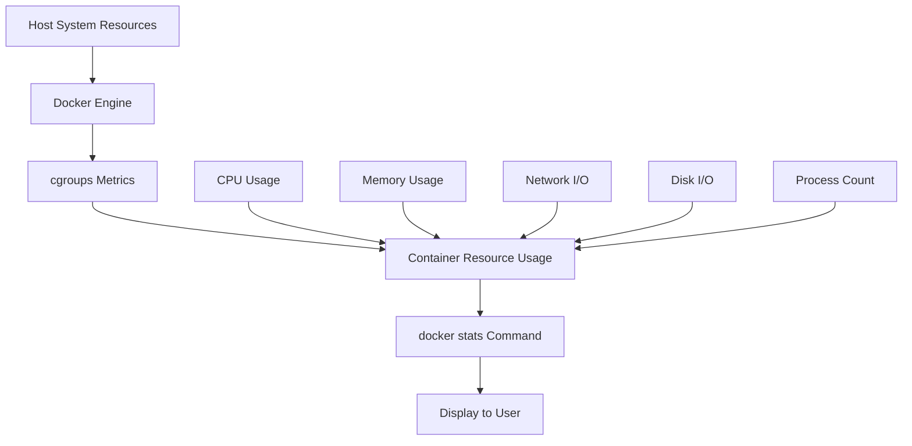

# Docker Stats

## Introduction

When working with Docker containers, understanding their resource usage and performance characteristics is essential for efficient application management. Docker provides a built-in command called `docker stats` that allows you to monitor the resource consumption of your containers in real-time. This tool is invaluable for identifying performance bottlenecks, optimizing resource allocation, and ensuring the stability of your containerized applications.

In this guide, we'll explore the `docker stats` command, understand its output, and learn how to use this information to manage your Docker environment effectively.

## What is Docker Stats?

Docker Stats is a command-line tool that provides a live stream of resource usage statistics for running containers. It shows CPU usage, memory usage, network I/O, disk I/O, and other critical metrics in an easy-to-read format. This real-time monitoring capability helps developers and system administrators keep track of container performance without installing additional monitoring tools.

## Basic Usage of Docker Stats

### Monitoring All Containers

To view the statistics for all running containers, simply run:

```bash
docker stats
```

This command will display a live updating table with resource usage information for each container.

**Example Output:**

```
CONTAINER ID   NAME                CPU %     MEM USAGE / LIMIT     MEM %     NET I/O           BLOCK I/O         PIDS
a1b2c3d4e5f6   web-server         0.10%     25.55MiB / 1.944GiB   1.28%     1.25kB / 1.25kB   0B / 0B           10
b2c3d4e5f6g7   database           1.50%     756.8MiB / 1.944GiB   37.98%    5.23MB / 1.21MB   22.5MB / 0B       24
c3d4e5f6g7h8   redis-cache        0.05%     7.164MiB / 1.944GiB   0.36%     3.45kB / 2.12kB   0B / 0B           4
```

The output provides the following information:

- **CONTAINER ID**: The unique identifier for each container
- **NAME**: The container name
- **CPU %**: Percentage of the host's CPU being used by the container
- **MEM USAGE / LIMIT**: Current memory usage and the maximum limit
- **MEM %**: Percentage of memory used relative to the limit
- **NET I/O**: Network data received and transmitted
- **BLOCK I/O**: Disk data read and written
- **PIDS**: Number of processes running inside the container

### Monitoring Specific Containers

To monitor specific containers, provide their names or IDs as arguments:

```bash
docker stats web-server database
```

This will display statistics only for the specified containers.

### No-Stream Mode

By default, `docker stats` continuously updates the display. If you want a single snapshot of the current state, use the `--no-stream` flag:

```bash
docker stats --no-stream
```

This is useful for scripts or when you want to capture a point-in-time view of container performance.

## Understanding Docker Stats Output

Let's break down each metric in detail to better understand what we're looking at:

### CPU Usage

The CPU percentage shows how much of the host's CPU processing capacity is being used by the container. This value can exceed 100% if the container uses multiple CPU cores.

For example, if you see:
```
CPU %
250%
```

This means the container is using 2.5 CPU cores' worth of processing power.

### Memory Usage

Memory metrics show the actual RAM being consumed by the container and its limit:

```
MEM USAGE / LIMIT     MEM %
756.8MiB / 1.944GiB   37.98%
```

This tells us the container is using 756.8 MiB of RAM out of an available 1.944 GiB, which is 37.98% of its allocation.

### Network I/O

The Network I/O displays the amount of data received and transmitted over the network:

```
NET I/O
5.23MB / 1.21MB
```

This means the container has received 5.23 MB and transmitted 1.21 MB since it started.

### Block I/O

Block I/O shows the amount of data read from and written to block devices:

```
BLOCK I/O
22.5MB / 0B
```

In this example, the container has read 22.5 MB and written 0 bytes to disk.

### PIDs

The number of processes or threads running inside the container:

```
PIDS
24
```

A high number of PIDs might indicate a potential issue, such as a memory leak or a poorly designed application.

## Customizing Docker Stats Output

### Format Options

You can customize the output format using the `--format` option and Go templates:

```bash
docker stats --format "{{.Name}}: {{.CPUPerc}} CPU, {{.MemUsage}} MEM"
```

This will produce a simplified output like:

```
web-server: 0.10% CPU, 25.55MiB / 1.944GiB MEM
database: 1.50% CPU, 756.8MiB / 1.944GiB MEM
redis-cache: 0.05% CPU, 7.164MiB / 1.944GiB MEM
```

### Available Format Placeholders

You can use the following placeholders in your format string:

- `{{.Container}}`: Container ID
- `{{.Name}}`: Container name
- `{{.ID}}`: Container ID (shorthand)
- `{{.CPUPerc}}`: CPU percentage
- `{{.MemUsage}}`: Memory usage
- `{{.MemPerc}}`: Memory percentage
- `{{.NetIO}}`: Network I/O
- `{{.BlockIO}}`: Block I/O
- `{{.PIDs}}`: Number of PIDs

## Real-World Applications

### Identifying Resource-Hungry Containers

One of the most common uses of `docker stats` is to identify which containers are consuming excessive resources:

```bash
docker stats --no-stream --format "table {{.Name}}\t{{.CPUPerc}}\t{{.MemUsage}}" | sort -k 2 -r | head -n 5
```

This command will show the top 5 containers by CPU usage in a tabular format.

### Monitoring During Load Testing

When performing load testing on your application, `docker stats` can help you observe how containers handle increased traffic:

```bash
# In one terminal, run your load testing tool
# In another terminal, monitor container performance
docker stats your-application-container
```

This allows you to see in real-time how your application's resource usage responds to increased load.

### Setting Up Resource Limits Based on Stats

After monitoring your containers with `docker stats`, you can set appropriate resource limits in your `docker-compose.yml` file:

```yaml
version: '3'
services:
  web-app:
    image: your-web-app
    deploy:
      resources:
        limits:
          cpus: '0.5'
          memory: 512M
        reservations:
          cpus: '0.25'
          memory: 256M
```

This ensures that your container won't exceed the specified resources, preventing it from affecting other containers or the host system.

## Using Docker Stats with Other Tools

### Combining with Watch Command

For periodic snapshots, you can combine `docker stats` with the `watch` command:

```bash
watch -n 5 'docker stats --no-stream'
```

This will update the statistics every 5 seconds.

### Sending Stats to Log Files

You can redirect the output to a log file for later analysis:

```bash
docker stats --no-stream > container_stats.log
```

For continuous logging with timestamps:

```bash
while true; do date >> stats_log.txt && docker stats --no-stream >> stats_log.txt && sleep 60; done
```

This will append stats to the log file every minute with timestamps.

## Understanding Resource Metrics Flow

The following diagram illustrates how Docker collects and presents container metrics:



## Common Issues and Troubleshooting

### High CPU Usage

If you notice a container consistently showing high CPU usage:

1. Check the application logs for errors or inefficient code
2. Consider scaling horizontally (adding more containers)
3. Look for infinite loops or resource-intensive operations
4. Set CPU limits to prevent a single container from consuming too much of the host's resources

```bash
docker run --cpus=0.5 your-image
```

### Memory Leaks

Signs of a memory leak include steadily increasing memory usage without corresponding increases in workload:

1. Monitor memory usage over time using a script that logs `docker stats` output
2. Check application logs for memory-related errors
3. Consider implementing a restart policy as a temporary solution
4. Increase container memory limit temporarily while investigating the root cause

```bash
docker run --memory=1g --restart=on-failure:5 your-image
```

### Network Bottlenecks

If you notice high network I/O that's affecting performance:

1. Check if the container is receiving unexpected traffic
2. Consider implementing rate limiting
3. Look for inefficient API calls or database queries
4. Use Docker networks to isolate container communication

## Advanced Usage: Programmatic Access to Stats

For programmatic access to Docker statistics, you can use the Docker API:

```bash
curl --unix-socket /var/run/docker.sock http://localhost/containers/your-container-id/stats
```

This will return JSON-formatted statistics that can be parsed by scripts or monitoring applications.

Example Python script to monitor container CPU usage:

```python
import json
import subprocess
import time

def get_container_stats(container_name):
    cmd = f"docker stats {container_name} --no-stream --format '{{{{json .}}}}'"
    result = subprocess.check_output(cmd, shell=True).decode('utf-8')
    return json.loads(result)

def monitor_container(container_name, interval=10, duration=60):
    iterations = duration // interval
    for i in range(iterations):
        stats = get_container_stats(container_name)
        print(f"Time: {i*interval}s, CPU: {stats['CPUPerc']}, Memory: {stats['MemUsage']}")
        time.sleep(interval)

# Usage
monitor_container('web-server', interval=5, duration=30)
```

## Alternatives to Docker Stats

While `docker stats` is excellent for quick monitoring, there are more comprehensive tools available:

1. **cAdvisor**: Google's container advisor provides more detailed metrics and a web interface
2. **Prometheus + Grafana**: For long-term monitoring and alerting
3. **Docker Desktop Dashboard**: Offers a graphical view of container stats (for Desktop users)
4. **Portainer**: Provides a comprehensive web UI for Docker management, including stats

## Summary

Docker Stats is a powerful built-in tool that provides real-time insights into container performance. By monitoring CPU, memory, network, and disk usage, you can:

- Identify performance bottlenecks
- Optimize resource allocation
- Ensure application stability
- Make informed decisions about scaling
- Troubleshoot issues quickly

As your Docker environment grows in complexity, you might need more sophisticated monitoring solutions, but for day-to-day container management and troubleshooting, `docker stats` remains an indispensable tool in every Docker user's arsenal.

## Practice Exercises

1. Run a web server container and use `docker stats` to monitor its resource usage while you send requests to it.
2. Create a script that logs container stats every minute for 24 hours and generates a report of peak usage times.
3. Set up a container with specific resource limits and observe how it behaves under load using `docker stats`.
4. Compare the resource usage of different databases (e.g., MySQL, PostgreSQL, MongoDB) running the same workload.
5. Create a custom format for `docker stats` that shows only the metrics you're interested in.

## Additional Resources

- [Docker Stats Command Reference](https://docs.docker.com/engine/reference/commandline/stats/)
- [Docker Resource Constraints Documentation](https://docs.docker.com/config/containers/resource_constraints/)
- [cgroups - The Technology Behind Docker Resource Management](https://docs.docker.com/engine/docker-overview/#control-groups)