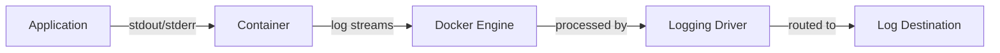
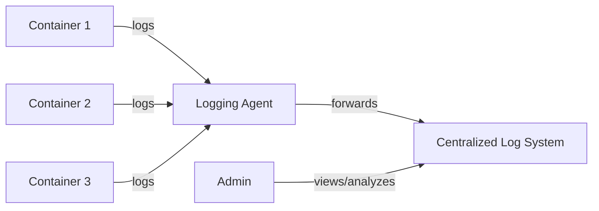

# Docker Logs

## Introduction

When working with Docker containers, one of the most important aspects of container management is understanding what's happening inside your containers. Docker logs are the key to gaining this visibility, providing a window into the application's runtime behavior, errors, and general operational status.

In this guide, we'll explore how Docker handles logs, how to access and analyze them, and best practices for log management in containerized environments. Whether you're troubleshooting issues or monitoring application health, mastering Docker logs is essential for effective container management.

## Understanding Docker Logs Basics

Docker captures standard output (`stdout`) and standard error (`stderr`) streams from processes running inside containers. This simple yet powerful approach means that anything your application writes to these streams becomes part of the container's logs.

### How Docker Logging Works

When a container runs, Docker captures these output streams and forwards them to a logging driver. The logging driver is responsible for processing and routing the logs to their final destination.



## Viewing Container Logs

The most basic way to view logs is using the `docker logs` command. This command retrieves logs for a specific container.

### Basic Log Command

```bash
# Basic syntax
docker logs [OPTIONS] CONTAINER

# Example
docker logs my-web-app
```

**Output Example:**
```
2023-06-10T12:01:23.456Z INFO Server started on port 3000
2023-06-10T12:01:24.123Z INFO Connected to database
2023-06-10T12:01:25.789Z INFO Ready to accept connections
```

### Useful Options

The `docker logs` command has several useful options:

| Option | Description |
|--------|-------------|
| `--follow` or `-f` | Follow log output (like `tail -f`) |
| `--tail=n` | Show only the last n lines |
| `--since` | Show logs since timestamp or relative time |
| `--until` | Show logs before timestamp or relative time |
| `--timestamps` or `-t` | Show timestamps |

### Common Use Cases

#### Following Logs in Real-time

To monitor logs as they're generated:

```bash
docker logs --follow my-container
```

This is particularly useful during development or when troubleshooting issues.

#### Viewing Recent Logs

To see just the most recent logs:

```bash
docker logs --tail=50 my-container
```

This shows the last 50 log entries.

#### Filtering Logs by Time

To see logs from a specific time period:

```bash
# Logs since a specific timestamp
docker logs --since="2023-06-10T10:00:00" my-container

# Logs from the last 30 minutes
docker logs --since=30m my-container
```

## Configuring Logging Drivers

Docker supports multiple logging drivers that determine how logs are processed and where they're stored.

### Available Logging Drivers

Docker provides several built-in logging drivers:

- `json-file`: Default driver that stores logs as JSON files
- `local`: Optimized local logging driver
- `syslog`: Writes logs to the syslog
- `journald`: Writes logs to journald
- `gelf`: Sends logs to a Graylog Extended Log Format (GELF) endpoint
- `fluentd`: Writes logs to fluentd
- `awslogs`: Sends logs to Amazon CloudWatch
- `splunk`: Writes logs to splunk
- `etwlogs`: Writes logs to Event Tracing for Windows
- `gcplogs`: Sends logs to Google Cloud Logging

### Setting the Default Logging Driver

You can configure the default logging driver for the Docker daemon in the `/etc/docker/daemon.json` file:

```json
{
  "log-driver": "json-file",
  "log-opts": {
    "max-size": "10m",
    "max-file": "3"
  }
}
```

### Configuring Logs for Individual Containers

You can also specify the logging driver and options when starting a container:

```bash
docker run --log-driver=syslog --log-opt syslog-address=udp://syslog-server:514 alpine echo hello world
```

## Log Rotation and Size Management

One important aspect of log management is preventing logs from consuming too much disk space.

### Configuring Log Rotation

For the default `json-file` driver, you can limit log file size and implement rotation:

```bash
docker run --log-opt max-size=10m --log-opt max-file=3 nginx
```

This configuration:
- Limits each log file to 10MB
- Keeps a maximum of 3 log files
- Rotates logs when they reach the size limit

## Advanced Log Management

For production environments, you'll often want more sophisticated log management solutions.

### Centralized Logging

In a multi-container or multi-host environment, centralized logging systems make log aggregation and analysis much easier:



Popular centralized logging stacks include:
- ELK Stack (Elasticsearch, Logstash, Kibana)
- Graylog
- Fluentd/Fluent Bit with various backends
- Cloud-based solutions (AWS CloudWatch, Google Cloud Logging)

### Example: Configuring Fluentd Logging

```bash
# Run a container with fluentd logging
docker run --log-driver=fluentd --log-opt fluentd-address=localhost:24224 \
  --log-opt tag="docker.{{.Name}}" nginx
```

## Best Practices for Docker Logs

### Structure Your Application Logs

Use structured logging in your applications to make logs more valuable:

```javascript
// Example using structured logging in Node.js
logger.info({
  event: 'user_login',
  userId: 'user123',
  ipAddress: '192.168.1.1',
  timestamp: new Date().toISOString()
});
```

This produces more easily parseable logs than simple text messages.

### Use Log Levels Appropriately

Make proper use of log levels (INFO, WARNING, ERROR, DEBUG) to facilitate filtering:

```python
# Python example
import logging

logging.basicConfig(level=logging.INFO)
logger = logging.getLogger(__name__)

logger.debug("Detailed debugging information")
logger.info("General information about program execution")
logger.warning("Warning about possible issues")
logger.error("Error information when something fails")
```

### Include Contextual Information

Add context to your logs to make troubleshooting easier:

```java
// Java example
logger.info("Processing order {} for customer {}", orderId, customerId);
```

### Keep Security in Mind

Be careful not to log sensitive information:

```javascript
// Bad: Logging sensitive data
logger.info(`User ${username} logged in with password ${password}`);

// Better: Omit sensitive information
logger.info(`User ${username} logged in successfully`);
```

## Troubleshooting with Docker Logs

Logs are invaluable for troubleshooting issues in containerized applications.

### Common Troubleshooting Scenarios

#### Container Startup Failures

If a container exits immediately after startup:

```bash
docker logs my-container
```

Look for errors in the initialization process, like missing dependencies or configuration issues.

#### Application Errors

For application-specific errors:

```bash
docker logs --tail=100 my-container | grep ERROR
```

This filters for error messages in the recent logs.

#### Performance Issues

For performance troubleshooting, look for logs indicating slow operations:

```bash
docker logs my-container | grep -i "slow" | grep -i "query"
```

## Practical Example: Setting Up Comprehensive Logging

Let's walk through a complete example of setting up logging for a web application:

### 1. Configure the application for proper logging

```javascript
// Example Node.js express app with structured logging
const express = require('express');
const winston = require('winston');

const logger = winston.createLogger({
  level: 'info',
  format: winston.format.json(),
  defaultMeta: { service: 'user-service' },
  transports: [
    new winston.transports.Console()
  ]
});

const app = express();

app.get('/', (req, res) => {
  logger.info({
    message: 'Received request',
    path: req.path,
    method: req.method,
    ip: req.ip
  });
  res.send('Hello World');
});

app.listen(3000, () => {
  logger.info('Server started on port 3000');
});
```

### 2. Create a Dockerfile with appropriate logging configuration

```dockerfile
FROM node:16-alpine

WORKDIR /app

COPY package*.json ./
RUN npm install

COPY . .

# Set environment variables for logging
ENV NODE_ENV=production
ENV LOG_LEVEL=info

CMD ["node", "app.js"]
```

### 3. Run the container with logging options

```bash
docker run -d --name myapp \
  --log-opt max-size=10m \
  --log-opt max-file=3 \
  -p 3000:3000 \
  myapp:latest
```

### 4. View and analyze logs

```bash
# View recent logs
docker logs --tail=20 myapp

# Follow logs in real-time
docker logs --follow myapp

# Filter logs for specific events
docker logs myapp | grep "Received request"
```

## Summary

Docker logs provide a critical window into the operation of your containerized applications. In this guide, we've covered:

- The basic architecture of Docker logging
- How to view container logs with various filtering options
- Configuring logging drivers for different destinations
- Managing log rotation and size limits
- Advanced logging configurations for production environments
- Best practices for effective logging
- Troubleshooting common issues using logs

By mastering Docker logs, you'll be better equipped to monitor, maintain, and troubleshoot your containerized applications, leading to more reliable and observable systems.

## Further Resources

- [Official Docker Logging Documentation](https://docs.docker.com/config/containers/logging/)
- [Fluentd Documentation](https://docs.fluentd.org/)
- [ELK Stack Documentation](https://www.elastic.co/guide/index.html)

## Exercises

1. Set up a simple web application in a Docker container and experiment with different `docker logs` commands to view its output.
2. Configure log rotation for a container and verify that logs are properly rotated when they reach the size limit.
3. Try using different logging drivers (such as syslog or journald) and observe how logs are stored differently.
4. Set up a multi-container application with a centralized logging system using Docker Compose.
5. Write a shell script that extracts specific information from container logs, like error counts or response time averages.