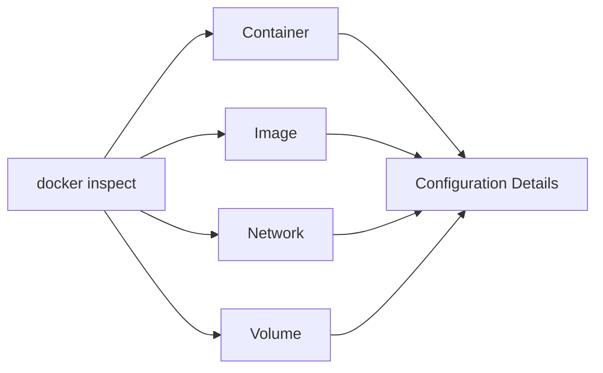

# Docker Inspect

## Introduction

When working with Docker containers, images, networks, and volumes, you often need to retrieve detailed information about these objects. The `docker inspect` command is a powerful tool that allows you to examine the low-level details and configurations of Docker objects.

In this tutorial, you'll learn how to use `docker inspect` to:
- Extract detailed information about containers, images, and other Docker objects
- Format and filter the output to find specific information
- Use this information for debugging and automation

## What is Docker Inspect?

Docker inspect is a command-line tool that returns detailed information about Docker objects in JSON format. This information includes:

- Container configuration
- Network settings
- Volume mounts
- Environment variables
- Container state
- Image metadata
- And much more

Think of `docker inspect` as a magnifying glass that allows you to see all the details that make up a Docker object.



## Basic Usage

The basic syntax of the `docker inspect` command is:

```bash
docker inspect [OPTIONS] NAME|ID [NAME|ID...]
```

Let's say we have a running container named `web-app`. To inspect this container, we would run:

```bash
docker inspect web-app
```

This command returns a large JSON object with all the container's information. Here's a truncated example of what the output might look like:

```json
[
    {
        "Id": "9c4d85708a7399701f32d51db7a8aa9fb939421b1e11935573517333fb5c089e",
        "Created": "2023-04-15T10:30:22.445925631Z",
        "Path": "docker-entrypoint.sh",
        "Args": [
            "nginx", 
            "-g", 
            "daemon off;"
        ],
        "State": {
            "Status": "running",
            "Running": true,
            "Paused": false,
            "Restarting": false,
            "OOMKilled": false,
            "Dead": false,
            "Pid": 1234,
            "ExitCode": 0,
            "Error": "",
            "StartedAt": "2023-04-15T10:30:23.127255019Z",
            "FinishedAt": "0001-01-01T00:00:00Z"
        },
        "Image": "sha256:904b8cb13b932e23230836850610fa45dce9eb0650d5618c2b1487c2a4f577b8",
        "NetworkSettings": {
            // Network details...
        },
        "Mounts": [
            // Mount details...
        ]
        // More information...
    }
]
```

## Formatting Output

The JSON output from `docker inspect` can be overwhelming, especially when you're looking for specific information. Docker provides the `--format` option to extract only the information you need using Go templates.

### Basic Formatting

To extract a specific field, use the `--format` or `-f` flag:

```bash
docker inspect --format='{{.State.Status}}' web-app
```

Output:
```
running
```

This command returns only the container's status.

### Accessing Nested Properties

You can access nested properties using dot notation:

```bash
docker inspect --format='{{.NetworkSettings.IPAddress}}' web-app
```

Output:
```
172.17.0.2
```

### Formatting Multiple Values

You can extract multiple values in a single command:

```bash
docker inspect --format='ID: {{.Id}}, Name: {{.Name}}, Status: {{.State.Status}}' web-app
```

Output:
```
ID: 9c4d85708a7399701f32d51db7a8aa9fb939421b1e11935573517333fb5c089e, Name: /web-app, Status: running
```

### Iterating Over Arrays

Some fields in the output are arrays. You can iterate over them using the `range` function:

```bash
docker inspect --format='{{range .NetworkSettings.Networks}}{{.IPAddress}}{{end}}' web-app
```

Output:
```
172.17.0.2
```

For multiple networks, this would print all IP addresses.

## Practical Examples

Let's look at some practical examples of how to use `docker inspect` in real-world scenarios.

### Example 1: Debugging Container Issues

When a container isn't working as expected, `docker inspect` can help you diagnose the problem:

```bash
# Check if the container is running
docker inspect --format='{{.State.Status}}' troublesome-container

# Check the container's logs location
docker inspect --format='{{.LogPath}}' troublesome-container

# Check if the container has any restart policies
docker inspect --format='{{.HostConfig.RestartPolicy}}' troublesome-container

# Check the last error message
docker inspect --format='{{.State.Error}}' troublesome-container
```

### Example 2: Finding Container IP Addresses

When you need to connect to a container from another container or from the host:

```bash
# Get the IP address of a container
docker inspect --format='{{range .NetworkSettings.Networks}}{{.IPAddress}}{{end}}' database-container
```

### Example 3: Checking Volume Mounts

To verify that your volumes are mounted correctly:

```bash
# List all mounted volumes in a container
docker inspect --format='{{range .Mounts}}{{.Source}} -> {{.Destination}}{{printf "
"}}{{end}}' web-app
```

Output:
```
/host/path/to/data -> /container/data
/host/path/to/logs -> /container/logs
```

### Example 4: Retrieving Environment Variables

To check what environment variables are set in a container:

```bash
docker inspect --format='{{range .Config.Env}}{{.}}{{printf "
"}}{{end}}' web-app
```

Output:
```
PATH=/usr/local/sbin:/usr/local/bin:/usr/sbin:/usr/bin:/sbin:/bin
NODE_ENV=production
PORT=3000
```

## Inspecting Multiple Objects

You can inspect multiple Docker objects in a single command by providing multiple names or IDs:

```bash
docker inspect web-app database-app cache-app
```

This returns an array of JSON objects, one for each container.

## Inspecting Different Types of Objects

So far, we've focused on inspecting containers, but `docker inspect` works with other Docker objects too:

### Inspecting Images

```bash
docker inspect nginx:latest
```

This returns detailed information about the nginx image, including:
- Image ID
- Creation date
- Image architecture
- Layers
- Exposed ports
- Default command

### Inspecting Networks

```bash
docker inspect bridge
```

This shows details about the default bridge network, including:
- Network ID
- Creation date
- Subnet and gateway
- Connected containers

### Inspecting Volumes

```bash
docker inspect my-volume
```

This returns information about the volume, including:
- Volume name
- Driver
- Mount point on the host
- Creation date

## Advanced Usage: Custom Format Scripts

For more complex scenarios, you can create shell scripts that use `docker inspect` with advanced formatting.

Here's an example script that lists all containers with their IP addresses:

```bash
#!/bin/bash
for container in $(docker ps -q); do
    name=$(docker inspect --format='{{.Name}}' $container | sed 's/\///')
    ip=$(docker inspect --format='{{range .NetworkSettings.Networks}}{{.IPAddress}}{{end}}' $container)
    echo "Container: $name, IP: $ip"
done
```

Output:
```
Container: web-app, IP: 172.17.0.2
Container: database-app, IP: 172.17.0.3
Container: cache-app, IP: 172.17.0.4
```

## Common Use Cases

Here are some common scenarios where `docker inspect` proves invaluable:

1. **Troubleshooting connectivity issues**: Find IP addresses and network configurations.
2. **Debugging application problems**: Check environment variables and volume mounts.
3. **Automation and scripting**: Extract specific data for use in CI/CD pipelines or monitoring scripts.
4. **Security audits**: Examine container configurations for security best practices.
5. **Documentation**: Generate detailed documentation about your Docker environment.

## Summary

The `docker inspect` command is a powerful tool for examining the configuration and state of Docker objects. It provides detailed information in JSON format, which can be filtered and formatted to extract specific data.

Key takeaways:
- Use `docker inspect` to get detailed information about containers, images, networks, and volumes
- The `--format` option helps extract specific information using Go templates
- Common use cases include debugging, networking, and automation
- The command works with all Docker object types

## Additional Resources

To deepen your understanding of Docker inspection, consider exploring these resources:

- The official [Docker documentation](https://docs.docker.com/engine/reference/commandline/inspect/)
- Learn more about [Go templates](https://golang.org/pkg/text/template/) for advanced formatting
- Explore [jq](https://stedolan.github.io/jq/), a command-line JSON processor that can be combined with `docker inspect` for even more powerful filtering

## Exercises

1. Run a simple container and use `docker inspect` to find its IP address.
2. Create a script that uses `docker inspect` to list all containers and their mounted volumes.
3. Use `docker inspect` with formatting to extract the entrypoint and command of an image.
4. Inspect a container and determine what ports are exposed and published.
5. Create a custom format that outputs container name, status, and restart count in a CSV format.