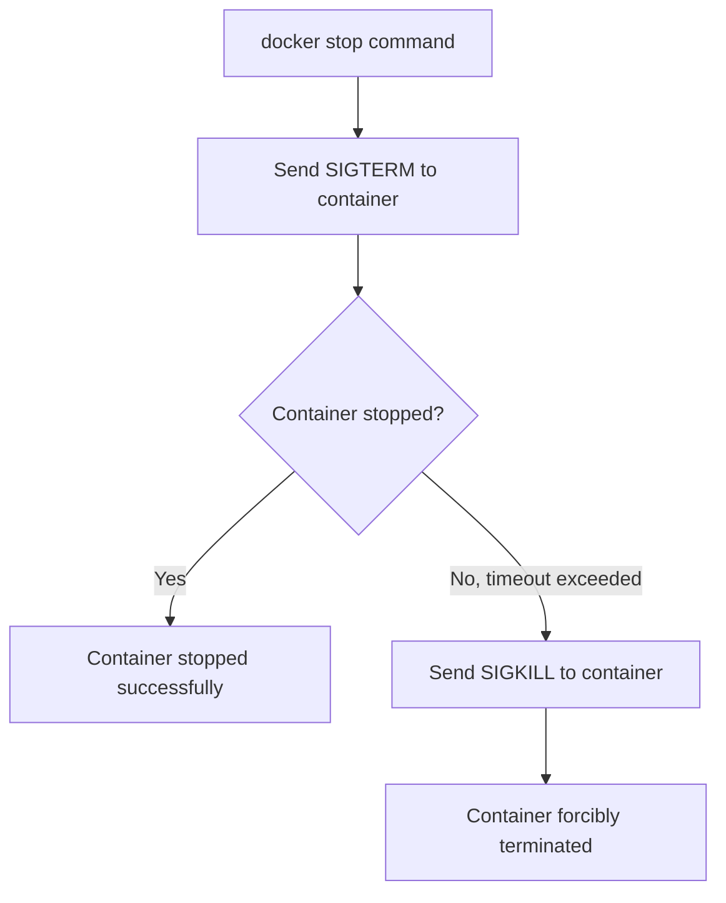

# Docker Stop

## Introduction

When working with Docker containers, properly stopping them is just as important as starting them. The `docker stop` command allows you to gracefully terminate running containers, ensuring data integrity and proper application shutdown.

In this guide, you'll learn how to use the `docker stop` command effectively, understand its behavior, and discover best practices for managing container lifecycles.

## Understanding Docker Stop

The `docker stop` command sends a SIGTERM signal to the main process (PID 1) running inside the container, allowing it to perform cleanup operations before shutting down. If the container doesn't stop within a specified timeout period, Docker sends a SIGKILL signal to forcibly terminate it.

This two-step process ensures applications can:
- Save data and state
- Close connections properly
- Release resources
- Exit cleanly

## Basic Docker Stop Command

### Syntax

```bash
docker stop [OPTIONS] CONTAINER [CONTAINER...]
```

### Options

| Option | Description |
|--------|-------------|
| `--time , -t` | Seconds to wait before killing the container (default: 10) |

### Simple Example

To stop a running container:

```bash
docker stop my_container
```

**Output:**
```
my_container
```

Docker outputs the container name/ID when successfully stopped.

## Stopping Multiple Containers

You can stop multiple containers in a single command:

```bash
docker stop container1 container2 container3
```

**Output:**
```
container1
container2
container3
```

## Using Container IDs

You can use either container names or their IDs:

```bash
docker stop 7f2d45cbe5eb
```

**Output:**
```
7f2d45cbe5eb
```

## Finding Container IDs

To get a list of running containers with their IDs:

```bash
docker ps
```

**Output:**
```
CONTAINER ID   IMAGE           COMMAND                  CREATED         STATUS         PORTS                    NAMES
7f2d45cbe5eb   nginx:latest    "/docker-entrypoint.…"   5 minutes ago   Up 5 minutes   0.0.0.0:8080->80/tcp     my_nginx
a62d3f43d9e2   redis:latest    "docker-entrypoint.s…"   10 minutes ago  Up 10 minutes  0.0.0.0:6379->6379/tcp   my_redis
```

## Customizing Timeout Period

By default, Docker waits 10 seconds before forcibly killing a container. You can customize this timeout:

```bash
docker stop --time=30 my_container
```

This gives the container 30 seconds to shut down gracefully before being forcibly terminated.

## Understanding the Container Shutdown Process

When you run `docker stop`:

1. Docker sends SIGTERM signal to the main process inside the container
2. The application can catch this signal and perform cleanup operations
3. If the container doesn't stop within the timeout period, Docker sends SIGKILL
4. SIGKILL cannot be caught or ignored, and forcibly terminates the container



## Common Use Cases

### Graceful Application Shutdown

When stopping a web server container that needs to finish processing requests:

```bash
docker stop --time=60 webserver_container
```

This gives the server a full minute to complete current requests and shut down properly.

### Batch Processing Containers

For containers processing large batches of data:

```bash
docker stop --time=120 data_processor
```

This ensures the container has enough time to complete current data processing operations.

### Database Containers

Databases particularly benefit from graceful shutdowns:

```bash
docker stop --time=90 postgres_container
```

This allows the database to finish writing data to disk and close connections properly.

## Practical Examples

### Example 1: Starting and Stopping a Web Server

First, let's start an Nginx container:

```bash
docker run --name my_nginx -d -p 8080:80 nginx
```

To verify it's running:

```bash
docker ps
```

**Output:**
```
CONTAINER ID   IMAGE          COMMAND                  CREATED          STATUS          PORTS                  NAMES
a7c6e4b3f9d1   nginx          "/docker-entrypoint.…"   10 seconds ago   Up 10 seconds   0.0.0.0:8080->80/tcp   my_nginx
```

Now stop the container:

```bash
docker stop my_nginx
```

**Output:**
```
my_nginx
```

Verify it's stopped:

```bash
docker ps -a
```

**Output:**
```
CONTAINER ID   IMAGE          COMMAND                  CREATED          STATUS                      PORTS     NAMES
a7c6e4b3f9d1   nginx          "/docker-entrypoint.…"   5 minutes ago    Exited (0) 10 seconds ago             my_nginx
```

### Example 2: Stopping All Running Containers

List all running containers:

```bash
docker ps -q
```

**Output:**
```
a7c6e4b3f9d1
b8d7f5c9e2a3
c9e8d7f6a5b4
```

Stop all of them:

```bash
docker stop $(docker ps -q)
```

**Output:**
```
a7c6e4b3f9d1
b8d7f5c9e2a3
c9e8d7f6a5b4
```

### Example 3: Stopping vs. Killing Containers

Graceful stop with cleanup (recommended):

```bash
docker stop my_container
```

Force immediate termination (only use when necessary):

```bash
docker kill my_container
```

## Best Practices

1. **Always prefer `docker stop` over `docker kill`** to allow applications to shut down gracefully.

2. **Understand your application's shutdown needs** and adjust timeout values accordingly:
   ```bash
   docker stop --time=<appropriate_seconds> container_name
   ```

3. **Monitor shutdown logs** to ensure your application is handling termination signals properly:
   ```bash
   docker logs container_name
   ```

4. **Set proper signal handlers in your applications** to catch SIGTERM and perform cleanup operations.

5. **Consider restart policies** when stopping containers that should automatically restart:
   ```bash
   docker run --restart=unless-stopped nginx
   ```

6. **Use health checks** to ensure your application is ready before starting and properly shut down when stopping:
   ```bash
   docker run --health-cmd="curl -f http://localhost/ || exit 1" nginx
   ```

## Common Issues and Troubleshooting

### Container Doesn't Stop Gracefully

If your container is frequently being killed rather than stopping gracefully:

1. Increase the timeout period:
   ```bash
   docker stop --time=120 container_name
   ```

2. Check if your application properly handles SIGTERM signals.

3. Ensure the main process (PID 1) in your container can receive and handle signals properly.

### Container Restart Policy Conflicts

If the container keeps restarting after you stop it, check its restart policy:

```bash
docker inspect --format='{{.HostConfig.RestartPolicy.Name}}' container_name
```

To update the restart policy when necessary:

```bash
docker update --restart=no container_name
```

## Docker Stop vs. Other Commands

| Command | Purpose | Behavior |
|---------|---------|----------|
| `docker stop` | Gracefully stop containers | Sends SIGTERM, then SIGKILL after timeout |
| `docker kill` | Force stop containers | Sends SIGKILL immediately |
| `docker pause` | Temporarily freeze containers | Preserves state but continues resource usage |
| `docker rm -f` | Remove containers | Forces removal of running containers |

## Summary

The `docker stop` command is a crucial tool for properly managing containers in development and production environments. It allows for graceful shutdowns, giving applications time to clean up resources and save state before termination.

Key points to remember:
- `docker stop` sends SIGTERM first, then SIGKILL after a timeout
- The default timeout is 10 seconds, but can be customized
- Always prefer `docker stop` over `docker kill` for proper application shutdown
- Understand your application's needs to set appropriate timeout values

By properly implementing graceful shutdown handling in your containers and using `docker stop` effectively, you can ensure data integrity and smooth operations in your containerized applications.

## Additional Resources

- Docker official documentation: `docker stop` command
- Learn about Linux signals (SIGTERM, SIGINT, SIGKILL)
- Explore container orchestration tools like Docker Compose and Kubernetes
- Implement proper signal handling in your containerized applications

## Exercises

1. **Basic Docker Stop:**
   Start an Nginx container and practice stopping it with different timeout values.

2. **Multiple Container Management:**
   Start several containers and practice stopping them individually and as a group.

3. **Shutdown Behavior:**
   Create a custom container with a script that demonstrates proper signal handling and cleanup operations when receiving SIGTERM.

4. **Timeout Testing:**
   Create a container with a long-running process and experiment with different stop timeout values to observe behavior.

5. **Integration Practice:**
   Set up a multi-container application using Docker Compose and practice proper shutdown procedures.