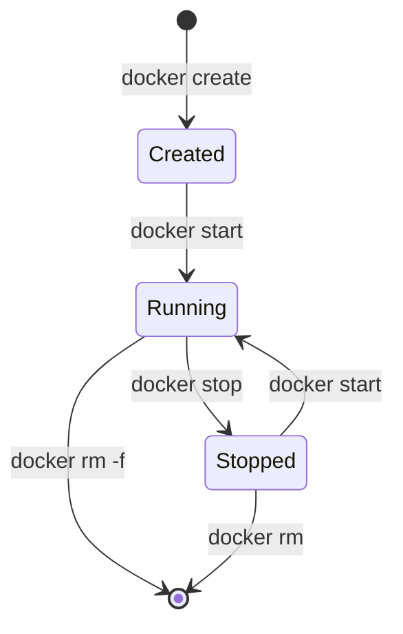

# Docker Start

## Introduction

Docker containers provide lightweight, isolated environments for running applications. One of the fundamental operations in Docker management is starting containers that have been created or previously stopped. The `docker start` command is essential for bringing containers to life and is a core part of the container lifecycle management process.

In this tutorial, you'll learn how to use the `docker start` command effectively, understand its options, and see practical examples of how to integrate it into your Docker workflows.

## Container Lifecycle Basics

Before diving into the `docker start` command, let's understand where it fits in the Docker container lifecycle:



As shown in the diagram, containers can exist in different states:
- **Created**: The container is set up but not running
- **Running**: The container is active and executing its processes
- **Stopped**: The container has been stopped but still exists

The `docker start` command transitions containers from the Created or Stopped state to the Running state.

## Basic Usage

The basic syntax of the `docker start` command is:

```bash
docker start [OPTIONS] CONTAINER [CONTAINER...]
```

You can specify one or more containers by their names or IDs.

### Example 1: Starting a Single Container

```bash
# Create a container without starting it
docker create --name my-nginx nginx

# Start the container
docker start my-nginx
```

**Output:**
```
my-nginx
```

The output is the name of the container that was started. A successful start command returns the container name or ID.

### Example 2: Checking Container Status

You can verify the container is running using the `docker ps` command:

```bash
docker ps
```

**Output:**
```
CONTAINER ID   IMAGE     COMMAND                  CREATED         STATUS         PORTS     NAMES
3a7f8e9d2b1c   nginx     "/docker-entrypoint.…"   2 minutes ago   Up 5 seconds   80/tcp    my-nginx
```

## Start Command Options

The `docker start` command comes with several useful options:

| Option              | Description                                              |
|---------------------|----------------------------------------------------------|
| `-a, --attach`      | Attach to STDOUT/STDERR and forward signals              |
| `-i, --interactive` | Attach container's STDIN                                 |
| `--detach-keys`     | Override the key sequence for detaching from a container |

### Example 3: Interactive Start

To start a container and connect to its input stream:

```bash
docker start -i my-ubuntu-container
```

This is particularly useful for containers that run interactive shells or command-line applications.

## Practical Use Cases

### Starting Multiple Containers

You can start multiple containers in a single command:

```bash
docker start container1 container2 container3
```

**Output:**
```
container1
container2
container3
```

### Restarting a Stopped Application

When your application container stops due to an error or after system maintenance:

```bash
# Check which containers are stopped
docker ps -a

# Start the application container
docker start my-app
```

### Attaching to Container Output

When you want to see the output of a container as it starts:

```bash
docker start -a my-logging-container
```

This will display the container's standard output and error streams in your terminal.

## Automating Container Starts

### Using Restart Policies

Instead of manually starting containers, you can use Docker's restart policies when creating containers:

```bash
docker create --restart unless-stopped --name always-up nginx
docker start always-up
```

With this configuration, Docker will automatically restart the container if it stops unexpectedly or if the Docker daemon restarts, unless the container was explicitly stopped by the user.

### Common Restart Policies:

- `no` - Never automatically restart (default)
- `on-failure[:max-retries]` - Restart only on non-zero exit status
- `always` - Always restart regardless of exit status
- `unless-stopped` - Like "always" but won't start on daemon startup if container was explicitly stopped

## Integration with Docker Compose

In real-world applications, you'll often use Docker Compose to manage multiple containers. Starting containers with Compose is as simple as:

```bash
docker-compose up -d
```

To restart services that are already defined in your `docker-compose.yml`:

```bash
docker-compose start [SERVICE...]
```

## Troubleshooting

### Container Won't Start

If a container refuses to start, you can investigate using:

```bash
# Check the exit status
docker ps -a

# Look at the container logs
docker logs my-container
```

Common issues include:
- Port conflicts
- Missing volume mounts
- Configuration errors
- Resource constraints

### Example: Fixing a Port Conflict

```bash
# Stop the container
docker stop my-nginx

# Remove it
docker rm my-nginx

# Recreate with a different port mapping
docker create --name my-nginx -p 8080:80 nginx

# Start the container
docker start my-nginx
```

## Advanced Start Techniques

### Starting with Resource Limits

While you can't change resource limits on `docker start`, you can specify them at container creation:

```bash
docker create --name limited-app --memory="512m" --cpus="0.5" my-app
docker start limited-app
```

### Start with Healthchecks

For critical applications, create containers with healthchecks:

```bash
docker create --name healthchecked-app --health-cmd="curl -f http://localhost/ || exit 1" --health-interval=5s nginx
docker start healthchecked-app
```

You can then monitor the health with:

```bash
docker inspect --format='{{.State.Health.Status}}' healthchecked-app
```

## Summary

The `docker start` command is an essential tool for Docker container management that:

- Transitions containers from a stopped or created state to a running state
- Can be used with options like `-a` for attaching output or `-i` for interactive mode
- Works with single or multiple containers
- Integrates with other Docker features like restart policies

Understanding how to effectively use `docker start` gives you greater control over your containerized applications and is fundamental to Docker management.

## Further Learning

To deepen your Docker management skills, consider exploring:

1. The `docker run` command, which combines `docker create` and `docker start`
2. Container orchestration tools like Docker Compose and Kubernetes
3. Docker's logging and monitoring capabilities
4. Service discovery and networking between containers

## Practice Exercises

1. Create a container without starting it, then start it and verify it's running.
2. Start a container in interactive mode and execute a command inside it.
3. Set up a container with a restart policy and test that it automatically restarts after stopping.
4. Create multiple containers and start them all with a single command.
5. Use a healthcheck to monitor a container's status after starting it.