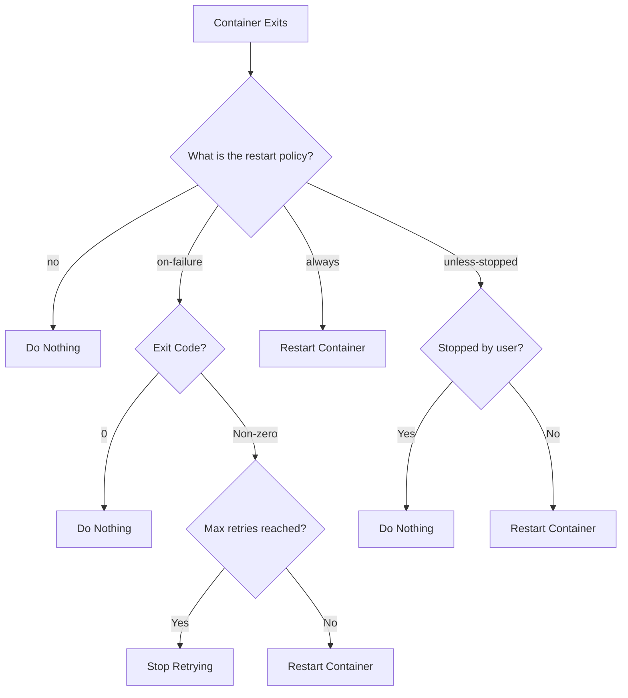

# Docker Restart

## Introduction

Managing container lifecycle is a fundamental aspect of working with Docker. One important management operation is the ability to restart containers. Whether you need to apply configuration changes, recover from errors, or implement high-availability strategies, understanding Docker's restart capabilities is essential.

In this guide, we'll explore how to restart Docker containers manually and how to configure automatic restart policies to ensure your containers maintain the desired state of operation.

## Restarting Containers Manually

### Basic Docker Restart Command

The most straightforward way to restart a running container is using the `docker restart` command:

```bash
docker restart [OPTIONS] CONTAINER [CONTAINER...]
```

This command stops and then starts the specified container(s). Let's look at a simple example:

```bash
# Restart a container by its name
docker restart my-web-app

# Restart a container by its ID
docker restart 7d9d6f8a4b21

# Restart multiple containers
docker restart container1 container2 container3
```

### Setting a Timeout

When restarting a container, Docker will attempt to gracefully stop the container before starting it again. By default, Docker waits 10 seconds before killing the container. You can modify this timeout period using the `-t` or `--time` option:

```bash
# Restart with a 30-second timeout
docker restart -t 30 my-web-app
```

### Checking Container Status

To verify if your container has restarted successfully, you can use:

```bash
docker ps -a
```

Example output:

```
CONTAINER ID   IMAGE          COMMAND        CREATED       STATUS          PORTS     NAMES
7d9d6f8a4b21   nginx:latest   "/docker-en…"  2 hours ago   Up 5 seconds    80/tcp    my-web-app
```

Look at the `STATUS` column to confirm the container is running and how long it's been up.

## Automatic Restart Policies

Docker provides several restart policies that automatically restart containers under specific conditions. These policies are particularly useful for production environments where you want to ensure high availability.

### Available Restart Policies

Docker offers four restart policies:

1. **no**: The default policy. Never automatically restart the container.
2. **on-failure[:max-retries]**: Restart only if the container exits with a non-zero status code. Optionally limit the number of restart attempts.
3. **always**: Always restart the container regardless of the exit status.
4. **unless-stopped**: Always restart the container unless it was explicitly stopped by the user.

### Setting Restart Policies

You can set restart policies when creating a container with `docker run`:

```bash
# Create a container with 'always' restart policy
docker run --restart always --name my-web-app -d nginx

# Create a container with 'on-failure' policy and max 5 retries
docker run --restart on-failure:5 --name my-app -d my-image
```

### Updating Restart Policy for Existing Containers

To update the restart policy for an existing container:

```bash
docker update --restart unless-stopped my-web-app
```

### Practical Example: High-Availability Web Server

Let's set up a high-availability Nginx web server that will automatically restart if it crashes:

```bash
# Create an Nginx container with always restart policy
docker run --name nginx-ha \
  --restart always \
  -p 8080:80 \
  -v $(pwd)/html:/usr/share/nginx/html \
  -d nginx
```

If the Nginx process crashes or the container stops for any reason, Docker will automatically restart it.

## Understanding Restart Policy Behavior

Let's explore how different restart policies behave in various scenarios:



### Restart Delay

When Docker automatically restarts a container, it applies a backoff strategy to avoid rapid restart loops:

- First restart happens immediately
- If the container fails again, Docker waits for increasing intervals between restarts
- The delay increases exponentially up to a maximum of 1 minute

This approach prevents system resource exhaustion when a container continually fails to start properly.

## Restart Policies in Docker Compose

For multi-container applications managed with Docker Compose, you can specify restart policies in your `docker-compose.yml` file:

```yaml
version: '3'
services:
  webapp:
    image: nginx
    restart: unless-stopped
    ports:
      - "8080:80"
  
  database:
    image: mysql
    restart: always
    environment:
      MYSQL_ROOT_PASSWORD: example
```

## Monitoring Restart Events

You can monitor container restart events using:

```bash
docker events --filter event=restart
```

This will show real-time events when containers are restarted.

## Best Practices for Docker Restart

1. **Choose the right policy**: Use `on-failure` for services that should only restart after unexpected failures. Use `always` or `unless-stopped` for critical services that must run continuously.

2. **Set appropriate retry limits**: For `on-failure`, set a maximum retry count to prevent infinite restart loops.

3. **Consider health checks**: Combine restart policies with Docker health checks for more robust container management:

```bash
docker run --name my-app \
  --restart unless-stopped \
  --health-cmd "curl -f http://localhost/ || exit 1" \
  --health-interval=5s \
  --health-retries=3 \
  -d my-image
```

4. **Implement proper logging**: Ensure your containers log errors properly to help diagnose issues that cause restarts.

5. **Use orchestration for complex deployments**: For complex applications, consider using orchestration tools like Docker Swarm or Kubernetes, which provide more sophisticated restart and high-availability features.

## Summary

Docker's restart capabilities provide a simple yet powerful way to manage container availability. Manual restart commands give you direct control over container lifecycle, while automatic restart policies ensure containers recover from failures with minimal intervention.

By choosing the appropriate restart policy for each container, you can build resilient applications that maintain high availability even when components fail.

## Further Learning

- Explore Docker health checks to enhance your container monitoring
- Learn about service replicas in Docker Swarm for distributed high availability
- Study how container orchestration platforms like Kubernetes manage pod lifecycle and restart behaviors

## Practice Exercises

1. Create a simple web application container with an `on-failure` restart policy and intentionally crash it to observe restart behavior.

2. Experiment with different timeout values for the `docker restart` command and observe how graceful shutdowns are affected.

3. Set up a multi-container application using Docker Compose with appropriate restart policies for each service.

4. Implement a monitoring solution that alerts you when containers are automatically restarted.