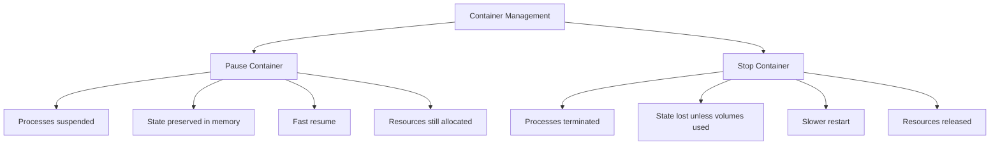

# Docker Pause

## Introduction

When managing Docker containers, there are times when you need to temporarily suspend a container's operations without stopping it completely. This is where Docker's `pause` and `unpause` commands come into play. These commands allow you to freeze all processes within a container while maintaining its state, which can be invaluable in certain development, testing, and production scenarios.

Unlike stopping a container, which terminates processes and releases resources, pausing preserves the container's exact state in memory, allowing for instant resumption when needed. Think of it as putting a container into "hibernation" rather than shutting it down.

## What Happens When You Pause a Container?

When you pause a Docker container:

1. All processes inside the container are suspended
2. The container maintains its state in memory
3. No new processes can start inside the container
4. Network connections remain established but inactive
5. The container continues to exist, but doesn't use CPU resources

Behind the scenes, Docker uses the Linux cgroups freezer to achieve this suspension, effectively putting all processes in the container into a "frozen" state.

## Basic Usage

### Pausing a Container

To pause a running container, use the `docker pause` command followed by the container ID or name:

```bash
docker pause my-container
```

If successful, Docker will simply display the container name or ID:

```
my-container
```

### Unpausing a Container

To resume a paused container, use the `docker unpause` command:

```bash
docker unpause my-container
```

Output:

```
my-container
```

### Checking Container Status

To verify if a container is paused, use the `docker ps` command:

```bash
docker ps
```

Output:

```
CONTAINER ID   IMAGE            COMMAND       STATUS                  PORTS     NAMES
e8a7c111f9a2   nginx:latest     "/bin/bash"   Up 10 minutes (Paused)  80/tcp    my-container
```

Notice the `(Paused)` status indication.

## Practical Use Cases

### 1. Resource Management

When running multiple containers on a resource-constrained system, you might want to temporarily pause non-critical containers to allocate more resources to priority tasks:

```bash
# Pause background service containers
docker pause background-service-1 background-service-2

# Run resource-intensive task
docker run --rm -it resource-intensive-task

# Resume background services when done
docker unpause background-service-1 background-service-2
```

### 2. Testing Application Behavior

Pausing can help test how your application handles temporary service outages:

```bash
# Pause a database container to simulate outage
docker pause postgres-db

# Observe how your application handles the unavailable database
# Then resume the database service
docker unpause postgres-db

# Check application logs to see recovery behavior
docker logs my-application
```

### 3. Debugging Race Conditions

For debugging timing-related issues in distributed systems:

```bash
# Run your interconnected services
docker compose up -d

# Pause one service at a critical point
docker pause service-a

# Examine the state in other services
docker logs service-b

# Resume when analysis is complete
docker unpause service-a
```

### 4. Snapshot Backup Preparation

Before creating container backups, pausing ensures data consistency:

```bash
# Pause container before backup
docker pause app-container

# Perform backup operation (example with volume)
docker run --rm -v app_data:/data -v $(pwd):/backup alpine tar czf /backup/data.tar.gz /data

# Resume container
docker unpause app-container
```

## Docker Pause vs. Stop: When to Use Each

Understanding the difference between pausing and stopping containers is crucial:



| Feature | Docker Pause | Docker Stop |
|---------|--------------|-------------|
| Process state | Suspended | Terminated |
| Memory state | Preserved | Lost |
| Resource usage | Memory still allocated | Resources released |
| Startup time | Instant resume | Full restart required |
| Network connections | Maintained but inactive | Terminated |
| Use case | Short-term suspension | Longer-term shutdown |

## Pause in Docker Compose

You can also use pause functionality within Docker Compose environments:

```yaml
# docker-compose.yml example
version: '3'
services:
  web:
    image: nginx:latest
    ports:
      - "80:80"
  database:
    image: postgres:latest
    environment:
      POSTGRES_PASSWORD: example
```

To pause specific services:

```bash
docker-compose pause database
```

To pause all services in a compose stack:

```bash
docker-compose pause
```

## Automate Pause/Unpause with Scripts

For scheduled resource management, you can automate pausing and unpausing with shell scripts:

```bash
#!/bin/bash
# Script to pause non-critical containers during business hours

# Pause dev containers during high-traffic periods
docker pause dev-container-1 dev-container-2

# Schedule resumption after peak hours
echo "docker unpause dev-container-1 dev-container-2" | at 18:00
```

## Common Issues and Solutions

### Paused Container Persisting After System Restart

Paused containers will return to a running state after system restart - this is normal behavior. If you want containers to remain stopped after a reboot, use `docker stop` instead.

### Unable to Pause a Container

If you receive an error when trying to pause a container, check:

```bash
docker pause non-existent-container
```

Error output:
```
Error response from daemon: No such container: non-existent-container
```

Solutions:
1. Verify the container exists and is running with `docker ps`
2. Ensure you have proper permissions to manage Docker

### Forgetting Which Containers are Paused

To list only paused containers:

```bash
docker ps --filter "status=paused"
```

## Summary

Docker Pause provides an elegant way to temporarily suspend container operations without terminating processes or losing the runtime state. This feature is particularly useful for:

- Conserving system resources during peak usage periods
- Testing application resilience against service interruptions
- Debugging timing-sensitive interactions between services
- Creating consistent backups without stopping containers completely

By understanding when and how to use the pause and unpause commands, you can gain more fine-grained control over your Docker environments and improve your development and operations workflows.

## Additional Exercises

1. **Basic Practice**: Create a simple web server container, pause it, verify the web server is inaccessible, unpause it, and verify it's working again.

2. **Resource Monitoring**: Run a CPU-intensive container, monitor resource usage, pause the container, and observe the change in system load.

3. **Multi-Container Coordination**: Set up a container network with three services, practice pausing and unpausing individual containers, and observe how it affects the entire system.

4. **Automation Challenge**: Write a shell script that pauses non-essential containers when system CPU usage exceeds 80% and unpauses them when it drops below 40%.