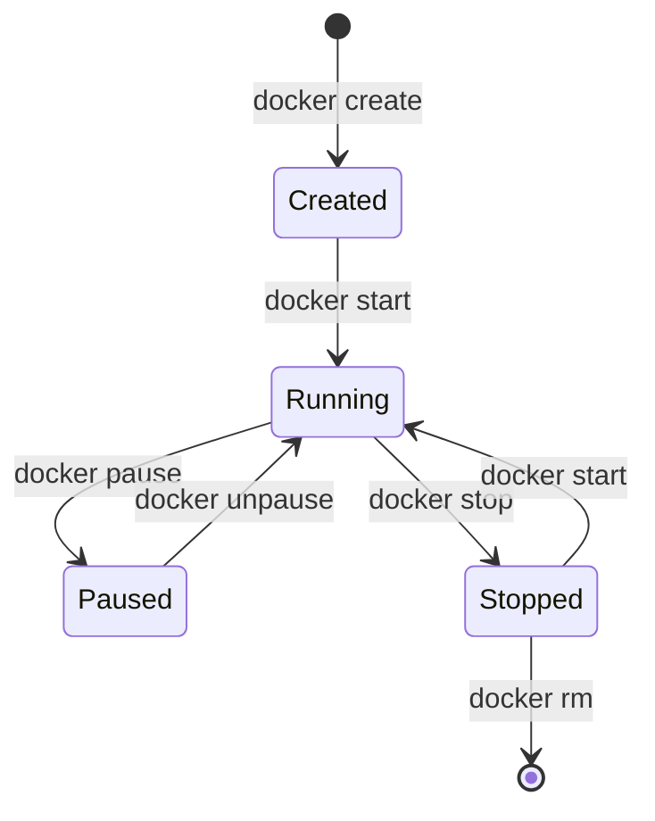

# Docker Unpause

## Introduction

When working with Docker containers, you might need to temporarily suspend a container's processes without stopping it completely. Docker provides the `pause` and `unpause` commands for this purpose. While the `pause` command freezes a container's processes, the `unpause` command resumes them, allowing the container to continue its operations from where it left off.

In this guide, we'll explore the Docker unpause functionality in depth, understanding when and how to use it effectively in your container management workflow.

## What is Docker Unpause?

Docker unpause is a command that resumes all processes within a previously paused container. When you unpause a container, Docker sends the SIGCONT signal to all processes in the container, allowing them to continue execution from their paused state.

The unpause operation is the counterpart to pausing a container and is useful when you want to resume normal operations after a temporary suspension.

## Basic Syntax

The basic syntax for the Docker unpause command is:

```bash
docker unpause CONTAINER [CONTAINER...]
```

Where `CONTAINER` is the name or ID of one or more containers you want to unpause.

## How Docker Unpause Works

Under the hood, Docker unpause works by leveraging the Linux cgroups (control groups) freezer subsystem. When you unpause a container:

1. Docker identifies the container's cgroup
2. Removes the "frozen" state from the container's freezer cgroup
3. Sends the SIGCONT signal to processes in the container
4. Processes resume execution from exactly where they were paused

This mechanism ensures that the container's state is preserved during the pause/unpause cycle.

## Step-by-Step Usage Guide

### 1. Check for Paused Containers

Before unpausing, you might want to check which containers are currently in a paused state:

```bash
docker ps --filter "status=paused"
```

**Output example:**
```
CONTAINER ID   IMAGE     COMMAND                  CREATED          STATUS                     PORTS                    NAMES
a1b2c3d4e5f6   nginx     "/docker-entrypoint.…"   10 minutes ago   Up 10 minutes (Paused)     0.0.0.0:8080->80/tcp     web-server
```

### 2. Unpause a Container

To unpause a specific container:

```bash
docker unpause web-server
```

**Output example:**
```
web-server
```

The command returns the name of the container that was unpaused.

### 3. Verify the Container Status

After unpausing, verify that the container is running normally:

```bash
docker ps --filter "name=web-server"
```

**Output example:**
```
CONTAINER ID   IMAGE     COMMAND                  CREATED          STATUS              PORTS                    NAMES
a1b2c3d4e5f6   nginx     "/docker-entrypoint.…"   12 minutes ago   Up 12 minutes       0.0.0.0:8080->80/tcp     web-server
```

Notice that the `(Paused)` status is no longer present.

## Practical Examples

### Example 1: Temporarily Pausing and Resuming a Web Server

This example demonstrates a common scenario where you might need to pause and unpause a web server to perform some maintenance tasks.

```bash
# Start an Nginx web server
docker run -d --name web-server -p 8080:80 nginx

# Pause the container to perform some maintenance
docker pause web-server

# After completing maintenance, unpause the container
docker unpause web-server

# Verify the container is running
curl http://localhost:8080
```

**Expected output from curl command:**
```html
<!DOCTYPE html>
<html>
<head>
<title>Welcome to nginx!</title>
...
```

### Example 2: Unpausing Multiple Containers Simultaneously

You can unpause multiple containers at once by specifying multiple container names or IDs:

```bash
# Pause multiple containers
docker pause web-server database-server cache-server

# Later, unpause all of them at once
docker unpause web-server database-server cache-server
```

**Output example:**
```
web-server
database-server
cache-server
```

### Example 3: Using Unpause in a CI/CD Pipeline

Pausing and unpausing can be useful in CI/CD pipelines when you need to temporarily halt certain services during deployment:

```bash
#!/bin/bash
# Example CI/CD script snippet

# Pause the application container during database migration
echo "Pausing application container..."
docker pause app-container

# Run database migrations
echo "Running database migrations..."
docker exec database-container ./run-migrations.sh

# Unpause the application container after migrations
echo "Unpausing application container..."
docker unpause app-container

echo "Deployment completed successfully!"
```

## When to Use Docker Unpause

Docker's unpause functionality is particularly useful in several scenarios:

1. **Resource Management**: Temporarily free up system resources without losing container state
2. **Debugging**: Freeze processes to examine their state, then resume them
3. **Maintenance**: Pause dependent services while performing updates
4. **Testing**: Test how your application responds to process suspension and resumption
5. **Synchronization**: Coordinate the timing between different containers or services

## Unpause vs. Start

It's important to understand the difference between unpausing and starting a container:

| Docker Unpause                                        | Docker Start                        |
|-------------------------------------------------------|-------------------------------------|
| Resumes processes in a paused container               | Starts a stopped container          |
| Container was previously running, then paused         | Container was previously stopped    |
| Maintains memory state, connections, and file handles | Fresh start with reinitialization   |
| Very quick operation                                  | Takes longer to initialize          |
| Uses the SIGCONT signal                               | Runs the container's entrypoint/CMD |

## Limitations and Considerations

When working with Docker unpause, keep these considerations in mind:

1. **Network Connections**: Long-lived TCP connections might time out during a pause, even after unpausing
2. **Time-Sensitive Operations**: Paused containers are unaware of elapsed time, which might affect scheduled tasks
3. **Resources**: While paused, a container still consumes memory (but minimal CPU)
4. **Container Orchestration**: Some orchestration platforms may have limitations with pause/unpause functionality
5. **Persistent Data**: Ensure any in-memory data is properly handled during pause/unpause cycles

## Visualizing the Container Lifecycle

The following diagram shows where pause and unpause fit in the Docker container lifecycle:



## Monitoring Paused and Unpaused Containers

To monitor container state transitions, you can use Docker events:

```bash
docker events --filter 'type=container' --filter 'event=unpause'
```

This command will display real-time events related to container unpausing.

## Summary

Docker's unpause command provides a powerful mechanism to resume containers that have been temporarily suspended using the pause command. This functionality allows for effective resource management, synchronization between services, and simplified debugging processes.

Key takeaways:
- Docker unpause resumes all processes in a paused container
- The container continues execution from exactly where it was paused
- Unpausing is different from starting a stopped container
- The command is useful for resource management, maintenance, and testing scenarios
- Be aware of the limitations related to network connections and time-sensitive operations

## Exercises for Practice

1. Create a simple web application container, pause it, and verify that it's not accessible. Then unpause it and confirm it's working again.

2. Write a bash script that pauses a container, performs some operations, and then unpauses it automatically.

3. Set up multiple containers with dependencies, practice pausing and unpausing them in the correct order to maintain application integrity.

4. Monitor Docker events during pause and unpause operations to understand the event lifecycle.

5. Compare the resource usage of a container in running, paused, and stopped states using `docker stats`.

## Additional Resources

- [Docker Documentation on Container Lifecycle](https://docs.docker.com/engine/reference/commandline/unpause/)
- [Linux cgroups and the freezer subsystem](https://www.kernel.org/doc/Documentation/cgroup-v1/freezer-subsystem.txt)
- [SIGCONT signal in Linux](https://www.gnu.org/software/libc/manual/html_node/Job-Control-Signals.html)