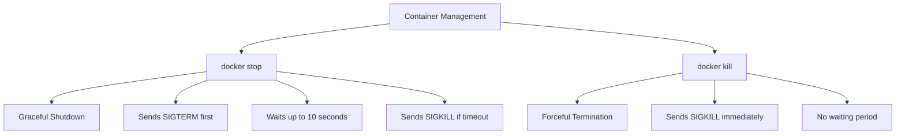

# Docker Kill

## Introduction

When working with Docker containers, there are various ways to stop a running container. While the `docker stop` command provides a graceful way to terminate containers, sometimes you need to forcefully and immediately stop a container. That's where the `docker kill` command comes into play.

The `docker kill` command sends a signal (by default, SIGKILL) to the main process running inside the container, causing it to terminate immediately. Unlike `docker stop` which gives containers time to shut down gracefully, `docker kill` doesn't wait - it stops the container immediately.

## Basic Syntax

The basic syntax of the `docker kill` command is:

```bash
docker kill [OPTIONS] CONTAINER [CONTAINER...]
```

Where:
- `[OPTIONS]` are additional parameters you can provide
- `CONTAINER` is the ID or name of the container(s) you want to kill

## Key Parameters

The `docker kill` command supports these important options:

| Option | Description |
|--------|-------------|
| `--signal`, `-s` | Signal to send to the container (default: KILL) |

## Docker Kill vs Docker Stop

Before diving into examples, let's understand the key differences between `docker kill` and `docker stop`:



- **docker stop**: Sends a SIGTERM signal to the main process, waits up to 10 seconds for the container to stop, and then sends a SIGKILL signal if it's still running.
- **docker kill**: Sends a SIGKILL signal immediately, giving the container no chance to perform cleanup operations.

## Basic Examples

### Killing a Single Container

To kill a single container, you simply provide its ID or name:

```bash
docker kill my_container
```

**Output:**
```
my_container
```

The command returns the name or ID of the container it killed.

### Killing Multiple Containers

You can kill multiple containers at once by listing their IDs or names:

```bash
docker kill container1 container2 container3
```

**Output:**
```
container1
container2
container3
```

### Checking if Container Was Killed

You can verify that a container was killed by using the `docker ps` command:

```bash
docker ps -a
```

**Output:**
```
CONTAINER ID   IMAGE     COMMAND   CREATED        STATUS                     PORTS     NAMES
f9d123456789   nginx     "nginx"   2 minutes ago  Exited (137) 5 seconds ago          my_container
```

Notice the status shows "Exited (137)" - the exit code 137 indicates the process was killed with a SIGKILL signal (128 + 9).

## Advanced Usage

### Sending a Different Signal

By default, `docker kill` sends a SIGKILL (9) signal. However, you can specify a different signal using the `--signal` or `-s` option:

```bash
docker kill --signal=SIGHUP my_container
```

**Output:**
```
my_container
```

This sends the SIGHUP signal instead of SIGKILL. This can be useful when you want the container to handle a specific signal in a custom way.

Common signals you might use include:

- `SIGHUP` (1): Hangup detected
- `SIGINT` (2): Interrupt from keyboard (like pressing Ctrl+C)
- `SIGTERM` (15): Termination signal
- `SIGKILL` (9): Kill signal (cannot be caught or ignored)
- `SIGUSR1` (10): User-defined signal 1
- `SIGUSR2` (12): User-defined signal 2

### Killing All Running Containers

To kill all running containers at once, you can combine `docker kill` with `docker ps`:

```bash
docker kill $(docker ps -q)
```

This command gets the IDs of all running containers with `docker ps -q` and passes them to the `docker kill` command.

## Practical Use Cases

### Scenario 1: Unresponsive Container

When a container becomes unresponsive or frozen, a graceful shutdown with `docker stop` might not work or might take too long. In such cases, `docker kill` offers a quick solution:

```bash
# Container is unresponsive to normal stop command
docker stop web_server
# After waiting for some time with no response
docker kill web_server
```

### Scenario 2: Quick Development Iterations

During development, when you're rapidly iterating on your container configuration and don't care about graceful shutdowns:

```bash
# Start a container
docker run -d --name dev_container my_dev_image
# Make changes to code or configuration
# Kill the container quickly to restart with new settings
docker kill dev_container
docker rm dev_container
docker run -d --name dev_container my_dev_image
```

### Scenario 3: Custom Signal Handling

When your containerized application has custom signal handlers, you can trigger specific behavior:

```bash
# Send SIGUSR1 to trigger custom behavior (like reloading configuration)
docker kill --signal=SIGUSR1 my_custom_app
```

## Best Practices

1. **Use Sparingly**: `docker kill` should not be your first choice for stopping containers. Use `docker stop` for normal operations to allow graceful shutdown.

2. **Data Integrity**: Be aware that killing a container immediately might lead to data corruption if the container was in the middle of writing data.

3. **Cleanup After Killing**: Containers that were killed still exist in a stopped state and may need to be removed with `docker rm`.

4. **Implement Signal Handlers**: If your application needs to handle termination, implement proper signal handlers in your application code.

5. **Monitoring**: After using `docker kill`, especially in production, monitor your system for any unexpected side effects.

## Troubleshooting

### Container Won't Kill

If a container refuses to be killed, it might be in an uninterruptible state. Try these steps:

1. Check the container's status:
   ```bash
   docker inspect container_name | grep Status
   ```

2. Try forcing removal:
   ```bash
   docker rm -f container_name
   ```

3. As a last resort, restart the Docker daemon:
   ```bash
   sudo systemctl restart docker
   ```

### Unexpected Behavior After Kill

If your system behaves unexpectedly after killing containers:

1. Check for zombie processes:
   ```bash
   ps aux | grep defunct
   ```

2. Verify system resources have been properly released:
   ```bash
   docker system df
   ```

## Summary

The `docker kill` command is a powerful tool in Docker management that allows you to forcefully terminate running containers. While it should be used judiciously, it's invaluable when you need immediate termination without waiting for graceful shutdown procedures.

Key takeaways:
- `docker kill` sends SIGKILL (by default) to immediately terminate containers
- Unlike `docker stop`, it doesn't wait for cleanup operations
- You can specify alternative signals using the `--signal` option
- Use it sparingly and prefer `docker stop` for normal operations
- Always be aware of potential data integrity issues when killing containers abruptly

## Exercises

1. **Basic Kill Exercise**: Start an Nginx container, then kill it and observe the exit code.
2. **Custom Signal Exercise**: Write a simple application that handles SIGUSR1 and SIGUSR2 differently, containerize it, and practice sending those signals.
3. **Comparison Exercise**: Compare the time difference between `docker stop` and `docker kill` on a busy database container.
4. **Cleanup Challenge**: Create multiple containers, kill them all with a single command, then clean up all stopped containers.

## Additional Resources

- [Docker Official Documentation: docker kill](https://docs.docker.com/engine/reference/commandline/kill/)
- [Linux Signal Handling](https://www.gnu.org/software/libc/manual/html_node/Signal-Handling.html)
- [Docker Container Lifecycle Best Practices](https://docs.docker.com/config/containers/start-containers-automatically/)