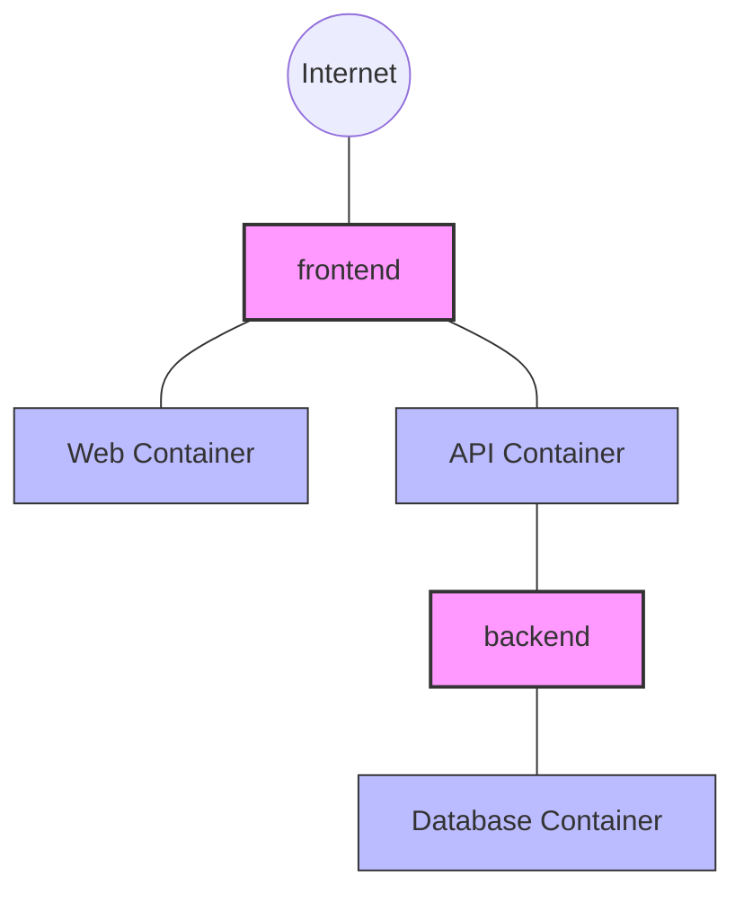
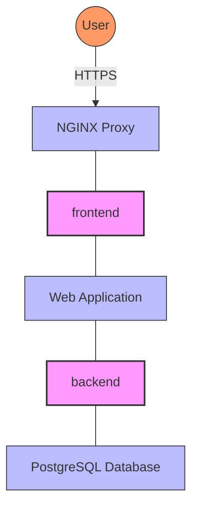

# Docker Network Security

## Introduction

When working with Docker containers, network security is a critical aspect that often gets overlooked. While containers provide isolation at the process level, their network communication paths can introduce security vulnerabilities if not properly configured and monitored.

This guide will walk you through the fundamental concepts of Docker network security, common vulnerabilities, and best practices to protect your containerized applications from network-based threats.

## Why Docker Network Security Matters

Containers communicate over networks, and without proper security measures, these networks can become attack vectors. Consider this scenario:

1. You deploy multiple containers in a production environment
2. The containers need to communicate with each other and external services
3. Without proper network security, an attacker who compromises one container might gain access to others

Let's explore how Docker networking works and then dive into securing these networks.

## Docker Network Basics

Before we delve into security, let's understand the basics of Docker networking.

Docker provides several network drivers:

- **bridge**: The default network driver that allows containers on the same host to communicate
- **host**: Removes network isolation between the container and the Docker host
- **none**: Disables all networking for a container
- **overlay**: Enables communication between containers across multiple Docker hosts
- **macvlan**: Assigns a MAC address to a container, making it appear as a physical device on the network
- **ipvlan**: Similar to macvlan but uses IP addresses without MAC address assignment

You can list available networks with:

```bash
docker network ls

# Output:
# NETWORK ID     NAME      DRIVER    SCOPE
# 7b369448a1d1   bridge    bridge    local
# 5fb9450dfbe5   host      host      local
# 3b28f2c4e99c   none      null      local
```

## Common Network Security Vulnerabilities

Docker networking introduces several potential security issues:

1. **Exposed container ports**: Unnecessarily exposed ports increase the attack surface
2. **Insecure default bridge network**: All containers on the default bridge can communicate with each other
3. **Lack of network segmentation**: Without proper network isolation, compromised containers can affect others
4. **Unencrypted communication**: Data transmitted between containers might be intercepted
5. **Inadequate access controls**: Missing authentication for container-to-container communication

Let's address each of these issues with practical solutions.

## Creating Secure Docker Networks

### Using Custom Bridge Networks

Instead of using the default bridge network, create custom bridge networks to isolate groups of containers:

```bash
# Create a custom bridge network
docker network create --driver bridge secure_network

# Run a container in the custom network
docker run --network=secure_network --name secure_container -d nginx

# Output (for network create):
# 8a11e1b78e7a6f6248f5561546df156ef3446113878eafe3625f79e371695f10
```

Custom networks provide DNS resolution by container name and isolation from containers in other networks.

### Network Segmentation with Docker Compose

For multi-container applications, Docker Compose helps define isolated networks:

```yaml
version: '3'

networks:
  frontend:
    driver: bridge
  backend:
    driver: bridge
    internal: true  # No external connectivity

services:
  web:
    image: nginx
    networks:
      - frontend
  
  api:
    image: my-api
    networks:
      - frontend
      - backend
  
  database:
    image: postgres
    networks:
      - backend
```

This configuration creates two separate networks:
- `frontend` for components that need external access
- `backend` (marked as `internal`) for private services like databases

The diagram below visualizes this segmentation:



## Network Access Control

### Restricting Port Exposure

Only expose necessary ports, and bind them to localhost when possible:

```bash
# Expose port only to localhost
docker run -p 127.0.0.1:8080:80 -d nginx

# Output:
# 7c39be7c10d5e6c53388a66a8b3c88528b36378a5fab58d81b531af0c3df9a4d
```

### Using Network Policies

For Kubernetes environments, implement network policies to control traffic:

```yaml
kind: NetworkPolicy
apiVersion: networking.k8s.io/v1
metadata:
  name: api-allow
spec:
  podSelector:
    matchLabels:
      app: api
  ingress:
  - from:
    - podSelector:
        matchLabels:
          app: web
    ports:
    - protocol: TCP
      port: 8080
```

## Encrypting Network Traffic

### Using TLS for Container Communication

For sensitive communications, implement TLS between containers:

```bash
# Generate certificates (simplified example)
openssl req -newkey rsa:2048 -nodes -keyout key.pem -x509 -days 365 -out cert.pem

# Run a container with TLS enabled
docker run -v $(pwd)/cert.pem:/cert.pem -v $(pwd)/key.pem:/key.pem \
  -e ENABLE_TLS=true -e TLS_CERT=/cert.pem -e TLS_KEY=/key.pem \
  -d my-secure-app
```

### Setting Up Overlay Networks with Encryption

For Docker Swarm deployments, enable encryption on overlay networks:

```bash
# Create an encrypted overlay network
docker network create --driver overlay --opt encrypted=true secure_overlay

# Output:
# q6ann6wzyaw6g9h9ywsfj1k31
```

## Advanced Docker Network Security

### Docker Content Trust

Enable Docker Content Trust to ensure you only run signed images:

```bash
# Enable Docker Content Trust
export DOCKER_CONTENT_TRUST=1

# Pull a signed image
docker pull nginx:latest

# Output:
# Pull (1 of 1): nginx:latest@sha256:abcdef...
# Tagging nginx:latest@sha256:abcdef... as nginx:latest
```

### Using Security Profiles

Implement security profiles like AppArmor or SELinux:

```bash
# Run a container with AppArmor profile
docker run --security-opt apparmor=docker-default -d nginx

# Output:
# 3b28f2c4e99c7b369448a1d15fb9450dfbe5
```

## Network Security Monitoring

### Inspecting Network Traffic

Monitor container network traffic with tools like `tcpdump`:

```bash
# Install tcpdump in a container
docker exec -it container_name apt-get update && apt-get install -y tcpdump

# Capture traffic
docker exec -it container_name tcpdump -i eth0 -n

# Partial output:
# 13:24:30.591235 IP 172.17.0.2.48376 > 8.8.8.8.53: UDP, length 44
# 13:24:30.591417 IP 8.8.8.8.53 > 172.17.0.2.48376: UDP, length 60
```

### Implementing Network IDS/IPS

For production environments, consider implementing a Network Intrusion Detection/Prevention System:

```yaml
version: '3'

services:
  ids:
    image: securityonion/so-suricata
    network_mode: "host"
    cap_add:
      - NET_ADMIN
      - NET_RAW
    volumes:
      - ./rules:/etc/suricata/rules
      - ./logs:/var/log/suricata
```

## Practical Example: Securing a Web Application

Let's put everything together with a real-world example of a secure web application setup:

```yaml
version: '3'

networks:
  frontend:
    driver: bridge
  backend:
    driver: bridge
    internal: true

services:
  nginx:
    image: nginx:latest
    ports:
      - "127.0.0.1:8080:80"
    networks:
      - frontend
    volumes:
      - ./nginx/ssl:/etc/nginx/ssl:ro
      - ./nginx/conf.d:/etc/nginx/conf.d:ro
  
  webapp:
    image: my-webapp:latest
    networks:
      - frontend
      - backend
    depends_on:
      - nginx
    environment:
      - DB_HOST=database
      - DB_USER=webuser
    restart: unless-stopped
  
  database:
    image: postgres:13
    networks:
      - backend
    volumes:
      - db-data:/var/lib/postgresql/data
    environment:
      - POSTGRES_PASSWORD_FILE=/run/secrets/db_password
    secrets:
      - db_password
    restart: unless-stopped

volumes:
  db-data:

secrets:
  db_password:
    file: ./db_password.txt
```

The architecture looks like this:



## Best Practices Checklist

To ensure your Docker networks remain secure, follow these best practices:

1. ✅ **Create custom networks** instead of using the default bridge
2. ✅ **Segment container networks** based on security requirements
3. ✅ **Expose only necessary ports**, preferably only to localhost
4. ✅ **Enable encrypted communication** between containers
5. ✅ **Use Docker secrets** for sensitive data
6. ✅ **Regularly update Docker** and all container images
7. ✅ **Monitor network traffic** for suspicious activities
8. ✅ **Implement network policies** to restrict container communications
9. ✅ **Use read-only file systems** when possible
10. ✅ **Implement proper logging** for network activities

## Summary

Docker network security is a multi-layered approach that involves:

- Understanding Docker's networking drivers and their security implications
- Creating isolated networks for different application components
- Restricting container access to only necessary resources
- Implementing encryption for sensitive communications
- Monitoring network traffic for suspicious activities

By following the practices outlined in this guide, you can significantly reduce the attack surface of your containerized applications and protect your data from network-based threats.

## Exercises

1. Create a custom bridge network and deploy two containers that can communicate with each other but are isolated from the default bridge network.
2. Set up a Docker Compose file with three services in two separate networks, ensuring the database is not accessible from outside.
3. Configure a reverse proxy container (like NGINX) to terminate TLS and forward requests to an internal application container.
4. Implement network monitoring for a multi-container application and detect when a container attempts to access an unauthorized service.

## Additional Resources

- [Docker Networking Documentation](https://docs.docker.com/network/)
- [Docker Security Documentation](https://docs.docker.com/engine/security/)
- [OWASP Docker Security Cheat Sheet](https://cheatsheetseries.owasp.org/cheatsheets/Docker_Security_Cheat_Sheet.html)
- [CIS Docker Benchmarks](https://www.cisecurity.org/benchmark/docker)