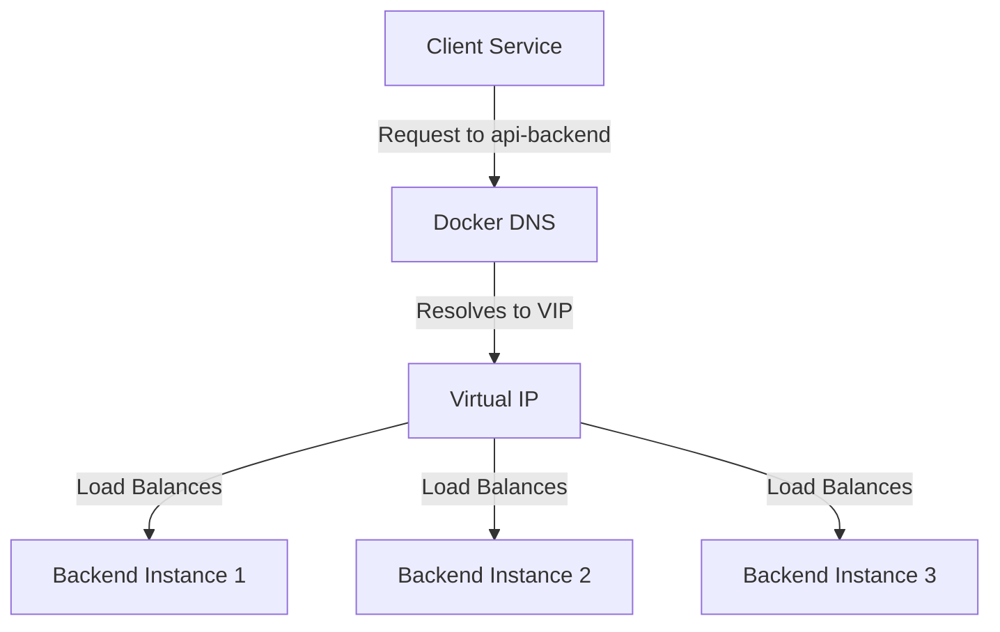

# Docker Service Discovery

## Introduction

When working with Docker, especially in multi-container environments, one challenge quickly becomes apparent: **how do containers find and communicate with each other?** This is where service discovery comes into play.

Service discovery is the process of automatically detecting devices and services on a network. In the context of Docker, it helps containers locate and communicate with each other without hardcoded IP addresses or ports. As containers are ephemeral (they can be created, destroyed, or moved), having a reliable way for them to find each other is essential.

In this tutorial, we'll explore the concept of service discovery in Docker, understand its importance, and implement various methods to achieve effective communication between containers.

## Why Service Discovery Matters

Imagine you have a web application that needs to connect to a database. In a traditional setup, you might hardcode the database server's IP address in your application configuration. But in a containerized environment:

- Container IP addresses are dynamic and change when containers restart
- Containers might be scheduled on different host machines
- Services might scale up or down (multiple instances)

Without service discovery, your containers would lose connection to each other after any restart or scaling event.

## Basic Service Discovery Methods in Docker

### DNS-Based Service Discovery

Docker has built-in DNS capabilities that allow containers to find each other by name. This is the simplest form of service discovery.

#### Example: Using Docker's DNS

Let's create a simple network and two containers to demonstrate:

```bash
# Create a custom network
docker network create my-network

# Start two containers on this network
docker run -d --name web --network my-network nginx
docker run -d --name database --network my-network postgres
```

Now, from the web container, we can ping the database container by name:

```bash
docker exec -it web ping database
```

Output:
```
PING database (172.18.0.3): 56 data bytes
64 bytes from 172.18.0.3: icmp_seq=0 ttl=64 time=0.114 ms
64 bytes from 172.18.0.3: icmp_seq=1 ttl=64 time=0.110 ms
```

Docker automatically resolves the hostname `database` to the correct IP address. Your application can simply connect to `database` instead of an IP address.

### Using Docker Compose for Service Discovery

Docker Compose makes service discovery even easier by automatically creating a network and setting up DNS resolution.

Let's create a `docker-compose.yml` file:

```yaml
version: '3'
services:
  web:
    image: nginx
    depends_on:
      - database
  
  database:
    image: postgres
    environment:
      POSTGRES_PASSWORD: example
```

In the web service, you can refer to the database using the service name:

```bash
docker-compose exec web ping database
```

The output will be similar to our previous example. Within your application code, you would simply connect to `database` as the hostname.

## Advanced Service Discovery

For more complex scenarios, especially in production environments, you might need more advanced service discovery mechanisms.

### Docker Swarm Service Discovery

Docker Swarm, the native clustering and orchestration solution for Docker, provides built-in service discovery through its mesh network and DNS-based routing mesh.

Let's set up a simple service in Docker Swarm:

```bash
# Initialize Docker Swarm
docker swarm init

# Create a service
docker service create --name web-service --replicas 3 -p 80:80 nginx
```

The service `web-service` is now accessible from any node in the swarm at port 80. Docker handles load balancing across the three replicas automatically.

In Swarm mode, services get their own DNS entries. If you have another service that needs to communicate with `web-service`, it can simply use that name.

Here's a more complete example with a frontend and backend service:

```bash
# Create backend service
docker service create --name api-backend --network my-network --replicas 3 my-api-image

# Create frontend service
docker service create --name web-frontend --network my-network -p 80:80 --replicas 2 my-web-image
```

From any container in the `web-frontend` service, the `api-backend` service is reachable at `http://api-backend`. Docker Swarm's internal load balancer will distribute requests across the three backend replicas.

### Virtual IP (VIP) and Load Balancing

Docker Swarm assigns a virtual IP (VIP) to each service. When other services communicate with a service, they connect to this VIP, and Docker's embedded DNS resolves the service name to the VIP.

Let's visualize this:



## External Service Discovery Solutions

For more complex environments or when using Docker alongside other technologies, you might want to use external service discovery tools:

### Consul

Consul is a service discovery tool that provides both service discovery and a key-value store.

A basic example of using Consul with Docker:

```bash
# Run Consul
docker run -d --name consul -p 8500:8500 consul

# Run a service that registers with Consul
docker run -d --name my-service \
  -e CONSUL_HTTP_ADDR=consul:8500 \
  my-service-image
```

Your service would use the Consul API to register itself and discover other services.

### etcd

etcd is a distributed key-value store that can be used for service discovery:

```bash
# Run etcd
docker run -d --name etcd -p 2379:2379 quay.io/coreos/etcd

# Register a service with etcd
curl -L http://localhost:2379/v2/keys/services/database -XPUT -d value="172.17.0.3:5432"

# Discover a service
curl -L http://localhost:2379/v2/keys/services/database
```

### Service Discovery in Kubernetes

If you're using Kubernetes for container orchestration, it has its own robust service discovery mechanism using Services and DNS:

```yaml
apiVersion: v1
kind: Service
metadata:
  name: my-service
spec:
  selector:
    app: my-app
  ports:
  - port: 80
    targetPort: 8080
```

Other pods can reach this service simply by using `my-service` as the hostname.

## Practical Example: Three-Tier Web Application

Let's create a complete example with a web frontend, API service, and database:

```yaml
version: '3'
services:
  frontend:
    image: nginx
    ports:
      - "80:80"
    volumes:
      - ./frontend/nginx.conf:/etc/nginx/conf.d/default.conf
    depends_on:
      - api
  
  api:
    build: ./api
    environment:
      - DB_HOST=database
      - DB_PORT=5432
      - DB_USER=postgres
      - DB_PASSWORD=example
    depends_on:
      - database
  
  database:
    image: postgres
    environment:
      POSTGRES_PASSWORD: example
    volumes:
      - db-data:/var/lib/postgresql/data

volumes:
  db-data:
```

The key part for service discovery is in the API service configuration:

```yaml
environment:
  - DB_HOST=database  # Using the service name as hostname
```

The same principle works in the nginx configuration for the frontend:

```nginx
server {
    listen 80;
    
    location /api {
        proxy_pass http://api:8000;  # Using the service name
    }
    
    location / {
        root /usr/share/nginx/html;
        index index.html;
    }
}
```

## Common Challenges and Solutions

### Challenge: Service Dependencies and Startup Order

Sometimes a service needs to wait for another service to be fully ready.

**Solution: Use wait-for scripts or health checks**

```yaml
services:
  api:
    build: ./api
    depends_on:
      - database
    command: ["./wait-for-it.sh", "database:5432", "--", "node", "app.js"]
```

### Challenge: Service Discovery Across Multiple Networks

**Solution: Connect services to multiple networks**

```yaml
networks:
  frontend-network:
  backend-network:

services:
  api:
    networks:
      - frontend-network
      - backend-network
  
  frontend:
    networks:
      - frontend-network
  
  database:
    networks:
      - backend-network
```

## Best Practices for Docker Service Discovery

1. **Use meaningful service names**: Choose descriptive names for your services to make discovery intuitive.

2. **Implement health checks**: Ensure services are actually ready when discovered:

   ```yaml
   services:
     api:
       healthcheck:
         test: ["CMD", "curl", "-f", "http://localhost:8000/health"]
         interval: 30s
         timeout: 10s
         retries: 3
   ```

3. **Use environment variables for configuration**: Don't hardcode service locations.

4. **Consider using service meshes** for complex applications: Tools like Istio or Linkerd provide advanced service discovery capabilities.

5. **Document your service discovery approach**: Make sure developers understand how services find each other.

## Summary

Docker service discovery is a crucial aspect of containerized applications, enabling dynamic communication between services without relying on fixed IP addresses. We've explored:

- Basic DNS-based discovery in Docker networks
- Service discovery in Docker Compose environments
- Advanced discovery in Docker Swarm with VIPs and load balancing
- External service discovery solutions like Consul and etcd
- Practical examples and best practices

By implementing proper service discovery, your containerized applications become more resilient, scalable, and easier to manage. As containers come and go, your services will still be able to find and communicate with each other seamlessly.

## Additional Resources

- [Docker Networking Documentation](https://docs.docker.com/network/)
- [Docker Compose Networking](https://docs.docker.com/compose/networking/)
- [Docker Swarm Service Discovery](https://docs.docker.com/engine/swarm/networking/)

## Exercises

1. Create a Docker Compose file with a web server and a Redis cache service. Configure the web server to connect to Redis using service discovery.

2. Set up a Docker Swarm with multiple replicas of a service and observe how the DNS-based load balancing works.

3. Implement a health check system to ensure your application only connects to fully initialized services.

4. Try implementing service discovery with an external tool like Consul and compare it with Docker's built-in discovery mechanisms.