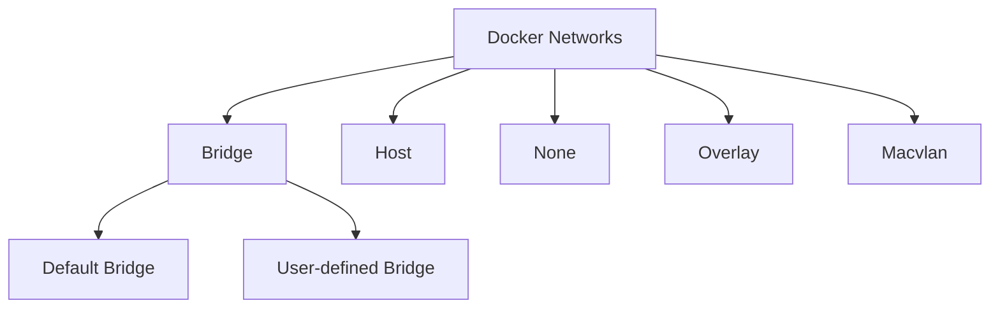

# Docker Network Troubleshooting

## Introduction

When working with Docker containers, networking issues can sometimes be challenging to diagnose and resolve. Understanding how Docker networking works and having a systematic approach to troubleshooting can save you hours of frustration. This guide will walk you through the most common Docker networking problems and provide practical solutions to help you resolve them efficiently.

Docker networking allows containers to communicate with each other and with the outside world. However, misconfigured networks, port conflicts, DNS issues, and other networking problems can prevent your containerized applications from functioning correctly. In this tutorial, we'll explore various troubleshooting techniques to identify and fix these issues.

## Understanding Docker Network Types

Before diving into troubleshooting, let's quickly review the main Docker network types:



- **Bridge Network**: The default network for containers, creating a private network internal to the host.
- **Host Network**: Removes network isolation between the container and the host.
- **None Network**: Disables all networking for a container.
- **Overlay Network**: Connects multiple Docker daemons across hosts (used in Docker Swarm).
- **Macvlan Network**: Assigns a MAC address to a container, making it appear as a physical device on the network.

## Essential Docker Network Commands

Here are some fundamental commands for inspecting and managing Docker networks:

```bash
# List all networks
docker network ls

# Inspect a network
docker network inspect bridge

# Create a new network
docker network create my_network

# Connect a container to a network
docker network connect my_network container_name

# Disconnect a container from a network
docker network disconnect my_network container_name

# Remove a network
docker network rm my_network
```

## Common Docker Networking Issues and Solutions

### Issue 1: Container Cannot Connect to the Internet

#### Symptoms
- Containers cannot ping external domains
- `apt-get update` or similar commands fail
- External API calls fail

#### Troubleshooting Steps

1. **Check if DNS is working properly**:

```bash
# Enter the container
docker exec -it container_name bash

# Try to resolve a domain
ping google.com
# or
nslookup google.com
```

If DNS resolution fails, you might need to configure DNS:

```bash
# Run container with custom DNS
docker run --dns 8.8.8.8 --dns 8.8.4.4 image_name
```

2. **Verify that the container can reach the gateway**:

```bash
# Get container's network details
docker inspect container_name | grep -A 20 "NetworkSettings"

# Try to ping the gateway
ping <Gateway IP>
```

3. **Check if the host machine has internet access**:

```bash
# On the host
ping google.com
```

4. **Inspect iptables rules** (on the host):

```bash
sudo iptables -L -n
sudo iptables -t nat -L -n
```

Look for rules that might be blocking container traffic.

### Issue 2: Containers Cannot Communicate with Each Other

#### Symptoms
- One container cannot ping or connect to services in another container
- Applications report connection refused errors

#### Troubleshooting Steps

1. **Ensure containers are on the same network**:

```bash
# List networks and connected containers
docker network inspect bridge

# If needed, connect containers to the same network
docker network create app_network
docker network connect app_network container1
docker network connect app_network container2
```

2. **Test connectivity between containers**:

```bash
# Get IP of the target container
docker inspect -f '{{range .NetworkSettings.Networks}}{{.IPAddress}}{{end}}' container2

# From container1, try to ping container2
docker exec -it container1 ping <container2_IP>
```

3. **Check if container services are actually running and listening**:

```bash
docker exec -it container2 netstat -tuln
```

4. **For user-defined bridge networks, use container names as hostnames**:

```bash
# Ping by name instead of IP
docker exec -it container1 ping container2
```

### Issue 3: Port Binding Issues

#### Symptoms
- Services cannot be accessed from the host
- `docker: Error response from daemon: driver failed programming external connectivity`
- Port conflicts when starting containers

#### Troubleshooting Steps

1. **Check which ports are already in use on the host**:

```bash
# On Linux/macOS
sudo netstat -tuln

# On Windows
netstat -abn
```

2. **Verify container port mappings**:

```bash
docker port container_name
```

3. **Inspect container network settings**:

```bash
docker inspect -f '{{range $p, $conf := .NetworkSettings.Ports}}{{$p}} -> {{(index $conf 0).HostPort}}{{println}}{{end}}' container_name
```

4. **Try a different host port**:

```bash
docker run -p 8081:80 nginx
```

5. **Check if the application inside the container is actually listening on the specified port**:

```bash
docker exec -it container_name netstat -tuln
```

### Issue 4: Bridge Network Issues

#### Symptoms
- Containers cannot communicate on a custom bridge network
- Network connectivity problems after Docker restart

#### Troubleshooting Steps

1. **Recreate the bridge network**:

```bash
# Remove the network (after disconnecting all containers)
docker network rm my_bridge_network

# Create it again
docker network create --driver bridge my_bridge_network
```

2. **Check for overlapping subnets**:

```bash
# List networks and their subnets
docker network ls
docker network inspect my_bridge_network | grep Subnet
```

3. **Inspect the bridge interface on the host**:

```bash
ip addr show docker0
```

4. **Restart the Docker daemon**:

```bash
# On Linux
sudo systemctl restart docker

# On macOS/Windows
# Restart Docker Desktop
```

### Issue 5: DNS Resolution Problems in Containers

#### Symptoms
- Containers can ping IPs but not domain names
- `nslookup` or `dig` commands fail inside containers

#### Troubleshooting Steps

1. **Check DNS configuration in the container**:

```bash
docker exec -it container_name cat /etc/resolv.conf
```

2. **Override DNS settings for a container**:

```bash
docker run --dns 8.8.8.8 --dns-search example.com image_name
```

3. **Configure Docker daemon DNS**:

Create or edit `/etc/docker/daemon.json`:

```json
{
  "dns": ["8.8.8.8", "8.8.4.4"]
}
```

Then restart Docker:

```bash
sudo systemctl restart docker
```

4. **Test DNS resolution with different tools**:

```bash
docker exec -it container_name nslookup google.com
docker exec -it container_name dig google.com
docker exec -it container_name curl -v https://google.com
```

## Advanced Troubleshooting Techniques

### Packet Capture with tcpdump

Capturing network packets can provide valuable insights into networking issues:

```bash
# Install tcpdump in the container
docker exec -it container_name apt-get update && apt-get install -y tcpdump

# Capture packets
docker exec -it container_name tcpdump -i eth0 -n
```

Example output:
```
12:34:56.789012 IP 172.17.0.2.52462 > 8.8.8.8.53: UDP, length 44
12:34:56.901234 IP 8.8.8.8.53 > 172.17.0.2.52462: UDP, length 60
```

### Analyzing Docker Network Namespace

For deeper network troubleshooting, you can access the container's network namespace:

```bash
# Get container's process ID
PID=$(docker inspect -f '{{.State.Pid}}' container_name)

# Use nsenter to run commands in container's network namespace
sudo nsenter -t $PID -n ip addr
sudo nsenter -t $PID -n netstat -tuln
```

### Checking Network Performance

Test network performance between containers or to external resources:

```bash
# Install iperf in containers
docker exec -it container1 apt-get update && apt-get install -y iperf3
docker exec -it container2 apt-get update && apt-get install -y iperf3

# Run iperf server in container2
docker exec -it container2 iperf3 -s

# Run iperf client in container1
docker exec -it container1 iperf3 -c container2
```

Example output:
```
[ ID] Interval           Transfer     Bitrate         Retr
[  5]   0.00-10.00  sec   1.05 GBytes   903 Mbits/sec    0             sender
[  5]   0.00-10.00  sec   1.05 GBytes   902 Mbits/sec                  receiver
```

## Practical Example: Troubleshooting a Multi-Container Application

Let's walk through troubleshooting a typical web application with a frontend, backend, and database:

1. **Setup the application**:

```bash
# Create a network
docker network create app_network

# Start the database
docker run -d --name db --network app_network -e POSTGRES_PASSWORD=secret postgres

# Start the backend
docker run -d --name api --network app_network -p 8080:8080 my-backend-image

# Start the frontend
docker run -d --name web --network app_network -p 80:80 my-frontend-image
```

2. **Problem**: The frontend can't connect to the backend API.

3. **Troubleshooting**:

Check if the API container is running:
```bash
docker ps | grep api
```

Check if the API is listening on port 8080:
```bash
docker exec -it api netstat -tuln
```

Output:
```
Active Internet connections (only servers)
Proto Recv-Q Send-Q Local Address           Foreign Address         State
tcp        0      0 0.0.0.0:8080            0.0.0.0:*               LISTEN
```

Verify network connectivity from frontend to API:
```bash
docker exec -it web ping api
```

Check logs for error messages:
```bash
docker logs api
docker logs web
```

Inspect the network configuration:
```bash
docker network inspect app_network
```

4. **Solution**: The API was configured to listen on localhost only, not 0.0.0.0

Fix the API configuration to listen on all interfaces and restart:
```bash
# Update configuration to listen on 0.0.0.0
docker restart api
```

## Debugging Tools and Commands Reference

Here's a quick reference of useful tools and commands for Docker network troubleshooting:

| Command/Tool | Purpose | Example |
|--------------|---------|---------|
| `docker network ls` | List all networks | `docker network ls` |
| `docker network inspect` | Inspect network details | `docker network inspect bridge` |
| `docker inspect` | Inspect container network settings | `docker inspect -f '{{json .NetworkSettings.Networks}}' container_name` |
| `ping` | Test basic connectivity | `docker exec container ping 8.8.8.8` |
| `curl` | Test HTTP connectivity | `docker exec container curl -v http://service:8080` |
| `netstat` | Check listening ports | `docker exec container netstat -tuln` |
| `tcpdump` | Capture network packets | `docker exec container tcpdump -i eth0` |
| `nslookup/dig` | Test DNS resolution | `docker exec container nslookup example.com` |
| `traceroute` | Trace network path | `docker exec container traceroute google.com` |
| `iptables` | Check firewall rules | `sudo iptables -L -n -v` |

## Common Docker Network Troubleshooting Commands

```bash
# View container's IP address
docker inspect -f '{{range .NetworkSettings.Networks}}{{.IPAddress}}{{end}}' container_name

# Check if container can access internet
docker exec -it container_name ping -c 3 google.com

# Check open ports in container
docker exec -it container_name netstat -tuln

# Check the network stack in container
docker exec -it container_name ip addr show

# View container routing table
docker exec -it container_name ip route

# Test connection to another container or service
docker exec -it container_name curl -v http://service_name:port

# Follow container network traffic
docker exec -it container_name tcpdump -i eth0 -n

# Restart Docker networking (on Linux)
sudo systemctl restart docker

# Clean up unused networks
docker network prune
```

## Best Practices for Docker Networking

1. **Use user-defined bridge networks** for container-to-container communication:
   ```bash
   docker network create --driver bridge my_app_network
   ```

2. **Prefer service names over IP addresses** for communication between containers:
   ```bash
   # Instead of hardcoding IPs in your app:
   docker run --network my_app_network --name api api_image
   docker run --network my_app_network web_image
   # Then use "api" as hostname in the web container
   ```

3. **Keep related containers on the same network**:
   ```bash
   # All components of an application on one network
   docker network create app_network
   docker run --network app_network --name db postgres
   docker run --network app_network --name cache redis
   docker run --network app_network --name api api_image
   ```

4. **Use Docker Compose for complex setups**:
   ```yaml
   # docker-compose.yml
   version: '3'
   services:
     web:
       image: nginx
       ports:
         - "80:80"
       networks:
         - frontend
     api:
       image: api_image
       networks:
         - frontend
         - backend
     db:
       image: postgres
       networks:
         - backend

   networks:
     frontend:
     backend:
   ```

5. **Limit container network capabilities** for better security:
   ```bash
   docker run --cap-drop NET_ADMIN --cap-drop NET_RAW image_name
   ```

## Summary

This guide covered essential Docker network troubleshooting techniques to help you diagnose and resolve common networking issues:

- We explored various Docker network types and configurations
- Learned how to inspect and debug container connectivity
- Covered solutions for common problems like DNS issues, port conflicts, and container-to-container communication
- Examined advanced troubleshooting techniques using specialized tools
- Walked through a practical multi-container application troubleshooting scenario

By systematically applying these techniques, you'll be able to efficiently pinpoint and resolve Docker networking problems, ensuring your containerized applications run smoothly.

## Additional Resources

- [Docker Networking Documentation](https://docs.docker.com/network/)
- [Docker Compose Networking](https://docs.docker.com/compose/networking/)
- [Docker Network Command Reference](https://docs.docker.com/engine/reference/commandline/network/)

## Exercises

1. Create a bridge network and connect two containers to it. Verify they can communicate by hostname.
2. Deliberately misconfigure a container's DNS and practice troubleshooting it.
3. Set up a multi-container application with frontend, backend, and database. Introduce and then fix a networking issue.
4. Capture network traffic between containers using tcpdump and analyze the results.
5. Configure port forwarding for a web application and test access from the host and from outside the host.