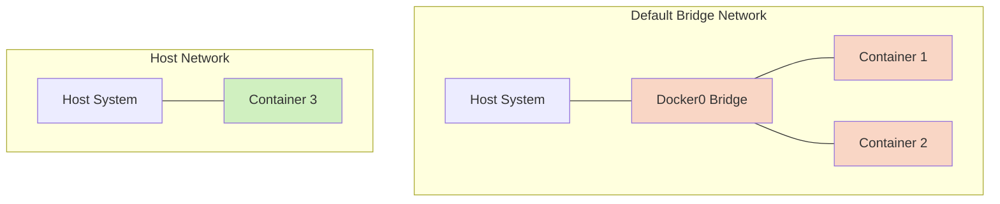

# Docker Host

## Introduction

When working with Docker containers, understanding how they interact with the host machine's network is crucial. Docker Host networking is a fundamental concept that allows containers to share the network namespace with the host machine. This means containers can use the host's IP addresses, network interfaces, and ports directly without any network isolation.

In this article, we'll explore Docker Host networking, how it differs from other Docker network types, when to use it, and best practices for implementation.

## What is Docker Host Networking?

Docker Host networking (also known as the `host` network driver) allows a container to share the host's network namespace, effectively removing network isolation between the container and the Docker host.

When a container runs with host networking:

- It uses the host's network interfaces directly
- It shares the host's IP address
- It has direct access to all network ports on the host
- No port mapping is required to access services in the container
- Network performance is the same as running the application directly on the host

## How Docker Host Networking Works

Let's examine how host networking differs from the default bridge network that Docker uses:



In the default bridge network (top), containers get their own network namespace and connect to the host through a virtual bridge. In host networking (bottom), the container shares the host's network namespace directly.

## When to Use Docker Host Networking

Host networking is particularly useful in the following scenarios:

1. **Performance-critical applications**: When network performance is crucial and you want to avoid the overhead of network address translation (NAT) and virtual networks.

2. **Network monitoring tools**: Applications that need to capture or analyze network traffic on the host.

3. **Applications that manage large ranges of ports**: When an application needs to bind to many ports or a range of ports.

4. **Development and testing**: When you want to quickly test an application without configuring port mappings.

## Creating a Container with Host Networking

To use host networking when creating a container, use the `--network host` flag with the `docker run` command:

```bash
docker run --network host nginx
```

This command runs an Nginx container using the host's network stack. The Nginx server will be accessible directly on port 80 of your host machine without any port mapping.

## Example: Running a Web Server with Host Networking

Let's compare running a web server with and without host networking:

### Without Host Networking (Default Bridge Network)

```bash
# Run Nginx with port mapping
docker run -d --name nginx-bridge -p 8080:80 nginx
```

With the default bridge network, we need to explicitly publish port 80 from the container to port 8080 on the host using the `-p` flag.

To access the web server, we would use: `http://localhost:8080`

### With Host Networking

```bash
# Run Nginx with host networking
docker run -d --name nginx-host --network host nginx
```

With host networking, Nginx binds directly to port 80 on the host machine. No port mapping is needed.

To access the web server, we would use: `http://localhost:80` or simply `http://localhost`

## Checking Network Configuration

You can verify that a container is using host networking with the `docker inspect` command:

```bash
docker inspect --format '{{.NetworkSettings.Networks.host}}' nginx-host
```

If the container is using host networking, this command will return information about the host network configuration.

## Advantages of Host Networking

- **Superior network performance**: No network address translation (NAT) or virtual networks.
- **Direct access to host network interfaces**: Useful for network monitoring tools.
- **Simplified configuration**: No need to manage port mappings.
- **Access to special network features**: Some low-level network features are only available when using host networking.

## Limitations and Considerations

While host networking offers advantages, it comes with important limitations:

1. **Reduced isolation**: Containers using host networking have no network isolation from the host, which can pose security risks.

2. **Port conflicts**: If multiple containers try to use the same port on the host, conflicts will occur.

3. **No portability**: Container configurations become dependent on the host's network configuration.

4. **Limited scalability**: You can only run one instance of a service per host when using host networking.

5. **Platform limitations**: Host networking works differently on Linux versus Windows or macOS.

## Host Networking vs. Other Docker Network Drivers

Docker provides several network drivers. Let's compare host networking with other common options:

| Network Driver | Isolation | Performance | Use Case |
|----------------|-----------|-------------|----------|
| Host | None | Highest | High-performance applications |
| Bridge (default) | Isolated | Good | General purpose |
| Overlay | Isolated | Moderate | Multi-host networking |
| Macvlan | Semi-isolated | High | Physical network integration |
| None | Complete | N/A | Disable networking |

## Practical Example: Network Monitoring Tool

Let's create a practical example using a network monitoring tool that needs access to all network interfaces:

```bash
# Run Wireshark's command-line version (tshark) with host networking
docker run --rm --network host -it --name network-monitor corfr/tcpdump tcpdump -i any -n
```

This container will capture packets from all network interfaces on the host machine, which would not be possible with the default bridge network.

## Security Best Practices

When using host networking, consider these security practices:

1. **Limit host networking to trusted containers**: Only use host networking for containers that require it and are trusted.

2. **Run containers with least privilege**: Use `--cap-drop` to remove capabilities and `--security-opt` to enhance security.

3. **Keep the host system secure**: Since there's no network isolation, host system security is even more critical.

4. **Implement host-level firewalls**: Use iptables or other firewall solutions to restrict access.

Example of running a container with host networking and enhanced security:

```bash
docker run --network host --cap-drop ALL --cap-add NET_ADMIN --security-opt no-new-privileges:true nginx
```

## Docker Compose with Host Networking

To use host networking in Docker Compose, add the `network_mode: host` option in your `docker-compose.yml` file:

```yaml
version: '3'
services:
  web:
    image: nginx
    network_mode: host
```

## Troubleshooting Host Network Issues

Common issues with host networking and how to resolve them:

### Port Conflicts

**Issue**: Container fails to start because the port is already in use.

**Solution**: Check which process is using the port on the host:

```bash
sudo netstat -tulnp | grep <port-number>
```

Then stop the competing service or use a different port for your application.

### Network Interface Access

**Issue**: Container cannot access specific network interfaces.

**Solution**: Verify that the container has the necessary capabilities:

```bash
docker run --network host --cap-add NET_ADMIN <image>
```

## Summary

Docker Host networking provides a powerful way to run containers with direct access to the host's network stack. This approach offers superior performance and simplicity but comes at the cost of reduced isolation between the container and the host.

Key takeaways:

- Host networking removes network isolation between container and host
- It's ideal for high-performance applications and network tools
- No port mapping is required with host networking
- Security considerations are critical due to reduced isolation
- It has limitations in terms of scalability and portability

## Additional Resources

To deepen your understanding of Docker networking:

1. Explore Docker's official documentation on [network drivers](https://docs.docker.com/network/)
2. Learn about other networking options like bridge networks and overlay networks
3. Practice creating different network configurations with Docker Compose

## Exercises

To reinforce your learning, try these exercises:

1. Run a web server (like Nginx) using host networking and verify you can access it directly on port 80.
2. Compare the performance of a database container using host networking versus bridge networking.
3. Create a Docker Compose file that runs multiple services with different network modes.
4. Use the `--network host` option to run a network diagnostic tool and analyze your network traffic.