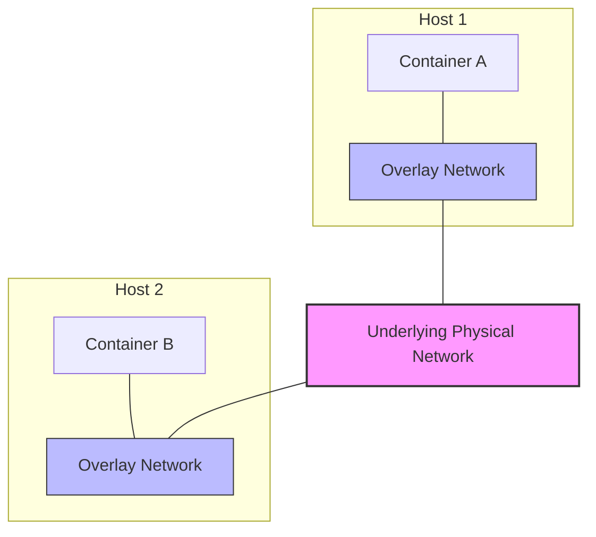

# Docker Overlay Networks

## Introduction

When working with Docker in a single-host environment, bridge networks are often sufficient to connect your containers. But what happens when your application scales and you need to run containers across multiple Docker hosts? This is where **overlay networks** come into play.

An overlay network creates a distributed network among multiple Docker daemon hosts. This network sits on top of the hosts' existing network infrastructure, allowing containers connected to it to communicate securely across hosts as if they were on the same local network.

In this guide, we'll explore Docker overlay networks in detail, understand how they work, and learn how to create and use them in distributed applications.

## Prerequisites

Before diving into overlay networks, make sure you have:

- Docker Engine installed on multiple hosts
- Basic understanding of Docker networking concepts
- Docker Swarm initialized (for most overlay network features)

## Understanding Overlay Networks

### What is an Overlay Network?

An overlay network is a network that is built on top of another network. In Docker's context, an overlay network allows containers running on different Docker hosts to communicate with each other, creating the illusion that they are on the same network even though they might be on entirely different physical machines.

### How Overlay Networks Work

Docker overlay networks use VXLAN (Virtual Extensible LAN) technology to encapsulate layer 2 frames within layer 4 UDP packets. This encapsulation allows container traffic to traverse the underlying physical network infrastructure.

Here's a simplified view of how overlay networks function:



Key components that make overlay networks work:

1. **VXLAN**: Provides the encapsulation mechanism for container traffic
2. **Network Control Plane**: Handles network creation and IP address management
3. **Network Data Plane**: Handles the actual packet forwarding
4. **Gossip Protocol**: Allows Docker hosts to discover each other and exchange network information

## Creating and Using Overlay Networks

### Prerequisites: Setting Up Docker Swarm

While you can create overlay networks without Swarm mode, many features require it. Let's first initialize a Docker Swarm:

```bash
# On the first host (becomes the manager)
docker swarm init --advertise-addr <MANAGER-IP>

# You'll get a command to run on worker nodes, similar to:
docker swarm join --token <TOKEN> <MANAGER-IP>:2377
```

### Creating an Overlay Network

Once you have a Swarm set up, you can create an overlay network using the `docker network create` command with the `--driver overlay` flag:

```bash
docker network create --driver overlay --attachable my-overlay-network
```

The `--attachable` flag allows standalone containers to connect to this network, not just Swarm services.

### Deploying Services on an Overlay Network

Let's deploy two services on our overlay network:

```bash
# Deploy a web service
docker service create \
  --name web-service \
  --network my-overlay-network \
  --replicas 2 \
  nginx

# Deploy a backend service
docker service create \
  --name api-service \
  --network my-overlay-network \
  --replicas 2 \
  my-api-image
```

These services can now communicate with each other using their service names as DNS entries, regardless of which host they're running on.

## Overlay Network Options and Features

### Encrypted Overlay Networks

For additional security, you can create encrypted overlay networks:

```bash
docker network create --driver overlay --opt encrypted=true --attachable secure-overlay
```

This encrypts all container-to-container traffic within the overlay network using IPsec encryption.

### Custom Subnet Configuration

You can specify custom subnets for your overlay networks:

```bash
docker network create \
  --driver overlay \
  --subnet=10.11.0.0/16 \
  --gateway=10.11.0.1 \
  custom-overlay
```

### Service Discovery

One of the most powerful features of overlay networks is automatic DNS-based service discovery. Containers can reach other containers by name:

```bash
# From inside container connected to the overlay network
curl http://web-service
```

## Real-World Example: Three-Tier Application

Let's look at a practical example of a three-tier application using overlay networks:

```bash
# Create our overlay network
docker network create --driver overlay --attachable app-network

# Deploy the database tier
docker service create \
  --name db \
  --network app-network \
  --env POSTGRES_PASSWORD=mysecretpassword \
  --env POSTGRES_DB=myapp \
  postgres:13

# Deploy the backend API tier
docker service create \
  --name api \
  --network app-network \
  --env DB_HOST=db \
  --env DB_PASSWORD=mysecretpassword \
  --replicas 3 \
  --publish published=8080,target=8080 \
  myapp/api:latest

# Deploy the frontend tier
docker service create \
  --name frontend \
  --network app-network \
  --env API_URL=http://api:8080 \
  --replicas 3 \
  --publish published=80,target=80 \
  myapp/frontend:latest
```

This deploys a three-tier application where:
- The frontend service can connect to the API service using the name "api"
- The API service can connect to the database using the name "db"
- All services are in the same overlay network but can be distributed across multiple hosts
- External traffic can reach the application via the published ports

## Monitoring and Troubleshooting Overlay Networks

### Inspecting Overlay Networks

To inspect an overlay network:

```bash
docker network inspect my-overlay-network
```

This provides detailed information about the network, including containers and services connected to it.

### Checking Network Connectivity

To check if containers can communicate within an overlay network:

```bash
# Get into a container
docker exec -it <container-id> sh

# Try pinging another service
ping api-service
```

### Common Issues and Solutions

1. **Connectivity Issues**:
   - Check if the Swarm nodes can communicate with each other (ports 2377, 7946, and 4789)
   - Verify that firewalls allow UDP traffic on port 4789 (VXLAN)

2. **Service Discovery Problems**:
   - Ensure containers are on the same overlay network
   - Check if service names are correct

3. **Performance Issues**:
   - Monitor network traffic between hosts
   - Consider using host mode networking for high-throughput services

## Performance Considerations

When working with overlay networks, keep these performance considerations in mind:

1. **Network Overhead**: Overlay networks add encapsulation overhead, which can impact throughput
2. **MTU Settings**: Default MTU may cause fragmentation; consider adjusting if needed
3. **Encryption Impacts**: Encrypted overlay networks have higher CPU usage and lower throughput

For high-throughput applications, consider alternatives like host networking where appropriate.

## Summary

Docker overlay networks provide a powerful way to enable container-to-container communication across multiple Docker hosts. They abstract away the complexity of distributed networking, making it easier to deploy applications at scale.

Key points to remember:
- Overlay networks allow containers on different hosts to communicate
- They work best with Docker Swarm for automatic service discovery
- They can be encrypted for additional security
- They support custom configuration for subnets and gateways
- They enable DNS-based service discovery across hosts

## Further Learning

To deepen your understanding of Docker overlay networks, you might want to explore:

1. **Advanced Docker Swarm features**
2. **Network policies and security**
3. **Alternative orchestration solutions like Kubernetes**
4. **Custom IPAM drivers for overlay networks**

## Exercises

1. Create a multi-host Docker Swarm cluster and deploy a simple web application that spans multiple hosts using an overlay network.
2. Compare the performance of an encrypted overlay network versus a non-encrypted one.
3. Create an overlay network with custom subnet settings and deploy services to it.
4. Implement service discovery between containers running on different hosts using an overlay network.
5. Debug common overlay network issues by intentionally misconfiguring parts of your network.