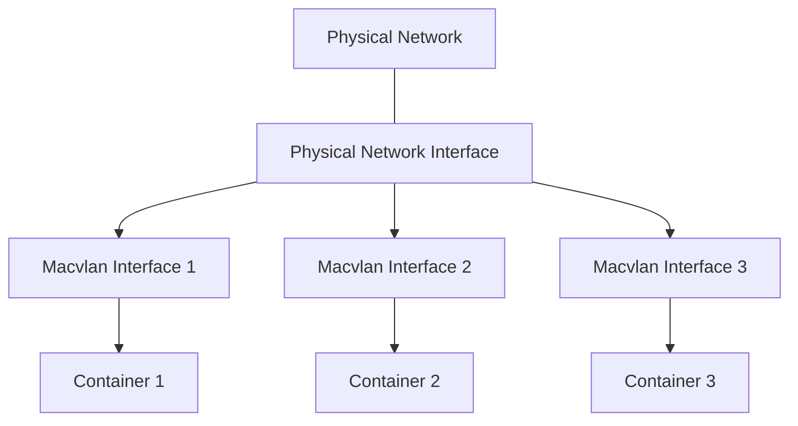

# Docker Macvlan

## Introduction

When working with Docker containers, networking is a fundamental concept that determines how containers communicate with each other and with the outside world. Docker provides several networking options, and one of the more advanced but incredibly useful options is the **Macvlan** driver.

Macvlan allows you to assign a MAC address to each container, making them appear as physical devices directly on your network. This is particularly useful when you need your containers to be directly accessible on your network with their own IP addresses, rather than going through port mapping or other networking layers.

In this tutorial, we'll explore Docker's Macvlan networking driver, understand how it works, and see how to implement it in practical scenarios.

## Understanding Macvlan Networking

### What is Macvlan?

Macvlan is a Linux kernel driver that allows you to create multiple virtual network interfaces that share the same physical network interface but have different MAC addresses. Docker's Macvlan networking driver leverages this technology to provide containers with their own MAC addresses and IP addresses on your physical network.

### How Macvlan Works



With Macvlan:

1. Each container gets its own MAC address
2. Each container appears as a physical device on your network
3. Containers can have their own IP addresses from your network's subnet
4. Traffic flows directly to containers without NAT or port mapping

### Macvlan Modes

Docker's Macvlan driver supports several modes:

- **Bridge Mode**: Containers communicate with the external network and with each other
- **VEPA (Virtual Ethernet Port Aggregator) Mode**: Traffic between containers on the same host is sent via the physical interface
- **Private Mode**: Containers can only communicate with the external network, not with each other
- **Passthrough Mode**: Similar to bridge mode but requires promiscuous mode on the parent interface

Bridge mode is the most commonly used and will be our focus in this tutorial.

## Prerequisites

Before we begin, ensure you have:

- Docker Engine installed (version 17.06 or newer)
- Root or sudo access to your host system
- A physical network interface that supports promiscuous mode (for some configurations)
- Basic understanding of IP addressing and networking concepts

## Creating a Macvlan Network

Let's start by creating a simple Macvlan network in bridge mode:

```bash
# Check your network interface name
ip addr

# Create a Macvlan network
docker network create -d macvlan \
  --subnet=192.168.1.0/24 \
  --gateway=192.168.1.1 \
  -o parent=eth0 \
  my_macvlan_network
```

In this example:
- `-d macvlan` specifies we're using the Macvlan driver
- `--subnet` defines the subnet our containers will use (should match your network)
- `--gateway` specifies your network's gateway
- `-o parent=eth0` specifies the parent interface (replace `eth0` with your interface name)
- `my_macvlan_network` is the name we're giving to this network

The output will be a network ID like:
```
1d6d9b076fb5df9c1b9d161e0c6e916137f54a79b9f6b815f3c3f41203c6c239
```

You can verify the network was created by running:

```bash
docker network ls
```

Output:
```
NETWORK ID          NAME                 DRIVER              SCOPE
1d6d9b076fb5        my_macvlan_network   macvlan             local
...other networks...
```

## Running Containers on a Macvlan Network

Now let's run a container using our Macvlan network:

```bash
docker run --rm -dit \
  --network my_macvlan_network \
  --ip=192.168.1.10 \
  --name=macvlan-container1 \
  alpine sh
```

In this command:
- `--network my_macvlan_network` connects the container to our Macvlan network
- `--ip=192.168.1.10` assigns a specific IP from our subnet
- `alpine` is a lightweight Linux distribution perfect for testing

Let's run a second container:

```bash
docker run --rm -dit \
  --network my_macvlan_network \
  --ip=192.168.1.11 \
  --name=macvlan-container2 \
  alpine sh
```

## Testing Container Connectivity

Now let's test the connectivity between our containers and with the external network:

```bash
# Access the first container
docker exec -it macvlan-container1 sh

# Inside the container, install ping
apk add --no-cache iputils

# Ping the second container
ping -c 4 192.168.1.11

# Ping the gateway
ping -c 4 192.168.1.1

# Ping an external address
ping -c 4 8.8.8.8
```

Expected output from pinging the second container:
```
PING 192.168.1.11 (192.168.1.11): 56 data bytes
64 bytes from 192.168.1.11: seq=0 ttl=64 time=0.307 ms
64 bytes from 192.168.1.11: seq=1 ttl=64 time=0.108 ms
64 bytes from 192.168.1.11: seq=2 ttl=64 time=0.111 ms
64 bytes from 192.168.1.11: seq=3 ttl=64 time=0.108 ms

--- 192.168.1.11 ping statistics ---
4 packets transmitted, 4 packets received, 0% packet loss
round-trip min/avg/max = 0.108/0.158/0.307 ms
```

## Use Case: Web Server with Direct Network Access

Let's create a practical example by deploying a web server that's directly accessible on your network:

```bash
docker run -d \
  --network my_macvlan_network \
  --ip=192.168.1.20 \
  --name=web-server \
  nginx
```

Now you can access this web server directly from any device on your network by navigating to `http://192.168.1.20` in a browser.

## Macvlan with Multiple Subnets

For more complex setups, you can create a Macvlan network with multiple subnets:

```bash
docker network create -d macvlan \
  --subnet=192.168.1.0/24 --gateway=192.168.1.1 \
  --subnet=192.168.2.0/24 --gateway=192.168.2.1 \
  -o parent=eth0 \
  multi_subnet_macvlan
```

## Limitations and Considerations

When working with Macvlan networks, keep these points in mind:

1. **Host Communication**: By default, the host cannot communicate with containers on a Macvlan network attached to the host's physical interface. To enable this, you need to create a separate Macvlan interface on the host.

2. **IP Address Management**: You need to manage IP addresses carefully to avoid conflicts on your network.

3. **DHCP**: Macvlan doesn't support DHCP for containers out of the box. IP addresses must be statically assigned.

4. **Hardware Support**: Some network interfaces don't support promiscuous mode, which may limit Macvlan functionality.

5. **Security**: Since containers are directly exposed on the network, you need to implement proper security measures.

### Enabling Host-to-Container Communication

To allow your host to communicate with Macvlan containers, create a Macvlan interface on the host:

```bash
# Create a macvlan interface on the host
ip link add mac0 link eth0 type macvlan mode bridge

# Assign an IP address to the interface
ip addr add 192.168.1.201/24 dev mac0

# Bring the interface up
ip link set mac0 up

# Add a route to the macvlan subnet
ip route add 192.168.1.0/24 dev mac0
```

Note: These changes won't persist after a reboot unless added to your network configuration.

## Macvlan vs. Other Docker Networking Options

Let's compare Macvlan with other Docker networking options:

| Feature | Macvlan | Bridge | Overlay | Host |
|---------|---------|--------|---------|------|
| Directly accessible on network | ✅ | ❌ (requires port mapping) | ❌ | ✅ |
| Isolated container networks | ✅ | ✅ | ✅ | ❌ |
| Multi-host networking | ❌ | ❌ | ✅ | ❌ |
| IP address preservation | ✅ | ❌ | ❌ | ✅ |
| Performance | Very High | High | Medium | Highest |
| Complexity | Medium | Low | High | Low |

## Advanced Example: Running Multiple Services

Let's create a more complex example with multiple services that need direct network access:

```bash
# Create our macvlan network
docker network create -d macvlan \
  --subnet=192.168.1.0/24 \
  --gateway=192.168.1.1 \
  -o parent=eth0 \
  production_network

# Run a web server
docker run -d \
  --network production_network \
  --ip=192.168.1.20 \
  --name web-server \
  nginx

# Run a database server
docker run -d \
  --network production_network \
  --ip=192.168.1.21 \
  --name db-server \
  postgres:13

# Run a cache server
docker run -d \
  --network production_network \
  --ip=192.168.1.22 \
  --name cache-server \
  redis
```

All these services would be accessible directly on your network with their assigned IP addresses.

## Summary

Docker's Macvlan networking driver provides a powerful way to integrate containers directly into your physical network. By assigning MAC addresses to containers, they appear as physical devices on your network with their own IP addresses.

Key points to remember:

- Macvlan assigns MAC addresses to containers, making them appear as physical devices
- Containers can have their own IP addresses from your network's subnet
- Traffic flows directly to containers without NAT or port mapping
- Macvlan is ideal for scenarios where containers need to appear as physical devices on the network
- Bridge mode is the most commonly used Macvlan mode

While Macvlan adds some complexity, it offers significant benefits for certain use cases, particularly when you need containers to be first-class citizens on your network.

## Exercises

1. Create a Macvlan network and run three containers with static IPs. Verify they can communicate with each other and the outside world.

2. Set up a simple web application stack using Macvlan with a web server container and a database container.

3. Create a Macvlan interface on your host and verify it can communicate with containers in your Macvlan network.

4. Experiment with different Macvlan modes and observe the differences in container communication.

5. Research how to use Docker Compose with Macvlan networks to deploy multi-container applications.

## Additional Resources

- [Docker Networking Documentation](https://docs.docker.com/network/)
- [Linux Network Namespaces](https://blog.scottlowe.org/2013/09/04/introducing-linux-network-namespaces/)
- [Understanding Docker Container Networking](https://docs.docker.com/config/containers/container-networking/)
- [Docker Compose Networking](https://docs.docker.com/compose/networking/)