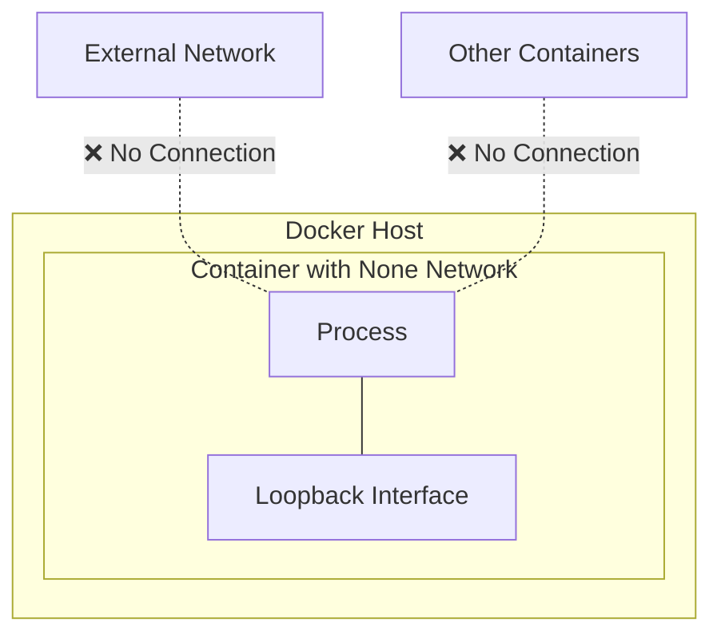

# Docker None Network

## Introduction

When working with Docker containers, networking is a critical aspect that determines how containers communicate with each other and the outside world. Docker provides several built-in network drivers to address different networking requirements. One of these is the **none** network driver, which is sometimes overlooked but serves important use cases in containerized environments.

The `none` network driver creates containers with no external network interfaces. This might seem counterintuitive at first—why would you want a container with no network connectivity? However, there are specific scenarios where this level of isolation is exactly what you need.

In this guide, we'll explore the `none` network driver in depth, its characteristics, use cases, and limitations.

## What is the None Network?

The `none` network is a special network type in Docker that provides maximum network isolation. When you attach a container to the `none` network:

- The container receives only a loopback interface (`lo`)
- No external network interface is created
- The container cannot communicate with other containers or the host
- No incoming or outgoing network connections are possible beyond the container itself

Here's a visual representation of the `none` network:



## Creating a Container with the None Network

To create a container using the `none` network, you can use the `--network=none` flag with the `docker run` command:

```bash
docker run --network=none -it ubuntu bash
```

Let's verify the network interfaces inside the container:

```bash
# Inside the container
ip addr show
```

Output:
```
1: lo: <LOOPBACK,UP,LOWER_UP> mtu 65536 qdisc noqueue state UNKNOWN group default qlen 1000
    link/loopback 00:00:00:00:00:00 brd 00:00:00:00:00:00
    inet 127.0.0.1/8 scope host lo
       valid_lft forever preferred_lft forever
```

Notice that only the loopback interface (`lo`) is available. There are no `eth0` or other network interfaces that would typically be present in a networked container.

## Inspecting the None Network

Let's examine the `none` network using the Docker network inspection command:

```bash
docker network inspect none
```

Output:
```json
[
    {
        "Name": "none",
        "Id": "3d4821e424d1ac089b8f9a664331ff76adb172810f8a8a16e9ede0e2165fb963",
        "Created": "2023-03-15T14:27:46.285789277Z",
        "Scope": "local",
        "Driver": "null",
        "EnableIPv6": false,
        "IPAM": {
            "Driver": "default",
            "Options": null,
            "Config": []
        },
        "Internal": false,
        "Attachable": false,
        "Ingress": false,
        "ConfigFrom": {
            "Network": ""
        },
        "ConfigOnly": false,
        "Containers": {},
        "Options": {},
        "Labels": {}
    }
]
```

Key things to notice:
- The driver is actually called `null`, though we refer to it as the `none` network
- There is no IP configuration (`"Config": []` in the IPAM section)
- The network is not attachable, not internal, and not used for ingress

## Use Cases for the None Network

### 1. Security-Critical Applications

For applications handling extremely sensitive data, the `none` network provides the highest level of network isolation. Since the container cannot communicate with anything outside itself, the attack surface from a network perspective is minimized.

```bash
docker run --network=none -v /secure/data:/data secure-processor
```

### 2. CPU-Intensive Batch Processing

For containers that perform computational tasks without needing network access, the `none` network eliminates unnecessary overhead:

```bash
docker run --network=none number-cruncher --input /data/input.dat --output /data/result.dat
```

### 3. Local Development and Testing

When developing applications that don't require network access or when you want to test application behavior in the absence of network connectivity:

```bash
docker run --network=none -v $(pwd):/app my-app-test
```

### 4. Custom Network Namespaces

Advanced users might want to set up their own network namespace manually:

```bash
# Run with none network
docker run --network=none -d --name custom-net-container alpine sleep infinity

# Get container PID
PID=$(docker inspect -f '{{.State.Pid}}' custom-net-container)

# Set up custom networking (example)
sudo ip link add eth0 type veth peer name veth0
sudo ip link set veth0 netns $PID
sudo nsenter -t $PID -n ip addr add 192.168.1.100/24 dev veth0
sudo nsenter -t $PID -n ip link set veth0 up
```

## Testing Network Isolation

Let's verify that a container with the `none` network truly has no external connectivity:

```bash
# Create a container with the none network
docker run --network=none --name isolation-test -d alpine sleep infinity

# Try to ping Google's DNS from inside the container
docker exec isolation-test ping -c 1 8.8.8.8
```

Output:
```
ping: sendto: Network unreachable
```

Trying to access the internet or any external resource will fail with a "Network unreachable" error, confirming the isolation.

## Limitations and Considerations

When using the `none` network, be aware of these limitations:

1. **Data Exchange**: Since the container cannot connect to networks, you must use volume mounts to get data in and out of the container.
   
   ```bash
   docker run --network=none -v /host/path:/container/path my-isolated-app
   ```

2. **No Docker DNS**: DNS resolution services provided by Docker are not available.

3. **Resource Access**: The container cannot access external resources like databases, APIs, or package repositories.

4. **Container Linking**: Traditional Docker container linking won't work with the `none` network.

5. **Health Checks**: If your container relies on network-based health checks, you'll need alternative mechanisms.

6. **Debugging Challenges**: Debugging can be more difficult without network access to the container.

## None Network vs. Host Network

It's worth comparing the `none` network with another special network type in Docker - the `host` network:

| Feature | None Network | Host Network |
|---------|-------------|--------------|
| Network isolation | Complete isolation | No isolation |
| Network interfaces | Only loopback (`lo`) | All host interfaces |
| Network performance | N/A (no network) | Native (no overhead) |
| Security | Highest network security | Lowest network security |
| Use cases | Batch processing, security-critical apps | High-performance networking |
| Command | `--network=none` | `--network=host` |

## Practical Example: Secure File Processing

Here's a practical example of using the `none` network for a container that needs to process sensitive files without network access:

```bash
# Create directories for input and output
mkdir -p /secure/input /secure/output
echo "sensitive data" > /secure/input/data.txt

# Run a file processor with no network
docker run --network=none \
    -v /secure/input:/input:ro \
    -v /secure/output:/output \
    secure-file-processor \
    --input=/input/data.txt \
    --output=/output/processed.txt
```

In this example:
- The container has read-only access to the input directory
- It can write to the output directory
- It has no network access, preventing data exfiltration
- The `:ro` flag makes the input volume read-only for additional security

## Summary

The Docker `none` network provides the highest level of network isolation for containers. By removing all external network interfaces and limiting the container to just a loopback interface, it creates a secure environment for running applications that don't need network connectivity.

Key takeaways:
- The `none` network provides maximum network isolation
- Containers on this network have only a loopback interface
- It's ideal for security-critical applications and CPU-intensive tasks
- Data exchange must happen through volume mounts
- The isolation brings limitations that must be considered in your application design

While not suitable for all use cases, the `none` network is a valuable tool in Docker's networking toolkit, especially for scenarios where security and isolation are paramount.

## Additional Resources

To deepen your understanding of Docker networking:

- Explore other Docker network drivers: `bridge`, `host`, `overlay`, and `macvlan`
- Learn about Docker volume mounts for data exchange
- Study container security best practices
- Practice creating multi-container applications with different network configurations

## Exercises

1. Create a container with the `none` network and verify it has no external network interfaces.
2. Write a simple application that processes a file locally and deploy it in a container with the `none` network.
3. Compare the resource usage between identical containers using the `none` network and the default `bridge` network.
4. Design a secure data processing pipeline using containers with the `none` network for the processing stage.
5. Implement a custom solution to get logs out of a container running with the `none` network.