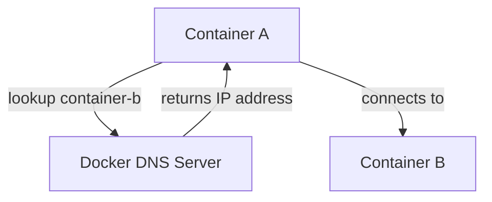

# Docker DNS

## Introduction

When working with Docker containers, especially in multi-container environments, having a reliable way for containers to find and communicate with each other is essential. This is where Docker's built-in DNS (Domain Name System) comes into play. Docker DNS provides automatic name resolution between containers, allowing them to communicate using container names instead of IP addresses, which can change frequently in dynamic container environments.

In this guide, we'll explore how Docker DNS works, how containers resolve hostnames, and how to configure and troubleshoot DNS in Docker environments.

## How Docker DNS Works

Docker implements an embedded DNS server that provides name resolution services to containers. When you create a Docker network (other than the default bridge network), Docker automatically configures a DNS server for that network.

Here's how it works at a high level:



When a container tries to communicate with another container using its name, the following happens:

1. The container sends a DNS query to the Docker DNS server
2. The Docker DNS server looks up the name in its records
3. If found, it returns the IP address of the target container
4. The original container can now connect to the target container using the IP address

## Docker DNS Resolution Rules

Docker follows specific rules for DNS resolution:

- Containers on user-defined networks can resolve each other by name or alias
- Containers on the default bridge network can't resolve each other by name unless you use the `--link` option (though this is legacy and not recommended)
- The Docker DNS server always resolves the container's hostname to its IP address
- External DNS queries are forwarded to the DNS servers configured on the Docker host

## Creating a Network with DNS

Let's create a simple example to demonstrate Docker DNS in action:

```bash
# Create a user-defined bridge network
docker network create my-network

# Run two containers on this network
docker run -d --name container1 --network my-network nginx
docker run -d --name container2 --network my-network nginx

# Connect to container1 and ping container2 by name
docker exec -it container1 ping container2
```

**Output:**
```
PING container2 (172.18.0.3): 56 data bytes
64 bytes from 172.18.0.3: icmp_seq=0 ttl=64 time=0.114 ms
64 bytes from 172.18.0.3: icmp_seq=1 ttl=64 time=0.118 ms
```

As you can see, `container1` can resolve and ping `container2` using just its name, without needing to know its IP address.

## Custom DNS Configuration

Docker allows you to customize DNS settings for your containers:

### Setting Custom DNS Servers

You can configure containers to use specific DNS servers:

```bash
# Run a container with custom DNS servers
docker run -d --name custom-dns --dns 8.8.8.8 --dns 8.8.4.4 nginx
```

This configures the container to use Google's public DNS servers.

### DNS Search Domains

You can also set DNS search domains:

```bash
docker run -d --name search-domain --dns-search example.com nginx
```

With this setting, if you try to access a host called `db`, Docker will first try to resolve `db`, and if that fails, it will try `db.example.com`.

## Docker Compose and DNS

When using Docker Compose, DNS resolution works automatically for services defined in the same `docker-compose.yml` file. Services can reach each other by their service names.

Here's an example `docker-compose.yml` file demonstrating this:

```yaml
version: '3'
services:
  web:
    image: nginx
    ports:
      - "8080:80"
  
  db:
    image: postgres
    environment:
      POSTGRES_PASSWORD: example
  
  app:
    image: my-app
    depends_on:
      - web
      - db
```

In this setup, the `app` service can connect to the `db` service using the hostname `db` and to the `web` service using the hostname `web`.

## Troubleshooting Docker DNS

If you're having issues with DNS resolution in Docker, here are some troubleshooting steps:

### 1. Check container DNS settings

```bash
docker exec container1 cat /etc/resolv.conf
```

**Output:**
```
nameserver 127.0.0.11
options ndots:0
```

The nameserver `127.0.0.11` is Docker's embedded DNS server.

### 2. Test DNS resolution

```bash
docker exec container1 nslookup container2
```

**Output:**
```
Server:    127.0.0.11
Address 1: 127.0.0.11

Name:      container2
Address 1: 172.18.0.3
```

### 3. Check network configuration

```bash
docker network inspect my-network
```

This will show all the containers connected to the network and their IP addresses.

### 4. DNS debug tools

Install DNS debugging tools in your container:

```bash
docker exec -it container1 sh -c "apt-get update && apt-get install -y dnsutils"
docker exec -it container1 dig container2
```

## Advanced DNS Features

### Custom `/etc/hosts` Entries

You can add custom host entries to a container:

```bash
docker run -d --name custom-hosts --add-host db.example.com:192.168.1.2 nginx
```

This adds an entry for `db.example.com` to the container's `/etc/hosts` file.

### DNS Round-Robin

Docker supports DNS round-robin, where multiple containers can be accessed through a single DNS name:

```bash
# Create a network
docker network create my-network

# Run multiple containers with the same network alias
docker run -d --name web1 --network my-network --network-alias webserver nginx
docker run -d --name web2 --network my-network --network-alias webserver nginx

# Test DNS round-robin
docker run --rm --network my-network appropriate/curl -s http://webserver/
```

Multiple requests to the hostname `webserver` will be distributed among the containers sharing that alias.

## Docker DNS and Container Restart

When a container restarts, it may receive a different IP address. Docker DNS automatically updates its records, so you can still reach the container by its name, which is another advantage of using DNS instead of hardcoded IP addresses.

## Practical Example: Multi-tier Application

Let's build a practical example with a web server, API, and database:

```bash
# Create a network
docker network create app-network

# Start a database
docker run -d --name db --network app-network \
  -e POSTGRES_PASSWORD=password \
  postgres

# Start an API service
docker run -d --name api --network app-network \
  -e DB_HOST=db \
  my-api-image

# Start a web server
docker run -d --name web --network app-network \
  -e API_URL=http://api:8000 \
  -p 80:80 \
  my-web-image
```

In this example:
- The web container connects to the API using the hostname `api`
- The API container connects to the database using the hostname `db`
- No IP addresses are hardcoded, making the setup resilient to container restarts or recreations

## Docker DNS Caching

Docker's embedded DNS server caches DNS responses, which can improve performance but might also cause issues if hostnames are being reused for different containers quickly.

If you need to clear the DNS cache, you usually need to restart the container:

```bash
docker restart container1
```

## Summary

Docker DNS is a powerful feature that simplifies container networking by allowing containers to discover and communicate with each other using names instead of IP addresses. Key points to remember:

- Docker provides an embedded DNS server for user-defined networks
- Containers on the same user-defined network can resolve each other by name
- The default bridge network doesn't support automatic name resolution
- Custom DNS servers, search domains, and `/etc/hosts` entries can be configured
- DNS round-robin allows for simple load balancing

By understanding and properly using Docker DNS, you can build more resilient containerized applications that don't depend on hardcoded IP addresses and can automatically adapt to changes in the container environment.

## Additional Resources

For further learning:

- Experiment with creating complex multi-container applications using Docker Compose
- Learn how to implement service discovery in larger environments using tools like Consul or etcd
- Practice debugging DNS issues in containers using tools like `dig`, `nslookup`, and `ping`

## Exercises

1. Create a user-defined bridge network and launch multiple containers. Practice connecting between them using their names.
2. Set up a round-robin DNS configuration with multiple web servers behind a common alias.
3. Configure a container to use custom DNS servers and verify the configuration works.
4. Build a three-tier application (web, api, database) using Docker DNS for service discovery.