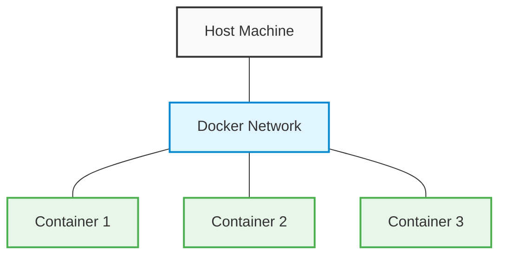
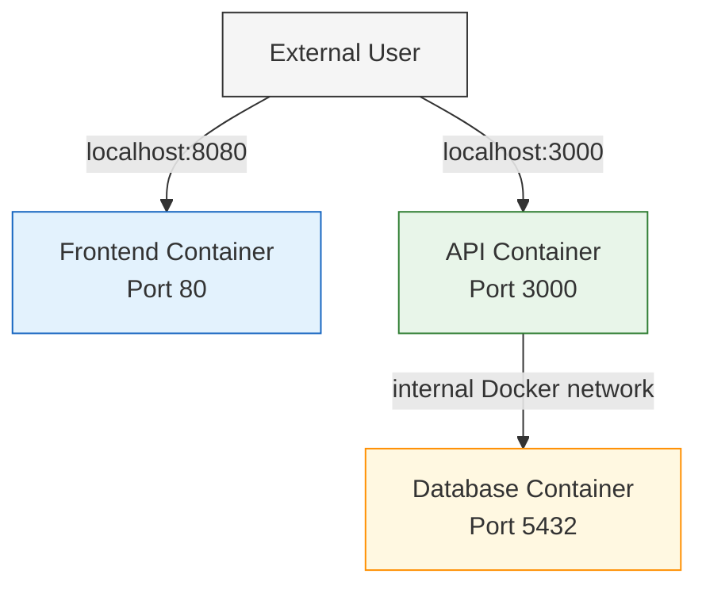

# Docker Port Mapping

## Introduction

When working with Docker containers, one of the fundamental concepts you'll need to understand is **port mapping**. Containers run in isolated network environments by default, meaning services running inside a container (like web servers, databases, or APIs) aren't accessible from outside the container without explicit configuration. This is where port mapping comes in.

Port mapping allows you to create a connection between a port on your host machine and a port inside your Docker container. This enables external applications or users to access services running inside your containers, making it a crucial component of Docker networking.

## Understanding Container Isolation

Before diving into port mapping, let's understand why it's necessary:



By default, Docker creates a private virtual network for each container. This isolation provides security and prevents port conflicts, but it also means that:

- Services inside the container can't be accessed from outside
- Containers can communicate with each other, but through Docker's internal networking
- External systems can't directly interact with container services

## Basic Port Mapping Syntax

The basic syntax for port mapping in Docker uses the `-p` or `--publish` flag:

```bash
docker run -p HOST_PORT:CONTAINER_PORT image_name
```

Let's break down what this means:

- `HOST_PORT`: The port on your local machine (the Docker host)
- `CONTAINER_PORT`: The port inside the container where your application is listening
- `image_name`: The Docker image you want to run

## Simple Port Mapping Example

Let's start with a basic example using Nginx, a popular web server:

```bash
# Run an Nginx container and map port 8080 on the host to port 80 in the container
docker run -p 8080:80 nginx
```

**What happens:**
1. Docker pulls the Nginx image (if not already available locally)
2. Starts a container running Nginx, which listens on port 80 inside the container
3. Maps port 8080 on your host machine to port 80 in the container

**Result:** You can now access the Nginx welcome page by opening a web browser and navigating to `http://localhost:8080`.

## Multiple Port Mappings

A single container can have multiple port mappings. This is useful when your container runs multiple services:

```bash
# Run a container with multiple exposed ports
docker run -p 8080:80 -p 8443:443 nginx
```

This maps:
- Host port 8080 → Container port 80 (HTTP)
- Host port 8443 → Container port 443 (HTTPS)

## Mapping to Specific IP Addresses

By default, port mappings bind to all network interfaces (0.0.0.0). You can specify which interface to bind to:

```bash
# Map to specific IP address
docker run -p 127.0.0.1:8080:80 nginx
```

This only allows connections from the local machine (localhost) to port 8080.

## Random Port Assignment

If you don't care which host port is used, Docker can assign one randomly:

```bash
# Let Docker assign a random available port
docker run -p 80 nginx
```

To find out which port was assigned, use:

```bash
docker ps
```

Output will include something like:
```
CONTAINER ID   IMAGE   ...   PORTS                  
1a2b3c4d5e6f   nginx   ...   0.0.0.0:49153->80/tcp  
```

This shows that port 80 in the container is mapped to port 49153 on the host.

## Port Mapping in Docker Compose

When working with multiple containers, Docker Compose simplifies port mapping. Here's an example `docker-compose.yml` file:

```yaml
version: '3'
services:
  webapp:
    image: nginx
    ports:
      - "8080:80"
  api:
    image: node:14
    ports:
      - "3000:3000"
  database:
    image: postgres
    ports:
      - "5432:5432"
```

This sets up three containers with appropriate port mappings.

## Port Ranges

You can map a range of ports using the following syntax:

```bash
# Map a range of ports
docker run -p 8000-8010:8000-8010 image_name
```

This maps each port in the range 8000-8010 on the host to the corresponding port in the container.

## Viewing Port Mappings

To see the port mappings for running containers:

```bash
docker ps
```

For more detailed information about a specific container:

```bash
docker port container_name_or_id
```

Example output:
```
80/tcp -> 0.0.0.0:8080
```

## Port Mapping vs. Exposing Ports

There are two related but different concepts in Docker networking:

1. **Exposing ports** (`EXPOSE` in Dockerfile or `--expose` flag): Documents which ports a container uses, but doesn't actually map them to the host.

2. **Publishing/mapping ports** (`-p` flag): Actually maps container ports to host ports.

In a Dockerfile, you might see:

```dockerfile
EXPOSE 80
```

This simply documents that the container uses port 80, but doesn't make it accessible from outside. You still need to use `-p` when running the container to actually map the port.

## Common Use Cases

### Web Application Development

```bash
# Run a Node.js application
docker run -p 3000:3000 my-node-app
```

This makes your Node.js application (listening on port 3000 inside the container) accessible at `http://localhost:3000`.

### Database Containers

```bash
# Run MongoDB with port mapping
docker run -p 27017:27017 mongo
```

Your local applications can now connect to MongoDB using `mongodb://localhost:27017`.

### Microservices Architecture

In a microservices setup, you might have multiple containers communicating with each other:



## Security Considerations

Port mapping opens access to your container services, so consider these security best practices:

1. **Map only necessary ports**: Don't expose ports that don't need external access
2. **Use specific IP bindings**: Bind to 127.0.0.1 for services that only need local access
3. **Use non-standard ports**: Map internal standard ports to non-standard external ports
4. **Implement proper authentication**: Don't rely solely on port security

## Troubleshooting Port Mapping Issues

### Port Already In Use

Error: `Bind for 0.0.0.0:8080 failed: port is already allocated`

Solution:
- Use a different host port
- Find and stop the process using that port:
  ```bash
  # On Linux/Mac
  sudo lsof -i :8080
  
  # On Windows
  netstat -ano | findstr :8080
  ```

### Container Service Not Listening

If you've mapped a port but can't connect:
1. Verify the service inside the container is running
2. Check it's listening on the correct interface (0.0.0.0 not 127.0.0.1)
3. Ensure no firewall is blocking the connection

## Summary

Port mapping is a fundamental Docker networking concept that connects container services to the outside world. With the `-p` flag, you can create bridges between your host machine and containerized applications, allowing for flexible, isolated, and portable development environments.

The key points to remember:
- Use `-p HOST_PORT:CONTAINER_PORT` to map ports
- Containers are isolated by default, and port mapping is required for external access
- Multiple port mappings are possible for a single container
- Docker Compose simplifies port mapping for multi-container applications
- Consider security implications when exposing container ports

## Exercises

1. Run an Nginx container and map it to port 8080. Access it through your browser.
2. Create a Docker Compose file that runs both a web application and a database with appropriate port mappings.
3. Experiment with binding to specific IP addresses and see how it affects accessibility.
4. Try mapping a random port and then use Docker commands to discover which port was assigned.

## Additional Resources

- [Docker Official Documentation on Network Containers](https://docs.docker.com/network/)
- [Docker Compose Networking](https://docs.docker.com/compose/networking/)
- [Docker Network Command Reference](https://docs.docker.com/engine/reference/commandline/network/)