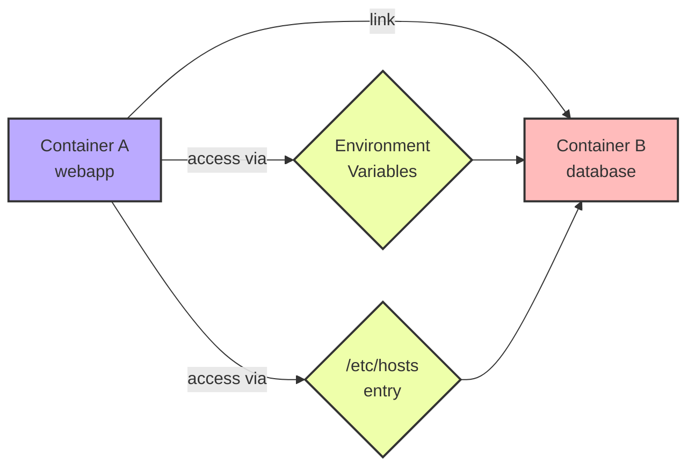

# Docker Link

## Introduction

Docker Link is a legacy feature in Docker that allows containers to communicate with each other. Before the introduction of Docker networks, linking was the primary way to enable container-to-container communication. While Docker now recommends using networks instead of links, understanding this concept is valuable for working with older Docker setups and for grasping the evolution of Docker networking concepts.

:::caution
Docker Link is now considered a legacy feature. For new applications, it's recommended to use Docker networks instead. Docker Link will eventually be removed from future Docker versions.
:::

## What is Docker Link?

Docker Link creates a secure channel between containers that allows them to communicate with each other without exposing ports to the outside world. When you link containers:

1. The source container's information is injected into the target container
2. Environment variables with connection details are created in the target container
3. Host file entries are added to enable hostname-based communication

Think of a link as a private tunnel between containers, where one container can access services provided by another container without making those services publicly accessible.

## Basic Syntax

```bash
docker run --link <source-container>:<alias> <image>
```

Where:
- `--link` is the flag that enables linking
- `<source-container>` is the name of the container you want to connect to
- `<alias>` is the name that the target container will use to reference the source container
- `<image>` is the Docker image you want to run

## How Docker Link Works

Let's understand Docker Link with a step-by-step explanation:

### 1. Creating a Source Container

First, let's create a container that will be our source (the one providing a service):

```bash
docker run -d --name database -e POSTGRES_PASSWORD=mysecretpassword postgres
```

This command creates a PostgreSQL database container named "database".

### 2. Linking Another Container to the Source

Now, let's create another container and link it to our database container:

```bash
docker run -d --name webapp --link database:db nginx
```

Here, we've created an nginx container named "webapp" and linked it to the "database" container with the alias "db".

### 3. What Happens During Linking

When you create a link:

1. **Environment Variables**: Docker creates environment variables in the target container with information about the source container
2. **Hosts File Entry**: Docker adds an entry to the `/etc/hosts` file in the target container
3. **Secure Communication**: Containers can communicate over a private network segment

Let's examine what this looks like inside the "webapp" container:

```bash
docker exec -it webapp bash

# Inside the container
env | grep DB_
cat /etc/hosts
```

You'll see environment variables like:

```
DB_PORT=tcp://172.17.0.2:5432
DB_PORT_5432_TCP=tcp://172.17.0.2:5432
DB_PORT_5432_TCP_ADDR=172.17.0.2
DB_PORT_5432_TCP_PORT=5432
DB_PORT_5432_TCP_PROTO=tcp
DB_NAME=/webapp/db
DB_ENV_POSTGRES_PASSWORD=mysecretpassword
...
```

And in the `/etc/hosts` file:

```
172.17.0.2    db 6d8eefeeb34r database
```

## Practical Example: Web Application with Database

Let's create a practical example of a web application that connects to a database using Docker Link:

### 1. Create a Database Container

```bash
docker run -d --name mysql-db \
  -e MYSQL_ROOT_PASSWORD=root \
  -e MYSQL_DATABASE=app_db \
  -e MYSQL_USER=app_user \
  -e MYSQL_PASSWORD=app_pass \
  mysql:5.7
```

### 2. Create a Web Application Container Linked to the Database

```bash
docker run -d --name web-app \
  -p 80:80 \
  --link mysql-db:mysql \
  php:7.4-apache
```

### 3. Connect to the Web Application Container and Install Dependencies

```bash
docker exec -it web-app bash

# Inside the container
apt-get update
apt-get install -y default-mysql-client
```

### 4. Test the Connection

```bash
# Inside the web-app container
mysql -h mysql -u app_user -papp_pass -e "SHOW DATABASES;"
```

Output:
```
+--------------------+
| Database           |
+--------------------+
| information_schema |
| app_db             |
+--------------------+
```

This confirms that our web application container can successfully connect to the MySQL database using the alias "mysql" that we defined in the link.

## Visualizing Docker Link

Here's a diagram showing how Docker Link works:



## Link vs Network: Understanding the Difference

Docker introduced networks as a more flexible and powerful replacement for links. Here's a comparison:

| Feature     | Docker Link                | Docker Network           |
|-------------|----------------------------|--------------------------|
| Direction   | One-way (source to target) | Bi-directional           |
| Scope       | Container-to-container     | Multiple containers      |
| DNS         | Limited (alias only)       | Automatic DNS resolution |
| Isolation   | Limited                    | Full network isolation   |
| Recommended | Legacy feature             | Current best practice    |

## Best Practices When Using Docker Link

If you need to use Docker Link in legacy systems:

1. **Use meaningful aliases**: Choose descriptive alias names that represent the service provided by the source container.
2. **Be aware of linking order**: Containers must exist before they can be linked to.
3. **Consider security implications**: Linked containers can access environment variables that might contain sensitive information.
4. **Plan migration to networks**: Have a plan to migrate to Docker networks as links are deprecated.

## Common Issues and Troubleshooting

### Issue: Cannot connect to the linked container

**Solution**: Verify that the source container is running and that you're using the correct alias:

```bash
docker ps
docker inspect --format='{{.State.Running}}' source-container
```

### Issue: Environment variables not accessible

**Solution**: Environment variables are only injected at container creation time. If you restart the source container with a new IP, the variables in the target container won't be updated. You'll need to recreate the target container.

### Issue: Service in linked container not starting fast enough

**Solution**: Implement a wait script or use a tool like `wait-for-it.sh` to ensure services are ready:

```bash
FROM php:7.4-apache
COPY wait-for-it.sh /usr/local/bin/
RUN chmod +x /usr/local/bin/wait-for-it.sh
CMD ["wait-for-it.sh", "mysql:3306", "--", "apache2-foreground"]
```

## Summary

Docker Link was an early solution for container-to-container communication in Docker. While it's now considered a legacy feature in favor of Docker networks, understanding links provides valuable insight into Docker's evolution and can be necessary when working with older Docker deployments.

Key takeaways:
- Docker Link creates a secure channel between containers
- It injects environment variables and adds host entries for communication
- It's a one-way connection from target to source
- Docker networks are the recommended replacement for links

## Additional Resources

To further your understanding of Docker networking:

1. **Official Docker Documentation**: Explore the Docker documentation on networking at docs.docker.com
2. **Docker Compose**: Learn how to define complex applications with multiple linked services
3. **Docker Networks**: Master the current recommended approach to container networking

## Exercises

1. Create a WordPress container linked to a MySQL database container and verify the connection.
2. Compare the environment variables created in a linked container with those in containers on the same network.
3. Create a three-tier application with web, application, and database containers using both linking and networks, then compare the approaches.
4. Write a shell script that waits for a linked service to be ready before starting the dependent application.