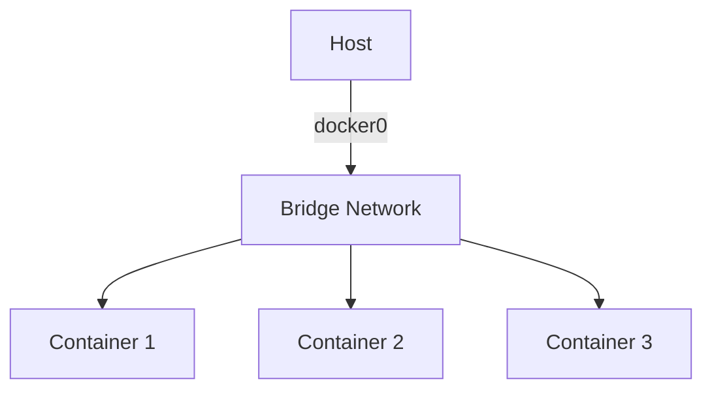
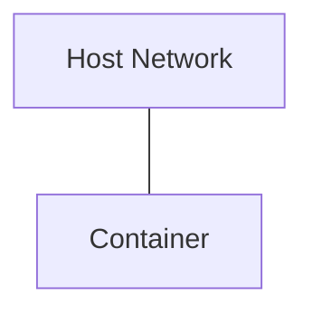
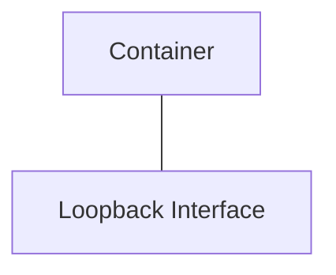
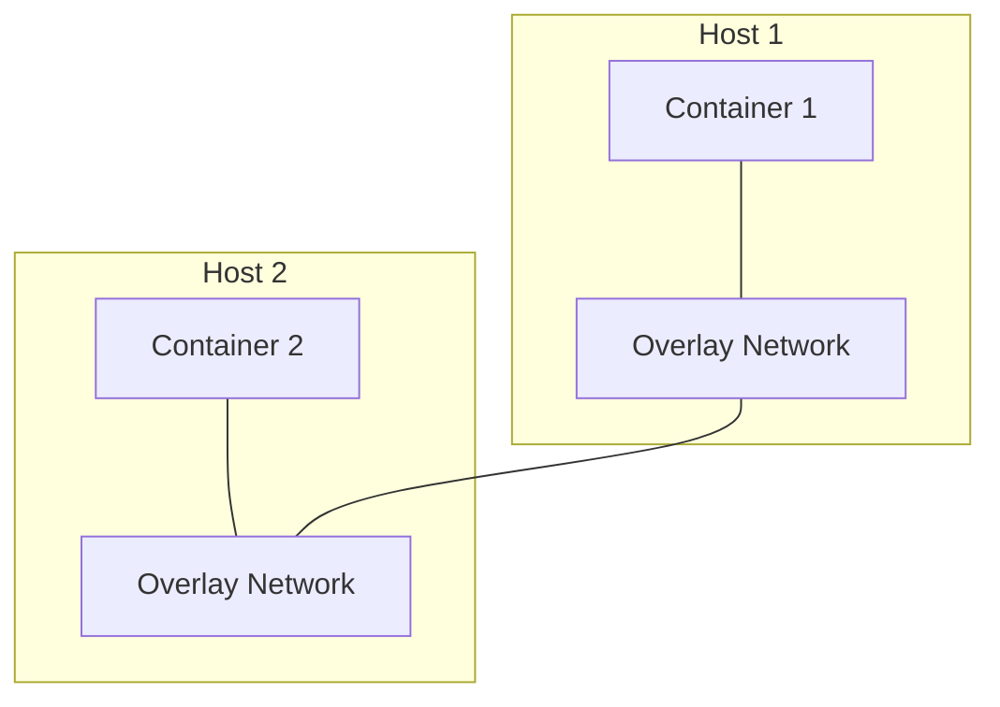
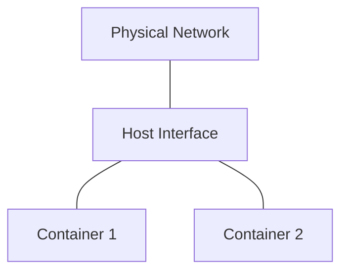
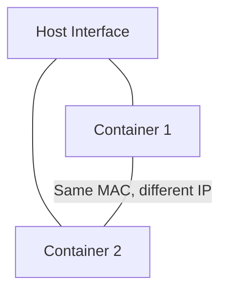

# Docker Network Drivers

## Introduction

Docker networking enables communication between containers and with the outside world. At the heart of Docker's networking capabilities are **network drivers**, which determine how containers communicate within and across Docker hosts. Understanding these drivers is essential for creating effective container deployments.

In this guide, we'll explore the different network drivers in Docker, when to use each one, and provide practical examples to help you implement them in your projects.

## What are Docker Network Drivers?

Docker network drivers are plugins that provide core networking functionality in Docker. Each driver offers different capabilities and is suitable for specific use cases. Docker includes several built-in network drivers, and third-party plugins can extend this functionality further.

Think of network drivers as different modes of transportation - just as you would choose a car, train, or plane depending on your journey, you select a Docker network driver based on your networking requirements.

## Types of Docker Network Drivers

Docker provides the following built-in network drivers:

1. **Bridge** (default)
2. **Host**
3. **None**
4. **Overlay**
5. **Macvlan**
6. **IPvlan**

Let's explore each of these in detail.

## Bridge Network Driver

The bridge driver creates a private network internal to the host. Containers on this network can communicate with each other, while remaining isolated from containers not connected to the same bridge network.

### How It Works

The bridge driver creates a virtual bridge on the host, typically named `docker0`. Each container connected to this bridge gets its own interface, IP address, and subnet.



### When to Use

- Development environments
- When you need isolated networks on a single host
- When running standalone containers that need to communicate

### Example: Creating and Using a Bridge Network

Let's create a custom bridge network and connect containers to it:

```bash
# Create a custom bridge network
docker network create --driver bridge my_bridge_network

# View the network
docker network inspect my_bridge_network

# Run containers on this network
docker run -d --name container1 --network my_bridge_network nginx
docker run -d --name container2 --network my_bridge_network nginx

# Test connectivity between containers
docker exec container1 ping container2
```

Output:
```
PING container2 (172.18.0.3): 56 data bytes
64 bytes from 172.18.0.3: icmp_seq=0 ttl=64 time=0.116 ms
64 bytes from 172.18.0.3: icmp_seq=1 ttl=64 time=0.139 ms
```

Notice that containers on the same bridge network can communicate using container names as hostnames.

## Host Network Driver

The host driver removes network isolation between the container and the Docker host. Containers using this driver share the host's networking namespace.

### How It Works

Instead of creating a separate network namespace for the container, Docker uses the host's network stack directly. This means the container shares the host's IP address and port space.



### When to Use

- When you need maximum performance
- When container networking should not be isolated from the host
- When the container needs to access a specific host interface

### Example: Using the Host Network

```bash
# Run an nginx container with the host network
docker run -d --name host_nginx --network host nginx

# Check that it's using the host's network
curl localhost:80
```

Output (if nginx is running correctly):
```
<!DOCTYPE html>
<html>
<head>
<title>Welcome to nginx!</title>
...
</html>
```

Note: When using the host network driver, you don't need to map ports with `-p` because the container shares the host's ports directly.

## None Network Driver

The none driver gives a container its own network namespace, but doesn't configure any interfaces. The container has only a loopback interface but no external connectivity.

### How It Works

This driver completely isolates the container's network, providing it with only a loopback interface.



### When to Use

- When you need complete network isolation
- For containers that don't need network access
- When custom networking will be set up later

### Example: Using the None Network

```bash
# Run a container with no network
docker run -d --name no_network --network none alpine sleep 1000

# Verify it has no external connectivity
docker exec no_network ping 8.8.8.8
```

Output:
```
ping: bad address '8.8.8.8'
```

## Overlay Network Driver

The overlay driver creates a distributed network among multiple Docker daemon hosts. It enables swarm services and containers to communicate securely across hosts.

### How It Works

Overlay networks use the VXLAN protocol to encapsulate network traffic, allowing containers on different hosts to communicate as if they were on the same network.



### When to Use

- In Docker Swarm mode
- For multi-host networking
- When containers need to communicate across hosts

### Example: Creating an Overlay Network

First, initialize a swarm:

```bash
# Initialize Docker Swarm on the first node
docker swarm init --advertise-addr <MANAGER-IP>

# Create an overlay network
docker network create --driver overlay my_overlay_network

# Create a service using this network
docker service create --name my_service --network my_overlay_network --replicas 2 nginx
```

Containers started by this service can communicate with each other across hosts seamlessly.

## Macvlan Network Driver

The macvlan driver allows you to assign a MAC address to a container, making it appear as a physical device on your network. It gives the container direct access to the physical network.

### How It Works

Macvlan assigns a MAC address to containers and maps them to a parent host interface, allowing containers to be directly on the physical network.



### When to Use

- When containers need to be on the same network as the physical host
- For applications that expect direct network access
- When migrating from VMs with minimal changes

### Example: Creating a Macvlan Network

```bash
# Identify the parent interface (e.g., eth0)
ip addr

# Create a macvlan network
docker network create --driver macvlan \
  --subnet=192.168.1.0/24 \
  --gateway=192.168.1.1 \
  -o parent=eth0 my_macvlan_network

# Run a container on this network
docker run --network my_macvlan_network --ip=192.168.1.10 -d nginx
```

This container will now be directly accessible on your physical network at 192.168.1.10.

## IPvlan Network Driver

Similar to macvlan, the IPvlan driver gives containers their own IP address. However, instead of assigning a unique MAC address to each container, IPvlan shares the MAC address of the parent interface among all containers.

### How It Works

IPvlan uses the parent interface's MAC address but assigns unique IP addresses to containers.



### When to Use

- When you're limited by the number of MAC addresses allowed
- For large-scale deployments
- When you want to save on network overhead

### Example: Creating an IPvlan Network

```bash
# Create an IPvlan network in L2 mode
docker network create --driver ipvlan \
  --subnet=192.168.1.0/24 \
  --gateway=192.168.1.1 \
  -o parent=eth0 \
  -o ipvlan_mode=l2 my_ipvlan_network

# Run a container on this network
docker run --network my_ipvlan_network -d nginx
```

## Comparing Network Drivers

Here's a quick comparison of the network drivers to help you choose the right one for your use case:

| Driver | Isolation | Multiple Hosts | Performance | Use Case |
|--------|-----------|----------------|------------|----------|
| Bridge | Container | No | Good | Single-host development |
| Host | None | No | Excellent | High-performance applications |
| None | Complete | No | N/A | Security-focused containers |
| Overlay | Container | Yes | Good | Multi-host production |
| Macvlan | Network | No | Excellent | Physical network integration |
| IPvlan | Network | No | Excellent | MAC-limited environments |

## Working with Docker Network Drivers in Docker Compose

Docker Compose makes it easy to define networks and attach services to them. Here's an example `docker-compose.yml` file showing how to use different network drivers:

```yaml
version: '3'

networks:
  frontend:
    driver: bridge
  backend:
    driver: bridge
  management:
    driver: host

services:
  web:
    image: nginx
    networks:
      - frontend
  
  api:
    image: node:14
    networks:
      - frontend
      - backend
  
  database:
    image: mysql:8
    networks:
      - backend
  
  monitoring:
    image: grafana/grafana
    networks:
      - management
```

## Common Networking Commands

Here are some useful Docker commands for working with networks:

```bash
# List all networks
docker network ls

# Inspect a network
docker network inspect <network-name>

# Create a network
docker network create --driver <driver-type> <network-name>

# Connect a container to a network
docker network connect <network-name> <container-name>

# Disconnect a container from a network
docker network disconnect <network-name> <container-name>

# Remove a network
docker network rm <network-name>

# Remove all unused networks
docker network prune
```

## Troubleshooting Docker Networking

### Issue: Containers Cannot Communicate

1. Check if containers are on the same network:
```bash
docker network inspect <network-name>
```

2. Verify DNS resolution:
```bash
docker exec <container-name> ping <other-container>
```

3. Check firewall rules on the host:
```bash
sudo iptables -L
```

### Issue: Cannot Access Container from Host

1. Ensure ports are published:
```bash
docker run -p <host-port>:<container-port> <image>
```

2. Check if the container is running:
```bash
docker ps
```

## Summary

Docker network drivers provide flexible networking options for containers, allowing you to choose the right level of isolation, performance, and connectivity for your specific use cases.

- **Bridge**: Default driver, provides isolation while allowing containers to communicate
- **Host**: Shares the host's network namespace for maximum performance
- **None**: Provides complete network isolation
- **Overlay**: Enables multi-host networking for swarm services
- **Macvlan**: Makes containers appear as physical devices on your network
- **IPvlan**: Similar to Macvlan but uses the parent interface's MAC address

Understanding these drivers and their appropriate use cases will help you design more effective containerized applications with proper network architecture.

## Additional Resources

- [Docker Networking Documentation](https://docs.docker.com/network/)
- [Docker Compose Networking](https://docs.docker.com/compose/networking/)
- [Docker Swarm Networking](https://docs.docker.com/engine/swarm/networking/)

## Exercises

1. Create a custom bridge network and connect two containers to it. Verify they can communicate using container names.

2. Run a web server using the host network driver and access it from your browser.

3. Create an overlay network in swarm mode and deploy a multi-service application that communicates across this network.

4. Set up a macvlan network and configure a container with a static IP address from your physical network.

5. Create a Docker Compose file that defines multiple networks with different drivers and connects services appropriately.