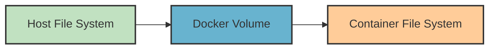

# Docker Volumes

## Introduction

When working with Docker containers, one of the first challenges you'll encounter is managing data. By default, any data created within a container is lost when that container is removed. This is because containers are designed to be ephemeral and stateless by nature.

Docker volumes solve this problem by providing a way to persist data generated by and used by Docker containers. In this guide, we'll explore everything you need to know about Docker volumes - from basic concepts to practical implementations.

## What Are Docker Volumes?

Docker volumes are the preferred mechanism for persisting data generated by and used by Docker containers. While Docker containers are ephemeral (temporary), volumes allow you to store data outside the container lifecycle.



### Key Benefits of Docker Volumes

- **Data Persistence**: Data remains even after containers are removed
- **Data Sharing**: Multiple containers can mount the same volume
- **Performance**: Volumes are more efficient than bind mounts
- **Portability**: Volumes work the same across different operating systems
- **Manageability**: Docker provides commands to manage volumes directly

## Types of Docker Volumes

Docker offers several types of volumes to fit different use cases:

### 1. Named Volumes

Named volumes are the most convenient type of volume. Docker manages where they are stored on disk, and you only need to remember the name.

```bash
# Create a named volume
docker volume create my_data

# Run a container with the named volume
docker run -v my_data:/app/data nginx
```

### 2. Anonymous Volumes

Anonymous volumes are similar to named volumes, but Docker assigns a random name. They're useful for temporary storage that should outlive a container.

```bash
# Docker creates and manages an anonymous volume
docker run -v /app/data nginx
```

### 3. Host Bind Mounts

Bind mounts map a specific path on the host to a path in the container. These provide more control but are less portable.

```bash
# Mount a specific host directory to the container
docker run -v /host/path:/container/path nginx
```

## Creating and Managing Volumes

Let's look at how to work with Docker volumes in practice.

### Creating Volumes

You can create a volume explicitly before using it:

```bash
docker volume create my_volume
```

Output:
```
my_volume
```

To list all volumes:

```bash
docker volume ls
```

Output:
```
DRIVER    VOLUME NAME
local     my_volume
```

### Using Volumes with Containers

Here's how to start a container with a volume:

```bash
docker run -d \
  --name my_container \
  -v my_volume:/app/data \
  nginx
```

This mounts the `my_volume` volume to the `/app/data` directory in the container.

### Inspecting Volumes

To see detailed information about a volume:

```bash
docker volume inspect my_volume
```

Output:
```json
[
    {
        "CreatedAt": "2023-04-12T09:12:36Z",
        "Driver": "local",
        "Labels": {},
        "Mountpoint": "/var/lib/docker/volumes/my_volume/_data",
        "Name": "my_volume",
        "Options": {},
        "Scope": "local"
    }
]
```

### Removing Volumes

To remove a volume:

```bash
docker volume rm my_volume
```

To remove all unused volumes:

```bash
docker volume prune
```

## Practical Examples

Let's explore some common use cases for Docker volumes.

### Example 1: Persistent Database Storage

When running a database in a container, you'll want to persist the data:

```bash
# Create a volume for database files
docker volume create postgres_data

# Run PostgreSQL with the volume
docker run -d \
  --name my_postgres \
  -e POSTGRES_PASSWORD=mysecretpassword \
  -v postgres_data:/var/lib/postgresql/data \
  postgres:14
```

Now, even if you remove and recreate the PostgreSQL container, your data will be preserved in the `postgres_data` volume.

### Example 2: Sharing Data Between Containers

You can mount the same volume in multiple containers:

```bash
# Container 1 writes to the shared volume
docker run -d \
  --name writer \
  -v shared_data:/shared \
  ubuntu bash -c "echo 'Hello from container 1' > /shared/file.txt && tail -f /dev/null"

# Container 2 reads from the shared volume
docker run -it \
  --name reader \
  -v shared_data:/shared \
  ubuntu cat /shared/file.txt
```

Output from the second container:
```
Hello from container 1
```

### Example 3: Development Environment

Volumes are perfect for development environments where you want to see code changes in real-time:

```bash
# Mount local code directory into a Node.js container
docker run -d \
  --name node_app \
  -v $(pwd):/app \
  -w /app \
  -p 3000:3000 \
  node:16 npm start
```

Any changes you make to your local code will immediately be available in the container.

## Volume Drivers

Docker supports various volume drivers that extend functionality:

- **local**: The default driver for local storage
- **nfs**: For mounting NFS shares
- **cifs**: For mounting CIFS/SMB shares
- **Third-party plugins**: For cloud storage, distributed storage, etc.

To use a specific driver:

```bash
docker volume create --driver=nfs \
  --opt o=addr=192.168.1.1,rw \
  --opt device=:/path/to/dir \
  my_nfs_volume
```

## Best Practices for Docker Volumes

1. **Use named volumes** for better readability and management
2. **Create volumes explicitly** before using them in containers
3. **Set appropriate permissions** for volume mount points
4. **Use volume labels** to organize and categorize volumes
5. **Regularly backup important volumes**
6. **Clean up unused volumes** with `docker volume prune`

## Data Backup and Restore

### Backing Up a Volume

To backup a volume:

```bash
docker run --rm \
  -v my_volume:/source \
  -v $(pwd):/backup \
  alpine tar czvf /backup/my_volume_backup.tar.gz -C /source .
```

### Restoring a Volume

To restore from a backup:

```bash
docker run --rm \
  -v my_volume:/target \
  -v $(pwd):/backup \
  alpine sh -c "tar xzvf /backup/my_volume_backup.tar.gz -C /target"
```

## Common Issues and Troubleshooting

### Permissions Problems

If your container can't write to a volume, it might be a permissions issue:

```bash
# Fix permissions by running a temporary container
docker run --rm \
  -v my_volume:/data \
  alpine chown -R 1000:1000 /data
```

### Volume Not Mounting Correctly

Check if the volume exists and is properly configured:

```bash
docker volume inspect my_volume
```

Also verify the container configuration:

```bash
docker inspect my_container | grep -A 10 Mounts
```

## Summary

Docker volumes provide a powerful way to manage persistent data in Docker containers. They solve the ephemeral nature of containers by allowing data to exist independently of container lifecycles.

In this guide, we covered:

- The concept and importance of Docker volumes
- Different types of volumes (named, anonymous, bind mounts)
- Creating and managing volumes
- Practical examples for real-world applications
- Volume drivers for extended functionality
- Best practices and troubleshooting tips

By mastering Docker volumes, you've taken a significant step toward building more robust and maintainable containerized applications.

## Exercises

1. Create a named volume and mount it to an Nginx container. Place an HTML file in the volume and verify it's being served.
2. Set up a MySQL container with a volume for data persistence. Add some data, then destroy and recreate the container to verify the data persists.
3. Create two containers that share the same volume. Experiment with having one container write data and the other read it.
4. Try using different volume drivers if available in your environment.
5. Implement a backup and restore process for a volume containing important data.

## Additional Resources

- [Docker Volume Documentation](https://docs.docker.com/storage/volumes/)
- [Docker Compose with Volumes](https://docs.docker.com/compose/compose-file/compose-file-v3/#volumes)
- [Container Storage Interface (CSI)](https://github.com/container-storage-interface/spec)