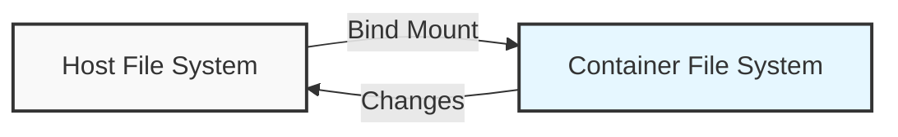

# Docker Bind Mounts

## Introduction

When working with Docker containers, you'll often need to share files between your host machine and the containers. Docker provides several options for managing data, and one of the most straightforward approaches is using **bind mounts**.

A bind mount is a direct mapping between a folder on your host machine and a folder inside a Docker container. Unlike volumes (which are managed by Docker), bind mounts provide a way to access and modify files on your host system directly from within a container.

## What Are Bind Mounts?

Bind mounts allow you to:

- Share files between your host and a container
- Edit source code on your host while running the application in a container
- Persist data even after a container is removed
- Access host system files from inside a container



## How Bind Mounts Work

With a bind mount, a file or directory on the host machine is mounted into a container. The file or directory is referenced by its absolute path on the host machine.

This differs from volumes, where the storage location is managed by Docker. Bind mounts depend on the host machine's filesystem and directory structure, making them less portable but more flexible for development scenarios.

## Creating a Bind Mount

You can create a bind mount when starting a container using the `-v` or `--mount` flag with the `docker run` command.

### Using the `-v` Flag (Older Syntax)

The `-v` flag takes the format: `-v <host-path>:<container-path>[:options]`

```bash
docker run -v /path/on/host:/path/in/container image_name
```

### Using the `--mount` Flag (Newer Syntax)

The `--mount` flag uses a key-value pair format which is more verbose but clearer:

```bash
docker run --mount type=bind,source=/path/on/host,target=/path/in/container image_name
```

Docker recommends using the `--mount` syntax for clarity and consistency with swarm services.

## Practical Examples

Let's explore some common use cases for bind mounts with practical examples.

### Example 1: Sharing a Web Application for Development

Imagine you're developing a simple web application and want to see your changes in real-time without rebuilding the container.

1. First, let's create a simple HTML file on our host machine:

```bash
mkdir -p ~/my-web-app
echo "<html><body><h1>Hello from bind mount!</h1></body></html>" > ~/my-web-app/index.html
```

2. Now, let's run an Nginx container and mount our local directory:

```bash
docker run -d --name web-server -p 8080:80 --mount type=bind,source=~/my-web-app,target=/usr/share/nginx/html nginx
```

3. If you navigate to `http://localhost:8080` in your browser, you'll see your HTML page.

4. Let's modify the file on our host:

```bash
echo "<html><body><h1>Updated content!</h1><p>Changes appear instantly with bind mounts.</p></body></html>" > ~/my-web-app/index.html
```

5. Refresh your browser, and you'll see the changes immediately, without restarting the container.

**Output:**
When you visit `http://localhost:8080` after the update, you'll see the new content rendered in your browser.

### Example 2: Database Data Persistence

Let's use a bind mount to persist MySQL database data:

```bash
mkdir -p ~/mysql-data
docker run -d --name mysql-db \
  -e MYSQL_ROOT_PASSWORD=my-secret-pw \
  --mount type=bind,source=~/mysql-data,target=/var/lib/mysql \
  mysql:8.0
```

Now, even if you remove and recreate the container, your database data will persist in the `~/mysql-data` directory.

### Example 3: Configuration Files

You can use bind mounts to provide configuration files to containers:

```bash
# Create a custom Nginx configuration
mkdir -p ~/nginx-conf
echo "server { listen 80; server_name localhost; location / { root /usr/share/nginx/html; index index.html; } }" > ~/nginx-conf/default.conf

# Run Nginx with the custom configuration
docker run -d --name nginx-custom -p 8080:80 \
  --mount type=bind,source=~/nginx-conf/default.conf,target=/etc/nginx/conf.d/default.conf,readonly \
  --mount type=bind,source=~/my-web-app,target=/usr/share/nginx/html \
  nginx
```

Notice the `readonly` option - this ensures the container can't modify the configuration file.

## Read-Only Bind Mounts

For security reasons, you might want to make a bind mount read-only to prevent a container from modifying host files. You can do this by adding `:ro` with the `-v` flag or `readonly` with the `--mount` flag:

```bash
# Using -v flag
docker run -v /path/on/host:/path/in/container:ro image_name

# Using --mount flag
docker run --mount type=bind,source=/path/on/host,target=/path/in/container,readonly image_name
```

## Bind Mounts vs. Volumes

Let's compare bind mounts with Docker volumes to understand when to use each:

| Feature | Bind Mounts | Volumes |
|---------|-------------|---------|
| Location | Any location on host | Docker managed location |
| Management | Manual | Docker managed |
| Portability | Less portable | More portable |
| Performance | Host-dependent | Optimized by Docker |
| Use case | Development, sharing files | Production data persistence |

## Common Gotchas and Troubleshooting

### File Permissions

A common issue with bind mounts is file permission problems. The user inside the container might have a different UID/GID than the user on the host, leading to permission denied errors.

**Solution:** You can address this by:

1. Changing the permissions on the host:

```bash
chmod -R 755 ~/my-web-app
```

2. Running the container with a specific user that matches your host user:

```bash
docker run -u $(id -u):$(id -g) --mount type=bind,source=~/my-web-app,target=/app image_name
```

### Path Does Not Exist

If the specified host path doesn't exist, Docker's behavior depends on which flag you use:

- With `-v`, Docker creates the directory if it doesn't exist
- With `--mount`, Docker returns an error if the directory doesn't exist

### SELinux Considerations

On systems with SELinux enabled (like Fedora, CentOS, RHEL), you might need to use the `:Z` or `:z` suffix with bind mounts:

```bash
docker run -v /path/on/host:/path/in/container:z image_name
```

- `:z` - allows sharing with multiple containers
- `:Z` - allows sharing with a single container

## Best Practices

1. **Use absolute paths** for host directories to avoid confusion.
2. **Be careful with write access** - use read-only mounts when possible.
3. **Avoid mounting system directories** like `/etc`, `/var`, etc., into containers.
4. **Consider security implications** - bind mounts can break container isolation.
5. **For production, prefer volumes** over bind mounts when possible.

## Summary

Bind mounts are a powerful feature in Docker that allow you to share files and directories between your host system and containers. They're particularly useful for development workflows, configuration files, and situations where you need direct access to host files.

While bind mounts are less portable than volumes, they provide flexibility that makes development and debugging much easier. Remember to consider security implications when using bind mounts, especially in production environments.

## Exercises

1. Create a bind mount for a Node.js application that automatically reflects code changes without rebuilding the container.
2. Set up a bind mount with read-only access for configuration files and read-write access for logs.
3. Compare the performance between a bind mount and a Docker volume when working with a database container.

## Additional Resources

- [Docker Official Documentation on Bind Mounts](https://docs.docker.com/storage/bind-mounts/)
- [Docker Storage Overview](https://docs.docker.com/storage/)
- [Best Practices for Using Docker Bind Mounts](https://docs.docker.com/develop/develop-images/dockerfile_best-practices/)