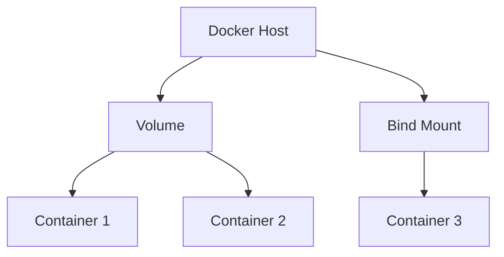

# Docker Volume Sharing

## Introduction

When working with Docker containers, one of the most important concepts to understand is how data is stored and shared. By default, any data created within a container is isolated and temporary - when the container is removed, so is the data. This is where **Docker volumes** come in, allowing you to persist data and share it between:

- The host system and containers
- Multiple containers
- Across container restarts

Volume sharing is essential for developing applications in containers, managing databases, and creating efficient Docker workflows. In this guide, we'll explore how to effectively share data using Docker volumes.

## Understanding Docker Volume Basics

Before diving into sharing, let's understand the core volume concepts:



Docker provides three main ways to manage data:

1. **Volumes**: Docker-managed data storage in the host filesystem
2. **Bind mounts**: Direct mapping between host and container directories
3. **tmpfs mounts**: Memory-only storage (not covered in this guide)

## Creating and Sharing Volumes Between Containers

### Creating a Named Volume

The first step is to create a named volume that can be shared:

```bash
docker volume create shared-data
```

You can verify it was created with:

```bash
docker volume ls
```

Output:
```
DRIVER    VOLUME NAME
local     shared-data
```

### Attaching a Volume to Multiple Containers

Now let's create two containers that share the same volume:

```bash
# Start the first container with the volume
docker run -d --name container1 --volume shared-data:/app/data alpine sh -c "while true; do sleep 1000; done"

# Start the second container with the same volume
docker run -d --name container2 --volume shared-data:/app/data alpine sh -c "while true; do sleep 1000; done"
```

### Testing the Shared Volume

Let's write data from one container and read it from another:

```bash
# Write data from container1
docker exec container1 sh -c "echo 'Hello from container1' > /app/data/test.txt"

# Read data from container2
docker exec container2 cat /app/data/test.txt
```

Output:
```
Hello from container1
```

This demonstrates that both containers can access the same file, proving the volume is shared between them.

## Sharing Data Between Host and Container

### Using Bind Mounts

Bind mounts allow you to directly mount a host directory into a container:

```bash
# Create a directory on host
mkdir -p ~/docker-host-data

# Write some data to the host directory
echo "This data comes from the host" > ~/docker-host-data/host-file.txt

# Mount the host directory to a container
docker run -it --rm -v ~/docker-host-data:/container-data alpine sh
```

Inside the container, you can access the host file:

```bash
# Inside the container
cat /container-data/host-file.txt
```

Output:
```
This data comes from the host
```

You can also create files from within the container that will persist on the host:

```bash
# Inside the container
echo "Created inside the container" > /container-data/container-file.txt
exit
```

After exiting, check the host directory:

```bash
cat ~/docker-host-data/container-file.txt
```

Output:
```
Created inside the container
```

## Volume Sharing in Docker Compose

For multi-container applications, Docker Compose makes volume sharing simpler:

```yaml
version: '3'

services:
  web:
    image: nginx:alpine
    volumes:
      - web-data:/usr/share/nginx/html
    ports:
      - "8080:80"

  backup:
    image: alpine
    volumes:
      - web-data:/backup/data
    command: sh -c "while true; do cp -r /backup/data /backup/$(date +%Y%m%d); sleep 86400; done"

volumes:
  web-data:
```

In this example:
- The `web-data` volume is defined once
- Both the `web` and `backup` services share the same volume
- The `web` service mounts it to serve content
- The `backup` service accesses the same data for backups

## Common Use Cases for Volume Sharing

### 1. Database Data Persistence

When running databases in Docker, persistent storage is critical:

```bash
docker run -d \
  --name postgres-db \
  -e POSTGRES_PASSWORD=mysecretpassword \
  -v postgres-data:/var/lib/postgresql/data \
  postgres:14
```

### 2. Development Environment

Share your code with a container for live development:

```bash
docker run -it --rm \
  -v $(pwd):/app \
  -w /app \
  node:16 \
  npm run dev
```

### 3. Web Server Content

Share content between a content management container and web server:

```bash
# Create a shared volume
docker volume create website-content

# Run a CMS container with the volume
docker run -d --name cms -v website-content:/content my-cms-image

# Run the web server with the same volume
docker run -d --name webserver -v website-content:/usr/share/nginx/html -p 80:80 nginx
```

## Volume Sharing Permissions and Ownership

When sharing volumes, permission issues can arise because:

1. The user inside the container may be different from the host user
2. Different containers may have different user IDs

### Fixing Permission Issues

You can address this by:

1. Setting specific user/group in your Dockerfile:

```dockerfile
FROM alpine:latest
RUN addgroup -g 1000 appgroup && adduser -u 1000 -G appgroup -D appuser
USER appuser
# Rest of your Dockerfile
```

2. Using the `--user` flag when running containers:

```bash
docker run -it --rm --user "$(id -u):$(id -g)" -v $(pwd):/app alpine sh
```

## Best Practices for Volume Sharing

1. **Use named volumes for persistent data**
   Named volumes are easier to manage than anonymous volumes.

2. **Use bind mounts for development**
   During development, bind mounting your code directory enables real-time changes.

3. **Consider volume drivers for production**
   In production, consider using volume drivers that support backups, encryption, etc.

4. **Be careful with ownership and permissions**
   Understand how user IDs map between containers and hosts.

5. **Document volume usage**
   Clearly document which volumes your containers use and why.

6. **Use read-only mounts when possible**
   If a container only needs to read data, mount volumes as read-only:

```bash
docker run -v shared-data:/data:ro alpine
```

## Advanced Volume Sharing Techniques

### Cross-Host Volume Sharing

For sharing volumes across multiple Docker hosts, you can use volume plugins like:

- Docker Volume Plugin for NFS
- REX-Ray
- Portworx

Example using NFS volume driver:

```bash
# Install the plugin
docker plugin install trajano/nfs-volume-plugin

# Create a volume using the driver
docker volume create --driver trajano/nfs-volume-plugin \
  --opt device=nfs.example.com:/path/to/share \
  nfs-volume

# Use the volume
docker run -v nfs-volume:/data alpine
```

### Volume Encryption

For sensitive data, you can use encrypted volumes:

```bash
# Using a third-party encrypted volume driver
docker volume create --driver crypt \
  --opt key=mysecretkey \
  encrypted-vol

docker run -v encrypted-vol:/secure-data alpine
```

## Troubleshooting Volume Sharing Issues

### 1. Volume Not Showing Updated Content

If changes from one container aren't visible in another, ensure both containers are mounting the same volume path:

```bash
# Check volume mounts
docker inspect -f '{{ .Mounts }}' container1
docker inspect -f '{{ .Mounts }}' container2
```

### 2. Permission Denied Errors

If you see permission errors when accessing volume data:

```bash
# Fix permissions on the volume
docker run --rm -v shared-data:/data alpine chmod -R 777 /data
```

### 3. Volume Not Persisting After Container Removal

Make sure you're using named volumes, not anonymous volumes:

```bash
# This creates an anonymous volume (data will be lost)
docker run -v /app/data alpine

# This uses a named volume (data will persist)
docker run -v named-volume:/app/data alpine
```

## Summary

Docker volume sharing is a powerful feature that allows you to:

- Share data between multiple containers
- Persist data beyond the lifecycle of containers
- Share files between your host and containers
- Create more flexible and maintainable container deployments

Understanding how to effectively use volumes is essential for production Docker deployments, especially for stateful applications like databases, content management systems, and applications that need to store user uploads or configuration.

## Additional Resources

- [Docker Volume Documentation](https://docs.docker.com/storage/volumes/)
- [Docker Compose Documentation](https://docs.docker.com/compose/compose-file/compose-file-v3/#volumes)
- [Docker Volume Plugins](https://docs.docker.com/engine/extend/plugins_volume/)

## Exercises

1. Create a setup with three containers sharing the same volume, and demonstrate data written from any container is accessible by all.

2. Set up a development environment for a web application where code is on your host but runs in a Docker container.

3. Create a backup system using volumes that automatically backs up a database container's data to the host system daily.

4. Configure a scenario with the correct permissions where a non-root user in a container can write to a shared volume.