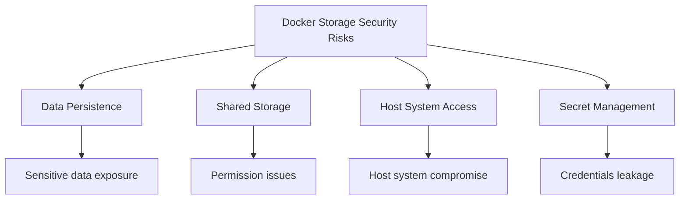

# Docker Storage Security

## Introduction

When working with Docker containers, storage security is often overlooked but critically important. Containers that access, process, or store data need proper security measures to prevent unauthorized access, data leaks, and potential breaches. In this guide, we'll explore essential Docker storage security practices that will help you protect your containerized applications and their data.

## Understanding Docker Storage Security Risks

Before diving into specific security measures, let's understand the potential risks associated with Docker storage:

1. **Data Persistence**: Containers are ephemeral by nature, but data often needs to persist. Insecure persistent storage can expose sensitive information.

2. **Shared Storage**: Multiple containers might access the same storage volumes, creating potential privacy and permission issues.

3. **Host System Access**: Improperly configured volumes can provide unwanted access to the host filesystem.

4. **Secret Management**: Storing credentials, API keys, and other secrets in container images or volumes without proper protection is a common risk.



## Volume Permission Management

### Setting Proper Permissions

One of the most fundamental aspects of Docker storage security is managing permissions correctly:

```bash
# Create volume with proper ownership
docker volume create --name secure_data

# Run container with specific user ID
docker run -d \
  --name secure_app \
  --mount source=secure_data,target=/data \
  --user 1000:1000 \
  my-application
```

The `--user` flag ensures the container runs with a specific user ID rather than root, limiting the potential damage if the container is compromised.

### Using Docker Volume Drivers

Volume drivers can provide additional security features:

```bash
# Create encrypted volume using a volume driver
docker volume create --driver=volumedriver-secrets \
  --opt encrypted=true \
  --name encrypted_data
```

Different volume drivers offer various security features like encryption, access controls, and auditing capabilities.

## Avoiding Sensitive Data in Images

### Use .dockerignore

A `.dockerignore` file helps prevent sensitive files from being included in your Docker images:

```
# Sample .dockerignore file
.env
*.key
*.pem
credentials.json
**/node_modules
**/.git
```

### Multistage Builds

Use multistage builds to keep sensitive build-time dependencies out of your final image:

```dockerfile
# Build stage
FROM node:14 AS build
WORKDIR /app
COPY package*.json ./
RUN npm install
COPY . .
RUN npm run build

# Production stage
FROM node:14-slim
WORKDIR /app
# Only copy what's needed for production
COPY --from=build /app/dist ./dist
COPY --from=build /app/package*.json ./
RUN npm install --only=production
USER node
CMD ["npm", "start"]
```

## Securing Bind Mounts

Bind mounts directly map a host directory to a container directory, which can pose security risks if not properly configured:

```bash
# Restrictive bind mount with read-only access
docker run -d \
  --name web_server \
  --mount type=bind,source=/host/config,target=/app/config,readonly \
  nginx
```

The `readonly` flag ensures the container cannot modify the files in the mounted directory.

## Managing Secrets

### Using Docker Secrets

Docker Swarm provides a secrets management feature:

```bash
# Create a secret
echo "my_database_password" | docker secret create db_password -

# Use the secret in a service
docker service create \
  --name secure_app \
  --secret db_password \
  --env DB_PASSWORD_FILE=/run/secrets/db_password \
  my-application
```

Secrets are mounted as files within the container, typically at `/run/secrets/<secret_name>`.

### Using Environment Variables Securely

```dockerfile
# AVOID: Exposing secrets in Dockerfile
FROM python:3.9
ENV API_KEY="super_secret_key"  # BAD PRACTICE!

# BETTER: Accept secrets at runtime
FROM python:3.9
CMD ["python", "app.py"]
```

Then run the container with:

```bash
docker run -d \
  --name api_client \
  -e API_KEY="super_secret_key" \
  api_client
```

Even better, use secret files:

```bash
docker run -d \
  --name api_client \
  --env-file ./secrets.env \
  api_client
```

## Implementing Storage Encryption

### Encrypted Volumes

For sensitive data, consider using encrypted volumes:

```bash
# Using Docker volume encryption plugins
docker volume create \
  --driver=cloudstor:aws \
  --opt encrypted=true \
  --opt key_id=your_kms_key_id \
  secure_volume
```

### Application-Level Encryption

Implement encryption within your application for sensitive data:

```python
from cryptography.fernet import Fernet

# Generate key
key = Fernet.generate_key()

# Create cipher
cipher = Fernet(key)

# Encrypt data
encrypted_data = cipher.encrypt(b"sensitive data")

# Write to volume
with open("/data/secure.dat", "wb") as f:
    f.write(encrypted_data)
```

## Best Practices for Docker Storage Security

1. **Minimal Permissions**: Always run containers with the least privileges needed.

```bash
docker run --user 1000:1000 --cap-drop=ALL my-app
```

2. **Read-Only Filesystem**: Make container filesystems read-only when possible.

```bash
docker run --read-only --tmpfs /tmp my-app
```

3. **Volume Lifecycle Management**: Properly manage the lifecycle of volumes with sensitive data.

```bash
# Remove volumes when they're no longer needed
docker volume rm secure_data
```

4. **Regular Security Audits**:

```bash
# Use Docker Bench for Security
docker run -it --net host --pid host --userns host --cap-add audit_control \
    -v /var/lib:/var/lib \
    -v /var/run/docker.sock:/var/run/docker.sock \
    -v /usr/lib/systemd:/usr/lib/systemd \
    -v /etc:/etc --label docker_bench_security \
    docker/docker-bench-security
```

5. **Use Content Trust**: Enable Docker Content Trust to ensure you're using verified images.

```bash
# Enable content trust for image pulls and pushes
export DOCKER_CONTENT_TRUST=1
```

## Practical Example: Secure Database Container

Let's put everything together in a real-world example of a secure database container:

```bash
# Create an encrypted volume
docker volume create --name db_data

# Run PostgreSQL with security best practices
docker run -d \
  --name secure_postgres \
  --mount source=db_data,target=/var/lib/postgresql/data \
  --user postgres \
  --cap-drop=ALL \
  --cap-add=CHOWN \
  --cap-add=DAC_OVERRIDE \
  --cap-add=SETGID \
  --cap-add=SETUID \
  -e POSTGRES_PASSWORD_FILE=/run/secrets/db_password \
  --secret db_password \
  postgres:13
```

This setup:
- Uses a dedicated volume for data persistence
- Runs as the postgres user (not root)
- Drops all capabilities and only adds back the minimum required
- Uses Docker secrets for the database password

## Troubleshooting Common Security Issues

### Fixing Permission Problems

If you encounter permission issues with volumes:

```bash
# Fix permissions on the host
sudo chown -R 1000:1000 /path/to/volume/data
```

### Identifying Exposed Secrets

Check if any secrets are exposed in your images:

```bash
# Scan for secrets in images
docker run --rm -v /var/run/docker.sock:/var/run/docker.sock \
  goodwithtech/dockle my-application:latest
```

## Summary

Docker storage security is a critical aspect of container security that requires careful attention. By implementing proper permission management, secure handling of sensitive data, encryption, and following best practices, you can significantly reduce the risk of security breaches in your containerized applications.

Remember these key points:
- Always use the principle of least privilege
- Never store secrets in Docker images
- Use volume permissions and encryption for sensitive data
- Regularly audit your Docker storage security

## Additional Resources

- [Docker Security Documentation](https://docs.docker.com/engine/security/)
- [CIS Docker Benchmark](https://www.cisecurity.org/benchmark/docker/)
- [Docker Security Cheat Sheet](https://cheatsheetseries.owasp.org/cheatsheets/Docker_Security_Cheat_Sheet.html)

## Exercises

1. Create a Docker Compose setup that implements proper volume security for a web application with a database.
2. Implement Docker secrets in a Swarm mode service and access them securely from your application.
3. Configure a volume with encryption and verify the data is properly protected.
4. Perform a security audit on your current Docker volumes and identify potential weaknesses.
5. Implement a secure backup strategy for your Docker volumes containing sensitive data.