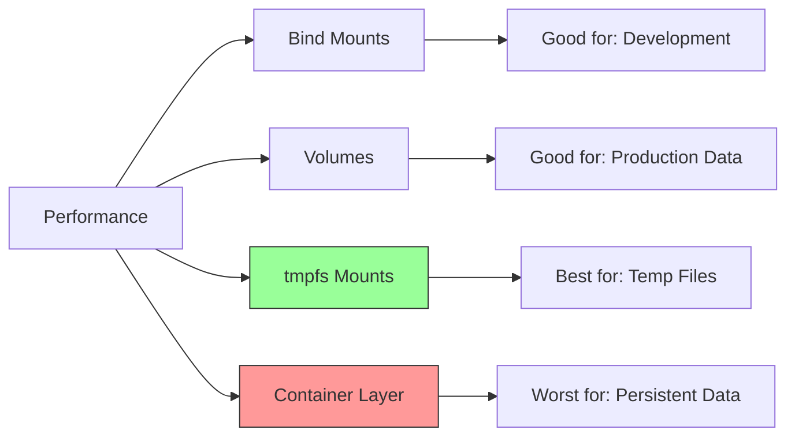

# Docker Storage Performance

## Introduction

When working with Docker containers, storage performance can significantly impact the overall efficiency of your applications. This guide explores the factors affecting Docker storage performance, how to measure it, and best practices for optimization.

Docker provides several storage options, each with different performance characteristics. Understanding these differences is crucial for selecting the right storage solution for your specific use case, whether you're running a database container requiring fast I/O or a web application that doesn't heavily rely on storage operations.

## Docker Storage Drivers

Docker uses storage drivers to manage the container filesystem. Each driver implements a different strategy for managing container layers, affecting read/write performance.

### Common Storage Drivers

Docker supports several storage drivers, each with different performance characteristics:

| Driver | Description | Performance Characteristics |
|--------|-------------|----------------------------|
| `overlay2` | Uses overlayfs, a modern union filesystem | Good overall performance, recommended for most use cases |
| `devicemapper` | Uses device mapper thin provisioning | Good write performance, but can be slower for reading |
| `btrfs` | Uses Btrfs filesystem | Good for systems already using Btrfs |
| `zfs` | Uses ZFS filesystem | Excellent for systems already using ZFS |
| `aufs` | Older union filesystem | Legacy option, not recommended for new deployments |

You can check your current storage driver with:

```bash
docker info | grep "Storage Driver"
```

## Benchmarking Docker Storage Performance

Before optimizing, it's important to establish baseline performance metrics for your Docker storage.

### Using dd for Basic I/O Testing

The `dd` command is a simple tool for measuring write performance inside a container:

```bash
# Run a container with the default storage driver
docker run -it --name storage-test ubuntu bash

# Inside the container, test write performance
dd if=/dev/zero of=test.img bs=1G count=1 oflag=dsync
```

Sample output:
```
1+0 records in
1+0 records out
1073741824 bytes (1.1 GB, 1.0 GiB) copied, 15.4408 s, 69.5 MB/s
```

### Using fio for Comprehensive Benchmarking

For more detailed benchmarks, use the Flexible I/O tester (`fio`):

```bash
# Create a container with fio installed
docker run -it --name fio-test ubuntu bash

# Inside the container
apt-get update && apt-get install -y fio

# Run a random read/write test
fio --name=random-rw --ioengine=posixaio --rw=randrw --bs=4k --size=1g --numjobs=1 --runtime=60 --time_based --end_fsync=1
```

Sample output:
```
random-rw: (g=0): rw=randrw, bs=(R) 4096B-4096B, (W) 4096B-4096B, (T) 4096B-4096B, ioengine=posixaio, iodepth=1
fio-3.16
Starting 1 process
random-rw: Laying out IO file (1 file / 1024MiB)
Jobs: 1 (f=1): [m(1)][100.0%][r=5932KiB/s,w=5716KiB/s][r=1483,w=1429 IOPS][eta 00m:00s]
random-rw: (groupid=0, jobs=1): err= 0: pid=1214: Tue Mar 12 17:34:56 2025
  read: IOPS=1495, BW=5980KiB/s (6123kB/s)(350MiB/60001msec)
   bw (  KiB/s): min= 5520, max= 6384, per=100.00%, avg=5982.71, stdev=127.34
  write: IOPS=1498, BW=5992KiB/s (6136kB/s)(351MiB/60001msec); 0 zone resets
   bw (  KiB/s): min= 5504, max= 6424, per=100.00%, avg=5995.06, stdev=128.49
  cpu          : usr=1.18%, sys=4.81%, ctx=180321, majf=0, minf=17
  IO depths    : 1=100.0%, 2=0.0%, 4=0.0%, 8=0.0%, 16=0.0%, 32=0.0%, >=64=0.0%
     submit    : 0=0.0%, 4=100.0%, 8=0.0%, 16=0.0%, 32=0.0%, 64=0.0%, >=64=0.0%
     complete  : 0=0.0%, 4=100.0%, 8=0.0%, 16=0.0%, 32=0.0%, 64=0.0%, >=64=0.0%
     issued rwts: total=89702,89905,0,0 short=0,0,0,0 dropped=0,0,0,0
     latency   : target=0, window=0, percentile=100.00%, depth=1
```

## Storage Performance Comparison

Here's a diagram showing relative performance of different Docker storage options:



## Performance Factors and Optimization Techniques

### 1. Volume vs. Bind Mount vs. tmpfs

Docker provides three main ways to persist data:

**Volume Performance:**
```bash
# Create a volume
docker volume create data-vol

# Run container with a volume
time docker run --rm -v data-vol:/data alpine sh -c "dd if=/dev/zero of=/data/test bs=1M count=100 oflag=direct"
```

**Bind Mount Performance:**
```bash
# Create a directory on host
mkdir -p /tmp/test-dir

# Run container with bind mount
time docker run --rm -v /tmp/test-dir:/data alpine sh -c "dd if=/dev/zero of=/data/test bs=1M count=100 oflag=direct"
```

**tmpfs Mount Performance:**
```bash
# Run container with tmpfs mount
time docker run --rm --tmpfs /data:rw,noexec,nosuid,size=1g alpine sh -c "dd if=/dev/zero of=/data/test bs=1M count=100"
```

In general, performance ordering from fastest to slowest:
1. tmpfs mounts (in-memory)
2. Volumes
3. Bind mounts
4. Container layer storage

### 2. Storage Driver Optimization

To change the storage driver:

```bash
# Edit /etc/docker/daemon.json
{
  "storage-driver": "overlay2",
  "storage-opts": [
    "overlay2.override_kernel_check=true"
  ]
}
```

Restart Docker after making changes:

```bash
sudo systemctl restart docker
```

### 3. IOPS and Throughput in Docker

Different applications have different storage performance needs:

- **Databases (e.g., PostgreSQL, MySQL)**: High IOPS, consistent latency
- **Log processing**: High throughput 
- **Web servers**: Often minimal storage requirements

### 4. Container Layer Storage Performance

When writing to the container's writable layer (not using volumes or bind mounts), performance can suffer due to the copy-on-write strategy:

```bash
# Test file creation in container layer
time docker run --rm alpine sh -c "for i in {1..1000}; do echo 'test' > file\$i; done"

# Compare with tmpfs performance
time docker run --rm --tmpfs /app alpine sh -c "for i in {1..1000}; do echo 'test' > /app/file\$i; done"
```

## Real-World Example: Optimizing Database Container Performance

Let's compare storage performance for a PostgreSQL container with different storage configurations:

### Step 1: Create test configurations

```bash
# Create a Docker volume for PostgreSQL data
docker volume create pgdata

# Create a directory for bind mount
mkdir -p /tmp/pgdata
```

### Step 2: Run PostgreSQL with different storage options

**Using a Docker volume:**
```bash
docker run --name pg-volume -e POSTGRES_PASSWORD=test -v pgdata:/var/lib/postgresql/data -d postgres:14
```

**Using a bind mount:**
```bash
docker run --name pg-bind -e POSTGRES_PASSWORD=test -v /tmp/pgdata:/var/lib/postgresql/data -d postgres:14
```

### Step 3: Benchmark with pgbench

```bash
# For volume configuration
docker exec -it pg-volume bash -c "su postgres -c 'createdb benchmark && pgbench -i -s 50 benchmark && pgbench -c 10 -T 60 benchmark'"

# For bind mount configuration
docker exec -it pg-bind bash -c "su postgres -c 'createdb benchmark && pgbench -i -s 50 benchmark && pgbench -c 10 -T 60 benchmark'"
```

Sample output:
```
transaction type: <builtin: TPC-B (sort of)>
scaling factor: 50
query mode: simple
number of clients: 10
number of threads: 1
duration: 60 s
number of transactions actually processed: 24631
latency average = 24.359 ms
initial connection time = 18.854 ms
tps = 410.518452 (without initial connection time)
```

## Best Practices for Docker Storage Performance

1. **Use volumes instead of bind mounts in production**:
   ```bash
   docker volume create app_data
   docker run -v app_data:/data myapp
   ```

2. **Use tmpfs for temporary data**:
   ```bash
   docker run --tmpfs /tmp myapp
   ```

3. **Choose the right storage driver** (overlay2 is generally recommended)

4. **Limit container write operations** where possible

5. **Use volume plugins for specialized workloads**:
   ```bash
   docker plugin install rexray/ebs
   docker volume create -d rexray/ebs --name=ebs-vol
   docker run -v ebs-vol:/data myapp
   ```

6. **Monitor storage performance**:
   ```bash
   docker stats
   ```

## Troubleshooting Docker Storage Performance

### Common Issues and Solutions

1. **Slow container startup time**
   - Check storage driver configuration
   - Reduce image size

2. **Poor database performance**
   - Use Docker volumes instead of container storage
   - Configure database to adjust fsync behavior

3. **High disk I/O causing system slowdown**
   - Implement I/O limits:
     ```bash
     docker run --device-write-bps /dev/sda:10mb myapp
     ```

4. **Degraded performance after running many containers**
   - Clean up unused volumes and images:
     ```bash
     docker volume prune
     docker image prune
     ```

## Summary

Docker storage performance varies significantly based on:
- The storage driver you use
- The storage options (volumes, bind mounts, tmpfs)
- The container's workload characteristics
- Host system configuration

For optimal performance:
1. Use Docker volumes for persistent data
2. Use tmpfs for temporary files
3. Choose the most appropriate storage driver
4. Regularly monitor and benchmark performance
5. Clean up unused resources

## Additional Resources

- Docker documentation on storage drivers
- Docker benchmarking tools
- Learn more about Linux I/O subsystem

## Exercises

1. Benchmark your Docker environment using the `dd` and `fio` commands shown above.
2. Compare the performance of Docker volumes vs. bind mounts on your system.
3. Test how different storage drivers affect the performance of a database container.
4. Create a monitoring solution that tracks container I/O performance.