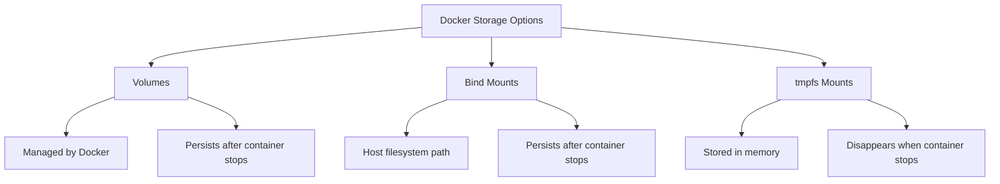

# Docker tmpfs Mounts

## Introduction

When running containers, data persistence is a key consideration. Docker provides several options for managing data, one of which is **tmpfs mounts**. Unlike volumes or bind mounts that store data on the host filesystem, tmpfs mounts store data in the host system's memory (or swap, if memory is exhausted).

In this tutorial, we'll explore how tmpfs works in Docker, when to use it, and how to implement it effectively in your container workflows.

## What is tmpfs?

tmpfs (temporary filesystem) is a Linux filesystem that keeps all its files in virtual memory. With a tmpfs mount in Docker:

- Data is stored only in the host's memory (RAM), not on the disk
- Data is temporary and disappears when the container stops
- Read/write operations are typically faster since they occur in memory
- The data is container-specific and not shared between containers

## Why Use tmpfs Mounts?

There are several scenarios where tmpfs mounts are particularly useful:

- **Sensitive data**: When you need to store sensitive information that shouldn't be persisted to disk
- **Temporary data**: For data that only needs to exist during the container's runtime
- **Performance**: When you need extremely fast I/O for temporary files
- **Reducing disk I/O**: To reduce wear on SSDs when working with frequently changing data

## Basic Usage

### Creating a Container with a tmpfs Mount

To create a container with a tmpfs mount, use the `--tmpfs` flag:

```bash
docker run -d --name tmpfs-demo --tmpfs /app/tmp nginx
```

This command creates an Nginx container with a tmpfs mount at `/app/tmp`. Any files written to this directory will be stored in memory rather than on disk.

### Verifying the tmpfs Mount

You can verify the tmpfs mount was created correctly by checking the container's mounts:

```bash
docker inspect -f '{{ .HostConfig.Tmpfs }}' tmpfs-demo
```

Output:
```
map[/app/tmp:<nil>]
```

## Advanced Configuration

### Setting Size Limits

By default, tmpfs mounts can use up to 50% of the host's RAM. You can set a size limit using the `size` option:

```bash
docker run -d --name tmpfs-limited --tmpfs /app/tmp:size=100m nginx
```

This limits the tmpfs mount to 100MB of memory.

### Additional Mount Options

You can provide various mount options similar to those used with the mount command:

```bash
docker run -d --name tmpfs-options --tmpfs /app/tmp:size=100m,noexec,nosuid,nodev nginx
```

Common options include:
- `size=<bytes>`: Maximum size of the filesystem
- `mode=<octal>`: File mode (permissions) for the tmpfs
- `exec/noexec`: Allow/disallow execution of binaries
- `suid/nosuid`: Allow/disallow SUID bit to take effect
- `dev/nodev`: Allow/disallow creation of device files

## Using Docker Compose with tmpfs

For more complex applications, you may want to use Docker Compose. Here's how to define a tmpfs mount in a `docker-compose.yml` file:

```yaml
version: '3'
services:
  web:
    image: nginx
    tmpfs:
      - /app/tmp
      - /app/logs:size=100m,uid=1000,gid=1000
```

This configuration creates two tmpfs mounts: one at `/app/tmp` with default settings and another at `/app/logs` with a size limit and specific user/group ownership.

## Practical Examples

### Example 1: Web Server Temporary Files

A common use case is to store web server temporary files in memory:

```yaml
version: '3'
services:
  nginx:
    image: nginx
    tmpfs:
      - /var/cache/nginx:exec,mode=1777
      - /tmp:exec,mode=1777
    ports:
      - "80:80"
```

This configuration puts Nginx's cache directory in memory, improving performance and reducing disk writes.

### Example 2: Build Artifacts in CI/CD

When running build processes in containers, storing build artifacts in tmpfs can speed up builds:

```bash
docker run --rm --tmpfs /build:exec maven:3.8-openjdk-11 mvn clean package -Dmaven.repo.local=/build/m2
```

This command runs Maven in a container with a tmpfs mount for build artifacts, significantly speeding up build times while ensuring artifacts don't persist after the build.

### Example 3: Working with Sensitive Data

If your application needs to process sensitive data that shouldn't be written to disk:

```bash
docker run -d --name secure-app \
  --tmpfs /app/secrets:size=10m,mode=0700 \
  my-secure-app
```

This creates a small tmpfs mount with restrictive permissions for storing secrets temporarily.

## Performance Considerations

### Memory Usage

When using tmpfs, be mindful of the following:

- Each file stored in a tmpfs mount consumes RAM
- If the host runs out of memory, it may start using swap, which decreases performance
- Multiple containers with large tmpfs mounts can exhaust system memory

### Benchmarking Example

Here's a simple way to benchmark the performance difference between disk-based storage and tmpfs:

```bash
# Run a container with regular disk storage
docker run --rm -v $(pwd)/test:/test alpine sh -c "time dd if=/dev/zero of=/test/file bs=1M count=100"

# Run a container with tmpfs
docker run --rm --tmpfs /test alpine sh -c "time dd if=/dev/zero of=/test/file bs=1M count=100"
```

Running these commands will show the performance difference, with tmpfs typically being significantly faster.

## Comparing Storage Options

Docker provides three main types of storage:



| Storage Type | Persistence | Location | Performance | Use Case |
|--------------|-------------|----------|-------------|----------|
| Volumes | Persistent | Docker managed area | Good | Database files, shared app data |
| Bind Mounts | Persistent | Anywhere on host | Good | Development, config files |
| tmpfs | Temporary | Memory only | Excellent | Secrets, temporary files, caches |

## Common Issues and Troubleshooting

### Out of Memory Errors

If you see "Out of Memory" errors when using tmpfs, you may need to:

1. Limit the size of your tmpfs mounts
2. Increase the host's memory
3. Use a regular volume instead for larger data

### Permission Issues

If your application can't write to the tmpfs mount:

```bash
docker run -d --name permission-fix --tmpfs /app/data:mode=1777 myapp
```

Setting the mode to 1777 provides read/write access to all users with the sticky bit set.

## Summary

Docker tmpfs mounts provide an efficient way to work with temporary data in containers:

- They store data in memory rather than on disk
- Data is automatically cleaned up when the container stops
- They provide improved performance for temporary storage needs
- They're ideal for sensitive data that shouldn't be persisted

By understanding when and how to use tmpfs mounts, you can optimize your container workflows for both security and performance.

## Additional Resources

- Try creating a container with multiple tmpfs mounts of different sizes
- Experiment with different mount options to see how they affect behavior
- Compare the performance of an application using disk storage vs. tmpfs for temporary files

## Exercises

1. Create a container with a tmpfs mount and write a large file to it. Monitor the memory usage on your host.
2. Set up a web server with cache directories in tmpfs and benchmark its performance.
3. Use Docker Compose to create an application with different types of storage, including tmpfs for temporary data.