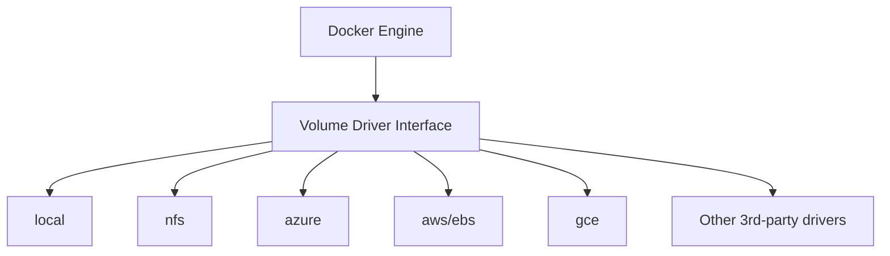

# Docker Volume Drivers

## Introduction

When working with Docker containers, one of the most important concepts to understand is how data persistence works. By default, any data created inside a container is lost when that container is removed. This is where Docker volumes come into play - they provide a way to persist data outside the container lifecycle.

But how does Docker actually manage these volumes on different storage systems? The answer lies in **Docker volume drivers**. Volume drivers are plugins that extend Docker's capabilities by allowing containers to interact with different types of storage systems.

In this guide, we'll explore:
- What Docker volume drivers are
- How the default local driver works
- How to use different volume drivers
- When and why you might need specialized volume drivers
- Real-world examples of volume driver usage

## Understanding Docker Volume Drivers

### What Are Volume Drivers?

Volume drivers are plugins that enable Docker to interact with different storage systems. They abstract away the complexities of storage management, allowing you to use various storage backends with a consistent interface.

When you create a volume in Docker, you can specify which driver to use. If you don't specify one, Docker uses the default `local` driver.



### The Default Local Driver

The `local` driver is built into Docker and stores volume data on the host filesystem, typically in `/var/lib/docker/volumes/` on Linux hosts. This is the simplest form of persistence and works well for single-host deployments.

## Working with Volume Drivers

### Basic Volume Commands

Let's start with some basic commands to work with Docker volumes:

```bash
# Create a volume with the default (local) driver
docker volume create my_data

# Create a volume specifying a driver
docker volume create --driver=local my_local_data

# List all volumes
docker volume ls

# Inspect a volume
docker volume inspect my_data

# Remove a volume
docker volume rm my_data
```

### Using Volumes with Containers

To use a volume with a container, you can use the `-v` or `--mount` flag:

```bash
# Using -v flag
docker run -d --name my-container -v my_data:/app/data nginx

# Using --mount flag (newer and more explicit)
docker run -d --name my-container --mount source=my_data,target=/app/data nginx
```

## Exploring Different Volume Drivers

### 1. Local Driver (Default)

As mentioned earlier, the `local` driver stores data on the host filesystem. Here's how to create and use a local volume:

```bash
# Create a local volume
docker volume create --driver local my_local_volume

# Run a container with the volume
docker run -d --name nginx-test --mount source=my_local_volume,target=/usr/share/nginx/html nginx
```

Let's see what happens when we modify data in this volume:

```bash
# Add a file to the volume through the container
docker exec nginx-test sh -c "echo 'Hello from volume' > /usr/share/nginx/html/index.html"

# Verify the content
docker exec nginx-test cat /usr/share/nginx/html/index.html
```

Output:
```
Hello from volume
```

Even if we remove this container and create a new one with the same volume, the data will persist:

```bash
# Remove the container
docker rm -f nginx-test

# Create a new container with the same volume
docker run -d --name nginx-new --mount source=my_local_volume,target=/usr/share/nginx/html nginx

# Check if the data is still there
docker exec nginx-new cat /usr/share/nginx/html/index.html
```

Output:
```
Hello from volume
```

### 2. NFS Driver

The NFS (Network File System) driver allows Docker containers to store data on remote NFS servers. This is particularly useful in distributed environments where multiple Docker hosts need to access the same data.

To use the NFS driver, you first need to install it:

```bash
docker plugin install --grant-all-permissions davidgiffin/docker-volume-nfs
```

Then, you can create and use NFS volumes:

```bash
# Create an NFS volume
docker volume create --driver davidgiffin/docker-volume-nfs \
  --opt server=nfs-server.example.com \
  --opt share=/path/on/server \
  my_nfs_volume

# Use the volume with a container
docker run -d --name nfs-container --mount source=my_nfs_volume,target=/data ubuntu
```

### 3. AWS EBS Driver

For Docker hosts running on AWS, you might want to use Amazon's Elastic Block Store (EBS) for persistent storage. The Docker EBS driver allows you to create volumes backed by EBS volumes.

```bash
# Install the EBS volume driver
docker plugin install rexray/ebs REXRAY_PREEMPT=true EBS_REGION=us-east-1

# Create an EBS-backed volume
docker volume create --driver rexray/ebs --opt size=10 my_ebs_volume

# Use the volume with a container
docker run -d --name ebs-container --mount source=my_ebs_volume,target=/data ubuntu
```

### 4. Azure File Storage Driver

If you're running Docker on Azure, you can use Azure File Storage for persistent volumes:

```bash
# Install the Azure File Storage driver
docker plugin install cloudfoundry/azurefile-broker

# Create an Azure-backed volume
docker volume create --driver cloudfoundry/azurefile-broker \
  --opt share=myfileshare \
  --opt storageAccountName=mystorageaccount \
  --opt storageAccountKey=mystoragekey \
  my_azure_volume

# Use the volume with a container
docker run -d --name azure-container --mount source=my_azure_volume,target=/data ubuntu
```

## Creating a Custom Volume Driver

In some cases, you might need to create a custom volume driver to integrate with a specific storage system. Let's outline the basic steps (note that actual implementation would require programming):

1. Create a plugin that implements the Docker volume plugin API
2. The plugin needs to implement these methods:
   - `Create`: Creates a new volume
   - `Remove`: Removes a volume
   - `Mount`: Mounts a volume to be used by a container
   - `Unmount`: Unmounts a volume
   - `Path`: Returns the path of a mounted volume
   - `Get`: Gets volume info
   - `List`: Lists all volumes

Here's a simplified structure for a custom volume driver:

```go
package main

import (
    "github.com/docker/go-plugins-helpers/volume"
)

type MyCustomDriver struct {
    // Driver-specific fields
}

func (d *MyCustomDriver) Create(req volume.Request) volume.Response {
    // Implementation...
}

func (d *MyCustomDriver) Remove(req volume.Request) volume.Response {
    // Implementation...
}

// Implement other required methods...

func main() {
    driver := &MyCustomDriver{}
    handler := volume.NewHandler(driver)
    handler.ServeUnix("docker", "my-custom-driver")
}
```

## Real-World Use Case: Multi-Host Development Environment

Let's walk through a real-world example where volume drivers make a significant difference. Imagine you have a development team working on a web application that needs to share code and database files.

### Problem:
- Multiple developers need to work on the same codebase
- Changes need to be immediately visible to all team members
- Database state needs to be persistent and shared

### Solution: NFS Volume Driver

1. Set up an NFS server to share code and database files:

```bash
# On the NFS server
mkdir -p /exports/project-code /exports/project-db
chmod 777 /exports/project-code /exports/project-db
```

2. Install and configure the NFS volume driver on all development Docker hosts:

```bash
docker plugin install --grant-all-permissions davidgiffin/docker-volume-nfs
```

3. Create volumes using the NFS driver:

```bash
# Create a volume for code
docker volume create --driver davidgiffin/docker-volume-nfs \
  --opt server=nfs-server.example.com \
  --opt share=/exports/project-code \
  project_code

# Create a volume for the database
docker volume create --driver davidgiffin/docker-volume-nfs \
  --opt server=nfs-server.example.com \
  --opt share=/exports/project-db \
  project_db
```

4. Use these volumes with your application and database containers:

```bash
# Start the web application container
docker run -d --name web-app \
  --mount source=project_code,target=/var/www/html \
  -p 8080:80 \
  my-web-image

# Start the database container
docker run -d --name db \
  --mount source=project_db,target=/var/lib/mysql \
  -e MYSQL_ROOT_PASSWORD=secret \
  mysql:5.7
```

Now, when any developer makes changes to the code or database, those changes are stored on the NFS server and immediately available to all other developers.

## Performance Considerations

Different volume drivers have different performance characteristics:

- **Local driver**: Fastest option but limited to a single host
- **NFS driver**: Good for sharing data between hosts but may have higher latency
- **Cloud-based drivers** (AWS EBS, Azure File): Performance depends on the cloud provider's infrastructure

Consider these factors when choosing a volume driver for your application:

1. **Read/write pattern**: Some drivers are better at handling frequent small writes, others at large sequential reads
2. **Consistency requirements**: Some drivers provide stronger consistency guarantees than others
3. **Scalability needs**: Consider how your storage needs will grow over time

## Troubleshooting Volume Drivers

Here are some common issues and how to solve them:

### 1. Volume creation fails

If you encounter errors when creating volumes:

```bash
# Check that the driver is installed
docker plugin ls

# Look for detailed error messages
docker volume create --driver my-driver my-volume
```

### 2. Container can't access volume data

If a container can't access data in a volume:

```bash
# Check volume mount
docker inspect container_name | grep Mounts -A 20

# Verify the volume exists and is configured correctly
docker volume inspect volume_name
```

### 3. Performance issues

If you're experiencing performance problems:

```bash
# Test write performance
docker run --rm -v my_volume:/data ubuntu dd if=/dev/zero of=/data/test bs=1M count=100

# Test read performance
docker run --rm -v my_volume:/data ubuntu dd if=/data/test of=/dev/null bs=1M
```

## Summary

Docker volume drivers provide a flexible way to manage persistent storage for containers. By understanding and properly utilizing volume drivers, you can:

1. **Persist data** beyond the lifecycle of containers
2. **Share data** between containers on the same host or across different hosts
3. **Integrate** with various storage backends, from local filesystems to cloud storage services
4. **Optimize** for your specific performance and scalability requirements

The right volume driver choice depends on your specific needs, infrastructure, and the characteristics of your application. Starting with the default local driver is perfect for beginners, while exploring other drivers will allow you to build more sophisticated container deployments as your needs grow.

## Further Learning

To deepen your understanding of Docker volume drivers, consider exploring:

- The Docker Engine API documentation for volume management
- Third-party volume drivers for specialized storage systems
- Container orchestration tools like Docker Swarm or Kubernetes, which offer additional storage abstractions

## Practice Exercises

1. Create a local volume and use it with a web server container to persist website files.
2. Create a volume that preserves data when a database container is restarted.
3. If you have access to a cloud platform, try using a cloud-specific volume driver like the AWS EBS driver.
4. Set up two containers that share the same volume and verify they can both read and write to it.
5. Explore volume backup and restore strategies using volume drivers.