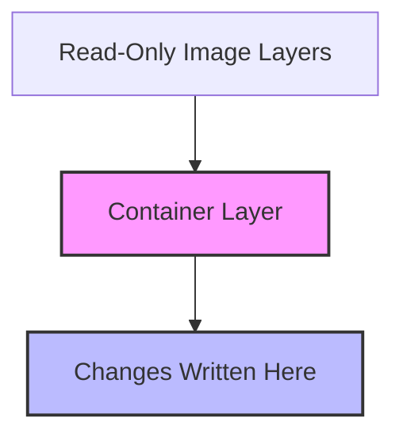

# Docker Data Persistence

## Introduction

When working with Docker containers, you'll quickly discover an important characteristic: by default, any data created or modified inside a container is lost when that container is removed. This behavior stems from Docker's container design philosophy, where containers are intended to be ephemeral and stateless.

However, many real-world applications need to persist data beyond the container lifecycle. For example, databases need to store records, content management systems need to retain uploaded files, and logging applications need to preserve logs. This is where Docker data persistence comes into play.

In this tutorial, we'll explore various ways to implement data persistence in Docker, allowing your containerized applications to maintain state even as containers come and go.

## Understanding Docker's Storage Architecture

Before diving into persistence solutions, let's understand how Docker handles storage by default.

### Container Layers and the Union File System

Docker uses a layered file system approach:



- **Image Layers**: Docker images consist of read-only layers.
- **Container Layer**: When a container starts, Docker adds a writable layer on top of the image layers.
- **Union File System**: Docker combines these layers to present a unified file system to the container.

### The Ephemeral Nature of Container Storage

When you create files inside a running container, those files are written to the container's writable layer. However, this layer is tightly coupled to the container's lifecycle. When you remove the container, you also remove this layer and all its contents.

Let's demonstrate this with a simple example:

```bash
# Start a container and create a file
docker run --name data-test ubuntu
docker exec data-test bash -c "echo 'important data' > /data.txt"
docker exec data-test cat /data.txt
```

Output:
```
important data
```

Now let's remove the container and create a new one from the same image:

```bash
docker rm -f data-test
docker run --name data-test-2 ubuntu
docker exec data-test-2 ls /data.txt
```

Output:
```
ls: cannot access '/data.txt': No such file or directory
```

As you can see, the file is gone because the container layer was destroyed with the container.

## Docker Persistence Options

Docker provides several ways to persist data beyond the container lifecycle:

1. **Volumes**: Docker-managed storage
2. **Bind Mounts**: Direct mappings to host filesystem paths
3. **tmpfs Mounts**: Memory-based storage (Linux only)

Let's explore each of these options.

## Docker Volumes

Volumes are the preferred mechanism for persisting data in Docker. They're completely managed by Docker and isolated from the host machine's core functionality.

### Why Use Volumes?

- **Safety**: Volumes are stored in a part of the host filesystem managed by Docker.
- **Portability**: Volumes work on both Linux and Windows containers.
- **Performance**: Volumes can use specific storage drivers optimized for I/O.
- **Management**: You can manage volumes with Docker CLI commands.

### Creating and Using Volumes

Let's see how to create and use a volume:

```bash
# Create a named volume
docker volume create my-data

# Run a container with the volume mounted
docker run -d --name mysql-db -v my-data:/var/lib/mysql -e MYSQL_ROOT_PASSWORD=my-secret-pw mysql:8.0
```

This mounts the `my-data` volume to the `/var/lib/mysql` directory in the container, where MySQL stores its data.

Let's verify our data persists by:
1. Creating a database
2. Stopping and removing the container
3. Starting a new container with the same volume

```bash
# Connect to MySQL and create a database
docker exec -it mysql-db mysql -p
# Enter password when prompted
# Then in MySQL shell:
# CREATE DATABASE persistence_demo;
# exit;

# Stop and remove the container
docker stop mysql-db
docker rm mysql-db

# Start a new container with the same volume
docker run -d --name mysql-db-2 -v my-data:/var/lib/mysql -e MYSQL_ROOT_PASSWORD=my-secret-pw mysql:8.0

# Verify our database still exists
docker exec -it mysql-db-2 mysql -p -e "SHOW DATABASES;"
# Enter password when prompted
```

Output should include:
```
+--------------------+
| Database           |
+--------------------+
| information_schema |
| mysql              |
| performance_schema |
| persistence_demo   |
| sys                |
+--------------------+
```

Our `persistence_demo` database is still there, demonstrating that the data persisted even though we completely destroyed and recreated the container.

### Volume Commands

Here are some useful Docker commands for managing volumes:

```bash
# List volumes
docker volume ls

# Inspect a volume
docker volume inspect my-data

# Remove a volume
docker volume rm my-data

# Remove all unused volumes
docker volume prune
```

## Bind Mounts

Bind mounts map a host file or directory to a container file or directory. Unlike volumes, bind mounts rely on the host machine's file system structure and are not managed by Docker.

### When to Use Bind Mounts

- During development to share code between host and container
- When you need to access specific host files in containers
- When you need to persist data in a specific location on the host

### Using Bind Mounts

Let's create a bind mount for a web development scenario:

```bash
# Create a project directory
mkdir -p ~/projects/my-webapp

# Create a simple HTML file
echo "<html><body><h1>Hello from bind mount!</h1></body></html>" > ~/projects/my-webapp/index.html

# Run an nginx container with a bind mount
docker run -d --name webapp -p 8080:80 -v ~/projects/my-webapp:/usr/share/nginx/html nginx
```

Now you can access your web page at http://localhost:8080, and any changes made to the HTML file on your host will be immediately visible in the container.

Let's test this:

```bash
# Modify the HTML file
echo "<html><body><h1>Updated content!</h1></body></html>" > ~/projects/my-webapp/index.html
```

If you refresh your browser, you'll see the updated content without restarting the container.

### Bind Mount vs. Volume Syntax

Note the difference in syntax:

- Volume: `-v volume-name:/container/path`
- Bind mount: `-v /host/path:/container/path`

Docker can tell the difference between a volume and a bind mount by the presence of a `/` at the beginning of the source path.

## tmpfs Mounts

tmpfs mounts are stored in the host system's memory only, never written to the host's filesystem. This is useful for storing sensitive information that you don't want to persist.

### Using tmpfs Mounts

```bash
# Run a container with a tmpfs mount
docker run -d --name tmpfs-test --tmpfs /app/temp nginx
```

Data written to `/app/temp` inside the container will be stored in memory and will be removed when the container stops.

## Practical Examples

Let's look at some real-world examples of Docker data persistence.

### Example 1: WordPress with Persistent Database and Media

```bash
# Create volumes for both MySQL data and WordPress content
docker volume create wordpress_db
docker volume create wordpress_content

# Create a network for WordPress and MySQL
docker network create wordpress-net

# Run MySQL with a volume
docker run -d --name wordpress-db \
  --network wordpress-net \
  -v wordpress_db:/var/lib/mysql \
  -e MYSQL_ROOT_PASSWORD=somewordpress \
  -e MYSQL_DATABASE=wordpress \
  -e MYSQL_USER=wordpress \
  -e MYSQL_PASSWORD=wordpress \
  mysql:5.7

# Run WordPress with a volume
docker run -d --name wordpress-app \
  --network wordpress-net \
  -v wordpress_content:/var/www/html \
  -p 8080:80 \
  -e WORDPRESS_DB_HOST=wordpress-db \
  -e WORDPRESS_DB_USER=wordpress \
  -e WORDPRESS_DB_PASSWORD=wordpress \
  -e WORDPRESS_DB_NAME=wordpress \
  wordpress
```

Now you can access WordPress at http://localhost:8080 and even if you rebuild or update your containers, your database content and uploaded media will be preserved.

### Example 2: Development Environment with Code Sharing

Here's a Node.js development environment with real-time code updates:

```bash
# Create a project directory if it doesn't exist
mkdir -p ~/projects/node-app

# Create a simple package.json
echo '{
  "name": "node-app",
  "version": "1.0.0",
  "description": "Node.js app with Docker",
  "main": "server.js",
  "scripts": {
    "start": "nodemon server.js"
  },
  "dependencies": {
    "express": "^4.17.1"
  },
  "devDependencies": {
    "nodemon": "^2.0.7"
  }
}' > ~/projects/node-app/package.json

# Create a simple server.js
echo 'const express = require("express");
const app = express();
const PORT = 3000;

app.get("/", (req, res) => {
  res.send("Hello from Node.js in Docker!");
});

app.listen(PORT, () => {
  console.log(`Server running on port ${PORT}`);
});' > ~/projects/node-app/server.js

# Run a Node.js container with the bind mount
docker run -d --name node-dev \
  -v ~/projects/node-app:/app \
  -w /app \
  -p 3000:3000 \
  node:14 \
  sh -c "npm install && npm start"
```

Now you can edit the `server.js` file on your host machine, and the server in the container will automatically restart with your changes.

## Best Practices for Docker Data Persistence

1. **Use named volumes** for data that needs to be persisted but doesn't need to be accessible on the host.
2. **Use bind mounts** during development for code and configuration that needs to be edited on the host.
3. **Use tmpfs mounts** for sensitive data that shouldn't be persisted to disk.
4. **Document your volume strategy** so others understand how your application manages state.
5. **Consider volume plugins** for advanced use cases like distributed storage, cloud storage, or encryption.
6. **Back up important volumes** regularly, as they store critical application data.

## Setting Volume Permissions

One common issue with volumes is permission problems. Here's how to address them:

```bash
# Run a container that sets the correct permissions before your app runs
docker run --rm \
  -v my-data:/data \
  ubuntu \
  chown -R 1000:1000 /data

# Now run your application container
docker run -d \
  -v my-data:/app/data \
  my-application
```

## Read-Only Mounts

For added security, you can mount volumes as read-only when the container doesn't need to write to them:

```bash
# Mount a configuration volume as read-only
docker run -d \
  -v config_vol:/etc/app/config:ro \
  my-application
```

The `:ro` suffix makes the mount read-only.

## Summary

Docker containers are ephemeral by design, but many applications need data persistence. Docker provides three main options for persisting data:

1. **Volumes**: Docker-managed storage that exists independently of containers
2. **Bind Mounts**: Direct mappings to host filesystem paths
3. **tmpfs Mounts**: Memory-based storage for sensitive or temporary data

Each option has its use cases:
- Use volumes for application data that needs to persist
- Use bind mounts during development or when you need host access
- Use tmpfs mounts for sensitive information

By properly implementing data persistence strategies, you can maintain the benefits of Docker's containerization while ensuring your application's data remains safe and accessible across container lifecycles.

## Additional Resources

- [Docker Volume Documentation](https://docs.docker.com/storage/volumes/)
- [Docker Bind Mounts Documentation](https://docs.docker.com/storage/bind-mounts/)
- [Docker tmpfs Mounts Documentation](https://docs.docker.com/storage/tmpfs/)

## Exercises

1. Create a Docker volume and mount it to two different containers. Verify that data created in one container is visible in the other.
2. Set up a development environment for a language of your choice using bind mounts.
3. Create a Docker Compose file that defines services with various types of volume mounts.
4. Implement a backup strategy for a Docker volume containing important data.
5. Experiment with read-only volumes and understand when they might be useful.