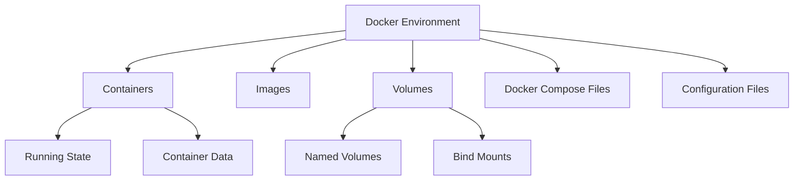

# Docker Backup

## Introduction

When working with Docker, data persistence and backup strategies are critical aspects of a robust deployment. Docker containers are ephemeral by nature - when a container is removed, all data within it disappears unless it was stored in a persistent volume. This makes backing up your Docker environment essential for:

- Disaster recovery
- System migration
- Version control of configurations
- Compliance with data retention policies

In this guide, we'll explore various approaches to backing up different Docker components, including containers, images, and volumes, along with practical examples and best practices.

## Docker Components Worth Backing Up

Before diving into backup methods, let's understand what Docker components typically need backup:



## Backing Up Docker Containers

### Method 1: Docker Commit

The simplest way to create a snapshot of a container's state is using the `docker commit` command, which creates an image from a container.

```bash
# Syntax
docker commit [OPTIONS] CONTAINER [REPOSITORY[:TAG]]

# Example
docker commit mysql-container mysql-backup:v1
```

This creates a new image that captures the container's filesystem at that moment. However, it doesn't capture volumes mounted to the container.

### Method 2: Docker Export

To export a container's filesystem as a tarball:

```bash
# Syntax
docker export [OPTIONS] CONTAINER > output.tar

# Example
docker export mysql-container > mysql-backup.tar
```

You can later import this tarball as an image:

```bash
cat mysql-backup.tar | docker import - mysql-restored:latest
```

## Backing Up Docker Images

### Saving Images to Tar Files

You can back up Docker images using the `docker save` command:

```bash
# Syntax
docker save [OPTIONS] IMAGE [IMAGE...] > output.tar

# Example
docker save nginx:latest redis:alpine > my-images-backup.tar
```

To restore these images:

```bash
docker load < my-images-backup.tar
```

Let's see what this process looks like with output:

```bash
# Saving multiple images
$ docker save nginx:latest redis:alpine > my-images-backup.tar
$ ls -lh my-images-backup.tar
-rw-r--r-- 1 user user 186M May 10 14:23 my-images-backup.tar

# Loading images back
$ docker load < my-images-backup.tar
Loaded image: nginx:latest
Loaded image: redis:alpine
```

## Backing Up Docker Volumes

Volumes are Docker's preferred mechanism for persisting data. There are several approaches to backing them up:

### Method 1: Using Docker Run with Volumes

```bash
# Syntax
docker run --rm -v [volume-name]:/source -v $(pwd):/backup alpine tar -czf /backup/volume-backup.tar.gz -C /source .

# Example
docker run --rm -v mysql-data:/source -v $(pwd):/backup alpine tar -czf /backup/mysql-data-backup.tar.gz -C /source .
```

This command:
1. Creates a temporary Alpine Linux container
2. Mounts the Docker volume you want to back up
3. Mounts your current directory as a target for the backup file
4. Uses `tar` to compress the volume contents to a `.tar.gz` file
5. Automatically removes the container after completion (`--rm`)

### Method 2: Docker Volume Backup Plugin

For more robust volume backups, you can use Docker plugins like `loomchild/volume-backup`:

```bash
# Install the plugin
docker plugin install loomchild/volume-backup

# Backup a volume
docker run --rm -v mysql-data:/source -v $(pwd):/backup loomchild/volume-backup backup mysql-data

# Restore a volume
docker run --rm -v mysql-data:/target -v $(pwd):/backup loomchild/volume-backup restore mysql-data
```

## Automating Docker Backups

For production environments, you'll want to automate your backup process. Here's a simple shell script example:

```bash
#!/bin/bash
# Docker backup script

# Set variables
BACKUP_DIR="/path/to/backups"
DATE=$(date +%Y-%m-%d_%H-%M-%S)
CONTAINER_LIST="container1 container2"
VOLUME_LIST="volume1 volume2"

# Create backup directory
mkdir -p $BACKUP_DIR/$DATE

# Backup containers as images
for container in $CONTAINER_LIST; do
  echo "Backing up container: $container"
  docker commit $container $container-backup-$DATE
  docker save $container-backup-$DATE > $BACKUP_DIR/$DATE/$container.tar
  docker rmi $container-backup-$DATE
done

# Backup volumes
for volume in $VOLUME_LIST; do
  echo "Backing up volume: $volume"
  docker run --rm -v $volume:/source -v $BACKUP_DIR/$DATE:/backup \
    alpine tar -czf /backup/$volume.tar.gz -C /source .
done

# Retain only the last 7 backups
cd $BACKUP_DIR && ls -t | tail -n +8 | xargs rm -rf

echo "Backup completed: $DATE"
```

You can schedule this script using cron:

```bash
# Run backup daily at 2 AM
0 2 * * * /path/to/docker-backup.sh
```

## Backing Up Docker Compose Projects

For applications managed with Docker Compose, you should back up:

1. The `docker-compose.yml` file
2. Any environment files (`.env`)
3. Configuration files mounted to containers
4. Volumes used by the services

Here's an example backup script for a Docker Compose project:

```bash
#!/bin/bash
# Docker Compose project backup

PROJECT_DIR="/path/to/compose/project"
BACKUP_DIR="/path/to/backups"
DATE=$(date +%Y-%m-%d_%H-%M-%S)

# Create backup directory
mkdir -p $BACKUP_DIR/$DATE

# Backup docker-compose files
cp $PROJECT_DIR/docker-compose.yml $BACKUP_DIR/$DATE/
cp $PROJECT_DIR/.env $BACKUP_DIR/$DATE/ 2>/dev/null

# Backup config files
cp -r $PROJECT_DIR/config $BACKUP_DIR/$DATE/ 2>/dev/null

# Get volume list from docker-compose
cd $PROJECT_DIR
VOLUMES=$(docker-compose config --volumes)

# Backup each volume
for volume in $VOLUMES; do
  echo "Backing up volume: $volume"
  docker run --rm -v $volume:/source -v $BACKUP_DIR/$DATE:/backup \
    alpine tar -czf /backup/$volume.tar.gz -C /source .
done

echo "Docker Compose project backup completed: $DATE"
```

## Practical Example: Backing Up a WordPress Site

Let's walk through a complete example of backing up a WordPress site running in Docker:

1. First, let's assume you have a WordPress setup with:
   - WordPress container
   - MySQL database container
   - Volumes for database and WordPress files

```bash
# List our WordPress containers
$ docker ps
CONTAINER ID   IMAGE            NAMES               PORTS
a1b2c3d4e5f6   wordpress:5.9    wordpress-app       0.0.0.0:8080->80/tcp
f6e5d4c3b2a1   mysql:5.7        wordpress-db        3306/tcp

# List our volumes
$ docker volume ls | grep wordpress
local     wordpress_db_data
local     wordpress_files
```

2. Back up the database volume:

```bash
$ docker run --rm -v wordpress_db_data:/source -v $(pwd):/backup \
  alpine tar -czf /backup/db-backup.tar.gz -C /source .
```

3. Back up the WordPress files volume:

```bash
$ docker run --rm -v wordpress_files:/source -v $(pwd):/backup \
  alpine tar -czf /backup/wp-files-backup.tar.gz -C /source .
```

4. Export container configurations (optional):

```bash
$ docker inspect wordpress-app > wordpress-app-config.json
$ docker inspect wordpress-db > wordpress-db-config.json
```

5. Save the Docker Compose file (if using compose):

```bash
$ cp /path/to/wordpress/docker-compose.yml wordpress-compose-backup.yml
```

Now you have a complete backup of your WordPress site that can be restored on any Docker host.

## Best Practices for Docker Backups

1. **Regular Scheduling**: Automate backups on a regular schedule
2. **Offsite Storage**: Store backups in a location separate from your Docker host
3. **Backup Rotation**: Implement a retention policy (e.g., keep daily backups for a week, weekly for a month)
4. **Incremental Backups**: Use incremental backup solutions for large volumes
5. **Testing Restoration**: Regularly test your backup restoration process
6. **Monitoring**: Monitor backup jobs and get notified of failures
7. **Documentation**: Document your backup and restore procedures

## Security Considerations

When implementing Docker backups, consider these security aspects:

1. **Encryption**: Encrypt sensitive backup data
2. **Access Control**: Restrict access to backup storage
3. **Credentials**: Never store database or service credentials in plain text
4. **Network Security**: Use secure channels when transferring backups

Example of creating an encrypted backup:

```bash
# Create an encrypted backup of a volume
docker run --rm -v mysql-data:/source -v $(pwd):/backup \
  alpine sh -c "tar -czf - -C /source . | gpg --symmetric --cipher-algo AES256 -o /backup/mysql-encrypted.tar.gz.gpg"
```

To decrypt and restore:

```bash
# Decrypt and restore a volume
gpg --decrypt mysql-encrypted.tar.gz.gpg | docker run --rm -i -v mysql-data:/target \
  alpine sh -c "tar -xzf - -C /target"
```

## Summary

In this guide, we've covered comprehensive approaches to backing up various Docker components:

- Container backup using `docker commit` and `docker export`
- Image backup with `docker save`
- Volume backup using temporary containers
- Automated backup strategies with shell scripts
- Docker Compose project backups
- A practical WordPress backup example
- Best practices and security considerations

Implementing a robust Docker backup strategy ensures that your containerized applications remain protected against data loss and can be quickly restored when needed.

## Additional Resources

- [Docker Documentation on Volumes](https://docs.docker.com/storage/volumes/)
- [Docker Documentation on Backup Methods](https://docs.docker.com/storage/volumes/#backup-restore-or-migrate-data-volumes)

## Exercises

1. Create a backup script for a multi-container application using Docker Compose
2. Implement and test a volume backup and restoration procedure
3. Set up a scheduled backup for a containerized database with log rotation
4. Create an encrypted backup of a sensitive volume and practice restoration
5. Design a backup strategy for a microservices architecture with multiple volumes