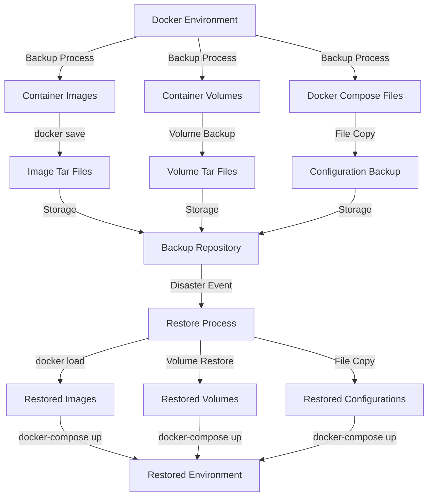

# Docker Restore

## Introduction

When working with Docker containers, preserving and recovering data is crucial for maintaining application stability and ensuring business continuity. Docker restore operations allow you to recover container states, volume data, and images after system failures, accidental deletions, or when migrating to new environments.

This guide will explore various techniques for restoring Docker resources, including containers, volumes, and images. By understanding these principles, you'll be able to implement robust backup and recovery strategies for your Docker environments.

## Understanding Docker's Data Persistence Model

Before diving into restoration techniques, it's important to understand how Docker handles data:

1. **Ephemeral Container Storage**: By default, data inside containers is ephemeral and disappears when containers are removed.
2. **Persistent Volume Storage**: Docker volumes provide persistent storage that exists independently of containers.
3. **Image Repositories**: Docker images are stored locally and can be pushed to/pulled from registries.

Knowing which components to back up and restore is the first step in creating an effective recovery strategy.

## Restoring Docker Containers

### Using Container Commit

One way to restore a container's state is by creating an image from a running container before it's stopped or removed:

```bash
# Create an image from a running container
docker commit my_container my_container_backup

# Later, restore a new container from this image
docker run -d --name my_restored_container my_container_backup
```

This approach captures the file system state but doesn't preserve runtime configurations like port mappings or environment variables.

### Using Docker Export and Import

For a more complete backup and restore process:

```bash
# Export a container to a tar archive
docker export my_container > my_container.tar

# Import the tar archive as a new image
cat my_container.tar | docker import - my_restored_image

# Create a new container from the imported image
docker run -d --name my_restored_container my_restored_image
```

### Example: Restoring a Web Server Container

Let's look at a practical example of restoring a web server container with custom content:

```bash
# Original container setup
docker run -d --name web_server -p 8080:80 nginx
docker exec -it web_server bash -c "echo 'Custom Website' > /usr/share/nginx/html/index.html"

# Backup the container
docker commit web_server web_backup

# Simulate disaster (remove the original container)
docker rm -f web_server

# Restore from backup
docker run -d --name restored_web_server -p 8080:80 web_backup

# Verify the restoration
curl http://localhost:8080
# Output: Custom Website
```

## Restoring Docker Volumes

Volumes are Docker's preferred mechanism for data persistence. Here's how to back up and restore volume data:

### Using Volume Backup Containers

This technique uses temporary containers to access volume data:

```bash
# Backup a volume to a tar file
docker run --rm -v my_volume:/source:ro -v $(pwd):/backup ubuntu tar -czf /backup/my_volume_backup.tar.gz -C /source .

# Restore volume data from a tar file
docker run --rm -v my_volume:/target -v $(pwd):/backup ubuntu bash -c "tar -xzf /backup/my_volume_backup.tar.gz -C /target"
```

### Example: Restoring a Database Volume

Let's see how to restore a PostgreSQL database volume:

```bash
# Create a PostgreSQL container with a named volume
docker run -d --name postgres_db -e POSTGRES_PASSWORD=mysecretpassword -v pg_data:/var/lib/postgresql/data postgres:13

# Create some test data
docker exec -it postgres_db psql -U postgres -c "CREATE DATABASE testdb;"
docker exec -it postgres_db psql -U postgres -c "CREATE TABLE test_table (id SERIAL PRIMARY KEY, name VARCHAR(50));" testdb
docker exec -it postgres_db psql -U postgres -c "INSERT INTO test_table (name) VALUES ('test data');" testdb

# Backup the volume
docker run --rm -v pg_data:/source:ro -v $(pwd):/backup ubuntu tar -czf /backup/pg_data_backup.tar.gz -C /source .

# Simulate disaster
docker rm -f postgres_db
docker volume rm pg_data

# Recreate the volume
docker volume create pg_data

# Restore from backup
docker run --rm -v pg_data:/target -v $(pwd):/backup ubuntu bash -c "tar -xzf /backup/pg_data_backup.tar.gz -C /target"

# Create a new container using the restored volume
docker run -d --name postgres_restored -e POSTGRES_PASSWORD=mysecretpassword -v pg_data:/var/lib/postgresql/data postgres:13

# Verify the restoration
docker exec -it postgres_restored psql -U postgres -c "SELECT * FROM test_table;" testdb
# Output: id | name
#         1  | test data
```

## Restoring Docker Images

Docker images are the foundation of containers. Here's how to back up and restore them:

### Using Docker Save and Load

```bash
# Save an image to a tar file
docker save -o nginx_backup.tar nginx:latest

# Load the image from the tar file
docker load -i nginx_backup.tar
```

### Example: Transferring Images Between Environments

This example shows how to move images between different Docker hosts:

```bash
# On source host: Save multiple images
docker save -o my_images.tar nginx:latest redis:alpine postgres:13

# Transfer the tar file to the destination host (using scp, rsync, etc.)
# scp my_images.tar user@destination:/path/to/destination/

# On destination host: Load the images
docker load -i my_images.tar

# Verify the images are available
docker images
```

## Using Docker Registry for Image Backup and Restore

For a more scalable approach, you can use Docker registries:

```bash
# Tag the image for your registry
docker tag my_app:latest registry.example.com/my_app:v1.0

# Push to the registry
docker push registry.example.com/my_app:v1.0

# Later, pull from the registry to restore
docker pull registry.example.com/my_app:v1.0
```

## Complete System Backup and Restore

For comprehensive Docker environment recovery, you might need to back up:

1. Docker volumes
2. Container configurations (compose files or run commands)
3. Custom images
4. Docker daemon configuration

### Using Docker Compose for System Restore

Docker Compose makes it easier to restore complex applications:

```yaml
# docker-compose.yml
version: '3'
services:
  web:
    image: nginx:latest
    ports:
      - "8080:80"
    volumes:
      - web_content:/usr/share/nginx/html
  
  db:
    image: postgres:13
    environment:
      POSTGRES_PASSWORD: mysecretpassword
    volumes:
      - db_data:/var/lib/postgresql/data

volumes:
  web_content:
  db_data:
```

After backing up the volumes, you can restore the entire system:

```bash
# Backup volumes
docker run --rm -v web_content:/source:ro -v $(pwd):/backup ubuntu tar -czf /backup/web_content_backup.tar.gz -C /source .
docker run --rm -v db_data:/source:ro -v $(pwd):/backup ubuntu tar -czf /backup/db_data_backup.tar.gz -C /source .

# Stop and remove existing containers
docker-compose down

# Recreate volumes (if needed)
docker volume create web_content
docker volume create db_data

# Restore volume data
docker run --rm -v web_content:/target -v $(pwd):/backup ubuntu bash -c "tar -xzf /backup/web_content_backup.tar.gz -C /target"
docker run --rm -v db_data:/target -v $(pwd):/backup ubuntu bash -c "tar -xzf /backup/db_data_backup.tar.gz -C /target"

# Bring the system back up
docker-compose up -d
```

## Automated Backup and Restore

For production environments, consider automating these processes:

```bash
#!/bin/bash
# Simple backup script for Docker volumes

BACKUP_DIR="/path/to/backups"
DATE=$(date +%Y%m%d_%H%M%S)

# Create backup directory
mkdir -p $BACKUP_DIR

# Backup named volumes
for VOLUME in $(docker volume ls -q)
do
  echo "Backing up volume: $VOLUME"
  docker run --rm -v $VOLUME:/source:ro -v $BACKUP_DIR:/backup alpine tar -czf /backup/${VOLUME}_${DATE}.tar.gz -C /source .
done

echo "Backup completed: $(ls -la $BACKUP_DIR)"
```

For restoration, you can create a companion script:

```bash
#!/bin/bash
# Simple restore script for Docker volumes

BACKUP_DIR="/path/to/backups"
VOLUME_NAME=$1
BACKUP_FILE=$2

if [ -z "$VOLUME_NAME" ] || [ -z "$BACKUP_FILE" ]; then
  echo "Usage: $0 <volume_name> <backup_file>"
  exit 1
fi

# Check if volume exists, create if not
if ! docker volume ls -q | grep -q "^${VOLUME_NAME}$"; then
  echo "Creating volume: $VOLUME_NAME"
  docker volume create $VOLUME_NAME
fi

# Restore from backup
echo "Restoring $BACKUP_FILE to volume $VOLUME_NAME"
docker run --rm -v $VOLUME_NAME:/target -v $BACKUP_DIR:/backup alpine sh -c "tar -xzf /backup/$BACKUP_FILE -C /target"

echo "Restore completed"
```

## Disaster Recovery Planning

An effective disaster recovery plan for Docker should include:

1. **Regular Automated Backups**: Schedule frequent backups of critical volumes and configurations.
2. **Testing Restore Procedures**: Regularly test your restore process to ensure it works.
3. **Documentation**: Document backup locations, restore procedures, and dependencies.
4. **Monitoring**: Implement monitoring to alert when backups fail.

Here's a visual representation of a Docker backup and restore workflow:



## Summary

Docker restore operations are essential for maintaining data persistence and recovering from failures. In this guide, we've explored:

- Different approaches to backing up and restoring Docker containers
- Techniques for preserving volume data
- Methods for saving and loading Docker images
- Complete system restore using Docker Compose
- Automated scripts for regular backup and restore operations

By implementing these strategies, you can ensure that your Docker-based applications remain resilient in the face of unexpected events.

## Additional Resources and Exercises

### Exercises

1. Create a backup and restore strategy for a three-tier application (web, application, database) using Docker Compose.
2. Write a script that automatically backs up all Docker volumes daily and retains backups for 30 days.
3. Set up a private Docker registry and practice pushing/pulling images for backup and restore purposes.
4. Create a disaster recovery runbook that documents the exact steps to restore your Docker environment.

### Further Reading

- Docker Documentation on [Volumes](https://docs.docker.com/storage/volumes/)
- Docker Documentation on [Backup, Restore, or Migrate Data Volumes](https://docs.docker.com/storage/volumes/#backup-restore-or-migrate-data-volumes)
- Docker Documentation on [Save and Load Images](https://docs.docker.com/engine/reference/commandline/save/)
- Learn about [Docker Registry](https://docs.docker.com/registry/) for image management