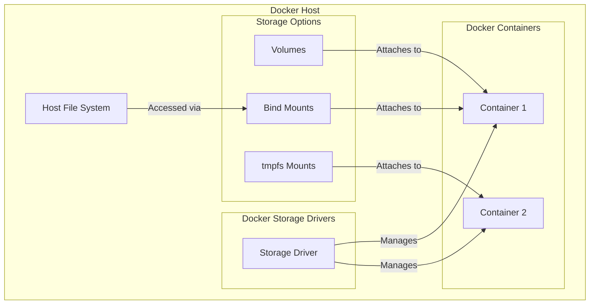

# Docker Storage Options

## Introduction

When working with Docker containers, one of the first challenges you'll encounter is data persistence. By default, any data created inside a container is lost when that container is removed. This is because Docker containers are designed to be ephemeral - they can be stopped, deleted, and replaced with minimal setup or configuration.

However, many applications require persistent data that lives beyond the container lifecycle. Docker provides several storage options to address this need, each with specific use cases and benefits. In this guide, we'll explore these options and learn when and how to use them effectively.

## Docker Storage - The Big Picture

Before diving into specific options, let's understand how Docker handles storage:



Docker containers have a layered filesystem, where each layer represents a set of changes to the filesystem. These layers are managed by a storage driver. However, for persistent data, Docker offers three main storage options:

1. **Volumes**: Docker-managed storage in the host filesystem
2. **Bind Mounts**: Direct mappings to the host filesystem
3. **tmpfs Mounts**: In-memory storage that exists only for the container's lifecycle

Let's examine each option in detail.

## Docker Volumes

Volumes are the recommended way to persist data in Docker. They are completely managed by Docker and isolated from the core functionality of the host machine.

### Key Benefits of Volumes

- Easier to back up or migrate than bind mounts
- Can be managed using Docker CLI commands
- Work on both Linux and Windows containers
- Can be shared safely among multiple containers
- Volume drivers allow for storing volumes on remote hosts or cloud providers
- New volumes can have their content pre-populated by a container

### Creating and Managing Volumes

To create a volume:

```bash
docker volume create my_data
```

List all volumes:

```bash
docker volume ls
```

Output:
```
DRIVER    VOLUME NAME
local     my_data
```

Inspect a volume to see its details:

```bash
docker volume inspect my_data
```

Output:
```json
[
    {
        "CreatedAt": "2025-03-12T10:15:30Z",
        "Driver": "local",
        "Labels": {},
        "Mountpoint": "/var/lib/docker/volumes/my_data/_data",
        "Name": "my_data",
        "Options": {},
        "Scope": "local"
    }
]
```

To remove a volume:

```bash
docker volume rm my_data
```

### Using Volumes with Containers

Let's run a container with a volume attached:

```bash
docker run -d --name postgres-db \
  -e POSTGRES_PASSWORD=mysecretpassword \
  -v my_pg_data:/var/lib/postgresql/data \
  postgres:14
```

In this example:

- `-v my_pg_data:/var/lib/postgresql/data` attaches the volume `my_pg_data` to the path `/var/lib/postgresql/data` inside the container
- If the volume doesn't exist, Docker creates it automatically

You can also use the longer `--mount` syntax, which is more explicit:

```bash
docker run -d --name postgres-db \
  -e POSTGRES_PASSWORD=mysecretpassword \
  --mount source=my_pg_data,target=/var/lib/postgresql/data \
  postgres:14
```

## Bind Mounts

Bind mounts have been around since the early days of Docker. They allow you to mount a file or directory on the host machine into a container.

### When to Use Bind Mounts

- Sharing configuration files from the host to containers
- Development environments where you need code changes to be immediately visible in the container
- When the container needs access to specific host filesystem structures

### Using Bind Mounts

To use a bind mount with the `-v` flag:

```bash
docker run -d --name nginx-site \
  -v /home/user/website:/usr/share/nginx/html \
  -p 8080:80 \
  nginx
```

With the more explicit `--mount` syntax:

```bash
docker run -d --name nginx-site \
  --mount type=bind,source=/home/user/website,target=/usr/share/nginx/html \
  -p 8080:80 \
  nginx
```

In these examples, the `/home/user/website` directory on the host is mounted directly into the container at `/usr/share/nginx/html`. Any changes made either on the host or in the container are immediately reflected on the other side.

### Potential Issues with Bind Mounts

- Security concerns: containers can modify host filesystem
- Dependency on host filesystem structure
- Less portable than volumes
- Not manageable through Docker CLI commands

## tmpfs Mounts

A tmpfs mount is temporary, stored in the host's memory only. When the container stops, the tmpfs mount is removed, and files written there won't be persisted.

### Use Cases for tmpfs

- Storing sensitive information that you don't want to persist
- Improving container performance for small data that's frequently read or written
- Testing applications that need a fast transient storage

### Using tmpfs Mounts

To create a container with a tmpfs mount:

```bash
docker run -d --name temp-data-container \
  --tmpfs /app/temp:rw,noexec,nosuid,size=100M \
  my-app-image
```

With the `--mount` syntax:

```bash
docker run -d --name temp-data-container \
  --mount type=tmpfs,destination=/app/temp,tmpfs-size=100M \
  my-app-image
```

In these examples, the container has access to a tmpfs mount at `/app/temp` with a size limit of 100MB that will exist only while the container is running.

## Comparing Storage Options

| Feature | Volumes | Bind Mounts | tmpfs Mounts |
|---------|---------|-------------|--------------|
| Host location | Docker managed directory | Any location on host | Host memory |
| Persistence | Yes | Yes | No (lost on container stop) |
| Content sharing | Multiple containers | Multiple containers | Single container only |
| Host file overwrite | No | Yes | N/A |
| Portability | High | Low (depends on host) | High |
| Performance | Good | Same as host filesystem | Very high (memory speed) |
| Docker CLI management | Yes | No | No |
| Works on Windows | Yes | Limited | Linux containers only |

## Practical Examples

### Example 1: Web Application with Database

Let's create a simple web application with a database, using volumes for data persistence:

```bash
# Create volumes for our application
docker volume create web_app_data
docker volume create db_data

# Launch the database container
docker run -d --name mysql-db \
  -e MYSQL_ROOT_PASSWORD=my-secret-pw \
  -e MYSQL_DATABASE=webappdb \
  -v db_data:/var/lib/mysql \
  mysql:8.0

# Launch the web application container
docker run -d --name webapp \
  -v web_app_data:/app/data \
  --link mysql-db:mysql \
  -p 80:80 \
  my-web-app
```

### Example 2: Development Environment

For a local development environment, bind mounts work best:

```bash
# Mount your source code directory to see live changes
docker run -d --name dev-container \
  -v $(pwd):/app \
  -p 3000:3000 \
  node:18 \
  npm start
```

### Example 3: Sensitive Data Processing

When working with sensitive data that shouldn't be persisted:

```bash
docker run -it --rm \
  --tmpfs /app/sensitive-data:rw,size=1G \
  my-data-processing-image
```

## Best Practices

1. **Use volumes for persistent data**:
   - Database storage
   - Application data that needs to survive container recreation
   - Shared configuration between containers

2. **Use bind mounts for development**:
   - When you need to see code changes immediately
   - When sharing configuration files from the host

3. **Use tmpfs for sensitive or temporary data**:
   - Password files, API keys, or other secrets
   - Temporary processing data
   - Caches that don't need to persist

4. **Consider volume drivers for special cases**:
   - Cloud storage integration
   - Network file systems
   - Backup solutions

5. **Add labels to your volumes for organization**:
   ```bash
   docker volume create --label project=myapp --label environment=dev app_data
   ```

## Troubleshooting Common Issues

### Problem: Can't see data changes in the container

If you're using a bind mount and can't see your changes:

1. Check the path is correct on both host and container sides
2. Verify file permissions
3. Make sure you're editing the right files

```bash
# Inspect the mount to confirm paths
docker inspect -f '{{ .Mounts }}' your-container-name
```

### Problem: Volume not persisting data

1. Check if you're using the correct volume name
2. Verify the mount path inside the container
3. Ensure your application is writing to the correct path

```bash
# Check volume exists and is being used
docker volume ls
docker inspect -f '{{ .Mounts }}' your-container-name
```

### Problem: Out of disk space

Docker volumes can grow over time:

```bash
# Prune unused volumes
docker volume prune

# Find large volumes by inspecting container mounts
docker ps -a --format "{{.Names}}" | xargs docker inspect -f '{{.Name}}: {{.Mounts}}' | grep volume
```

## Summary

Docker provides three main storage options for different use cases:

1. **Volumes**: The preferred mechanism for persisting data generated by and used by Docker containers. Completely managed by Docker.
2. **Bind Mounts**: Map a host file or directory to a container file or directory. Limited functionality compared to volumes.
3. **tmpfs Mounts**: Store data temporarily in the host's memory only. Data is lost when the container stops.

Understanding these storage options allows you to design Docker-based applications that handle data correctly, whether you need persistence, performance, or temporary storage.

## Exercises

1. Create a Docker volume and mount it to a container. Store some data in it, then remove the container and verify the data persists by attaching the volume to a new container.

2. Set up a development environment using bind mounts for a simple web application. Make changes to your code and observe them reflected in the running container.

3. Compare the performance of a database running with data stored in a volume versus a tmpfs mount. What differences do you observe? When would each be appropriate?

4. Create a Docker Compose file that sets up a multi-container application using different storage types for different components.

## Additional Resources

- [Docker Documentation on Storage](https://docs.docker.com/storage/)
- [Docker Volume Plugin API](https://docs.docker.com/engine/extend/plugins_volume/)
- [Back up, restore, or migrate data volumes](https://docs.docker.com/storage/volumes/#backup-restore-or-migrate-data-volumes)
- [Use volumes with Docker Compose](https://docs.docker.com/compose/compose-file/compose-file-v3/#volume-configuration-reference)
- [Docker Storage Drivers](https://docs.docker.com/storage/storagedriver/select-storage-driver/)