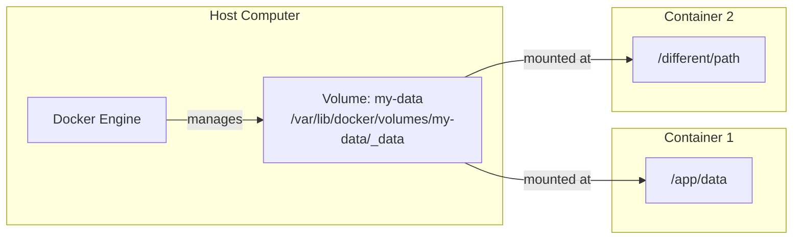

# Docker Named Volumes

## Introduction

When working with Docker containers, one challenge you'll frequently encounter is **data persistence**. Since containers are ephemeral by nature (meaning they can be stopped, restarted, or replaced at any time), any data stored inside a container is lost when that container no longer exists. This can be problematic for applications that need to store and retrieve data.

Docker provides several solutions for managing persistent data, and **Named Volumes** are one of the most powerful and flexible options. In this guide, we'll explore what Docker Named Volumes are, how they work, and how to use them effectively in your applications.

## What Are Docker Named Volumes?

A Docker Named Volume is a managed volume that Docker creates and maintains for you. Unlike bind mounts (which map a container path to a host path), named volumes are completely managed by Docker and isolated from the core functionality of the host machine.

Named volumes offer several advantages:

- **Easy to create and manage**: Docker handles the storage location on the host
- **Portable**: Can be easily shared between containers
- **Lifecycle management**: Can exist independently of containers
- **Performance**: Often better performance than bind mounts, especially on Windows and macOS

## Creating and Using Named Volumes

### Basic Named Volume Operations

Let's start with the basic operations for working with named volumes.

#### Creating a Named Volume

```bash
docker volume create my-data
```

This command creates a named volume called `my-data` that you can reference in container creation.

#### Listing Volumes

```bash
docker volume ls
```

Output:
```
DRIVER    VOLUME NAME
local     my-data
```

#### Inspecting a Volume

```bash
docker volume inspect my-data
```

Output:
```json
[
    {
        "CreatedAt": "2023-04-01T10:30:20Z",
        "Driver": "local",
        "Labels": {},
        "Mountpoint": "/var/lib/docker/volumes/my-data/_data",
        "Name": "my-data",
        "Options": {},
        "Scope": "local"
    }
]
```

#### Removing a Volume

```bash
docker volume rm my-data
```

### Using Named Volumes with Containers

Now let's see how to use named volumes with Docker containers.

#### Starting a Container with a Named Volume

```bash
docker run -d \
  --name my-app \
  -v my-data:/app/data \
  nginx:latest
```

This command:
- Creates a container named `my-app` from the nginx image
- Mounts the `my-data` volume to the `/app/data` path in the container

#### Creating a Volume on the Fly

You don't have to explicitly create a volume first. Docker will create it for you if it doesn't exist:

```bash
docker run -d \
  --name another-app \
  -v new-volume:/app/data \
  nginx:latest
```

This creates a new volume called `new-volume` and mounts it in the container.

## Practical Examples

Let's explore some practical use cases for Docker Named Volumes.

### Example 1: Database Persistence

One of the most common uses for named volumes is persisting database data:

```bash
# Create a volume for the database data
docker volume create db-data

# Start a MySQL container with the volume
docker run -d \
  --name mysql-db \
  -e MYSQL_ROOT_PASSWORD=mysecretpassword \
  -e MYSQL_DATABASE=myapp \
  -v db-data:/var/lib/mysql \
  mysql:8.0
```

Now, even if you remove and recreate the MySQL container, your data will persist in the `db-data` volume.

Let's verify this:

```bash
# Connect to MySQL and create a table with data
docker exec -it mysql-db mysql -u root -pmysecretpassword

# Inside MySQL shell:
# USE myapp;
# CREATE TABLE users (id INT, name VARCHAR(50));
# INSERT INTO users VALUES (1, 'John Doe');
# EXIT;

# Stop and remove the container
docker stop mysql-db
docker rm mysql-db

# Create a new container using the same volume
docker run -d \
  --name new-mysql-db \
  -e MYSQL_ROOT_PASSWORD=mysecretpassword \
  -e MYSQL_DATABASE=myapp \
  -v db-data:/var/lib/mysql \
  mysql:8.0

# Check if data persists
docker exec -it new-mysql-db mysql -u root -pmysecretpassword myapp -e "SELECT * FROM users;"
```

Output:
```
+------+----------+
| id   | name     |
+------+----------+
|    1 | John Doe |
+------+----------+
```

As you can see, the data persists even though we created a completely new container!

### Example 2: Sharing Data Between Containers

Another powerful use case is sharing data between containers:

```bash
# Create a volume
docker volume create shared-data

# Run a container that writes to the volume
docker run --rm \
  -v shared-data:/data \
  ubuntu bash -c "echo 'Hello from container 1' > /data/hello.txt"

# Run another container that reads from the volume
docker run --rm \
  -v shared-data:/data \
  ubuntu cat /data/hello.txt
```

Output:
```
Hello from container 1
```

This demonstrates how data can be shared between containers using a named volume.

### Example 3: Backing up Volume Data

You can also back up the data in your volumes:

```bash
# Create a backup of the volume data
docker run --rm \
  -v db-data:/source \
  -v $(pwd):/backup \
  ubuntu tar cvf /backup/db-backup.tar /source
```

This command creates a container that:
- Mounts the `db-data` volume at `/source`
- Mounts the current directory at `/backup`
- Creates a tar archive of the volume data

## How Docker Named Volumes Work

Let's visualize how Docker Named Volumes function:



The Docker engine manages volumes separately from containers. A single volume can be:
- Mounted at different paths in different containers
- Used by multiple containers simultaneously 
- Persist beyond the lifecycle of any container that uses it

## Volume Drivers

Docker Named Volumes support different drivers that determine how and where the data is stored. By default, Docker uses the `local` driver, which stores data on the host filesystem. However, you can use third-party drivers to store data on remote systems, cloud storage, etc.

```bash
# Create a volume with a specific driver
docker volume create --driver=my-driver my-remote-volume

# Use driver options for configuration
docker volume create --driver=my-driver \
  --opt key=value \
  my-config-volume
```

Some popular volume drivers include:
- NFS for network storage
- Ceph for distributed storage
- Cloud-specific drivers for AWS EBS, Azure Disk, etc.

## Best Practices for Docker Named Volumes

Here are some recommended practices when working with named volumes:

1. **Use descriptive names**: Choose volume names that clearly indicate their purpose, such as `myapp-db-data` or `wordpress-content`.

2. **Clean up unused volumes**: Regularly run `docker volume prune` to remove unused volumes.

3. **Back up important data**: Implement a backup strategy for volumes containing critical data.

4. **Use volume labels**: Add metadata to your volumes with labels:
   ```bash
   docker volume create --label environment=production --label app=myapp db-data
   ```

5. **Document volume usage**: Keep track of which volumes are used by which containers, especially in complex applications.

## Managing Volumes with Docker Compose

Docker Compose makes it even easier to manage named volumes in multi-container applications:

```yaml
version: '3'

services:
  web:
    image: nginx:latest
    volumes:
      - web-data:/usr/share/nginx/html

  db:
    image: postgres:13
    volumes:
      - db-data:/var/lib/postgresql/data
    environment:
      POSTGRES_PASSWORD: example

volumes:
  web-data:
  db-data:
```

In this Docker Compose example:
- Two named volumes are defined: `web-data` and `db-data`
- Each service mounts one of the volumes
- Docker Compose creates the volumes if they don't exist

To start this application:

```bash
docker-compose up -d
```

## Summary

Docker Named Volumes provide an elegant solution for persisting and sharing data in containerized applications. They offer better portability, management, and performance compared to bind mounts, while still being easy to use.

Key points to remember:
- Named volumes are fully managed by Docker
- They persist even when containers are removed
- They can be shared between multiple containers
- They support different storage drivers
- Docker Compose makes volume management even simpler

Now that you understand Docker Named Volumes, you have a powerful tool for handling data persistence in your containerized applications.

## Exercises

To reinforce your learning, try these exercises:

1. Create a named volume and mount it in an Ubuntu container. Create some files inside the volume, then create a second container that can access those files.

2. Set up a WordPress site with MySQL using named volumes to persist both the database and the WordPress files. Remove and recreate the containers to verify that the data persists.

3. Create a backup of a named volume, then restore it to a new volume.

4. Write a Docker Compose file that uses named volumes for a multi-container application of your choice.

## Additional Resources

- [Official Docker Volumes Documentation](https://docs.docker.com/storage/volumes/)
- [Docker Compose Volumes Reference](https://docs.docker.com/compose/compose-file/compose-file-v3/#volumes)
- [Docker Volume CLI Reference](https://docs.docker.com/engine/reference/commandline/volume/)