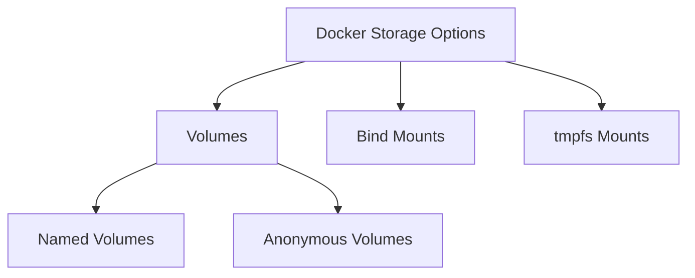

# Docker Anonymous Volumes

## Introduction

When working with Docker containers, data persistence is a common challenge. By default, any data created inside a container is lost when the container is removed. Docker provides several solutions for this problem, and one of them is **anonymous volumes**.

Anonymous volumes are Docker-managed volumes that provide a way to persist data without having to specify a location on the host filesystem. They're called "anonymous" because Docker generates a random name for them, and you don't need to track these names directly.

In this guide, we'll explore:
- What anonymous volumes are
- How they differ from named volumes and bind mounts
- When to use anonymous volumes
- How to create and manage them
- Best practices and limitations

## Understanding Docker Storage Options

Before diving into anonymous volumes, let's understand Docker's storage options:



- **Volumes**: Docker-managed storage in the host filesystem
- **Bind Mounts**: Direct mapping to a host filesystem path
- **tmpfs Mounts**: Stored in host memory only

## What Are Anonymous Volumes?

Anonymous volumes are Docker-managed volumes that:
1. Are created and managed by Docker
2. Have randomly generated IDs instead of human-readable names
3. Persist beyond the container lifecycle (by default)
4. Are not easily reused across containers

When Docker creates an anonymous volume, it:
- Allocates space in the Docker storage directory (usually `/var/lib/docker/volumes/` on Linux)
- Assigns a random UUID as the volume identifier
- Mounts the volume to the specified directory in the container

## Creating Anonymous Volumes

### Method 1: Using Dockerfile VOLUME Instruction

You can define anonymous volumes in a Dockerfile using the `VOLUME` instruction:

```dockerfile
FROM ubuntu:latest
RUN mkdir -p /app/data
VOLUME /app/data
```

When you build and run a container from this image, Docker automatically creates an anonymous volume mounted to `/app/data`.

### Method 2: Using the -v Flag with docker run

You can also create anonymous volumes when running a container:

```bash
docker run -v /app/data ubuntu:latest
```

This command creates a container with an anonymous volume mounted at `/app/data`.

## Inspecting Anonymous Volumes

Let's see anonymous volumes in action:

```bash
# Create a container with an anonymous volume
docker run --name test-container -v /app/data ubuntu:latest touch /app/data/testfile

# Inspect the container to find the volume
docker inspect test-container
```

The output will include a "Mounts" section like this:

```json
"Mounts": [
    {
        "Type": "volume",
        "Name": "2a3f5766b8c5af8e624581d868f21c9a6a5a873f70999339d51d8a7e8f4b6123",
        "Source": "/var/lib/docker/volumes/2a3f5766b8c5af8e624581d868f21c9a6a5a873f70999339d51d8a7e8f4b6123/_data",
        "Destination": "/app/data",
        "Driver": "local",
        "Mode": "",
        "RW": true,
        "Propagation": ""
    }
]
```

Notice the randomly generated name - this is characteristic of anonymous volumes.

## Listing Anonymous Volumes

You can list all volumes (including anonymous ones) with:

```bash
docker volume ls
```

You'll see output like:

```
DRIVER    VOLUME NAME
local     2a3f5766b8c5af8e624581d868f21c9a6a5a873f70999339d51d8a7e8f4b6123
```

## Example: Using Anonymous Volumes for a Database Container

Let's create a practical example using a MongoDB container with an anonymous volume:

```bash
# Run MongoDB with an anonymous volume for data
docker run -d --name mongo-db -v /data/db mongo:latest

# Create some data
docker exec mongo-db sh -c 'echo "db.test.insert({name:\"example\"})" | mongo'

# Verify the data exists
docker exec mongo-db sh -c 'echo "db.test.find()" | mongo'
```

Now, let's remove the container but keep the volume:

```bash
# Remove the container
docker rm -f mongo-db

# Create a new container with the same anonymous volume
docker run -d --name new-mongo-db --volumes-from mongo-db mongo:latest

# Verify the data still exists
docker exec new-mongo-db sh -c 'echo "db.test.find()" | mongo'
```

You should see your data is preserved!

## Lifecycle of Anonymous Volumes

By default, anonymous volumes are not automatically removed when you remove a container. To remove the container and its anonymous volumes, use:

```bash
docker rm -v container_name
```

## When to Use Anonymous Volumes

Anonymous volumes are useful when:

1. **You need temporary persistence** - Data should outlive the container but doesn't need a permanent name
2. **The Dockerfile defines storage needs** - The image creator determines where volumes should be mounted
3. **You want to protect container directories** from being overwritten by bind mounts
4. **You don't need to share volumes** between multiple containers

## Anonymous vs. Named Volumes

Let's compare anonymous volumes with their close relative, named volumes:

| Feature              | Anonymous Volumes               | Named Volumes                        |
|----------------------|---------------------------------|--------------------------------------|
| Creation             | Auto-generated name             | User-specified name                  |
| Reusability          | Harder to reuse                 | Easy to reference by name            |
| Lifecycle management | More complex                    | Simpler to manage                    |
| Use case             | Short-term persistence          | Long-term data storage               |
| Creation command     | `docker run -v /container/path` | `docker run -v name:/container/path` |

## Best Practices

1. **Use named volumes for important data** - Anonymous volumes are harder to track and manage
2. **Use the `-v` flag when removing containers** to clean up anonymous volumes
3. **Use anonymous volumes to protect container directories** from being accidentally overwritten
4. **Periodically clean up unused volumes** with `docker volume prune`

## Limitations and Considerations

- Anonymous volumes are harder to back up and restore
- They can consume disk space if not properly managed
- Difficult to share between multiple containers
- Not ideal for production environments where data tracking is important

## Practical Example: Web Server Cache

Let's create a simple web server that uses an anonymous volume for caching:

```dockerfile
FROM nginx:alpine
# Create a cache directory and make it a volume
RUN mkdir -p /var/cache/nginx
VOLUME /var/cache/nginx
COPY ./default.conf /etc/nginx/conf.d/default.conf
```

Build and run the container:

```bash
docker build -t cache-example .
docker run -d --name web-server -p 8080:80 cache-example
```

After some usage, the cache will populate in the anonymous volume, improving performance while allowing the container to be replaced without losing the cache.

## Summary

Anonymous volumes provide a simple way to persist data in Docker containers without having to manage volume names. They're useful for:

- Protecting container directories from being overwritten
- Temporary data persistence
- Cases where the Dockerfile should define storage needs

While they're convenient for development and simple use cases, named volumes are generally a better choice for important data in production environments where tracking and management are crucial.

## Additional Resources

- [Docker Volumes Documentation](https://docs.docker.com/storage/volumes/)
- [Docker Storage Options](https://docs.docker.com/storage/)

## Exercises

1. Create a Dockerfile that uses an anonymous volume to store application logs
2. Run a database container with an anonymous volume, add data, then remove and recreate the container
3. Practice using the `docker inspect` command to find information about anonymous volumes
4. Compare the performance of a web application with and without an anonymous volume for caching
5. Write a shell script to clean up anonymous volumes older than 7 days