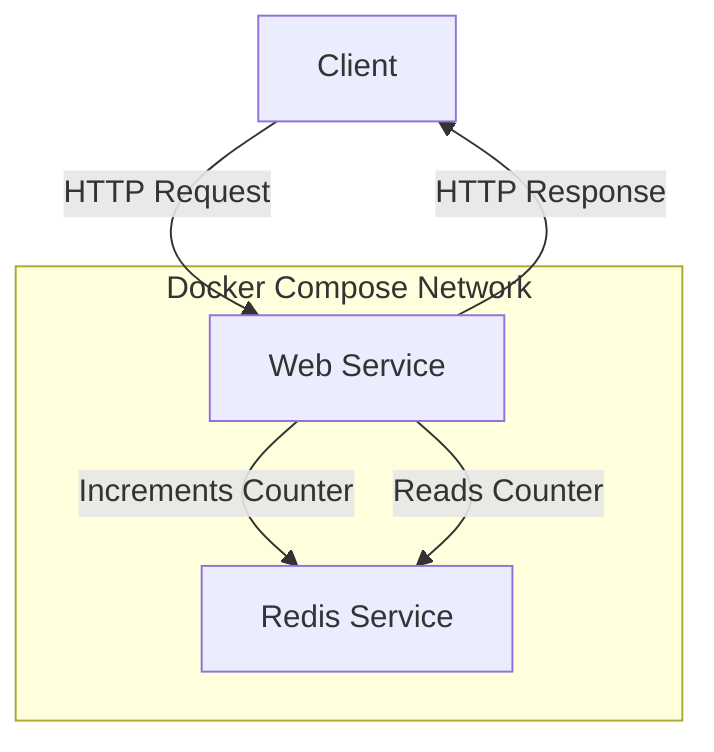

# Docker Compose Introduction

## What is Docker Compose?

Docker Compose is a tool that helps you define and manage multi-container Docker applications. With Compose, you use a YAML file to configure your application's services, networks, and volumes. Then, with a single command, you create and start all the services from your configuration.

Docker Compose simplifies the process of managing applications that require multiple containers to work together, making development and testing much more straightforward.

## Why Use Docker Compose?

When building applications with a microservices architecture or applications that consist of multiple interconnected components, using Docker alone can become complex. You would need to manually create and manage each container, network, and volume.

Docker Compose solves this problem by allowing you to:

- Define your entire application stack in a single file
- Start, stop, and rebuild all services with one command
- Maintain container configurations in version control
- Share your application setup with others easily
- Create isolated development environments

## Docker Compose vs. Dockerfile

Before diving deeper, let's clarify the difference between a Dockerfile and Docker Compose:

| Dockerfile | Docker Compose |
|------------|----------------|
| Defines a single container | Orchestrates multiple containers |
| Focuses on application build | Focuses on application deployment |
| Contains instructions to build an image | References images and defines how they work together |
| Used with `docker build` command | Used with `docker-compose` commands |

## Docker Compose File Structure

A Docker Compose file (typically named `docker-compose.yml`) is written in YAML format. Here's a simple example:

```yaml
version: '3'
services:
  web:
    image: nginx:latest
    ports:
      - "8080:80"
  database:
    image: mysql:5.7
    environment:
      MYSQL_ROOT_PASSWORD: my-secret-pw
    volumes:
      - db-data:/var/lib/mysql

volumes:
  db-data:
```

Let's break down the key components:

- **version**: Specifies the Compose file format version
- **services**: Defines the different application components
- **volumes**: Defines persistent storage for your services
- **networks**: (Optional) Configures custom networks for container communication

## Installing Docker Compose

Docker Compose is included with Docker Desktop installations for Windows and Mac. For Linux, you may need to install it separately.

To check if Docker Compose is installed, run:

```bash
docker-compose --version
```

You should see output similar to:

```
docker-compose version 2.15.1
```

If it's not installed, follow the [official installation guide](https://docs.docker.com/compose/install/).

## Basic Docker Compose Commands

Here are the most common commands you'll use with Docker Compose:

| Command | Description |
|---------|-------------|
| `docker-compose up` | Create and start all services |
| `docker-compose down` | Stop and remove all services |
| `docker-compose ps` | List running services |
| `docker-compose logs` | View output from services |
| `docker-compose build` | Build or rebuild services |
| `docker-compose restart` | Restart services |

Let's see how to use them with a practical example.

## Your First Docker Compose Project

Let's create a simple web application with a Python Flask backend and a Redis database.

### Step 1: Project Structure

Create a new directory for your project:

```bash
mkdir compose-demo
cd compose-demo
```

Create the following files:

```
compose-demo/
├── app.py
├── requirements.txt
├── Dockerfile
└── docker-compose.yml
```

### Step 2: Write the Application Code

First, create `requirements.txt`:

```
flask==2.0.1
redis==3.5.3
```

Next, create `app.py`:

```python
from flask import Flask
import redis
import os

app = Flask(__name__)
redis_client = redis.Redis(host=os.environ.get('REDIS_HOST', 'redis'), port=6379)

@app.route('/')
def hello():
    redis_client.incr('hits')
    counter = redis_client.get('hits').decode('utf-8')
    return f'Hello from Docker Compose! This page has been viewed {counter} times.'

if __name__ == "__main__":
    app.run(host="0.0.0.0", debug=True)
```

### Step 3: Create a Dockerfile

```dockerfile
FROM python:3.9-slim

WORKDIR /app

COPY requirements.txt .
RUN pip install --no-cache-dir -r requirements.txt

COPY app.py .

EXPOSE 5000

CMD ["python", "app.py"]
```

### Step 4: Create the Docker Compose File

Create a `docker-compose.yml` file:

```yaml
version: '3'

services:
  web:
    build: .
    ports:
      - "5000:5000"
    environment:
      - REDIS_HOST=redis
    depends_on:
      - redis
    volumes:
      - .:/app
  
  redis:
    image: redis:alpine
    volumes:
      - redis-data:/data

volumes:
  redis-data:
```

### Step 5: Run the Application

Now, run your application using Docker Compose:

```bash
docker-compose up
```

You should see output indicating that both services are starting up. Visit `http://localhost:5000` in your browser to see the application running.

When you're done, stop the application with:

```bash
docker-compose down
```

## Understanding the Compose File

Let's examine our `docker-compose.yml` file in more detail:

- `version: '3'`: Specifies the Compose file format version.
- `services`: Contains the definition of our application components.
  - `web`: Our Flask application.
    - `build: .`: Builds an image using the Dockerfile in the current directory.
    - `ports`: Maps port 5000 on the host to port 5000 in the container.
    - `environment`: Sets environment variables for the container.
    - `depends_on`: Ensures Redis starts before the web service.
    - `volumes`: Mounts the current directory to /app for development.
  - `redis`: The Redis database service.
    - `image: redis:alpine`: Uses the official Redis Alpine image.
    - `volumes`: Persists Redis data.
- `volumes`: Defines named volumes that can be reused.

## Docker Compose Networking

By default, Docker Compose creates a single network for your application. All services can communicate with each other by their service name. In our example, the web service connects to Redis using the hostname `redis`.

You can also define custom networks:

```yaml
version: '3'

services:
  web:
    # ... other configuration
    networks:
      - frontend
      - backend
  
  redis:
    # ... other configuration
    networks:
      - backend

networks:
  frontend:
  backend:
```

This configuration creates two separate networks, allowing you to isolate services as needed.

## Environment Variables in Docker Compose

Docker Compose offers several ways to work with environment variables:

### 1. Directly in the Compose file:

```yaml
services:
  web:
    environment:
      - DEBUG=True
      - SECRET_KEY=development_key
```

### 2. Using a .env file:

Create a `.env` file in the same directory as your `docker-compose.yml`:

```
DEBUG=True
SECRET_KEY=development_key
```

Then reference these variables in your Compose file:

```yaml
services:
  web:
    env_file:
      - .env
```

### 3. Using variable substitution:

```yaml
services:
  web:
    image: "myapp:${TAG}"
```

You can set the TAG variable in your shell or in a .env file.

## Docker Compose for Different Environments

You can maintain different Compose files for different environments:

- `docker-compose.yml`: Base configuration
- `docker-compose.override.yml`: Development overrides (loaded automatically)
- `docker-compose.prod.yml`: Production configuration

To use a specific configuration:

```bash
docker-compose -f docker-compose.yml -f docker-compose.prod.yml up -d
```

## Health Checks

Docker Compose allows you to define health checks to ensure your services are running correctly:

```yaml
services:
  web:
    build: .
    healthcheck:
      test: ["CMD", "curl", "-f", "http://localhost:5000/health"]
      interval: 30s
      timeout: 10s
      retries: 3
      start_period: 40s
```

## Docker Compose in CI/CD Pipelines

Docker Compose is not just for local development. It can also be used in CI/CD pipelines to:

- Run automated tests
- Build and validate your application stack
- Deploy to staging environments

Here's an example of how it might be used in a CI pipeline:

```yaml
# In a CI configuration file
steps:
  - name: Build and test
    command: |
      docker-compose build
      docker-compose run --rm web pytest
      docker-compose down
```

## Best Practices

1. **Use version control** for your Docker Compose files
2. **Keep services focused** on doing one thing well
3. **Use environment variables** for configuration
4. **Create separate Compose files** for different environments
5. **Document your architecture** using diagrams
6. **Use depends_on** to control startup order
7. **Set resource limits** to prevent container resource hogging

```yaml
services:
  web:
    deploy:
      resources:
        limits:
          cpus: '0.5'
          memory: 512M
```

## Visualizing Docker Compose Architecture

It can be helpful to visualize your Docker Compose architecture:



## Summary

Docker Compose is a powerful tool that simplifies the development and deployment of multi-container applications. It allows you to:

- Define your entire application stack in a single YAML file
- Manage multiple containers as a single service
- Create isolated development environments
- Share your application configuration easily

By learning Docker Compose, you've taken a significant step toward mastering modern container orchestration. As your applications grow in complexity, Docker Compose will continue to be a valuable tool in your development workflow.

## Additional Resources

- [Docker Compose Documentation](https://docs.docker.com/compose/)
- [Docker Compose GitHub Repository](https://github.com/docker/compose)
- [Docker Compose Cheat Sheet](https://devhints.io/docker-compose)

## Exercises

1. Extend the example application by adding a second web service that connects to the same Redis instance.
2. Create a Docker Compose file for a three-tier application with a web frontend, API backend, and database.
3. Modify the example to include environment-specific configurations for development and production.
4. Add volume configurations to persist data for both services.
5. Implement health checks for all services in your application.