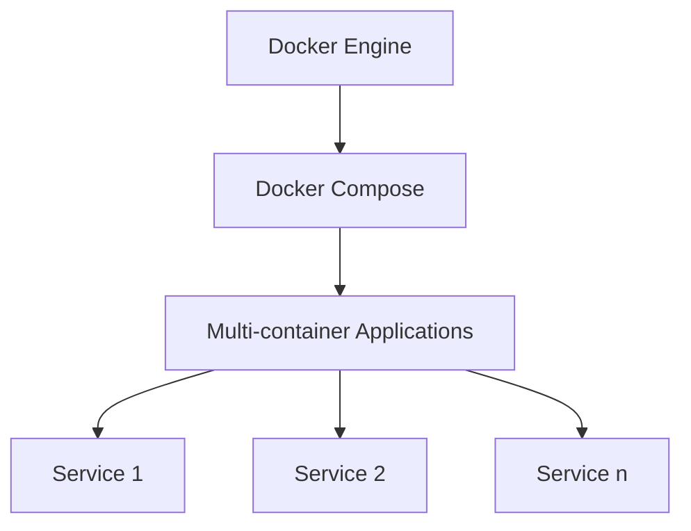

# Docker Compose Installation

Docker Compose is a powerful tool that allows you to define and run multi-container Docker applications. In this guide, we'll walk through the process of installing Docker Compose on various operating systems.

## Prerequisites

Before installing Docker Compose, you need to have Docker Engine installed on your system.

## What is Docker Compose?

Docker Compose is a tool for defining and running multi-container Docker applications. With Compose, you use a YAML file to configure your application's services, networks, and volumes. Then, with a single command, you create and start all the services from your configuration.

Using Docker Compose is basically a three-step process:
1. Define your app's environment with a `Dockerfile`
2. Define the services that make up your app in `docker-compose.yml`
3. Run `docker compose up` to start and run your entire app

## Installation Methods

Let's go through the installation process for different operating systems:

### Installing on Windows

If you've installed Docker Desktop for Windows, Docker Compose is already included. To verify the installation:

```bash
docker compose version
```

If you need to install Docker Compose separately:

1. Download the latest Docker Compose binary from the [official GitHub releases page](https://github.com/docker/compose/releases)
2. Move the binary to a directory in your PATH
3. Make it executable

### Installing on macOS

Similar to Windows, if you've installed Docker Desktop for Mac, Docker Compose is included. To verify:

```bash
docker compose version
```

For manual installation:

1. Use Homebrew (recommended):

```bash
brew install docker-compose
```

2. Or download the binary from GitHub:

```bash
sudo curl -L "https://github.com/docker/compose/releases/download/v2.20.2/docker-compose-$(uname -s)-$(uname -m)" -o /usr/local/bin/docker-compose
sudo chmod +x /usr/local/bin/docker-compose
```

### Installing on Linux

On most Linux distributions, you can install Docker Compose via the package manager:

**For Ubuntu/Debian:**

```bash
sudo apt update
sudo apt install docker-compose-plugin
```

**For Fedora:**

```bash
sudo dnf install docker-compose-plugin
```

**Manual installation on any Linux distribution:**

```bash
# Download the latest version
sudo curl -L "https://github.com/docker/compose/releases/download/v2.20.2/docker-compose-$(uname -s)-$(uname -m)" -o /usr/local/bin/docker-compose

# Apply executable permissions
sudo chmod +x /usr/local/bin/docker-compose

# Verify installation
docker compose version
```

## Docker Compose V1 vs V2

Docker Compose is available in two major versions:

1. **V1 (Legacy)**: The standalone `docker-compose` binary
2. **V2**: Integrated as a plugin within Docker CLI as `docker compose` (note the space instead of a hyphen)

The newer V2 is recommended and is what we'll use in examples. The main difference in usage is:

- V1: `docker-compose up`
- V2: `docker compose up`

## Verifying Your Installation

After installation, you should verify that Docker Compose is working correctly:

```bash
docker compose version
```

You should see output similar to:

```
Docker Compose version v2.20.2
```

## Installation Diagram

Here's a diagram showing the relationship between Docker Engine and Docker Compose:



## Creating Your First Docker Compose File

Now that you have Docker Compose installed, let's create a simple `docker-compose.yml` file:

```yaml
version: '3'
services:
  web:
    image: nginx:latest
    ports:
      - "8080:80"
    volumes:
      - ./html:/usr/share/nginx/html
```

Save this file as `docker-compose.yml` and run:

```bash
docker compose up
```

This will start an Nginx web server accessible at http://localhost:8080.

## Troubleshooting Installation Issues

### Permission Denied

If you encounter a "Permission denied" error:

```bash
sudo chmod +x /usr/local/bin/docker-compose
```

### Command Not Found

If `docker compose` command is not found after installation:

1. Ensure the binary is in your PATH
2. For V2, make sure the Docker CLI plugins directory exists:

```bash
mkdir -p ~/.docker/cli-plugins
```

3. Create a symbolic link to the Docker Compose binary:

```bash
ln -s /usr/local/bin/docker-compose ~/.docker/cli-plugins/docker-compose
```

## Summary

In this guide, we've covered:

- What Docker Compose is and why it's useful
- How to install Docker Compose on Windows, macOS, and Linux
- The difference between Docker Compose V1 and V2
- How to verify your installation
- A simple example to get started
- Common troubleshooting tips

Docker Compose is an essential tool for developing multi-container applications with Docker. Now that you have it installed, you can proceed to learn more about creating and managing Docker Compose configurations.

## Exercises

1. Install Docker Compose on your system and verify the installation.
2. Create the example `docker-compose.yml` file and start the Nginx container.
3. Modify the example to include a second service, such as a database.
4. Try stopping your services with `docker compose down`.

## Additional Resources

- [Official Docker Compose Documentation](https://docs.docker.com/compose/)
- [Docker Compose file reference](https://docs.docker.com/compose/compose-file/)
- [Sample applications with Docker Compose](https://docs.docker.com/compose/samples-for-compose/)