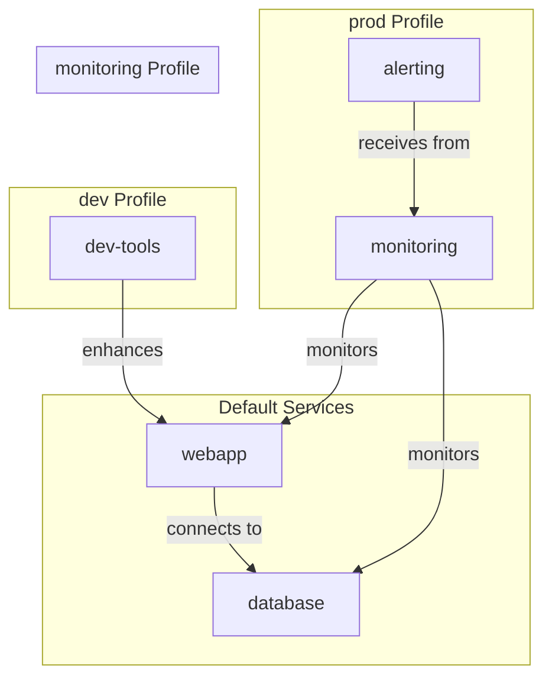

# Docker Compose Profiles

## Introduction

When working with Docker Compose, you might have encountered situations where you need different sets of services for various environments or use cases. For example, you may want to run only essential services for development but include monitoring tools for testing. This is where **Docker Compose Profiles** come in handy.

Profiles provide a way to selectively enable services when running Docker Compose commands, allowing you to maintain a single `docker-compose.yml` file while still having the flexibility to start different service combinations based on your current needs.

## What are Docker Compose Profiles?

Profiles are a feature introduced in Docker Compose version 1.28 that allows you to assign labels to services and then selectively enable those services during runtime. This way, you can organize your services into logical groups and start only the ones you need for a specific task.

## How Profiles Work

Services in your Docker Compose file can be assigned to one or more profiles. If a service doesn't have any profile assigned, it will always start by default. Services assigned to profiles will only start when their profile is explicitly enabled.

## Setting Up Profiles

Let's learn how to define and use profiles in your Docker Compose configuration.

### Basic Syntax

To assign a service to a profile, add the `profiles` attribute to the service definition:

```yaml
services:
  webapp:
    image: nginx
    # This service will always start by default as it has no profiles

  database:
    image: postgres
    profiles:
      - dev
      - prod
    # This service will only start when the "dev" or "prod" profile is active

  monitoring:
    image: grafana/grafana
    profiles: ["monitoring", "prod"]
    # This service will only start when "monitoring" or "prod" profile is active
```

In this example:
- `webapp` will always start by default
- `database` will only start when either the `dev` or `prod` profile is activated
- `monitoring` will only start when either the `monitoring` or `prod` profile is activated

### Activating Profiles

To activate profiles when running Docker Compose commands, use the `--profile` flag or set the `COMPOSE_PROFILES` environment variable:

Using the command line flag:

```bash
# Start services in the "dev" profile
docker compose --profile dev up

# Start services in multiple profiles
docker compose --profile dev --profile monitoring up
```

Using the environment variable:

```bash
# Set the active profiles
export COMPOSE_PROFILES=dev,monitoring

# Run docker-compose normally
docker compose up
```

## Practical Examples

Let's explore some real-world scenarios where Docker Compose profiles are particularly useful.

### Example 1: Development vs. Production Environment

Consider a web application with different service requirements for development and production:

```yaml
services:
  webapp:
    image: mywebapp:latest
    # This service will always start

  database:
    image: postgres:13
    # This service will always start

  dev-tools:
    image: mydevtools:latest
    profiles: ["dev"]
    # Development-only tools

  minifier:
    image: cssjs-minifier:latest
    profiles: ["build"]
    # Used only during the build process

  monitoring:
    image: prometheus:latest
    profiles: ["prod", "monitoring"]
    # Used in production and monitoring environments

  alerting:
    image: alertmanager:latest
    profiles: ["prod", "monitoring"]
    # Used in production and monitoring environments
```

To start your development environment:

```bash
docker compose --profile dev up
```

This will start `webapp`, `database`, and `dev-tools`.

For production:

```bash
docker compose --profile prod up
```

This will start `webapp`, `database`, `monitoring`, and `alerting`.

### Example 2: Microservices Architecture

Profiles are particularly valuable in microservices architectures where you may have dozens of services but only need to work with a subset:

```yaml
services:
  # Core services
  api-gateway:
    image: api-gateway:latest
    # Always starts

  user-service:
    image: user-service:latest
    # Always starts

  # Optional services
  email-service:
    image: email-service:latest
    profiles: ["notification", "full"]

  sms-service:
    image: sms-service:latest
    profiles: ["notification", "full"]

  payment-service:
    image: payment-service:latest
    profiles: ["payment", "full"]

  analytics:
    image: analytics:latest
    profiles: ["analytics", "full"]

  # Development tools
  adminer:
    image: adminer:latest
    profiles: ["debug", "tools"]

  redis-commander:
    image: redis-commander:latest
    profiles: ["debug", "tools"]
```

When working on the notification system:

```bash
docker compose --profile notification up
```

This starts `api-gateway`, `user-service`, `email-service`, and `sms-service`.

For debugging with tools:

```bash
docker compose --profile debug up
```

This starts `api-gateway`, `user-service`, `adminer`, and `redis-commander`.

## Visualizing Service Dependencies with Profiles

Let's visualize how profiles organize services using a diagram:



## Advanced Profile Patterns

### 1. Overriding Services with Profiles

You can use profiles to override configuration for different environments:

```yaml
services:
  database:
    image: postgres:13
    profiles: ["prod"]
    volumes:
      - pg_data:/var/lib/postgresql/data
    deploy:
      resources:
        limits:
          memory: 2G

  database-dev:
    image: postgres:13
    profiles: ["dev"]
    environment:
      - POSTGRES_HOST_AUTH_METHOD=trust
    ports:
      - "5432:5432"

volumes:
  pg_data:
```

In this example, we have two PostgreSQL service definitions with different configurations. For development, we expose the ports and simplify authentication, while the production version includes volume mounting and resource limits.

### 2. Utility Profiles

You can create utility profiles for one-off tasks:

```yaml
services:
  webapp:
    image: mywebapp:latest
    depends_on:
      - database

  database:
    image: postgres:13

  database-backup:
    image: postgres:13
    profiles: ["backup"]
    volumes:
      - ./backups:/backups
      - pg_data:/var/lib/postgresql/data:ro
    command: pg_dump -U postgres -d mydb -f /backups/backup.sql

  database-restore:
    image: postgres:13
    profiles: ["restore"]
    volumes:
      - ./backups:/backups
      - pg_data:/var/lib/postgresql/data
    command: psql -U postgres -d mydb -f /backups/backup.sql

volumes:
  pg_data:
```

To run a backup:

```bash
docker compose --profile backup up
```

### 3. Combining Multiple Profiles

You can combine multiple profiles to create custom environments:

```bash
# Start core services with monitoring and tools
docker compose --profile monitoring --profile tools up
```

## Best Practices

1. **Default Services**: Keep critical services without profiles so they always start.

2. **Logical Grouping**: Group related services under the same profile name.

3. **Documentation**: Add comments in your Docker Compose file to explain which profiles are available and what they do.

4. **Consistent Naming**: Use consistent profile naming conventions across projects.

5. **Avoid Over-Profiling**: Don't create too many profiles that make your file difficult to manage.

## Common Issues and Solutions

### Issue 1: Services Not Starting

If a service isn't starting when expected, verify:
- The profile name is spelled correctly
- The service is assigned to the profile you're activating
- The service doesn't have dependencies that are in non-activated profiles

### Issue 2: Environment Variable Not Working

If using `COMPOSE_PROFILES` environment variable and services aren't starting:
- Make sure there are no spaces between profile names in the variable
- Verify the environment variable is exported correctly
- Try using the command-line flag instead to isolate the issue

## Summary

Docker Compose Profiles provide a powerful way to manage service groupings within a single Compose file. By using profiles, you can:

- Maintain a single `docker-compose.yml` file for all environments
- Selectively start services based on your current needs
- Organize services into logical groups
- Create specialized environments for development, testing, and production

This feature significantly improves the flexibility and maintainability of your Docker Compose configurations, especially for complex applications with multiple services.

## Additional Resources

To learn more about Docker Compose Profiles, check out:
- The official Docker documentation on Compose Profiles
- Docker Compose CLI reference for profile-related commands
- Docker Compose file specification version 3.9+

## Exercises

1. **Basic Profile Setup**: Create a Docker Compose file with at least three services, assigning different profiles to each. Practice starting different combinations using profile flags.

2. **Development Environment**: Set up a development environment with debug tools in one profile and production services in another.

3. **Microservices Practice**: Create a microservices-based Compose file with at least five services organized into logical profiles.

4. **Profile Dependencies**: Create a scenario where some services depend on others in different profiles, and find the minimum set of profiles needed to start a specific service.