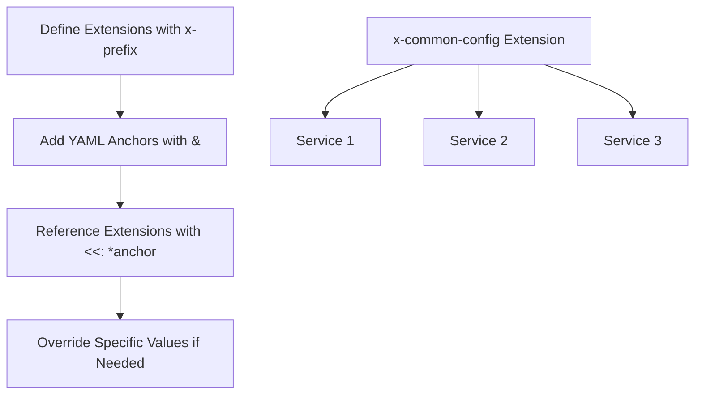

# Docker Compose Extensions

## Introduction

Docker Compose Extensions, introduced in Docker Compose v2.20.0, provide a powerful way to create reusable configuration fragments in your Docker Compose files. They allow you to define common configuration patterns once and reuse them across multiple services, reducing duplication and making your Docker Compose files more maintainable.

Extensions work like templates or snippets of YAML that can be referenced by services, networks, volumes, or other components in your Docker Compose configuration. This feature is especially useful for teams working with complex multi-service applications where many services share similar configurations.

## Understanding Extensions

Extensions are defined under the top-level `x-` prefix in your Docker Compose file. This naming convention indicates to Docker Compose that these are extension fields rather than standard Docker Compose configuration keys.

### Basic Syntax

Here's the basic syntax for defining and using extensions:

```yaml
# Define extensions under top-level x- prefix
x-common-config: &common-config
  restart: always
  logging:
    driver: json-file
    options:
      max-size: "10m"
      max-file: "3"

services:
  web:
    # Reference the extension using YAML anchors
    <<: *common-config
    image: nginx:latest
    ports:
      - "80:80"

  api:
    <<: *common-config
    image: myapi:latest
    ports:
      - "8000:8000"
```

In this example, both the `web` and `api` services inherit the common configuration defined in the `x-common-config` extension.

## How Extensions Work

Docker Compose Extensions utilize YAML's anchors (`&`) and aliases (`*`) feature for referencing defined content. The process works as follows:

1. Define an extension with an `x-` prefix
2. Add an anchor using `&` to name your reference
3. Use the reference in your services with the YAML merge key `<<:` followed by `*` and your anchor name

## Practical Examples

Let's look at some practical examples of how extensions can simplify your Docker Compose configurations.

### Example 1: Common Environment Variables

```yaml
x-database-variables: &db-variables
  environment:
    DB_HOST: postgres
    DB_PORT: 5432
    DB_USER: app_user
    DB_PASSWORD: password
    DB_NAME: app_db

services:
  backend:
    image: my-backend:latest
    <<: *db-variables
    # Additional backend-specific config here
    
  worker:
    image: my-worker:latest
    <<: *db-variables
    # Additional worker-specific config here
```

### Example 2: Deployment Configuration for Different Environments

```yaml
x-production-deploy: &production-deploy
  deploy:
    replicas: 3
    update_config:
      parallelism: 1
      delay: 10s
    restart_policy:
      condition: on-failure
      max_attempts: 3
      window: 120s
    resources:
      limits:
        cpus: '0.50'
        memory: 512M

x-development-deploy: &development-deploy
  deploy:
    replicas: 1
    restart_policy:
      condition: on-failure
  
services:
  api:
    image: my-api:latest
    # Use production configuration
    <<: *production-deploy
    
  background-worker:
    image: my-worker:latest
    # Use development configuration
    <<: *development-deploy
```

### Example 3: Combining Multiple Extensions

You can use multiple extensions together for even more flexibility:

```yaml
x-logging-config: &logging-config
  logging:
    driver: json-file
    options:
      max-size: "20m"
      max-file: "5"

x-healthcheck-config: &healthcheck-config
  healthcheck:
    test: ["CMD", "curl", "-f", "http://localhost/health"]
    interval: 30s
    timeout: 10s
    retries: 3
    start_period: 40s

services:
  web:
    image: nginx:latest
    <<: [*logging-config, *healthcheck-config]
    # Additional web-specific config
    
  api:
    image: my-api:latest
    <<: [*logging-config, *healthcheck-config]
    # Additional api-specific config
```

## Advanced Usage

### Nested Extensions

You can nest extensions to create a hierarchy of configurations:

```yaml
x-base-service: &base-service
  restart: always
  logging:
    driver: json-file
    options:
      max-size: "10m"

x-web-service: &web-service
  <<: *base-service
  networks:
    - frontend
  environment:
    NODE_ENV: production

services:
  app:
    <<: *web-service
    image: my-app:latest
    ports:
      - "3000:3000"
```

### Overriding Extension Values

When you apply an extension to a service, you can override specific values:

```yaml
x-defaults: &defaults
  environment:
    DEBUG: "false"
    LOG_LEVEL: info
    
services:
  development:
    <<: *defaults
    image: my-app:latest
    # Override the DEBUG value from the extension
    environment:
      DEBUG: "true"
```

In this example, the `development` service inherits all configuration from `x-defaults` but overrides the `DEBUG` environment variable.

## Extension Organization

For larger projects, you can organize extensions in a separate file and import them:

**extensions.yml**:
```yaml
x-logging:
  &logging
  logging:
    driver: json-file
    options:
      max-size: "10m"

x-deploy:
  &deploy
  deploy:
    replicas: 2
    update_config:
      parallelism: 1
```

**docker-compose.yml**:
```yaml
# Import extensions from external file
include:
  - extensions.yml

services:
  web:
    image: nginx:latest
    <<: [*logging, *deploy]
```

## Best Practices for Using Extensions

1. **Use Descriptive Names**: Name your extensions in a way that clearly indicates their purpose.

2. **Keep Extensions Focused**: Each extension should handle a specific aspect of configuration, following the single responsibility principle.

3. **Document Your Extensions**: Add comments to explain what each extension does and when it should be used.

4. **Be Cautious with Overriding**: When overriding extension values, be aware that some YAML merging behaviors might be unexpected.

5. **Consider Versioning**: If your extensions change over time, consider versioning them (e.g., `x-logging-v1`, `x-logging-v2`).

## Common Patterns with Extensions

### Service Templates

```yaml
x-app-template: &app-template
  restart: always
  networks:
    - app-network
  depends_on:
    - db
    - redis
  volumes:
    - ./logs:/app/logs

services:
  app:
    <<: *app-template
    image: myapp:latest
    
  worker:
    <<: *app-template
    image: myworker:latest
    command: ["process-queue"]
```

### Environment-Specific Configurations

```yaml
x-production: &production
  environment:
    NODE_ENV: production
    LOG_LEVEL: warn
  deploy:
    replicas: 3

x-development: &development
  environment:
    NODE_ENV: development
    LOG_LEVEL: debug
    DEBUG: "true"
  volumes:
    - ./src:/app/src

services:
  app:
    image: myapp:latest
    # Choose the environment by uncommenting one of the following:
    <<: *production
    # <<: *development
```

## Flow Diagram of Extensions Usage



## Summary

Docker Compose Extensions provide a powerful way to create reusable configuration fragments, resulting in more maintainable Docker Compose files. By using YAML anchors and aliases with the `x-` prefix, you can define common patterns once and reference them across multiple services.

Key benefits of using extensions include:

- Reduced duplication in your Docker Compose files
- Improved maintainability through centralized configuration
- Easier environment-specific setups
- Better organization of complex Docker Compose configurations

As your Docker Compose configurations grow more complex, extensions become an essential tool for keeping your files clean, consistent, and manageable.

## Additional Resources

- [Docker Compose Specification](https://docs.docker.com/compose/compose-file/)
- [YAML Specification](https://yaml.org/spec/1.2.2/)
- [Docker Compose GitHub Repository](https://github.com/docker/compose)

## Exercises

1. Create a Docker Compose file with an extension that defines common logging configuration, and apply it to multiple services.

2. Create extensions for different deployment environments (development, testing, production) and demonstrate how to switch between them.

3. Define a base extension and a child extension that inherits and extends the base configuration. Apply the child extension to a service.

4. Create a Docker Compose project that uses extensions defined in a separate file, and import them using the `include` directive.